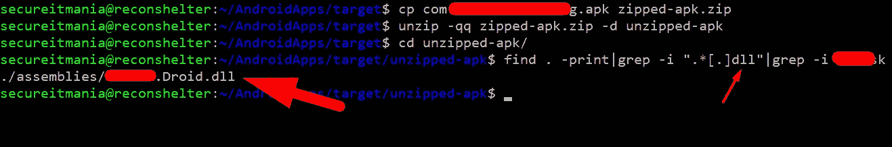
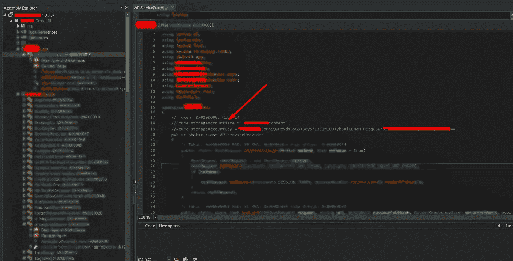

# 让我们知道我是如何探索 Xamarin 应用程序中隐藏的秘密的

> 原文：<https://infosecwriteups.com/lets-know-how-i-have-explored-the-buried-secrets-in-xamarin-application-d6b8c5609c87?source=collection_archive---------2----------------------->

## 移动应用渗透测试指南

## Android 逆向工程的新时代(下)

> 在 **m** [**y 上一篇文章**](https://secureitmania.medium.com/lets-know-how-i-have-explored-the-buried-secrets-in-react-native-application-6236728198f7) 中我解释了 **React Native** 逆向工程技术。我又一次在基于 Xamarin 的应用程序中发现了一个 bug，这是通过不同的方法而不是旧的逆向工程方法发现的。

## 简介:

Xamarin 是一个免费的**开源移动应用平台**，用于构建原生和高性能的 **iOS** 、 **Android** 、tvOS、watchOS、macOS 和 Windows。

## 安卓逆向工程的老套方式

通常，在反转 Android 应用程序时，会使用 **apktool、dex2jar** 进行反编译，然后使用 [**JD-GUI**](https://java-decompiler.github.io/) 进行分析。当处理本机应用程序时，如果应用程序有您想要分析的任何**本机代码**，这可能是有用的。

但很多时候，应用的核心逻辑在于”。**不需要使用 dex2jar 就可以获得**的 dll”。

# 逆向工程过程:Xamarin 应用

**步骤 1** :让我们确认一下应用程序是否构建在 Xamarin 框架上。

要检查这一点，使用 zip 扩展名重命名 APK，然后使用以下命令将 APK 解压缩到一个新文件夹

```
cp com.example.apk example-apk.zip
unzip -qq example-apk.zip -d unzipped-apk
```

浏览到新创建的`unzipped-apk`文件夹，找到`assemblies`文件夹。在这个文件夹中，包含了几个`dll` 二进制文件。这意味着应用程序是在 Xamarin 框架上构建的。

**步骤 2** :现在我们必须找到合适的`dll`文件，其中包含应用程序的核心逻辑。很容易找到正确的 dll 文件。通常是以包名或应用程序名命名的`dll`文件。



Xamarin Android 应用程序逆向工程

**步骤 3** :使用 **dnSpy 工具**反编译`dll`文件。

[](https://github.com/dnSpy/dnSpy) [## dnSpy/dnSpy

### dnSpy 是一个调试器。NET 程序集编辑器。你可以用它来编辑和调试程序集，即使你没有任何…

github.com](https://github.com/dnSpy/dnSpy) 

**步骤 4:** 搜索敏感凭据和端点

在这个阶段，你必须识别出**敏感关键字**来分析反编译的代码。android 应用程序流行的一种模式是使用第三方服务，如 Firebase、Azure、AWS s3 服务端点、私钥等。,

在对代码审查进行了长时间的深入分析后，我能够在代码的注释部分找到**敏感的硬编码凭证**。



在 dnSpy 中分析 dll 代码

## 现在是利用公开的密钥的时候了

每当我发现任何 API 密匙，我主要去参考 [Keyhacks](https://github.com/streaak/keyhacks) GitHub 库。但是没有与公开的密钥相关的有效方法。

Azure blob 存储 API 文档的未来分析和一些关于 Azure CLI 的教程。我通过 azure CLI 了解了如何使用这些凭证。请找到下面的过程来利用公开的密钥

在您的本地计算机上安装 azure CLI，然后通过用公开的密钥替换值来设置以下环境变量

```
C:\Users\admin>set AZURE_STORAGE_ACCOUNT=**<replace this with storageAccountName>**
C:\Users\admin>set AZURE_STORAGE_ACCESS_KEY=**<replace this with storageAccessKey>**C:\Users\admin>set AZURE_STORAGE_CONNECTION_STRING=DefaultEndpointsProtocol=https;EndpointSuffix=core.windows.net;AccountName=**<replace this with storageAccountName>;**AccountKey=**<replace this with storageAccessKey>**C:\Users\admin>az storage blob list --container-name **<container_name>**
```

# 结论

android 应用程序的逆向工程过程应该基于构建框架进行。您应该在信息收集的初始阶段就确定应用程序构建技术。

感谢你花时间阅读这篇博客。如果你想学习 android 黑客技术，请**关注我**并关注有趣的**黑客技术**并查看 [**我的简介**](https://medium.com/@secureITmania) 阅读有趣的 **BugBounty** 报道。