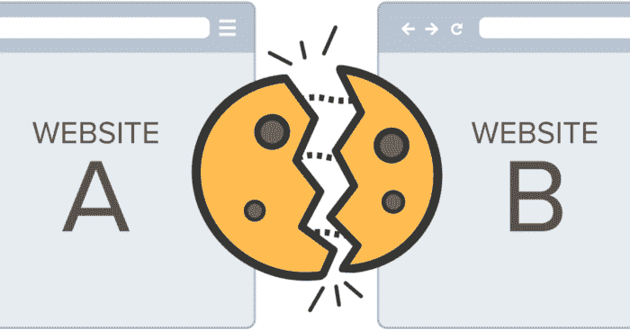
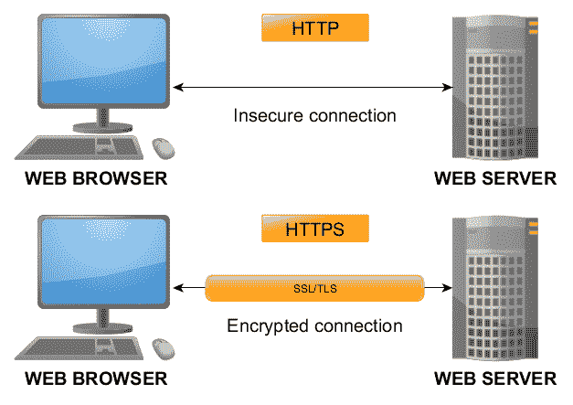

# 让我们了解一下 Cookie 及其安全性

> 原文：<https://infosecwriteups.com/lets-learn-about-cookie-and-its-security-f6d349f2ccc0?source=collection_archive---------1----------------------->

**照片由** [**维什那维**](https://unsplash.com/@vyshnavibisani?utm_source=unsplash&utm_medium=referral&utm_content=creditCopyText) **上** [**下**](https://unsplash.com/s/photos/cookie?utm_source=unsplash&utm_medium=referral&utm_content=creditCopyText)

**简介**

当我们讨论正确的会话管理以及应用程序当前如何处理用户的会话管理时，我们称之为“会话管理”有许多应用程序通常使用的基本组件，例如存储在标题或 cookie 中的令牌。每当使用 cookie 或向 cookie 添加任何值时，必须确保应用适当的保护。如果不这样做，cookies 可能会受到危害，这就是为什么它们需要适当的保护。在今天的帖子中，我们将更深入地探讨 cookie 安全性的话题，以及在保护它们时应该考虑的因素。

# 保护 Cookie

**什么是 Cookie**

每个在线应用程序为每个用户提供一个保存在客户端的独一无二的会话标识符，分配给该身份的值作为一个变量保存在 cookie 中，以便应用程序可以识别用户并更好地为他们服务。该应用程序能够确定哪个用户当前已登录，并为该用户提供适合其特定兴趣领域的内容。每次用户基于 path 变量访问应用程序时，都会随请求一起发送一个 cookie。这允许应用程序验证用户，并确保它按照要求提供服务。除了确保用户得到正确的身份验证之外，这还可以用于实施任何必要的授权。这些在 cookies 中找到的会话令牌可以被认为是用户帐户的临时用户名和密码。一旦用户注销他们的帐户，它们就失效了。

让我们了解一下可以在 cookie 中使用的不同标志，以使它完全安全

## **HttpOnly**

[**来源**](https://dzone.com/articles/cross-site-cookie-manipulation)

## **HttpOnly 标志未设置为真**

为了防止客户端脚本访问 cookie 的内容，有必要在 cookie 中设置 HttpOnly 标志。如果 cookie 上没有设置此标志，那么客户端脚本(包括恶意 JS 有效负载)将能够通过使用简单的属性文档轻松访问 cookie。饼干。

在跨站点脚本攻击中，攻击者总是希望获得对 cookie 的访问权限，以便可以访问 cookie 并将其移动到由攻击者控制的域中。cookie 遭到破坏后，如果不采取额外的保护措施，cookie 就有可能被用来控制用户的帐户。因此，如果会话令牌和其他敏感信息保存在 cookie 中，攻击者将能够访问它们，并能够以不道德的方式利用它们。出于恶意目的访问用户的帐户、更改用户的个人资料或泄露用户的全部信息都是恶意意图的例子。

应用程序所有者需要将“HttpOnly”标志设置为“True”。

Cookie 中需要设置几个属性，“HttpOnly”是其中之一。

> *setcookie($name，$value，$expire，$path，$domain，$secure，$ http only)；*

在设置 cookie 时，httponly 标志的值必须设置为“$ *httponly=True* ”。

**示例**:在下面的代码片段中，HTTPonly 设置在 cookie 中。

> *setcookie("userCookie "，$userl，0，"/"，" www.example.com "，TRUE)；*

**设定到期时间**

应该要求存储敏感信息(如会话令牌和其他信息)的 Cookies 设置过期时间。因为这些 cookie 包含可用于访问用户帐户的会话令牌，所以让它们长时间处于活动状态会带来安全风险，因为成功破坏其中一个 cookie 的黑客可以无限期地访问用户帐户。因此，在 cookie 上放置过期时间是绝对必要的。大多数组织，如处理敏感数据的组织(如银行网站)，通常具有较短的过期时间，并且在 cookie 生成后大约 15-20 分钟后删除。

**为了设置到期时间，您可以使用此技术**

> *setcookie("userCookie "，$user，time()+60 * 60 * 24 * 365 * 1)；*

此后，该 cookie 的副本将在用户的计算机上保留一年。超过分配的时间后，它会自动终止。因为这样做可以提高用户帐户及其存储信息的安全性，所以始终建议将过期时间设置为 24 或 48 小时。

**安全属性**

[**来源**](https://materials.rangeforce.com/tutorial/2017/03/06/Cookie-Security/)

这是使用 cookie 的安全属性完成的。如果这个特征被改变，cookie 将不能通过加密通道(在 http 上)传输。当用户连接到公共 Wi-Fi 网络时，希望实施中间人攻击的攻击者通常会强迫他们使用未加密的信道进行连接。这是因为，如果使用未加密的通道建立连接，攻击者将能够读取从用户计算机传输的所有信息。如果 cookie 不包含该属性，它也将通过未加密的通道流动，这使得攻击者有可能破坏它并获得用户帐户的访问权限。

应用程序的“安全”标志需要由其所有者设置为“真”。因此，即使攻击者成功说服用户通过未加密的通道进行通信，cookie 也不会随请求一起传输，攻击者也无法获得它。

> *setcookie($name，$value，$expire，$path，$domain，****$ secure****，$ http only)；*

在设置 cookie 值时，管理员可以设置“$Secure *=True* ”。

**结论**

Cookies 在应用程序安全中起着重要的作用，所以要确保小心地实现它。在这篇博客中，我讨论了源代码审查过程中与 Cookie 相关的一些基本技术。安全团队可以手动发现问题，也可以使用自动化工具来发现问题。市场上有如此多的安全代码审查工具。