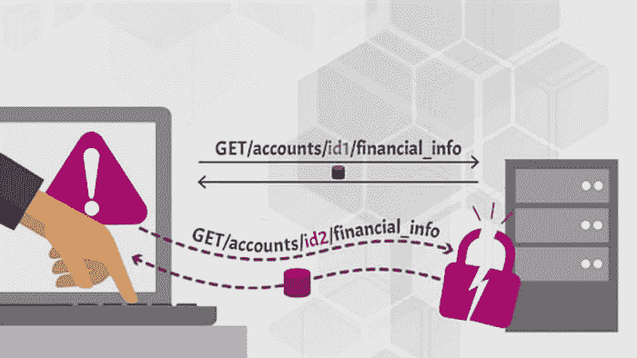

# 让我们学习 API 安全性:关于对象级授权的更多信息

> 原文：<https://infosecwriteups.com/lets-learn-api-security-more-about-broken-object-level-authorization-b5fd1d73e0d8?source=collection_archive---------1----------------------->

**照片由** [**照片由**](https://unsplash.com/@ffstop?utm_source=unsplash&utm_medium=referral&utm_content=creditCopyText) **上** [**下**](https://unsplash.com/s/photos/software-engineer?utm_source=unsplash&utm_medium=referral&utm_content=creditCopyText)

# 介绍

网络应用程序已经从进化中获益，不仅仅是网络，应用程序现在也在各种环境中构建，比如 android 或 iOS 应用程序。然而，到目前为止，这些应用程序都是独立开发的。现在，企业已经开发了一种集中式应用程序编程接口(API)，在接收到来自 Android 和 iOS 等移动平台的参数后，可以在一个网站上处理请求。应用程序编程接口(API)是一种连接，它充当两个或多个应用程序之间的中介。这使得应用程序之间可以轻松地相互通信。还可以在跨平台应用中使用，这意味着只需要一个 API 就可以有效地管理来自 android、iOS 和 web 应用的呼叫。

# 什么是破碎对象级授权/BOLA？

[**来源**](https://apisecurity.io/encyclopedia/content/owasp/api1-broken-object-level-authorization.htm)

这个漏洞也可以被认为是不安全的直接对象引用或 IDOR。在这个漏洞中，攻击者在 API 调用时利用用户的资源 ID 来操纵他的资源 ID，并且由于不正确的授权，访问他没有任何访问授权的其他用户的资源。换句话说，这个漏洞允许攻击者访问他没有任何访问授权的资源。这是特定端点上没有适当授权的结果。

这是 API 中存在的一个非常常见的漏洞；漏洞的严重程度取决于因漏洞而被披露的信息。例如，如果信息包含个人身份信息(PII)数据，如社会安全号码或信用卡信息，则漏洞的严重性应被视为严重。应用程序有时可能会很复杂，当开发人员在开发这些复杂的应用程序时，他们可能会忘记包括这些授权检查，这将成为漏洞的主要来源。

# 基于对象 ID 的漏洞:

在一些不同的上下文中，应用程序将处理用户数据，然后通过使用对象或用户 id 来检索该数据。看看这个网址:

[http://test.com/api/api](http://test.com/api/api)记录/记录 id=111

这个 URL 实际上包含一个记录 id，访问该记录 id 是为了从服务器或数据库中检索某些信息。

在大多数情况下，此漏洞是许多端点上发生的不正确授权的结果。因为这个端点处理敏感和不太敏感的信息。因此，某些端点需要授权，并且有必要在这些端点上部署这种授权。在没有授权的情况下，任何人都能够快速检索这些信息，并且这些信息也可能包括重要的信息。

# 剥削

由于没有授权，潜在的攻击者能够访问关键信息。如果用来改变信息的 API 调用也是不安全的，攻击者将很容易更改用户输入的数据，这将使应用程序的安全性处于危险之中。有时，这也可能导致帐户被接管，因为忘记密码或任何其他端点可能没有授权。这可能是因为用户忘记了密码。在 API 和 API 端点上工作的应用程序拥有一个对象的 ID，它们将根据用户发出的请求来处理该对象。在使用这些端点时，用户可以自由执行应用程序要求的任何操作。所有这些活动，包括授权检查，都是在对象级实现的。因此，这些检查确定现在登录的用户是否有效或者是否被允许执行所请求的操作。如果这些测试没有在任何端点正确实现，将导致“对象级授权”过程失败。

# 如何防御？

[**来源**](https://dzone.com/articles/api12019-broken-object-level-authorization)

*   始终在每个端点上实现授权。
*   不要依赖于用户输入，总是用适当的授权检查来验证和执行验证。
*   用户 id 的熵必须很高，并且可以是随机的，这样攻击者就不能轻易猜到。你可以使用加密来增加熵。
*   按照用户策略或组织策略实施对象级授权。
*   使用授权机制来检查登录用户是否有权在每个使用来自客户端的输入来访问数据库中的记录的函数中对记录执行所请求的操作。
*   实现各种测试用例来检查授权功能有多强？这将提供授权的清晰画面。

# **结论**

在当今复杂的体系结构中很可能存在 BOLA 漏洞。此漏洞的严重性由攻击者能够危害的功能决定。因此，您应该始终对用户以及交付给他们并根据他们的授权向他们传送的信息进行权限检查。授权通常会引发许多不同的问题，并可能升级为帐户接管或任何进一步的信息泄漏，其中可能包括敏感数据。

*来自 Infosec 的报道:Infosec 上每天都有很多事情发生，很难跟上。* [***加入我们的每周简讯***](https://weekly.infosecwriteups.com/) *以 5 篇文章、4 个线程、3 个视频、2 个 Github Repos 和工具以及 1 个工作提醒的形式免费获取所有最新的 Infosec 趋势！*