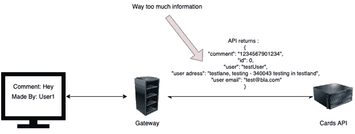
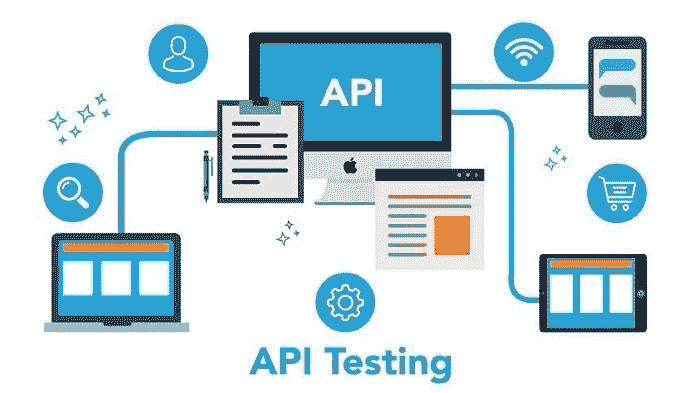

# 让我们学习 API 安全性:更多关于过度数据暴露的内容

> 原文：<https://infosecwriteups.com/lets-learn-api-security-more-about-excessive-data-exposure-372fe2dd70c8?source=collection_archive---------2----------------------->

[Unsplash](https://unsplash.com/s/photos/programming?utm_source=unsplash&utm_medium=referral&utm_content=creditCopyText) 上 [AltumCode](https://unsplash.com/es/@altumcode?utm_source=unsplash&utm_medium=referral&utm_content=creditCopyText) 拍摄的照片

在这篇为 API 安全而写的文章中，我们将讨论“过度的数据暴露”。但是在继续之前，您需要掌握什么是 API 以及它们是如何操作的；为此，你需要通读我在这之前写的博文。

[了解关于 API 安全性的更多信息:关于对象级授权的更多信息](https://securitylit.medium.com/lets-learn-api-security-more-about-broken-object-level-authorization-b5fd1d73e0d8)

# API 安全:什么是过度数据暴露？

[**来源**](https://www.wallarm.com/what/excessive-data-exposure)

当应用程序编程接口(API)没有正确实现时，存在各种安全缺陷的风险更高。其中之一就是暴露了过量的数据。顾名思义，“过度数据暴露”就是在客户端泄露过多数据的漏洞。例如，在获取数据时，客户端可能会泄露一些其他信息，如用户密码哈希或其他个人身份信息(PII)，尽管这并不是其本意。

例如:假设一个特定的 API 应该只检索用户的用户名，但是由于配置错误，它还检索用户的电话号码、电子邮件地址和其他敏感信息。在构建 HTML 页面的过程中，可能不会显示这些数据；然而，JSON 将真正显示原始响应和所有数据。

# 为什么会这样？

大多数情况下，API 会接受用户的输入，然后，基于该输入，它会从后端检索信息。应用程序编程接口(API)被设计成当用户给它输入时用输出来回复。该输出通常包含一些预定义的参数以及这些参数的值。但是，在某些情况下，可能需要比必要信息更多的信息。如果开发人员将 API 直接推向生产，而不遗漏属性，这很可能是可以实现的。

举例来说，在用户创建帐户后，从后端检索该用户的信息，并在前端提供给用户。用户可以访问名为“邀请”的功能，通过该功能，他们可以邀请其他用户加入他们的组织。当应用程序试图利用用户的电子邮件邀请用户时，它首先检查用户的电子邮件地址是否合法，是否已经存在于平台上。从后端 API 端点检索这些信息的过程揭示了大量信息，例如用户密码散列和最近登录的 IP 地址等。

应用程序可能没有在网页上呈现信息(当从 JSON 构建 HTML 时)，但是如果您点击 API，所有的信息都将在 JSON 响应中可见。该程序可能没有在网页上显示信息。

[来源](https://blogs.mulesoft.com/dev-guides/api-security-ways-to-authenticate-and-authorize/)

因为大量的用户数据被暴露，所以对手可以开发一个脚本并从数据库中提取所有信息，如果他们愿意的话。如果应用程序使用的散列机制不是很健壮，那么对手可以很容易地破解散列并控制用户帐户。

假设邀请系统发出这样的请求

> 发布/邀请用户
> 
> <headers></headers>
> 
> 电子邮件=[email@abc.com](mailto:email@abc.com)

该请求的响应应该如下所示

> {
> 
> “状态”:“已邀请”，
> 
> **"id": "2233 "，**
> 
> "用户名":"安迪普拉诺"，
> 
> **《真实姓名》:《安迪安东尼奥》，**
> 
> **“位置”:“德克萨斯州普莱诺”，**
> 
> 「电话号码」:「8314587458」，
> 
> 【地址】:“美国德克萨斯州任何一家山寨街头普莱诺”，
> 
> “信用卡”:“4788254125682541”，
> 
> 《CVV》:“一一一”，
> 
> "有效期到":" 2027 "
> 
> 《SSN》:“123547569”
> 
> “护照”:“Z547587”
> 
> }

这实际上暴露了大量不打算共享的用户信息。因此，威胁参与者很容易使用 invite 机制来获取用户信息。

# 如何预防？

*   永远不要依赖客户端过滤器来保护敏感信息，因为客户端数据很容易被操纵。
*   总是交叉检查来自 API 的响应，以确保没有敏感数据被泄露。
*   不要使用“to_json()”和“to_string()”等标准方法，而要使用精选的特定属性。
*   开发人员可以通过实现基于架构的响应验证来提供额外的安全性。根据 API 验证方法必须返回的数据由该机制定义和实施。它也包含了错误。

# 结论

API 是当前环境中应用程序开发的重要组成部分。应用程序的用户界面由前端用户处理，但后端应用程序在 API 的帮助下检索数据。因此，保护 API 以防过度数据泄漏是非常必要的。以下是一些保护数据处理和防止 API 过度暴露数据的基本步骤。众所周知，PII 数据必须受到所有用户和应用程序的保护。

来自 Infosec 的报道:Infosec 上每天都会出现很多难以跟上的内容。 [***加入我们的每周简讯***](https://weekly.infosecwriteups.com/) *以 5 篇文章、4 个线程、3 个视频、2 个 Github Repos 和工具以及 1 个工作提醒的形式免费获取所有最新的 Infosec 趋势！*