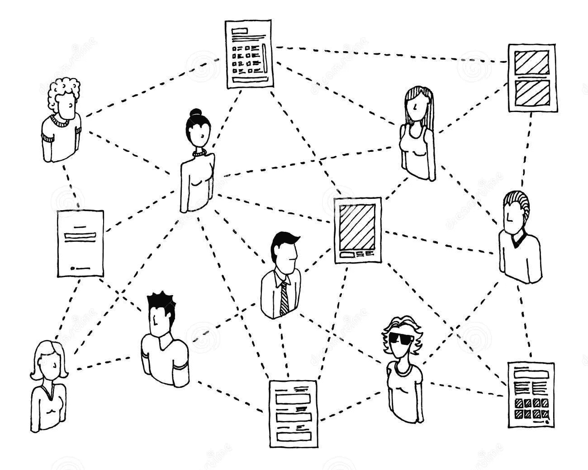
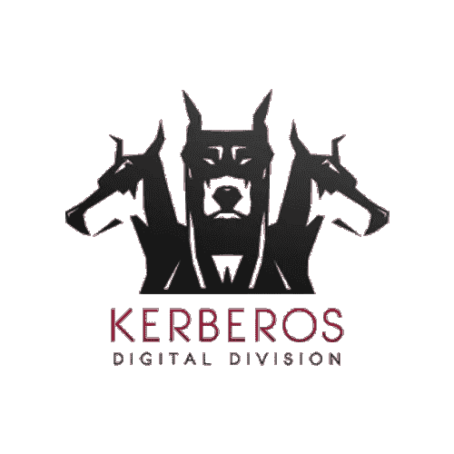
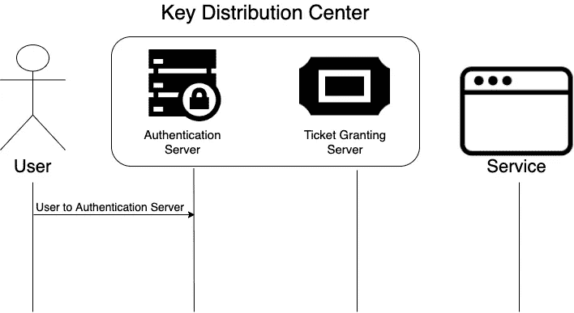
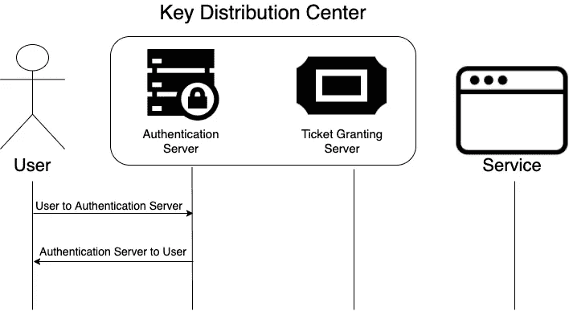
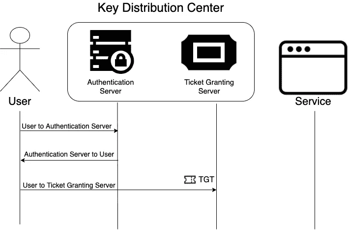
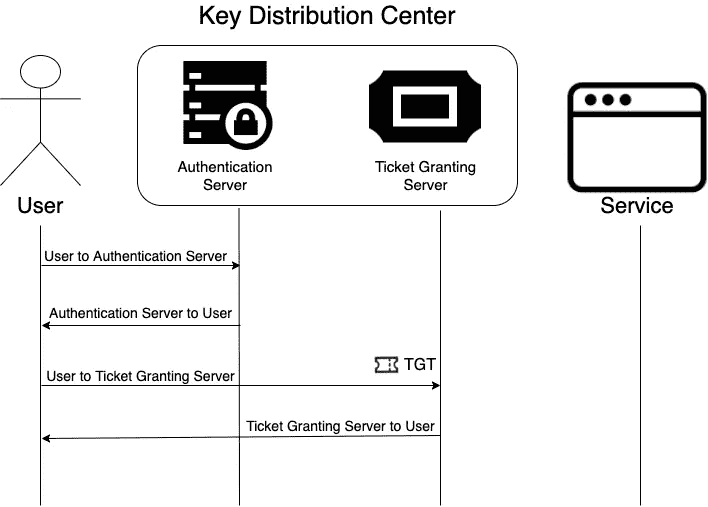
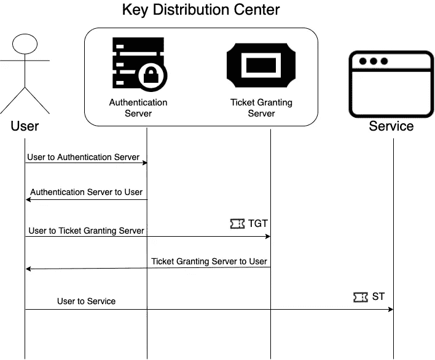
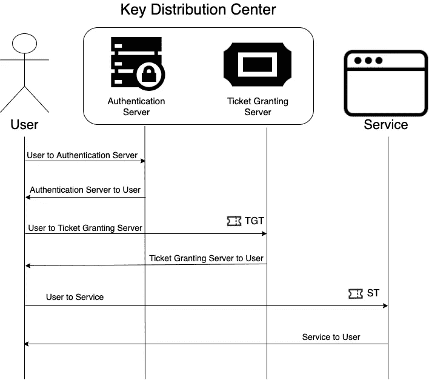

# 让我们用 Kerberos 的方式保护 WFH！

> 原文：<https://infosecwriteups.com/lets-secure-wfh-in-kerberos-way-208799802350?source=collection_archive---------3----------------------->

WFH 人通过互联网获取服务

人们大多被隔离，这对公司和员工的安全工作构成了重大挑战。双方都担心“安全”这个单一话题。如今，公司都在努力实现安全登录以获得缝合体验，员工也在寻求一键式访问功能。让我们看看大 MNC 是如何解决问题的。

想象一下，你是 WFH，想要通过一个不安全的网络(TCP/IP)连接到一个远程应用程序，同时也在某个空间并行…
*Le Hackers:“数据盛宴即将到来，准备好公司！呵呵……
所以现在你担心有人会闯入，有人会获取你的信息，或者有人会在某些地方冒充你？
嗯……所以现在你**需要一个“规则”,它被设计来为不安全网络上的服务提供安全认证。**

此外，在更广泛的领域:

1.  凭证不应在网络间共享。
2.  任何一方的加密密钥都不应该直接交换。
3.  客户端和服务器都应该互相认证。
4.  客户端能够对应用程序执行单点登录。

可以完成上述所有步骤的协议是“ **Kerberos** ”。
让我们深入挖掘各个方面，

1.  什么是 Kerberos 协议？
2.  名字背后的神话
3.  术语
4.  逐步指南
5.  使用 QnA 的有趣事实
6.  其他重要见解

事不宜迟，我们开始吧！

# 什么是 Kerberos 协议？

**Kerberos** 是一种在客户端-服务器架构中实现的计算机网络认证协议。简而言之，Kerberos 协议将使用票证在两个可信主机之间建立安全的通信链接，这两个可信主机跨越了一个不可信的网络，如 Internet。(如何？我们将在下面看到:p)
它将使用共享秘密认证技术认证两台主机。它将在两位主持人之间分享一个只有他们和 KDC 知道的秘密。为了理解共享秘密技术(对称密钥)，如果两个人共享一个只有他们自己知道的秘密代码，他们可以用它来验证他们自己。这被称为对称密钥加密，因为双方共享同一个密钥，该密钥可用于打开双方之间传递的任何消息或数据。
用更专业的话来说，这个密钥必须能够加密和解密。

基本上，Kerberos 可以归结为:

*   认证协议
*   使用票证进行身份验证
*   避免在本地存储密码或通过互联网发送密码
*   涉及可信的第三方
*   基于对称密钥加密技术

Kerberos 协议

# **名字背后的神话:**

Kerberos 的名字来自希腊语“Cerberus”。或许意思是“黑暗死亡精灵”来自三头犬。如果有人对琐事感兴趣，Cerberus 是冥府门口的三头看门狗，根据希腊神话，冥府之神。对于这个系统来说，这是一个合适的名称，因为它使用可信的第三方名称 KDC(密钥分发中心)在服务器和客户端之间进行身份验证。

Kerberos 的意思是“黑暗的死亡精灵”

# 术语

1.  Kerberos 领域—它是 Kerberos 有权对用户进行服务身份验证的一组系统的域。
2.  主体—主体是用户或服务的唯一身份。在一个领域里，你有原则。
3.  客户端/用户—客户端是代表用户访问服务的进程。通常，我们会交换术语，这没关系。一个领域中可以有多个用户。
4.  服务—它是提供给客户端的资源，例如文件服务器或用户希望访问的应用程序，例如文件服务器。毫无疑问，一个人可以拥有多个客户可以访问的服务。
5.  KDC(密钥分发中心)——它是 Kerberos 的核心，提供票证并生成临时会话密钥，从而允许用户安全地对服务进行身份验证。在 KDC 有两个服务器来执行该过程:票据授予服务器和认证服务器。
6.  票证授予服务器(TGS):服务器确认用户正在对已知服务发出访问请求，并发布服务票证。
7.  身份验证服务器(AS):这个服务器验证一个已知的用户正在发出对服务的访问请求，并发出票据授予票据。
8.  授权码—这些授权码允许用户向服务进行身份验证，也允许服务向用户进行身份验证相互身份验证。
9.  票证—包含需要传递的大部分信息客户端的身份服务 ID、会话密钥、时间戳、生存时间等等，所有这些都使用服务器的密钥加密。

嗯…！那太多了。行话。

困惑宝宝 xD

# 逐步指南

让我们从较高的层面来看一下用户为获得对服务的访问而进行的通信。

**步骤 1:** 我们从用户向认证服务器发送一条未加密的消息开始，这条消息说，“嘿，我想访问一些服务”。

**步骤 2:** 认证服务验证请求来自一个已知用户，并生成一个票据授予票据。TGT 连同用用户秘密密钥加密的另一条消息一起被发送回用户。

**步骤 3:** 用户用他们的秘密密钥解密消息，然后创建几条新消息，并将新消息和 TGT 一起发送到票据授予服务。

**步骤 4:** 票据授予服务解密票据授予票据执行一些验证并生成服务票据。服务票据连同另一个消息被发送回用户。

**第 5 步:**用户解密消息，创建一个验证者消息，并将用户验证者和服务票发送给服务。

**第 6 步:**服务进行自己的解密验证，并创建自己的最终认证者消息。这个最终的验证者消息被发送回用户。

所有这些消息允许用户和服务器相互验证对方，并安全地分发非对称服务会话密钥，这允许用户和服务安全地传递验证信息。

# 使用 QnA 的有趣事实！

1.  谁真正发明了 Kerberos，什么时候发明的？Kerberos 是一种由 MIT 开发的无状态网络协议，被认为是许可分发和修改的。Kerberos 开始是 Athina 的一部分(另一个神话参考！)项目，旨在保护麻省理工学院的计算机网络。
2.  是什么让 Kerberos 如此特别？Kerberos 使用密钥加密技术在不安全的通道上提供安全的通信。从本质上来说，Kerberos 是一个可信的第三方服务器，它为用户签发票证，以便他们可以对系统和服务进行身份验证。
3.  Kerberos 的哪个特性让它对组织如此有价值？虽然这看起来很奇怪，可能有点天真，但它变得很有价值，因为微软和 Mac 设备的实现使用了 DES 加密。
4.  简而言之，什么是 Kerberos 票证？Kerberos 使用票证进行身份验证和授予访问权限。由票证授予服务器(TGS)创建的票证受身份验证服务器的信任，可用于帐户请求的特定服务或端点。票证作为(您的)身份证明，并且总是用密钥加密。只要您的 Kerberos 票证有效，您就可以访问系统或服务。
5.  客户端-服务器架构到底是如何遵循的？在客户端-服务器架构中，客户端将向服务器发送请求服务的请求，服务器将通过向客户端提供服务来做出响应。但是在开始这个过程之前，客户端应该被服务器认证，反之亦然。
6.  是纯单边的客户端-服务器模式还是可以用于相互身份验证？是啊是啊。这是一种相互握手，客户端和服务器可以验证彼此的身份。他们通过使用带有联合会话密钥的时间戳加密或通过 2005 年引入的质询/响应来解决相关漏洞，从而实现这一点。
7.  什么是“传票”攻击？攻击者可以使用 Mimikatz 和 Windows 凭据编辑器等工具从受损的用户端点或授权服务器中挖掘 Kerberos 票证。一旦黑客获得了这些票，他们就可以在网络中横向移动，查看权限并获取有助于他们访问关键系统的信息。
8.  ‘金券’呢？这被称为“金券”,因为您被授予无限期创建 Kerberos 生成票证的权利，该票证通常被硬编码为默认授予 10 年的访问权限，但可以更改。
9.  在协议使用期间，加密密钥是否在内存中保持未加密状态？是的，这是事实。尽量不要想太多这个；这只是让调用执行得更快。
10.  如果 Kerberos 应该是安全的并且被广泛信任，我还需要使用强密码吗？不幸的是，密码仍然存在，因为它们被用来加密证书。不使用强密码将允许暴力攻击。
11.  如何使用 Kerberos 增强单点登录(SSO)功能？当用户第一次通过身份验证时，它会将票证服务存储到 TTL 的浏览器缓存中。这使他们能够自动向服务进行身份验证。

# 其他重要见解 ***:***

*   KDC 将用户机器和服务的所有秘密密钥存储在其数据库中。
*   这些密钥都储存在 KDC 的数据库里。
*   Kerberos 可以解释为一个系统。它包含 3 个部分。认证服务器通过检查客户端是否具有主密钥来检查客户端的真实性，票证授予服务向授权用户授予票证，数据库存储客户端详细信息(这就像一个小型验证数据库)。
*   KDC 本身用主密钥加密，增加了从数据库窃取密钥的难度。

如果你觉得错过了一些真知灼见，直接在评论区写下你的心声。欢迎编辑、建议和评论。如果你认为值得，请按住掌声。

## 祝 WFH 愉快:)

史蒂夫·哈拉马在 [Unsplash](https://unsplash.com?utm_source=medium&utm_medium=referral) 上拍摄的照片