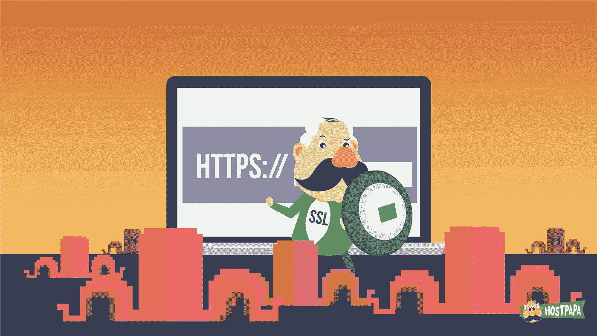
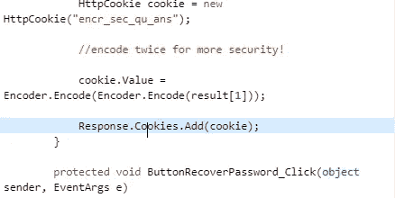
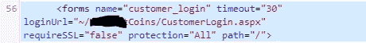

# 让我们看看会话 cookie 或 cookie 是如何不通过 SSL 发送的

> 原文：<https://infosecwriteups.com/lets-see-how-session-cookie-or-cookie-not-sent-over-ssl-c321a8d27d6?source=collection_archive---------1----------------------->

# 说明

现代网络浏览器支持每个 cookie 一个`secure`标志。如果设置了标志，浏览器将只通过 HTTPS 发送 cookie。通过未加密的通道发送 cookie 会使它们暴露于网络嗅探攻击，因此安全标志有助于保持 cookie 值的机密性。如果 cookie 包含私有数据或带有会话标识符，这一点尤其重要。



在这种情况下，创建了一个 cookie，但是没有调用`setSecure()`，或者调用了值`false`。

**示例:**在下面的示例中，一个 cookie 在没有设置`Secure`属性的情况下被添加到响应中。

```
...
HttpCookie cookie = new HttpCookie("emailCookie", email);
Response.AppendCookie(cookie);
...
```

如果您的应用程序同时使用 HTTPS 和 HTTP，但是没有设置`secure`标志，那么在 HTTPS 请求期间发送的 cookies 也会在随后的 HTTP 请求期间发送。对于攻击者来说，通过未加密的无线连接嗅探网络流量是一件轻而易举的事情，因此通过 HTTP 发送 cookiess(尤其是那些带有会话 id 的 cookie)会导致应用程序受损。



添加(cookie)

```
...
{
 if (Request.QueryString[“Cookie”] != null)
 {
 HttpCookie cookie = new HttpCookie(“UserAddedCookie”);
 cookie.Value = Request.QueryString[“Cookie”];Response.Cookies.Add(cookie);
 }
...
```

创建一个未将`secure`标志设置为`true`的 cookie。创建 cookie 时没有将`secure`标志设置为`true`。

在所有新的 cookie 上设置`Secure`标志，以指示浏览器不要明文发送这些 cookie。
**举例:**

```
...
HttpCookie cookie = new HttpCookie("emailCookie", email);
cookie.Secure = true;
Response.AppendCookie(cookie);
```

# **我们来讨论一下不通过 SSL 发送的会话 Cookie**

现代网络浏览器支持每个 cookie 一个`secure`标志。如果设置了标志，浏览器将只通过 HTTPS 发送 cookie。通过未加密的通道发送 cookie 会使它们暴露于网络嗅探攻击，因此安全标志有助于保持 cookie 值的机密性。如果 cookie 包含私有数据或带有会话标识符，这一点尤其重要。

在这种情况下，在 **Web.config** 中创建的会话 cookie 没有将其安全标志设置为真。

**示例:**在下面的示例中，会话 cookie 将被添加到响应中，而不设置`Secure`标志。

```
...
<configuration>
<system.web>
<authentication mode="Forms">
<forms requireSSL="false" loginUrl="login.aspx">
</forms>
</authentication>
</system.web>
</configuration>
...
```

如果您的应用程序同时使用 HTTPS 和 HTTP，但是没有设置`secure`标志，那么在 HTTPS 请求期间发送的 cookies 也将在随后的 HTTP 请求期间发送。对于攻击者来说，通过未加密的无线连接嗅探网络流量是一件轻而易举的事情，因此通过 HTTP 发送 cookiess(尤其是那些带有会话 id 的 cookie)会导致应用程序受损。

创建应用程序会话 cookie 时没有将`secure`标志设置为`true`。



在所有新的 cookie 上设置`Secure`标志，以指示浏览器不要明文发送这些 cookie。
**举例:**

```
...
<configuration>
<system.web>
<authentication mode="Forms">
<forms requireSSL="true" loginUrl="login.aspx">
</forms>
</authentication>
</system.web>
</configuration>
...
```

回应。cookies . Add(cookie)；
}

[帕特里翁](https://www.patreon.com/mrunal)-[https://www.patreon.com/mrunal](https://www.patreon.com/mrunal)

*关注* [*Infosec 报道*](https://medium.com/bugbountywriteup) *获取更多此类精彩报道。*

[](https://medium.com/bugbountywriteup) [## 信息安全报道

### 收集了世界上最好的黑客的文章，主题从 bug 奖金和 CTF 到 vulnhub…

medium.com](https://medium.com/bugbountywriteup)