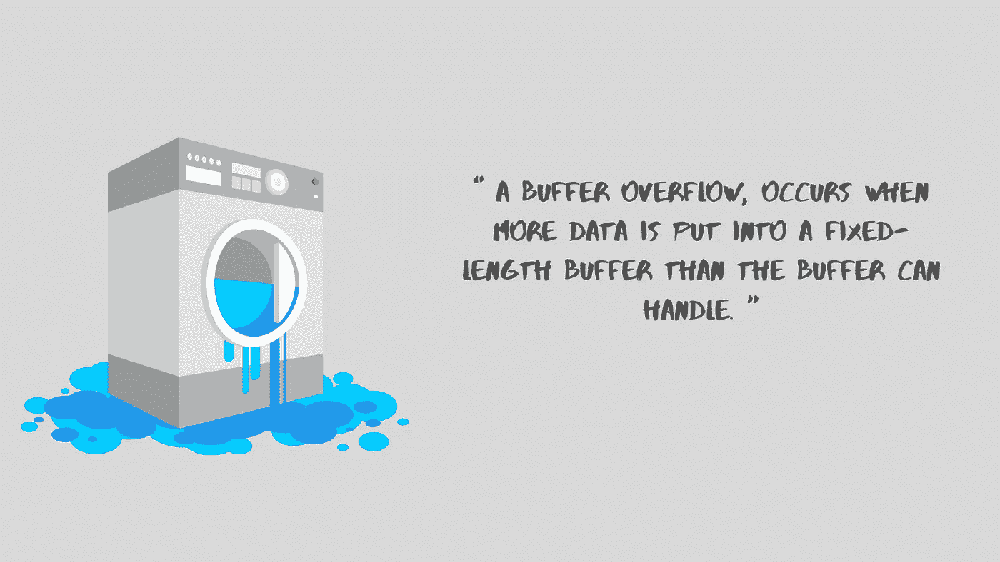

# 让我们来谈谈缓冲区溢出

> 原文：<https://infosecwriteups.com/lets-talk-about-buffer-overflow-54764101030b?source=collection_archive---------1----------------------->

当放入固定长度**缓冲器**的额外数据超过**缓冲器**所能管理的数量时，就会发生**缓冲器溢出**，或**缓冲器溢出**。

缓冲区溢出可能是软件安全漏洞最广为人知的形式。大多数软件开发人员都知道什么是缓冲区溢出漏洞，但是与旧的和新开发的应用程序相对应的缓冲区溢出攻击仍然非常明显。部分困难是由于缓冲区溢出可能发生的方式种类繁多，部分困难是由于经常用来防止缓冲区溢出的容易出错的过程。

在典型的缓冲区溢出利用中，攻击者将数据传输到一个程序，并将其存储在一个过小的堆栈缓冲区中。结果是调用堆栈上的数据被覆盖，包括函数的返回指针。数据设置返回指针的值，以便当函数返回时，它将控制权交给包含在攻击者数据中的恶意代码。

尽管这种类型的堆栈缓冲区溢出在一些策略和开发社区中仍然很普遍，但也混合了其他类型的缓冲区溢出，包括堆缓冲区溢出和其他缓冲区之间的逐个错误。



在代码级别，缓冲区溢出漏洞通常需要破坏程序员的理论。C 和 C++中的许多内存操作函数不执行边界终止，并且很容易覆盖它们所操作的缓冲区的指定边界。即使是有界函数，比如`strncpy()`，如果使用不当也会导致漏洞。大多数缓冲区溢出的问题是内存操作和对数据大小或组成的错误假设的结合。

缓冲区溢出漏洞通常出现在以下代码中:

-依赖外部数据来控制其行为。

-取决于在代码的快速范围之外实施的数据的特征。

*   非常复杂，以至于程序员无法准确预测它的行为。

这是第二种情况的一部分，其中代码依赖于未在本地验证的数据部分。在这个模式中，一个名为`lccopy()`的函数将一个序列作为其参数，并返回一个字符串的堆分配副本，其中所有大写字母都转换为小写字母。该函数不会对其输入进行边界检查，因为它希望`str`总是小于`BUFSIZE`。如果攻击者绕过调用代码中的检查，或者如果代码中的更改占用了`str` false 的大小，那么`lccopy()`将溢出`buf`，对`strcpy()`进行无限制调用。

```
char *lccopy(const char *str) {
char buf[BUFSIZE];
char *p;strcpy(buf, str);
for (p = buf; *p; p++) {
if (isupper(*p)) {
*p = tolower(*p);
}
}
return strdup(buf);
}
```

下面的示例代码演示了一个简单的缓冲区溢出，这通常是由代码依赖外部数据来控制其行为的第一种情况引起的。代码使用`gets()`将任意数量的数据读入堆栈缓冲区。因为没有办法限制这个函数读取的数据的数量，所以代码的安全性依赖于用户总是输入少于`BUFSIZE`的字符。

```
...
char buf[BUFSIZE];
gets(buf);
... 
```

这个例子展示了在 C++中通过使用`>>`操作符将输入读入`char[]`字符串来模仿`gets()`函数的不安全行为是多么容易。

```
...
char buf[BUFSIZE];
cin >> (buf);
...
```

本例中的代码也依赖于用户输入来管理其行为，但是它通过使用有界内存复制函数`memcpy()`增加了一个间接层。这个函数接受一个目标缓冲区、一个引用缓冲区和要复制的字节数。buffer 的信息由对的有界调用填充，但是用户指定`memcpy()`复制的字节数。

```
...
char buf[64], in[MAX_SIZE];
printf("Enter buffer contents:\n");
read(0, in, MAX_SIZE-1);
printf("Bytes to copy:\n");
scanf("%d", &bytes);
memcpy(buf, in, bytes);
...
```

这段代码描述了第三种情况，在这种情况下，代码非常复杂，其性能很难预测。这段代码来自流行的 libPNG 图像解码器，它被许多应用程序使用，包括 Mozilla 和一些其他浏览器。

该代码看起来安全地执行了边界检查，因为它检查了变量 length 的大小，稍后它将使用该变量来控制由`png_crc_read()`复制的数据量。然而，在测试长度之前，代码会对`png_ptr->mode`进行检查，如果检查失败，就会发出警告，处理继续进行。由于`length`是在`else if`块中测试的，如果第一次检查失败的话，`length`将不会被测试，并且在对`png_crc_read()`的调用中被盲目使用，潜在地允许堆栈缓冲区溢出。

虽然这个例子中的代码不是我们见过的最复杂的，但是它演示了为什么在执行内存操作的代码中应该最小化复杂性。

```
if (!(png_ptr->mode & PNG_HAVE_PLTE)) {
/* Should be an error, but we can cope with it */
png_warning(png_ptr, "Missing PLTE before tRNS");
}
else if (length > (png_uint_32)png_ptr->num_palette) {
png_warning(png_ptr, "Incorrect tRNS chunk length");
png_crc_finish(png_ptr, length);
return;
}
...
png_crc_read(png_ptr, readbuf, (png_size_t)length);
```

此示例还演示了第三种情况，其中程序的复杂性使其暴露于缓冲区溢出。在这种情况下，暴露是由于其中一个函数的不明确的接口，而不是代码的结构(如前一个示例中的情况)。

`getUserInfo()`该函数采用多字节字符串形式的用户名和指向用户信息结构的指针，并用用户信息填充该结构。因为 Windows 身份验证使用 Unicode 作为用户名，所以参数`username`首先从多字节字符串转换为 Unicode 字符串。`(UNLEN+1)*sizeof(WCHAR)*sizeof(WCHAR)`字节，到`unicodeUser`数组，该数组只分配了`(UNLEN+1)*sizeof(WCHAR)`字节。如果`username`字符串包含的字符多于`UNLEN`字符，那么对`MultiByteToWideChar()`的调用将溢出缓冲区`unicodeUser`。

```
void getUserInfo(char *username, struct _USER_INFO_2 info){
WCHAR unicodeUser[UNLEN+1];
MultiByteToWideChar(CP_ACP, 0, username, -1,
unicodeUser, sizeof(unicodeUser));
NetUserGetInfo(NULL, unicodeUser, 2, (LPBYTE *)&info);
}
```

# 建议

切勿使用固有不安全的功能，如`gets()`，避免使用难以安全使用的功能，如`strcpy()`。将无界函数如`strcpy()`替换为它们的有界等价函数，如`strncpy()`或`strsafe.h` 中定义的 WinAPI 函数。

尽管谨慎使用有界函数可以极大地降低缓冲区溢出的风险，但这种迁移不能盲目进行，而且其本身不足以确保安全性。每当您操作内存(尤其是字符串)时，就会发现缓冲区溢出漏洞通常发生在以下代码中:

-依赖外部数据来控制其行为

-依赖于在代码直接范围之外实施的数据属性

-非常复杂，程序员无法准确预测它的行为。

此外，请考虑以下原则:

-切勿相信外部来源会为内存操作提供正确的控制信息。

-永远不要相信你的程序所操作的数据的属性会在整个程序中得到维护。在对数据进行操作之前，对数据进行完整性检查。

-限制内存操作和边界检查代码的复杂性。保持简单，清楚地记录您执行的检查、您测试的假设，以及在输入验证失败的情况下程序的预期行为。

-当输入数据太大时，要小心截断数据并继续处理它。截断会改变输入的含义。

*   不要依赖 StackGuard 或不可执行堆栈等工具来防止缓冲区溢出漏洞。这些方法不能解决堆缓冲区溢出和更微妙的堆栈溢出，这些溢出会改变控制程序的变量的内容。此外，这些方法中的许多很容易被击败，即使它们正常工作，它们也只能解决问题的症状而不能解决问题的原因。

在 Windows 上，不太安全的函数`memcpy()`可以用它们更安全的版本代替，比如`memcpy_s()`。然而，这仍然需要谨慎行事。因为`_s`函数族提供的参数验证各不相同，依赖它会导致意想不到的行为。此外，错误地指定目标缓冲区的大小仍然会导致缓冲区溢出。