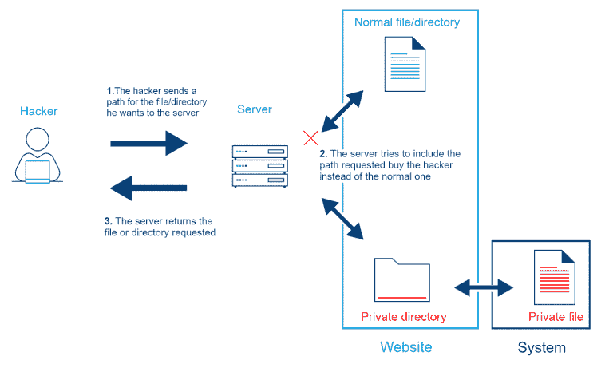

# 让我们了解路径遍历漏洞

> 原文：<https://infosecwriteups.com/lets-understand-path-traversal-vulnerabilities-e4263dcb4e39?source=collection_archive---------1----------------------->

照片由 [Unsplash](https://unsplash.com/s/photos/hacking?utm_source=unsplash&utm_medium=referral&utm_content=creditCopyText) 上的[静止不动](https://unsplash.com/@stillnes_in_motion?utm_source=unsplash&utm_medium=referral&utm_content=creditCopyText)

# 介绍

我们知道应用程序安全性的重要性，它用于保护组织的数据及其物理资产。由于当今世界各种组织普遍受到各种各样的破坏和攻击，保护自己的公司免受上述威胁是绝对必要的。为了成功地实现应用程序安全性，必须遵循各种框架和原则，如由 SANS 和 OWASP 提供的那些。每个框架都向开发人员说明用户输入验证的重要性，包括用户输入的净化、正确的语法、适当的长度以及接受输入的业务标准操作程序(SOP)。这是必要的，因为大多数攻击是由不正确的用户输入验证引起的。输入验证适用于许多不同类型的攻击，我们将在这篇博客中讨论路径操纵漏洞。

# 什么是路径操纵漏洞？

[来源](https://www.cloudprotector.com/path-traversal/)

攻击者可以利用此漏洞，通过更改应用程序访问文件或呈现文件时所使用的路径或参数，来访问位于 Webroot 文件夹以外位置的文件和目录。由于攻击者可以控制参数并修改它，这就允许攻击者使用“”../"序列或其 url 编码模式，通过使用绝对文件路径。当用于提取文件的应用程序的任何参数都没有输入验证，并且应用程序的任何参数都没有输入验证时，就会出现这种情况。攻击者能够使用这种方法来访问位于 webroot 目录以外的目录中的文件。这些文件可能是敏感的，如网站的源代码，也可能是系统文件。

# 它们为什么会发生？

当应用程序接受文件路径作为用户输入来读取文件，但不对所提供的文件路径执行任何形式的验证时，此漏洞通常会表现出来。让我们来看看这段代码:应用程序将文件名作为输入，然后追加。txt”添加到文件名的末尾，然后使用新形成的路径来访问文件。正如您所看到的，由于文件名参数没有输入验证，攻击者可以很容易地使用本地文件接口(LFI)来修改文件路径，然后访问存储在服务器上的敏感文件。

> *User _ File = new File inputstream(CFG . getproperty(" sub ")+"。txt ")；*
> 
> *User _ read = User _ file . read(arr)；*
> 
> *out . println(arr)；*

如果以极高的权限执行应用程序，恶意用户就有可能查看存储在服务器上的所有文件。可以通过在文件名中注入空字节来实现这一点，这样可以绕过“.”。txt”实现，它被附加到文件名的后面。符号“../"可被攻击者用来访问位于 web 根目录之外的文件。这包括包含敏感信息的文件。

# 我们如何利用它们？

假设我们有一个应用程序，即“example.com”。该应用程序是使用 PHP 开发的，它使用文件名和路径获取图像:

> **

这些图像存储在/var/www/images/位置。“文件名”参数从下面提到的路径中检索图像:

*/var/www/images/logo.png*

因为可能没有从上述位置获取图像的验证“文件名”参数。

为了充分利用这一点，我们需要修改图像路径，如下所示

> [*https://example.com/fetch_image?filename=/etc/passwd*](https://test.com/images?filename=/etc/passwd)

由于提供了文件的完整路径，它将直接从目录中访问文件，并向您显示结果。

**使用点号点号正斜杠(../)符号来绕过 LFI 保护**:当代码中嵌入了另一个文件路径时，攻击者将需要使用某种形式的../ notation，以便成功地逃离它们被困的目录。因此，在这个特定的实例中，这是攻击者能够轻易利用的基本攻击场景。攻击者可以使用../ notation 来访问 webroot 目录之外的文件

因此，当攻击者试图获取敏感文件时，他会提供“../../..“文件名”参数中的“/”序列。

理想的路径如下所示:

> [*https://test.com/images?filename=../../../etc/passwd*](https://test.com/images?filename=../../../etc/passwd)

*攻击者一输入这些信息，就退出 webroot 所在的目录，并检索敏感文件。这三个连续的“../“从它现在所在的三个目录“/var/www/images”开始。因此，威胁参与者有可能进入“/root”目录并读取其中的文件。*

***使用 PHP 包装器绕过 LFI 保护***

*对“的验证../”符号已经由开发人员实现，所以一旦应用程序检测到../符号，它会阻止攻击，并且通常会显示一条错误消息。如今，开发人员遵循各种各样的安全建议，以保护他们的应用程序免受这些类型的攻击。*

*在这种情况下，对手可以通过使用“PHP 包装器”来避免被验证抓住。当攻击者提供相对路径，并且该路径不是以../或任何 windows 驱动器号，时间提供的路径将应用于 PHP 包装器当前使用的工作目录。这是因为 PHP 包装器有一个内置的本地文件系统，可以在这种情况下使用。不管脚本当前存储在什么位置，路由通常都是起作用的。*

*当攻击者通过 PHP 包装程序时，在使用“FileName”参数时，所提供的路径将被格式化如下:*

*[*https://example.com/fetch_images?filename = PHP://filter/convert . base 64 encode/resource = etc/passwd*](https://test.com/images?filename=php://filter/convert.base64encode/resource=etc/passwd)*

*"*php://filter/convert . base64 encode/resource "*这个有效负载强制 PHP 对提到的文件进行 base64 编码，然后在用户界面上使用或呈现。*

***补救***

*   *将可以访问的文件列入白名单。*
*   *在没有用户输入的情况下使用函数的“文件系统”调用。*
*   *不包括[../]在用户输入的路径中。如果函数看到，这种类型的输入在那里进行净化。*
*   *根据语法、长度等验证用户输入。*
*   *实施严格的访问控制策略来限制用户，使他们无法访问将要保存文件的目录。*

# *结论*

*如果开发人员遵循 LFI 提倡的最佳实践，攻击者可能根本无法避开路径遍历漏洞。然而，有许多潜在的方法可以让攻击者绕过这个问题。*

*如果攻击者成功地泄露了属于某个组织的个人身份信息或其他敏感数据，则此漏洞可能是一个严重程度很高的漏洞。*

*因此，在采取绝对必要的预防措施的同时将其付诸实施。*

*来自 Infosec 的报道:Infosec 上每天都会出现很多难以跟上的内容。加入我们的每周简讯，以 5 篇文章、4 个线程、3 个视频、2 个 Github Repos 和工具以及 1 个工作提醒的形式免费获取所有最新的 Infosec 趋势！*