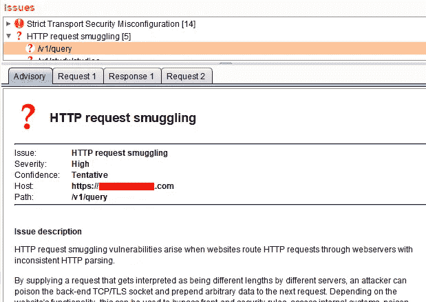
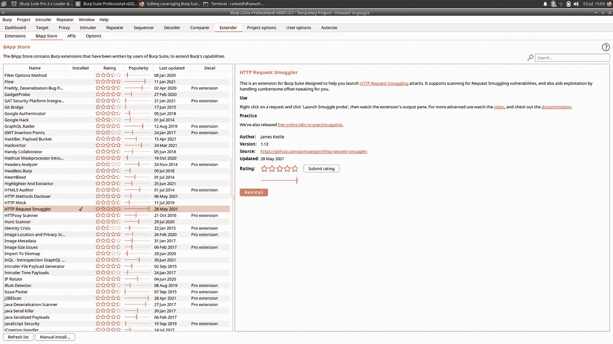
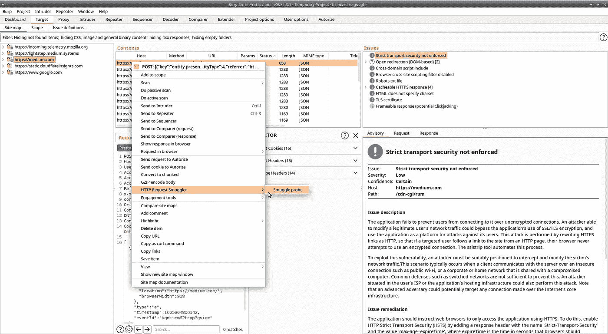
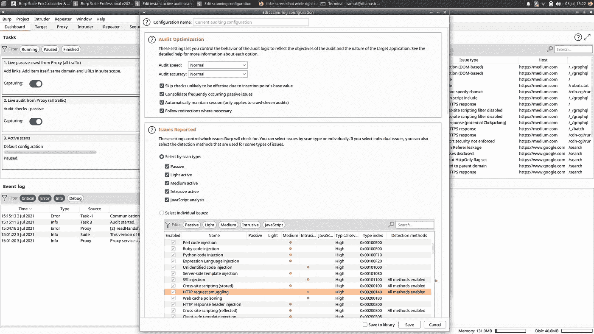

# 利用 Burp 套件扩展查找 HTTP 请求走私。

> 原文：<https://infosecwriteups.com/leveraging-burp-suite-extension-for-finding-http-request-smuggling-2c0b5321f06d?source=collection_archive---------0----------------------->

HTTP 请求走私经常被遗留在 bug bounty 发现中。但是通过正确的扩展，您可以在下一个 bug bounty 程序中自动执行查找 HTTP 请求走私的任务。



# 了解 HTTP 请求走私

现代网站通常部署多个代理服务器，将用户请求转发到托管 web 应用程序的实际服务器。这些前端或代理服务器和实际的后端服务器是云应用程序中最常见的架构。

前端服务器从多个用户那里获得请求，并将它们转发给后端服务器。这两个服务器必须就两个不同用户请求之间的边界达成一致。有时，这些服务器在边界上不一致，攻击者可以通过修改 HTTP 请求来利用这一点，从而导致 HTTP 请求走私。

> 当前端和后端服务器对用户请求之间的边界不一致时，HTTP 请求走私就产生了。

边界(即 HTTP 请求的结尾)由“内容长度”或“传输编码”HTTP 头定义。有些服务器不支持“传输编码”,有些服务器将“内容长度”头作为默认头，如果两者都出现在请求中的话。如果应用程序的前端和后端服务器配置不正确，它们将采用不同的边界值，从而导致请求走私漏洞。

```
HTTP/1.1 200 OK
Content-Type: text/plain
Transfer-Encoding: chunked
Content-Length: 4
```

> 两个标题都存在的示例请求。

攻击者可以在 HTTP 请求中包含两个具有不同边界值的报头。如果前端服务器接受“传输编码”,而后端服务器接受“内容长度”报头，这将导致请求处理中的污染，因为每个报头中的边界值是不同的。反之亦然，前端服务器接受“内容长度”，后端服务器接受“传输编码”。前者叫 TE。而后者是 CL。TE HTTP 请求走私漏洞。

前端和后端服务器的这种不明确的处理导致了 HTTP 请求走私。这可能会导致获取未经授权的数据、危害应用程序等。

我可以更多地谈论这个漏洞，但这不是这篇文章的目的。

# 手动查找 HTTP 请求走私

在使用 burp 扩展自动执行任务之前，让我们看看如何手动检测它，以便您可以更多地了解这个漏洞。

您只需发送一个修改过的 HTTP 请求，其中包含内容长度和传输编码头。服务器将花费比平常更多的时间来请求这个被污染的请求。如果有时间延迟，那么您就有了一个 HTTP 请求走私漏洞。

**示例请求:**

```
POST / HTTP/1.1Host: vulnerable-website.comTransfer-Encoding: chunkedContent-Length: 40Y
```

如果前端服务器只接受 Transfer-Encoding 头，那么它将忽略' 0 '之后的所有内容，并将上述不带' Y '的请求发送到后端服务器。

如果后端服务器只使用 Content-Length 头，那么它将只把请求的长度作为 4。但是请求的实际长度小于 4，因为前端服务器忽略了一些数据。因此后端服务器将等待一段时间来接收剩余的数据。这将造成时间延迟，从而请求走私漏洞的检测。

您可以修改相同的请求，使用内容长度查找前端服务器的漏洞，使用传输编码头查找后端服务器的漏洞。



HTTP 请求走私者，一个 Burp 套件扩展

# 使用 Burp 套件扩展查找 HTTP 请求走私漏洞

## HTTP 请求走私者

HTTP Request Smuggler 是一个 burp 扩展，它可以帮助您自动执行上述查找此漏洞的手动任务。手动查找这个漏洞是可能的，但是非常繁琐，所以您可以利用 burp 中的这个现有扩展来查找它。

安装扩展后，您可以立即开始使用它。右键单击 Burp 代理上拦截的请求，然后单击 HTTP Request smugger->走私探测器。然后，它会自动修改拦截的请求，并发送它来找到漏洞。它发送许多修改后的请求来检查这两种类型的漏洞— CL。TE & TE.CL .如果有任何与此相关的发现，您可以在“扫描问题活动”页面上找到它们。



使用扩展名启动走私调查

## 默认打嗝套件主动扫描

如果您主动扫描一个目标，Burp 套件将实际查找 HTTP 请求走私。您可以在 Burp 套件的主动扫描配置中检查这一点。完成主动扫描后，它还会在“问题活动”页面上报告发现的问题。如果你遇到这个问题，请不要离开它。对其进行处理，并通过 HTTP Request Smuggler 扩展确认该漏洞。



Burp 主动扫描配置中的 HTTP 请求走私

# 结论

HTTP 请求走私是一个经常被忽视的严重漏洞。实际上，我在一个使用主动扫描和请求走私者扩展的真实系统上发现了一个 bug。希望这篇文章能让你了解这个漏洞以及如何检测它。如果你想了解更多关于这个漏洞的信息，你可以看看 Port Swigger 网站，里面有关于它的详细解释。

这是“[利用 Burp Suite 扩展查找 IDOR](/leveraging-burp-suite-extension-for-finding-idor-insecure-direct-object-reference-2653f9b89fd4) 帖子的延续。如果你想要更多这样的，就跟我来。

***亲提示:*** *一个帖子你最多可以鼓掌 50 次，以示你有多喜欢。*