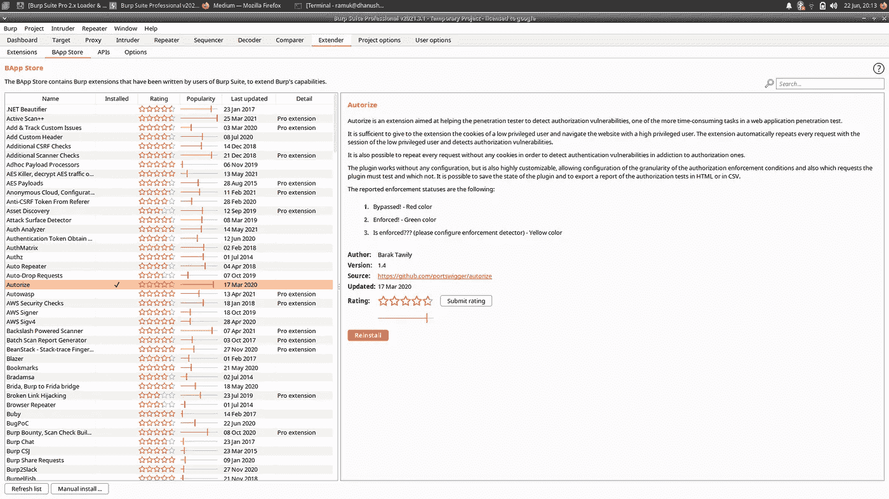
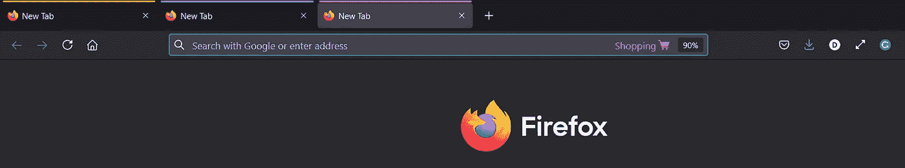

# 利用 Burp 套件扩展查找 IDOR(不安全直接对象引用)。

> 原文：<https://infosecwriteups.com/leveraging-burp-suite-extension-for-finding-idor-insecure-direct-object-reference-2653f9b89fd4?source=collection_archive---------1----------------------->

IDOR 是 bug bounty 网站常见的漏洞之一。让我们看看如何轻松地抓住它们。

运行中的 Autorize 扩展

# IODR 是什么？

如果您不熟悉 IDOR，那么这里有一个快速复习。

IDOR 是一种访问控制漏洞，其中系统使用用户输入来访问对象或资源。当用户可以修改用于访问仅限于该用户的内部对象/资源的引用时，就会出现 IDOR。

***让我用一个例子简单的说一下。***

假设学校系统使用学生的唯一编号来检索特定学生的个人信息。如果一个学生提供了一个不同的唯一编号，并检索了关于另一个学生的信息，这就是 IDOR 的一个例子。通常，系统会提供一种方法来限制每个用户对其信息的访问。但当它不这样做时，我的弱点就出现了。

自动扩展

# 查找 IDOR 的扩展

让我告诉你两个在寻找 IDOR 中最常用的扩展。

## 自动调整

这个免费使用的 burp 扩展可能是查找 IDOR 时最流行的工具。找到 IDOR 是一项耗时的任务，因为你应该检查网站上的每一个资源。您应该使用低特权用户的 cookie 详细信息来检查高特权用户的资源。并且，Autorize 可以帮助您轻松做到这一点。

***如何用它找到伊多尔？***

1.  您应该首先在 Autorize 扩展中提供低特权/不同用户的 cookie 细节。
2.  然后，以高权限用户的身份使用连接了 burp 的浏览器在易受攻击的网站上漫游并获取不同的资源。
3.  对于您向站点上的高特权用户发出的每个请求，Autorize 扩展都会用给定的低特权 cookie 重复相同的请求。
4.  最后，您可以检查 Autorize 扩展，看是否有特权资源被低特权 cookie 请求访问过。如果是的话，你会得到一个 IDOR。

Autorize 扩展使不同特权用户请求资源的任务变得容易。如果没有这个扩展，您必须在浏览器上手动更改 cookie 细节。所以如果你在找 IDOR，这个扩展应该在你的腰带上。

多帐户容器— Firefox 容器

## 多帐户容器

多账户容器是一个免费使用的火狐扩展，让你有不同的使用不同的标签。您可以使用这个扩展创建多个颜色编码的 Firefox 标签。当您使用一个彩色标签访问一个站点时，会话数据、cookie 数据、站点首选项和广告跟踪数据将保存在该特定的彩色标签中。这些数据不会与 Firefox 的其他标签共享。它可以让你将工作、购物或个人浏览彼此分开。

虽然这个扩展不能直接帮助找到 IDOR，但是它有助于在不同颜色的选项卡中为不同的用户分离 cookie 数据。

acc1、acc2 是我用来查找 IDOR 的两个容器选项卡

***在 IDOR 中是如何使用的？***

1.  为您打算用来查找 IDOR 的不同用户创建两个不同的容器(彩色标签)。
2.  在一个容器中，您以低权限用户的身份浏览易受攻击的网站，而在另一个容器中，您以高权限用户的身份浏览易受攻击的网站。
3.  这两个容器将两个不同用户的数据以及浏览器会话的其余部分分开。

您应该将此功能与 Autorize 扩展结合使用。这两个将帮助你更容易和更快地抓住 IDOR。

# 结论，

IDOR 是我最喜欢的一种漏洞，我只使用这两个扩展来发现它。我已经成功地找到或使用这两个。如果您不熟悉 bug bounty，那么您应该从查找 IDOR 或使用这些扩展开始。

*关注我更多的技术帖子，如果你觉得有用，给这个帖子一些掌声。*

*亲提示:你可以👏多达 50 次，以显示你有多喜欢它。*