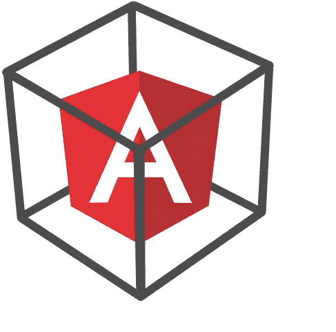

# 利用模板注入接管一个帐户。

> 原文：<https://infosecwriteups.com/leveraging-template-injection-to-takeover-an-account-1dba7c4ae315?source=collection_archive---------0----------------------->



嗨，我带着一篇有趣的文章回来了，这是关于我去年向一个私人程序报告的一个模板注入错误。

我在浏览这个应用程序，试图理解它是做什么的。在浏览应用程序时，我登陆了账户设置页面，寻找测试设置页面时应该查看的常见内容。

在测试了一段时间后，没有发现任何有意义的东西，我想也许我在这里什么也没有得到，应该继续下一个功能。

第二天，我在探索该应用程序的其他功能时，发现了这个有趣的功能，它允许用户为访问该页面的观众编写定制的消息，有点像带有定制问候的博客帖子。有趣的是，它允许用户访问用户对象的某些属性来创建定制的消息，它甚至允许用户为某些属性设置默认值。

例如，如果用户想写一篇文章，以给每个浏览者定制的问候开始。他可以做这样的事。

```
Hi user.name,XXXXXXXX
```

如果一个名为 Akash 的用户访问这个页面，他会看到

```
Hi Akash,XXXXXXXX
```

有许多属性可以用来向在应用程序上拥有不同权限的用户显示不同的消息。

我写了一篇博文，开头是这样的问候

```
Hi user.name,XXXXXXXX
```

从我的帐户访问这个页面，令我惊讶的是，它显示`Hi 9,`我没有预料到这一点，但后来我回忆起在设置页面测试错误时，我输入我的名字为`{{3*3}}`，那次什么也没有发生。我没有更改名称，而是继续测试另一个功能。

它对表达式`{{3*3}}`求值并显示结果`9`。这意味着应用程序容易受到客户端模板注入(CSTI)攻击。该应用程序使用 AngularJS 和用户提交的输入(表达式),该输入位于帐户设置页面下的名称字段中，并在该博客页面上进行评估。

我在想一种利用这种行为的方法，并继续寻找 IDOR，它可能允许攻击者更改用户名并将其替换为有效负载，该有效负载将用户的会话 cookies 发送到由攻击者控制的服务器，或者通过编程更改他的帐户电子邮件来接管他的帐户。

不幸的是，我找不到 IDOR，并得出结论，这种行为本身是不可利用的，因为这只是一个无害的自我注入漏洞。

但是等等，还记得我提到过应用程序允许用户为一些属性设置默认值吗？攻击者可以将变量的默认值设置为 CSTI 有效负载来利用此行为。

我将这个 CSTI 有效载荷设为`redacted_property`的默认值

```
{{a=toString().constructor.prototype;a.charAt=a.trim;$eval(‘a,alert(1),a’)}}
```

并在博客上使用了这个`redacted_property`，

```
Hi user.name,user.redacted_propertyXXXXXXXX
```

访问该页面时，我会看到一个警告弹出窗口，就像经典的 XSS 概念验证一样。


攻击者可以利用这一点来窃取用户的会话 cookie，或者简单地更改他的电子邮件地址并接管他的帐户，而不是弹出警报。

我希望你们喜欢读这篇文章，跟着我看更多这样有趣的文章。

有任何问题，你可以在推特上给我发消息 [@0xAkash](https://twitter.com/0xAkash)