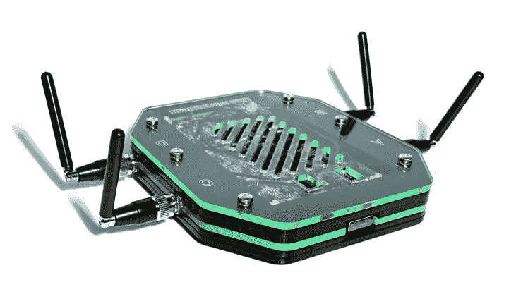
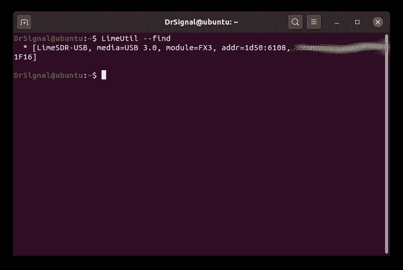
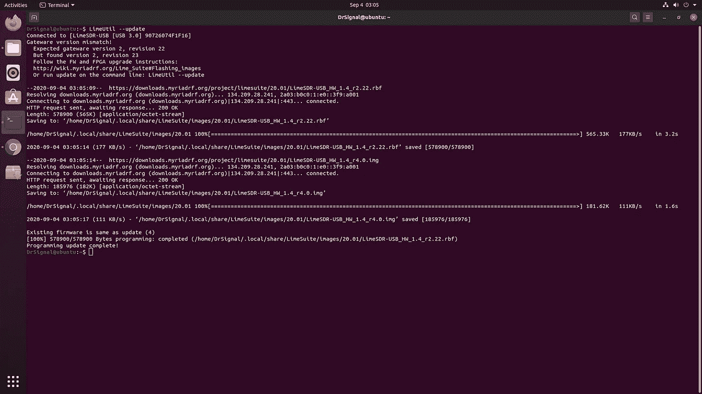
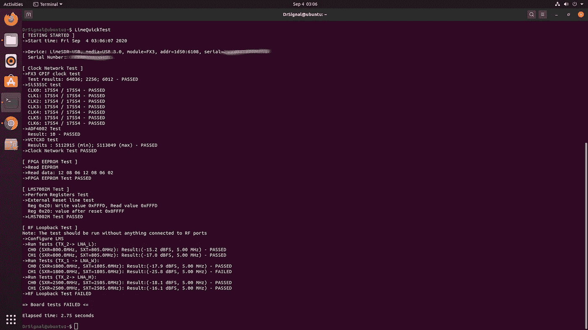
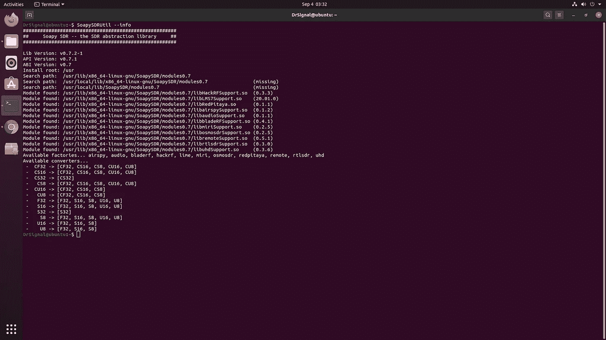
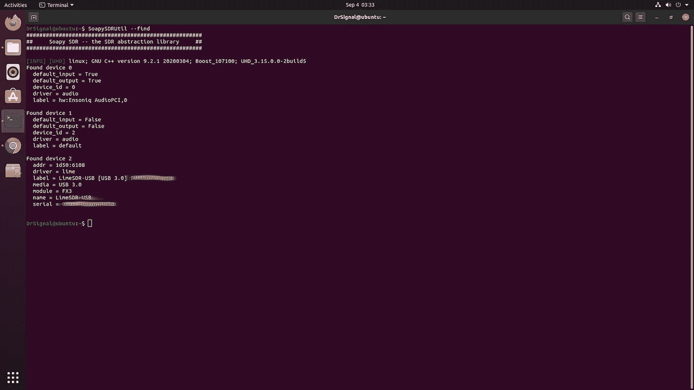
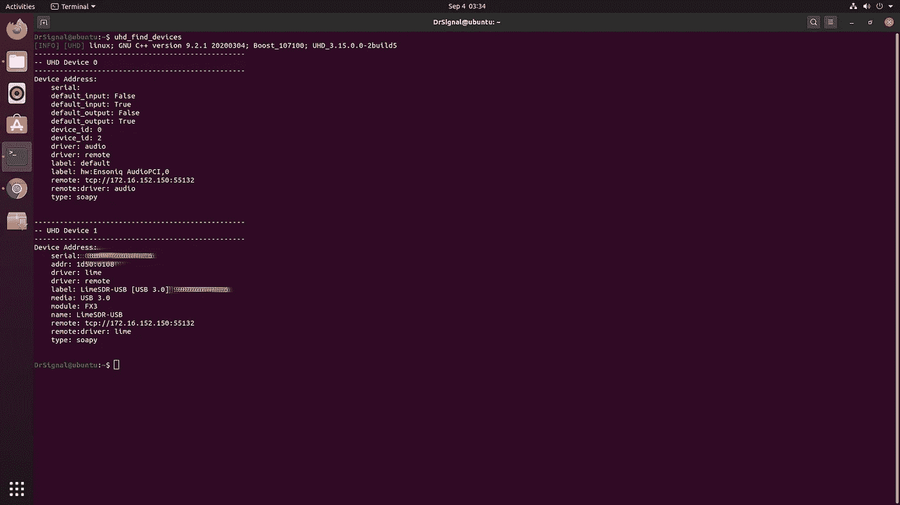
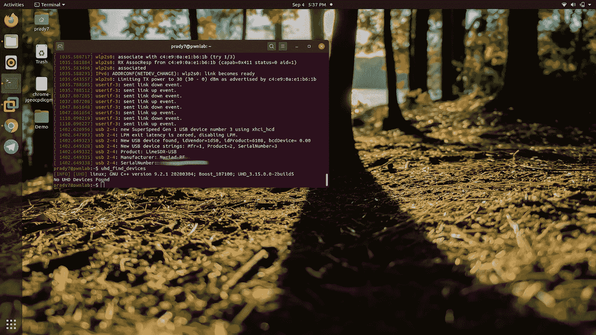

# 在 Ubuntu-20.04 上使用 GNURadio、gr-limesdr 和 GQRX 设置 LimeSDR

> 原文：<https://infosecwriteups.com/limesdr-setup-with-gnuradio-gr-limesdr-and-gqrx-on-ubuntu-20-04-4b275176d7cd?source=collection_archive---------0----------------------->

## -第一部分



带丙烯酸外壳的石灰画

**百无聊赖的**这个疫情和我终于在 [**Ubuntu-20.04**](https://releases.ubuntu.com/20.04/) 里掸掉了我的 [**LimeSDR**](https://limemicro.com/products/boards/limesdr/) 和 setup lab。Ubuntu-20.04 已经将 SDR 域所有以前的 PPAs 添加到其默认的 APT 缓存中。这引起了我的注意。因此，我们将研究如何设置石灰堆栈。不仅仅是 LimeSuite 或 Lime tools，还有其他软件栈，比如 osmo-bts、gnuradio 和其他没有 PPAs 的工具。我们还将了解如何将 LimeSDR 设置为 UHD 源。这对许多 RF 应用非常有帮助。

首先，让我们了解一下我们今天将要安装的工具。

*   **UHD:**USRP 硬件驱动程序(UHD)是由 Ettus Research 提供的设备驱动程序，用于 USRP 产品系列。它支持 Linux、MacOS 和 Windows 平台。几个框架包括 GNU Radio、LabVIEW、 [MATLAB](https://en.wikipedia.org/wiki/MATLAB) 和 UHD 的 Simulink..**来自维基百科**
*   limeSuite 和 Lime 工具:基本上，Lime 工具是那些帮助我们运行 Lime SDR 的工具。Lime Suite 支持对收发器进行编程和对寄存器进行回读，支持校准收发器，并借助 SoapySDR 支持使用 SoapySDR 或 UHD API 的应用。Lime Suite GUI 也可用于对 LimeSDR 板上的 FX3.0 微控制器、FPGA 和配置 flash 进行编程。*虽然 Lime Suite 是基于 LMS7002M 的平台的官方 SDR 驱动程序，并且推荐用于大多数应用，但也有替代方案，例如用于嵌入式应用和快速原型开发。**[***LMS7002M 驱动***](https://wiki.myriadrf.org/LMS7002M_Driver) ***包含一个 C 驱动用于控制 LMS 7002m 的收发器。*** 驱动程序为调谐频率、设置增益、设置滤波器、设置采样率、设置流模式、配置开关和校准提供用户 API。虽然该驱动程序可以选择 LMS7002M 的流模式，但它不会直接接收或发送基带数据。[***pylms 7002m***](https://wiki.myriadrf.org/PyLMS7002M)***Python 包是平台无关的，旨在快速原型化和算法开发。*** 为控制 LMS7002M 芯片和评估板提供低级寄存器访问和高级便利功能。除其他用途外，为 CW Tx 和矢量网络分析仪(VNA)提供了示例 Python 应用程序。*
*   ***SoapySDR:** SoapySDR 是 Pothosware 开发的一个软件套件，为主机系统提供统一的 API。一个全新的、干净的、独立于供应商和平台的 SDR 支持库。基本上，SoapySDR 与 SDR API 通信，并将其打包成一个新的 API。众所周知，市场上有如此多的 SDR 硬件。然而，它们中的大多数都实现了各自的驱动程序，这让 RF 开发人员很难将他们的项目移植到不同的硬件上。所以 SoapySDR 搭建了一个桥梁来连接各种各样的 SDR 驱动。*
*   *GnuRadio: GNU Radio 是一个免费的软件开发工具包，它提供信号处理模块来实现[软件定义无线电](https://en.wikipedia.org/wiki/Software-defined_radio)和信号处理系统。它可以与外部 [RF](https://en.wikipedia.org/wiki/Radio_frequency) 硬件一起使用，以创建软件定义的无线电，或者在类似模拟的环境中不使用硬件。*
*   ***GQRX:** Gqrx 是一款开源的软件定义无线电接收机(SDR)，由 [GNU Radio](http://gnuradio.org/) 和 [Qt](http://qt-project.org/) 图形工具包提供支持。这些是您可以使用 gqrx 执行的操作。*处理来自支持设备的 I/Q 数据。改变频率、增益并应用各种校正(频率、I/Q 平衡)。AM、SSB、CW、FM-N 和 FM-W(单声道和立体声)解调器。NOAA APT 的特殊调频模式。可变带通滤波器。AGC、静噪和噪声抑制器。FFT 图和瀑布。记录和播放音频到/从 WAV 文件。记录和回放原始基带数据。频谱分析仪模式，禁用所有信号处理。基本* [*遥控*](http://gqrx.dk/doc/remote-control) *通过 TCP 连接。* [*通过 UDP*](http://gqrx.dk/doc/streaming-audio-over-udp) *输出流式音频。**

*让我们从 Ubuntu 的初始设置开始。*

*   ***第一步** **:安装 UHD***

```
*sudo apt updatesudo apt upgradesudo apt install git cmake g++ libboost-all-dev libgmp-dev swig python3-numpy python3-mako python3-sphinx python3-lxml doxygen libfftw3-dev libsdl1.2-dev libgsl-dev libqwt-qt5-dev libqt5opengl5-dev python3-pyqt5 liblog4cpp5-dev libzmq3-dev python3-yaml python3-click python3-click-plugins python3-zmq python3-scipy python3-gi python3-gi-cairo gobject-introspection gir1.2-gtk-3.0sudo apt install uhd-host uhd-soapysdr*
```

*首先安装 uhd-host，然后安装 Limesuite 和 lime 驱动程序，这一点非常重要。我反过来做过，遇到了很多麻烦，因为我的 uhd 主机甚至在几次重启后都没有检测到石灰。*

*   ***第二步:安装 LimeSuite***

```
*sudo apt install limesuite limesuite-udev#Testing_Lime_setupLimeUtil --find*
```

**

```
*LimeUtil --update*
```

**

```
*LimeQuickTest*
```

**

***警告！！！如果您不想看到这种天线故障错误，请从板上断开所有天线并运行此命令***

*   ***步骤 3:安装 SoapySDR***

```
*sudo apt install soapyosmo-common0.7 soapyremote-server soapysdr-module-airspy soapysdr0.7-module-airspy soapysdr-module-all soapysdr0.7-module-all soapysdr-module-audio soapysdr0.7-module-audio soapysdr-module-bladerf soapysdr0.7-module-bladerf soapysdr-module-hackrf soapysdr0.7-module-hackrf soapysdr-module-lms7 soapysdr0.7-module-lms7 soapysdr-module-mirisdr soapysdr0.7-module-mirisdr soapysdr-module-osmosdr soapysdr0.7-module-osmosdr soapysdr-module-redpitaya soapysdr0.7-module-redpitaya soapysdr-module-remote soapysdr0.7-module-remote soapysdr-module-rtlsdr soapysdr0.7-module-rtlsdr soapysdr-module-uhd soapysdr0.7-module-uhd soapysdr-tools*
```

***警告！！！如果你安装的是 soapy ' rfspace '模块，就会出现某种错误。所以请不要安装任何 rfspace 模块。***

*装上索比之后，我们来看看它是如何工作的。*

```
*SoapySDRUtil --info*
```

**

*这给出了关于安装在 PC 上的 soapysdr 的信息。*

```
*SoapySDRUtil --find*
```

**

*你可以使用 LMS7 驱动程序来检查 LimeSDR 是否已经移植了 Soapy。现在，大多数应用程序使用 SoapySDR API 来使 SDR 工作。我们将在下一部分看到一个例子。*

```
*uhd_find_devices*
```

**

****见索比的魔术。现在它已经将 LimeSDR 移植到 UHD 源。这就是你能在 uhd 设备命令中看到石灰的原因。****

**

*为了证明这一点，我在另一台 Ubuntu-20.04 机器上运行了相同的命令。你可以看到结果是没有找到 UHD。这是因为没有安装 Soapy 驱动程序。但是可以看到 LimeSDR 是连接的($ dmesg)。*

*我们已经成功安装了 LimeSDR 工作所需的基本设置。*

*我们将在 [**PART-2**](https://medium.com/@pradyu.jumna/limesdr-setup-with-gnuradio-gr-limesdr-and-gqrx-on-ubuntu-20-04-dd51a1819359) 中看到如何设置 gnuradio、gr-limesdr 和 gqrx。*

# ***参考***

1.  *[https://en . Wikipedia . org/wiki/Universal _ Software _ Radio _ Peripheral](https://en.wikipedia.org/wiki/Universal_Software_Radio_Peripheral)*
2.  *[https://limemicro.com/products/boards/limesdr/](https://limemicro.com/products/boards/limesdr/)*
3.  *[https://wiki.myriadrf.org/LMS7002M_Driver](https://wiki.myriadrf.org/LMS7002M_Driver)*
4.  *[https://discourse.myriadrf.org/](https://discourse.myriadrf.org/)*
5.  *[https://github.com/pothosware/SoapySDR/wiki](https://github.com/pothosware/SoapySDR/wiki)*
6.  *[https://wiki.gnuradio.org/index.php/Main_Page](https://wiki.gnuradio.org/index.php/Main_Page)*
7.  *[https://gqrx.dk/](https://gqrx.dk/)*

> *在浪费了大量时间讨论如何设置合适的 SDR 实验室，并帮助许多正在寻找 RF | SDR 设置解决方案的初学者之后，我写了这篇博客。他们面临着安装软件堆栈和浪费时间的许多麻烦。这对少数人来说可能会节省很多时间。是的，我对 Ubuntu-20.04 有很多想法，比如它将如何支持 SDR 软件的许多依赖性。TBH，这使得大多数设置非常容易。*