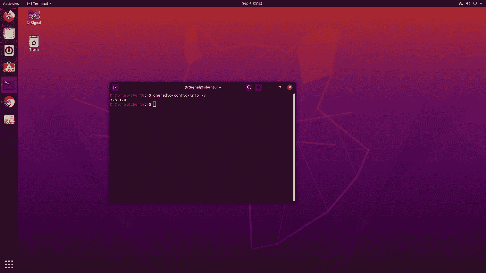
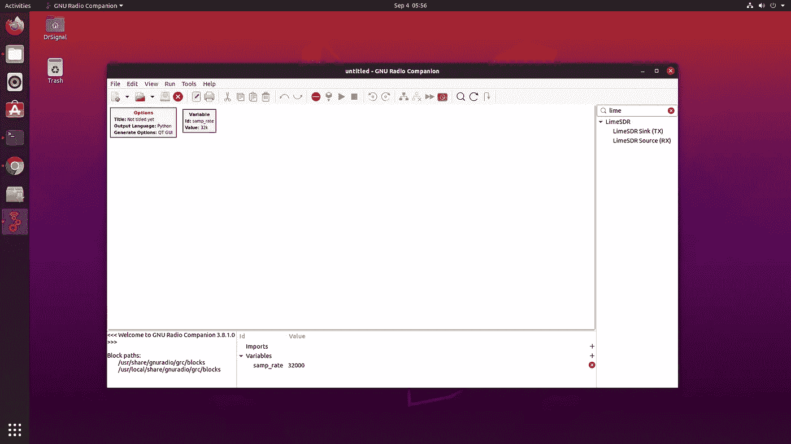
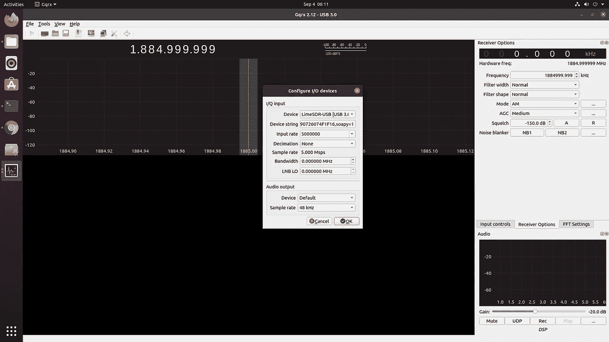
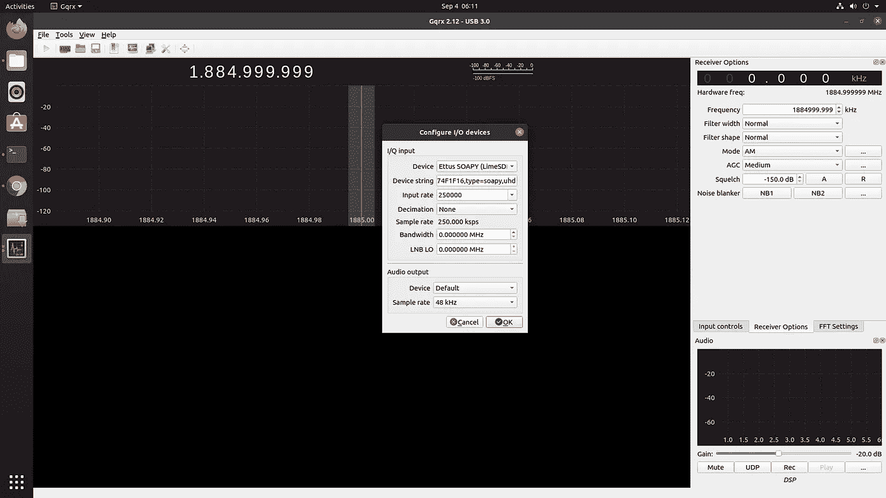
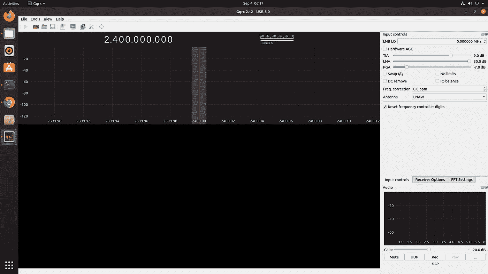
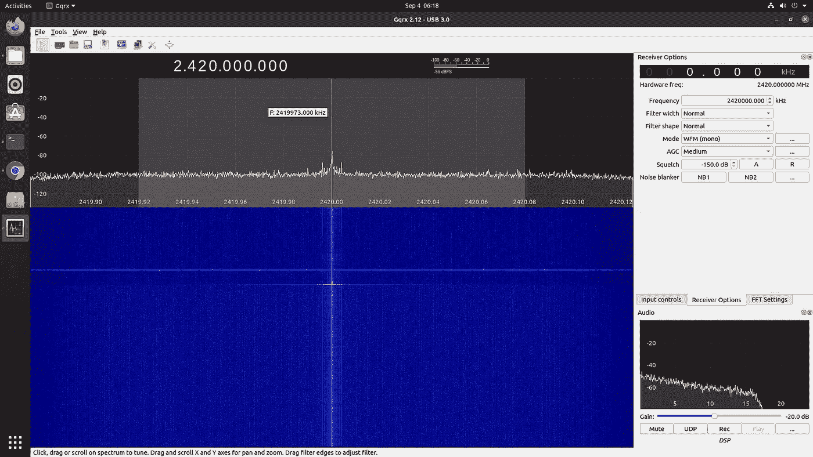

# 在 Ubuntu-20.04 上使用 GNURadio、gr-limesdr 和 GQRX 设置 LimeSDR

> 原文：<https://infosecwriteups.com/limesdr-setup-with-gnuradio-gr-limesdr-and-gqrx-on-ubuntu-20-04-dd51a1819359?source=collection_archive---------1----------------------->

## —第二部分


带丙烯酸外壳的石灰画

希望你有一个顺利的 LimeSDR 安装设置。现在，我们将了解如何设置 gnuradio、gr-limesdr 和 gqrx。对于那些没有检查过如何设置 LimeSDR 的人，这里是 [**PART-1**](https://medium.com/@pradyu.jumna/limesdr-setup-with-gnuradio-gr-limesdr-and-gqrx-on-ubuntu-20-04-4b275176d7cd) **。**

让我们继续前进。

*   **步骤 4:安装 GNURadio**

```
sudo apt install gnuradio gnuradio-dev
```

这将安装最新的 gnuadio，即 gnuradio-3.8.1。**你一定知道 Ubuntu-20.04 不赞成 gnuradio-3.7。因此执行上面的命令将会安装 gnuradio-3.8。**



这个 gnuradio 没有带 gr limesdr。这基本上是 GNURadio 的源代码。

```
sudo apt install gr-limesdrgnuradio-companion
```



打开 gnuradio companion 后，在 blocks 搜索栏搜索 lime，基本上是 Ctrl+f，现在可以用 Lime Rx，Tx 即插即用了。

*   **设置-5 : GQRX**

```
sudo apt install gqrx-sdrgqrx
(You definitely don't want to run this command with sudo because it throws "Pulseaudio error: Connection refused" and that is because Pulseaudio wont run on sudo)
```



可以看到 gqrx 是直接把 LimeSDR 当做 LMS7002M 驱动的来源。



但是在这里，你可以看到设备源是 Ettus Soapy。正如我在第一部分中解释的，我将展示如何使用 Soapy 模块，你可以在这里看到它。GQRX 是移植与索比设备给输出。让我们现在运行它，检查它是否工作。

**在播放 gqrx 之前，在 DSP 上方的右下方，进入输入控制→天线→ <为您的场景选择合适的天线>**



现在点击播放。



可以看到 gqrx 玩的。Ufff…终于:)

好吧，好吧，好吧…对于那些不知道，gqrx 设置与石灰 SDR 是如此令人头痛。安装 gqrx 对于 lime 来说是非常非常困难的，因为没有合适的依赖项，也因为 gnuradio-3.7 不适合。

最后 yyyy…这款加酸橙的 gqrx 版本运行起来像婴儿发油一样顺滑。SDR 领域期待已久的功能……我已经等了很久，希望这个问题能在 [**myriadrf** **支持页面**](https://discourse.myriadrf.org/)[**gqrx 支持页面**](https://github.com/csete/gqrx/issues) **上解决。终于，等待结束了。:D**

希望你们喜欢这个博客。如果您在安装过程中遇到任何错误，请留下您的掌声和评论。

# 谢谢你

# 参考

1.  [https://en . Wikipedia . org/wiki/Universal _ Software _ Radio _ Peripheral](https://en.wikipedia.org/wiki/Universal_Software_Radio_Peripheral)
2.  [https://limemicro.com/products/boards/limesdr/](https://limemicro.com/products/boards/limesdr/)
3.  [https://wiki.myriadrf.org/LMS7002M_Driver](https://wiki.myriadrf.org/LMS7002M_Driver)
4.  https://discourse.myriadrf.org/
5.  【https://github.com/pothosware/SoapySDR/wiki 
6.  [https://wiki.gnuradio.org/index.php/Main_Page](https://wiki.gnuradio.org/index.php/Main_Page)
7.  [https://gqrx.dk/](https://gqrx.dk/)

> 在浪费了大量时间讨论如何设置合适的 SDR 实验室，并帮助许多正在寻找 RF | SDR 设置解决方案的初学者之后，我写了这篇博客。他们面临着安装软件堆栈和浪费时间的许多麻烦。这对少数人来说可能会节省很多时间。是的，我对 Ubuntu-20.04 有很多想法，比如它将如何支持 SDR 软件的许多依赖性。TBH，这使得大多数设置非常容易。