# Linux 挑战 Tryhackme

> 原文：<https://infosecwriteups.com/linux-challenges-tryhackme-writeup-e8550417d476?source=collection_archive---------2----------------------->

## **这是一篇关于 Tryhackme room“Linux 挑战”的文章**


https://tryhackme.com/room/linuxctf

【房间:】[https://tryhackme.com/room/linuxctf](https://tryhackme.com/room/linuxctf)

**注:该房间仅供高级会员使用。谁购买了高级会员。**

TryHackMe 平台上的 [**Linux 挑战赛**](https://tryhackme.com/room/linuxctf) **室**非常适合用来提升你的 Linux 技能。这篇文章使用 Linux 操作系统中的不同命令、服务和工具在 Linux 机器上查找标志。我们将检查整个房间，找到隐藏在系统中的标志，这将导致系统地完成每个任务。

我建议你们试着自己解决这些挑战，如果你被困在某个地方，你随时可以回到这里。

## 目标

1.  学会使用 find、locate、ls、grep、tar 等命令。
2.  了解 Cron 作业、MOTDs，定位系统中隐藏的目录和文件。
3.  学习使用私钥登录不同用户帐户。
4.  了解系统文件、路径、变量和文件权限。
5.  学习通过 GUI 等使用 SCP 和远程桌面传输文件。

# 任务 1- Linux 挑战简介

首先，我们需要连接到 TryHackMe 网络来访问我们的目标机器。为此，我们可以连接到 OpenVPN 或使用浏览器内的机器访问(可供订阅用户使用)。如果我们需要通过 SSH 手动登录，我们可以使用下面的凭证。

**问题 1。在 garrys 的主目录中你能看到多少可见的文件？**

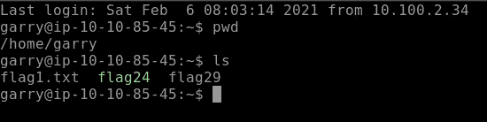

> **答案:3**

# 任务 2。基础知识

本节涵盖了 Linux 的基础知识。我们需要寻找隐藏的标志，我们可能需要切换到另一个用户帐户为我们的目标。我们需要找到 **10 面旗子**来完成这一部分的挑战。

让我们通过使用如下所示的 cat 命令找到我们的第一个标志。

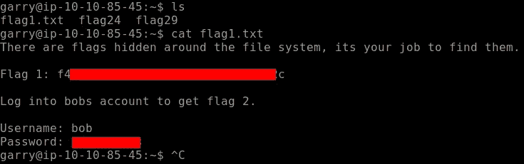

我们必须登录 bobs 帐户才能找到我们的 **Flag 2。**

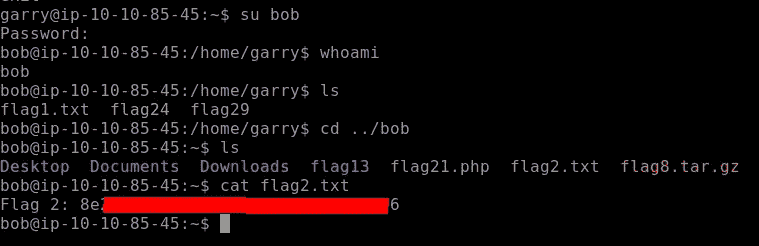

**标志 3** 隐藏在当前用户的 **bash 历史**中。我们不知道隐藏的 bash 历史文件的确切位置，所以我们可以使用 **locate** 命令找到 **flag 3** ，如下所示。

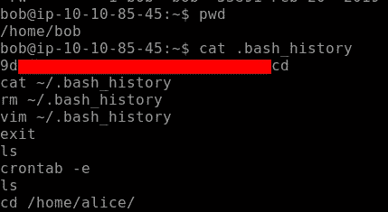

我们的**旗 4** 位于 crontab。 **Crontab** 是用于按指定时间表运行的命令列表。Crontab 与 **cronjobs** 相关，其目的是在指定的时间表或时间执行指定的指令或命令。 **crontab -e** 允许编辑 crontab 条目。

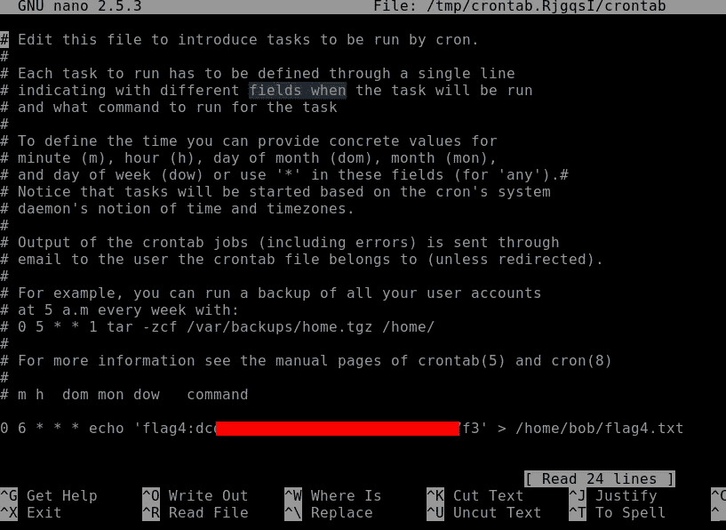

转到下一面旗帜，即**旗帜 5** 。让我们使用 grep 命令，它在查找任何文件、目录或文件内容时非常方便。grep -r 'flag5 '将递归搜索内容 flag5。如下图所示，我们找到了到达**标志 5 的路径。**

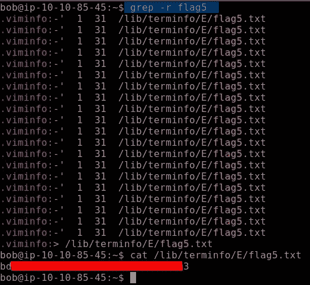

我们同样会找到旗帜 6。这个任务给了我们一个提示，标志中包含字母' **c9** '。首先，使用**定位**命令定位标志 6 目录。当我们输出文件时，文本太多，所以这里 **grep** 开始起作用

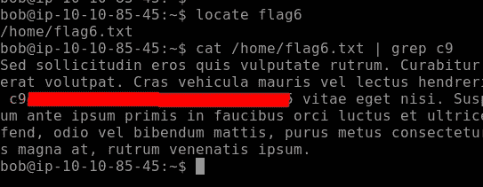

继续我们的下一面旗帜。这个挑战提示我们去寻找发现过程的路径。e 将使用 **ps** 命令，该命令用于列出系统中所有活动的进程。我们用 **ps** 命令设置的**标志**允许我们以列表格式列出活动连接。

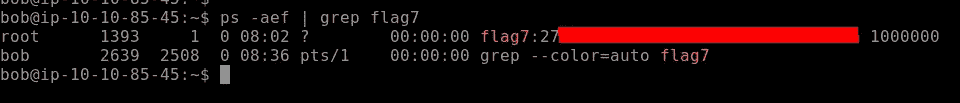

**标志 8** 可以在用户 bob 的主目录中找到。该文件需要解压缩以输出**标志 8** 的内容

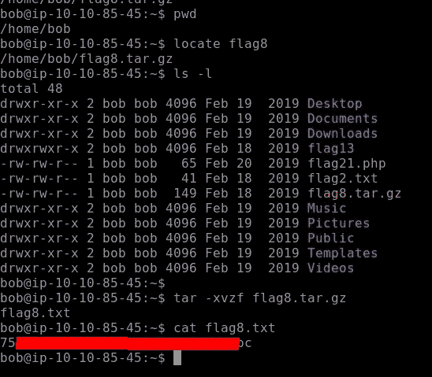

这个挑战提示我们在主机文件中寻找我们的**标志 9。**

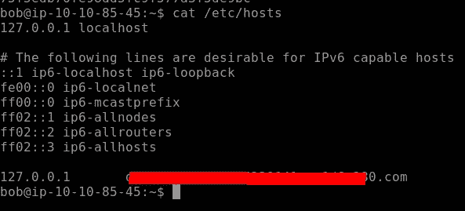

对于我们的最终标志，即**标志 10** ，我们需要查看所有用户的目录，主要是存储在该文件中的密码散列，如果您已经熟悉 Linux 文件系统和目录，您可能已经猜到了。没错，就是我们要查看的 **etc/passwd** 文件。通过分析文件，我们得到了最终的**标志 10。**

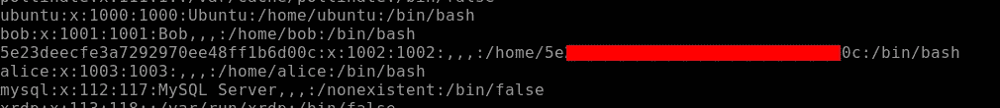

# 任务 3- Linux 功能

转到下一个挑战任务，我们将在这里使用更多的 Linux 命令。让我们运行一下**标记 11** ，看看它会显示什么。正如输出所说，我们必须查看创建别名的位置。巴什尔是值得一看的地方，如下图所示，我们有自己的**旗帜 11。**

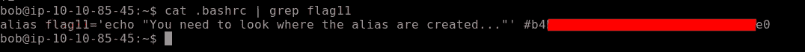

**标志 12** 可在 motd(每日消息)目录中找到。因此，导航到如下所示的目录。检查头文件，我们有我们的标志 12。

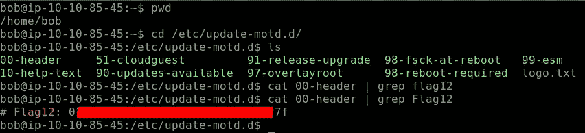

对于下一个标志，我们导航到**标志 13** 目录。该目录中包含两个脚本。正如挑战所说的使用 **diff** 命令，diff 命令逐行比较内容并产生输出。这样做我们得到了我们的**旗帜 13**

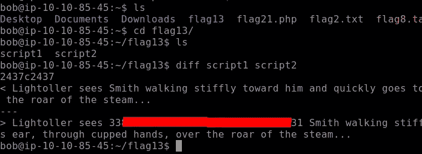

移动到下一个标志，即**标志 14** 。我们可以找到存储日志的标志，导航到 var/log 目录，如下所示。可以看到我们的 Flag14 被命名为 **flagtourteen.txt** ，里面有很多文字，你会在最后找到旗帜。为了简单起见，我使用了 **grep 3** 作为我的标志，其中包含数字 3。您可以跳过这个命令，因为它不是必需的

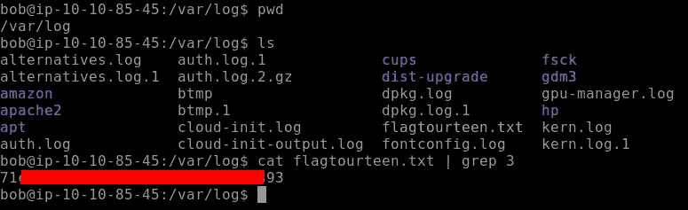

**Flag15** 可以在存储系统信息的地方找到，也可以在发布目录中找到。导航到这个目录，我们发现我们的标志 15。

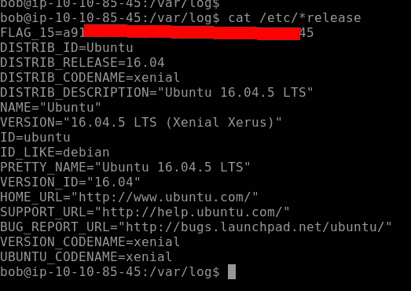

继续下一面旗帜，即 16 号旗帜。它隐藏在文件系统的一个挂载中，通常位于介质目录中。让我们导航到这个目录。似乎每个目录都有更多前缀为“ **Flag16is** 的目录，如下所示。

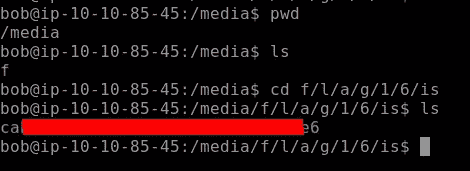

爱丽丝的账户上发现了标记 17。所以让 ssh 进入 Alice 的帐户，她的密码是“TryHackMe123”。使用 **ls** 列出目录中的所有文件，在这里我们可以找到我们的标志，如下所示

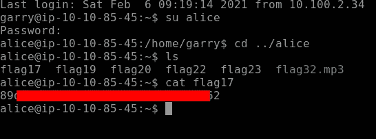

继续我们的下一个隐藏标志，即**标志 18，**它是隐藏的，所以我们使用 ls -la 列出所有隐藏的文件和目录。使用 **cat** 输出隐藏标志的结果

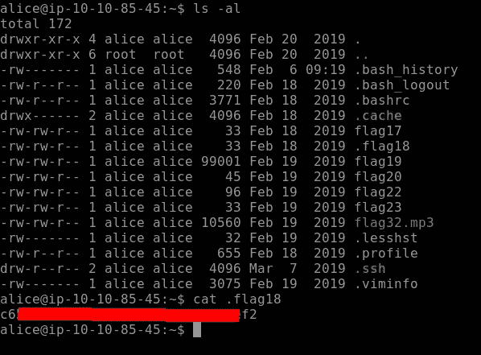

本部分的最后一个标志是 flag19。我们必须找到 2435 线，它将显示我们的标志 19。我们需要读取文件的特定行，因此我们将使用 sed。 **-n** 标志用于隐藏不匹配的文本，而标志 **p** 用于打印匹配的行。

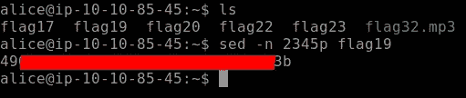

# 任务 4-数据表示、字符串和权限

这一节将主要关注数据在 Linux 系统上是如何表示的。除此之外，不要忘记使用搜索技巧，因为有些任务可能需要使用谷歌或任何其他参考资料进行独立研究。

我们在爱丽丝目录中找到了我们的标志。当我们捕捉输出时，我们发现内容是使用 base64 编码的，我们需要解码它。如下所示，我们可以通过查看字符集[A-Z，A-Z，0–9，+ /]来识别某个字符串是否是用 base64 编码的。因此，让我们解码字符串以获得我们的标志。使用以下命令进行解码。

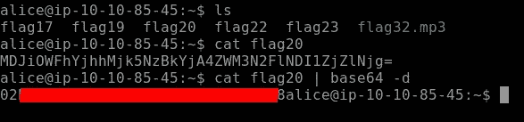

继续我们的下一个**标志 21。**这个标志是一个 PHP 文件，通过使用 **less** 命令，我们找到我们的标志，如下所示。**少**基本上一次输出一页文件的内容，类似于**多**但功能更多。

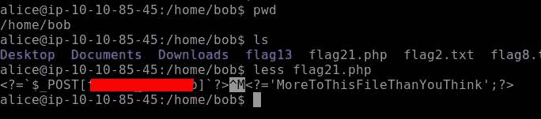

当我们输出我们的 **Flag22，**的内容时，输出是十六进制格式。我们需要将它转换成如下所示的 ASCII 码。 **xxd** 创建文件的十六进制转储，并将十六进制转储转换回其原始二进制。

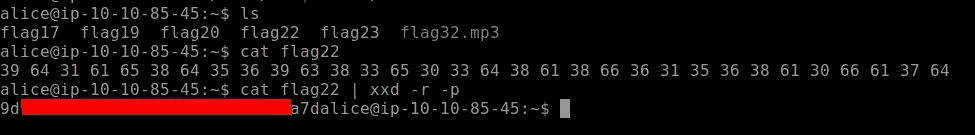

**Flag23** 很容易找到，只需颠倒在 Flag23 内容中找到的字符串的顺序，如下所示。

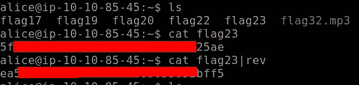

**Flag24** 是一个 c 程序文件。我们将使用命令**字符串**，以便显示人类可读的字符串。

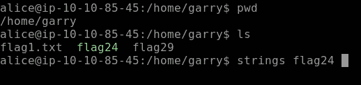

在我们使用字符串命令之后，我们得到我们的 **Flag24** ，如下所示。

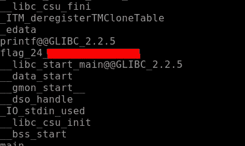

定位 flag26 有点困难，因为我们需要找到一个 32 个字符长、以 4bceb 开头的字符串。因此，这里我们将结合使用 find 命令和 grep，如下所示

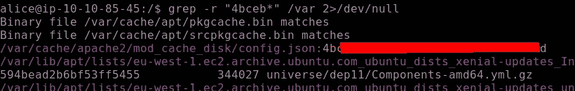

继续我们下一个**标志 27。Flag27** 由 root 用户拥有，所以我们需要知道是否允许 Alice 执行某些命令来提取 Flag27 的输出。所以这里我们使用 Sudo -l，它会告诉我用户 Alice 可以执行哪些命令，如下所示。因此，运行 root 用户 Alice 允许的命令，我们获得 F **lag27。**

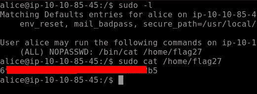

接下来，我们需要找到可以使用 uname 命令获得的内核版本，如下所示。uname 用于显示系统版本、操作系统等信息。 **-r** 标志显示内核版本，如下图所示。


我们需要删除文件和行中的所有空格，用逗号将它们分开，以获得我们的最终标志，即该部分的 Flag29。如下图所示 **tr** 用于翻译或删除字符，在我们的例子中是空格。

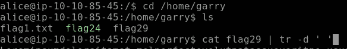

一旦空格被删除，我们可以得到我们的**标志 29** ，如下图所示

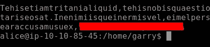

# 任务 5。SQL、FTP、组和 RDP

这项任务的挑战包括通过寻找标志，下载和传输文件到您的本地系统玩数据库。所以让我们开始吧！

我们需要为当前任务找到第一个标志，即标志 30。我们需要查找本地主机上运行的任何服务。命令 curl 在这里会派上用场。curl 是一个工具，用于使用不同的支持协议向服务器传输数据或从服务器传输数据。在当前场景中使用 curl，我们可以找到我们的旗帜。

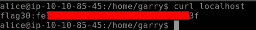

为了找到我们的 Flag31，我们需要登录数据库。数据库的凭据已经给定。登录数据库，使用命令**显示数据库；这将列出整个数据库，在这里我们找到了**标志 31。****

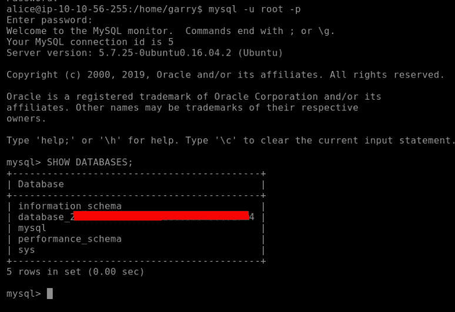

数据库中隐藏着一个奖金标志。为此，我们导航到前面找到的数据库。在该数据库下有一个名为**旗帜**的表格，让我们访问它找到我们的奖金旗帜，如下所示。

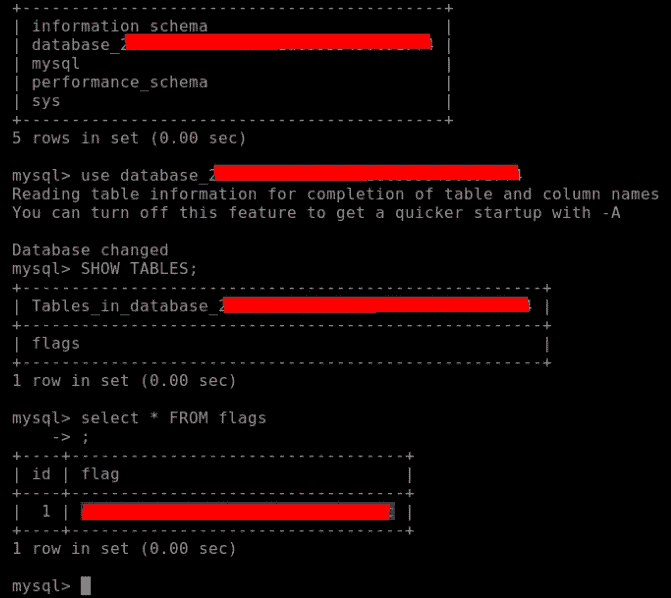

下一个标志是一个 mp3 文件，需要下载到我们的本地系统，看看里面有什么。我们可以使用 SCP(安全拷贝)或 Filezilla 下载。我更喜欢用 SCP。你可以通过谷歌搜索找到 SCP 的语法。

```
scp alice@10.10.56.255:/home/alice/flag32.mp3 .
```

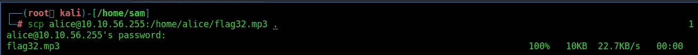

听文件。上面写着:试试黑我 13 37

我们通过导航到。存储个人路径的配置文件，如下所示。

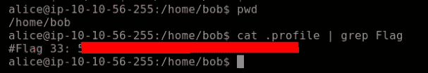

让我们切换到 Bob 的帐户，使用 **env** 或 **printenv** 输出环境变量，这将打印所有的环境变量，如下所示。我们在这里找到了我们的旗帜。

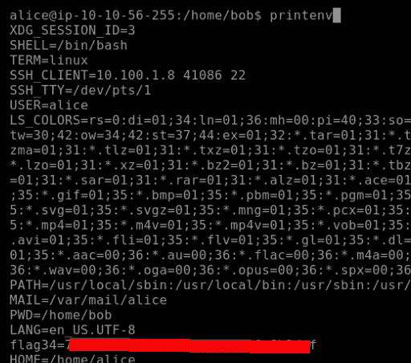

我们需要查看在系统上创建所有组的位置。使用 **getent group** 命令来完成这个任务，注意我已经将 grep 与这个命令结合使用，这样我就可以得到特定的结果。我们发现我们的标志 35 如下所示。

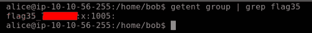

这一部分的最后一个标志与前面的命令相关。在这个具有挑战性的任务中，我们需要找到**黑客组织**中的用户。通过这个，我们将得到我们最后的旗帜。我们使用与显示系统上所有组相同的命令，并导航到特定用户以找到我们的 Flag36，如下所示。

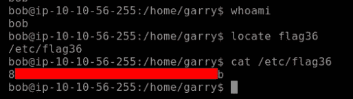

你可以在:
**LinkedIn:-**[https://www.linkedin.com/in/shamsher-khan-651a35162/](https://www.linkedin.com/in/shamsher-khan-651a35162/)
**Twitter:-**[https://twitter.com/shamsherkhannn](https://twitter.com/shamsherkhannn)
**Tryhackme:-**[https://tryhackme.com/p/Shamsher](https://tryhackme.com/p/Shamsher)


如需更多演练，请在出发前继续关注…

访问我的其他演练:-

感谢您花时间阅读我的演练。
如果您觉得有帮助，请点击👏按钮👏(高达 40 倍)并分享
它来帮助其他有类似兴趣的人！+随时欢迎反馈！