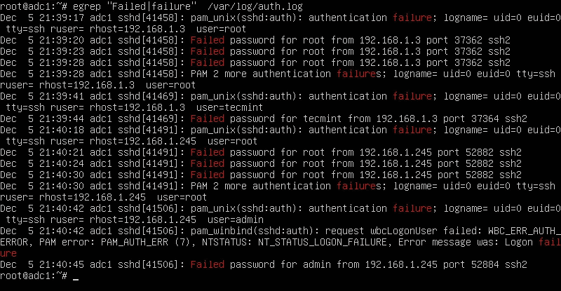
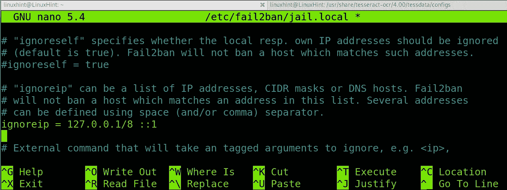

# Linux 加固技术

> 原文：<https://infosecwriteups.com/linux-hardening-techniques-802b12bebcae?source=collection_archive---------1----------------------->


由 [Lukas](https://unsplash.com/@lukash?utm_source=medium&utm_medium=referral) 在 [Unsplash](https://unsplash.com?utm_source=medium&utm_medium=referral) 拍摄的照片

# 介绍

这是 Linux 强化系列的第四篇博文，在这篇博文中，我们学习并讨论了如何保护我们的 Linux 服务器，这些服务器已经被部署来托管我们在互联网上的应用程序或网站。之前的博文可以在[这里](https://securitylit.medium.com/securing-your-linux-servers-part-3-23a711a701a7)，这里[这里](https://medium.com/codex/securing-your-linux-server-part-ii-48e45c581931)，这里[这里](https://medium.com/codex/securing-your-linux-server-with-these-best-practices-50b30e026bd)找到。

在这篇博文中，我们将详细介绍一些你可能没有意识到的东西，并检查这些东西是否被正确安装，或者是否需要相应地删除。

# **禁用不需要的服务**

在我们谈论这个之前，让我们先了解一下运行级别。运行级别是 Linux 操作系统中的运行模式。运行级别本质上与预设是一样的。运行级别用于确定加载操作系统后允许哪些应用程序运行。*共有 7 个运行级别(从 0 到 6)* ，均用于不同的目的，例如，如果您想要托管服务器或运行简单的操作系统，您可以根据使用情况选择运行级别。通常，在服务器环境中，您需要寻找**运行级别 3** 。

您必须删除不需要的包，因为它们会增加攻击面，手动更新它们会带来很多麻烦。此外，跟踪所有已安装的软件包可能不可行，如果在服务器上安装并运行的特定软件包上发现 0 天，这可能会导致危害。

要检查已安装的软件包，

```
/sbin/chkconfig --list |grep '3:on'
```

一旦您发现了需要删除的服务/包，请使用下面提到的命令:

```
service serviceName stop
chkconfig serviceName off
```

要删除这些包，您需要检查哪个包管理器用于安装它们。

它通常是三者之一

1.  容易得到
2.  妙的
3.  突然的

**使用 apt-get 卸载软件包**

```
sudo apt-get remove package-name
```

**使用 yum 卸载软件包**

```
yum –y remove package-name
```

**使用 snap 卸载软件包**

```
sudo snap remove package-name
```

# **登录失败后锁定用户账户**



[来源](https://www.tecmint.com/find-failed-ssh-login-attempts-in-linux/)

如果用户帐户没有启用任何速率限制功能，对手就有可能对用户帐户进行暴力攻击。因此，强烈建议在特定次数的不成功登录尝试后，对用户帐户应用速率限制。

我们会用两种方法来讨论这个问题。第一种是手动的，另一种是自动的。

**故障日志**

我们将使用 faillog 从日志文件中获取失败日志。这是一个将显示失败日志数据库内容的命令，该数据库是/var/log/faillog。

当**失败日志**在没有参数的情况下执行时，它只显示登录失败的用户的失败日志记录。

一旦您知道哪个帐户有多次失败的登录尝试，您可以使用 passwd 实用程序锁定它。

```
passwd –l username
```

这里-l 代表锁定帐户。

要解锁帐户，您也可以尝试 passwd 和 faillog

```
passwd –u username
faillog –u –r username
```

**Fail2ban**



[来源](https://linuxhint.com/whitelist-ip-address-fail2ban/)

Fail2ban 是一个入侵防御框架，提供了很多功能。这个工具被用来保护计算机服务器免受暴力攻击。Fail2ban 对日志文件(如/var/log/apache/error log)进行分析，然后禁止表现出恶意行为症状的 IP 地址，如过多的失败登录尝试或搜索漏洞。

然后利用 Fail2Ban 修改防火墙规则，以便在预定的时间内拒绝 IP 地址；然而，也可以定义任何任意的其他动作(例如发送电子邮件)。

Fail2Ban 预配置了针对各种不同服务(apache、courier、ssh 等)定制的过滤器。

要安装和初始化 fail2ban，请执行以下命令:

```
**# To install fail2ban**sudo apt install fail2ban**# Create a jail.local filne in /etc/fail2ban directory**sudo nano /etc/fail2ban/jail.local**# Type in the following in the file.**[sshd]enabled = truebanaction = iptables-multiportmaxretry = 10findtime = 43200bantime = 86400
```

我们来理解一下上面几行是什么意思。

如果来自特定 IP 地址的用户在 12 小时(43200 秒)内尝试进行 10 次失败的登录尝试，则该 IP 地址将被禁止一天(86400 秒)

```
**# Enable and Restart fail2ban**sudo systemctl enable fail2bansudo systemctl restart fail2ban
```

# **检查监听端口号**

如果我们在同一个服务器上运行多个服务，可能很难跟踪它们。我们可能经常忘记禁用该服务，但它仍然暴露在端口上，并允许连接到您的服务器。可能已经进入您的服务器的攻击者也可能已经安装了一个 bind shell，该 shell 可能正在侦听特定的端口。要检查所有活动的端口以及服务器正在监听的端口，请执行以下操作:

```
netstat –tulpn
```

您必须识别这些端口上运行的服务，然后您可以使用 ufw(防火墙)禁用它们

```
sudo ufw deny PORT-NUMBER
```

# **禁用不需要的 SUID 和 SGID 二进制文件**

使用 SUID 或 SGID 位设置的二进制文件可以在执行时为用户提供提升的权限。这可能导致整个 Linux 服务器受损，因为二进制文件可能以 root 权限运行。

要检查设置了 SUID 位的所有二进制文件:

```
find / -type f  \( -perm -4000 -o -perm -2000 \) 2>/dev/null
```

如果您可能错误地为任何二进制文件设置了 SUID/SGID 位，这也很有用。然后，您可以相应地更改权限。

注意:有些文件需要设置 SUID 或 SGID 位才能正常工作。在禁用任何二进制文件上的 SUID 或 SGID 位之前，请进行适当的研究。

# **避免使用 FTP、Telnet、rsh 或 rlogin**

虽然 FTP 和 telnet(在一定程度上)今天仍在使用，但 rsh 和 rlogin 是遗留的程序/服务。应该避免它们。这些是纯文本协议，网络中的任何人都可以嗅探您的流量以读取明文数据通信。

相反，您必须使用 OpenSSH、SFTP 或 FTPS (FTP over SSL)来加密数据通信。

要通过互联网将数据从一台电脑传输到另一台电脑，您可以使用 scp、rsync、ssh。FTP 和 telnet 是某种不安全的协议，因为 FTP 以明文形式发送数据，因此不能用于通过它发送敏感文件。总是建议使用 SSH 和公共私有密钥对来访问和转发敏感信息。

# **结论**

在这篇博客文章中，我们探讨了一些检测系统上运行和安装的服务和软件包的方法，以及如何停止和卸载它们。我们学习了如何检查他们正在监听的服务和端口，以及如何关闭端口，然后使用 faillog、passwd 和 fail2ban 锁定用户帐户。总是建议采用最好的安全措施来确保安全，并在不安全的协议上使用 SSH、SFTP 或 FTPS 等协议。