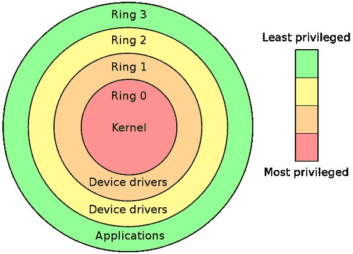
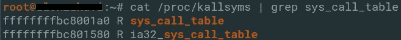

# Linux 内核模块 Rootkit —系统调用表劫持

> 原文：<https://infosecwriteups.com/linux-kernel-module-rootkit-syscall-table-hijacking-8f1bc0bd099c?source=collection_archive---------0----------------------->

在本文中，我们将讨论使用 Linux 内核 syscall 表的系统调用劫持。我将向您展示如何以两种不同的方法获得 syscall 表的地址，以及如何应用它们来进行系统调用以完成(几乎)您想要的一切(挂钩)。

# LKM 概述

我假设，如果你读到这里，这意味着你已经对 LKM(可加载内核模块)有了足够的了解，所以如果你有，可以跳到下一部分。

LKM 是一个目标文件，可以被插入到正在运行的内核中。这主要用于扩展内核的功能(设备驱动、文件系统等)。).它的另一个用途是创建一个将在内核内部运行的 rootkit。

# 保护环

操作系统中有两种模式，用户模式和内核模式，它们是由保护环定义的。“保护环”是系统中特权的层次结构。有四个环(环-0，环-1 等。)而且越往下，特权越多。在大多数现代系统中，实际上只有两个环，即 ring-0(也称为内核模式)和 ring-3(用户模式)。



保护环

在内核模式下运行的进程可以访问所有系统资源，包括最“敏感”的部分，当内核模式进程访问错误的资源时，或者由于某种原因而崩溃时，这可能会导致系统崩溃。然而，用户模式进程对资源的访问非常有限，所以它不会访问任何敏感的资源。这样设计是为了保护(因此得名，保护环)用户不犯大错误。

# Rootkits

> 来自维基百科:
> **rootkit**是一个计算机软件的集合，通常是恶意的，旨在允许访问计算机或其软件的某个区域，否则是不允许的(例如，对未经授权的用户)，并且经常掩盖其存在或其他软件的存在。

当谈到 rootkit 时，我们应该将其分为两种不同的模式，内核模式的 rootkit，以内核权限运行，和用户模式的 rootkit，以用户权限运行。用户模式的 rootkit 可以改变二进制文件，如`ls`、`ss`、`cat`等。用户模式的 rootkit 也可以挂钩动态链接库来改变某些函数的行为。然而，内核模式的 rootkit 可以做更多的事情，这要归功于它所拥有的特权，比如改变内核级函数指针、改变内核代码、操纵重要的数据结构以及最重要的挂钩系统调用。

# 系统调用

内核充当着用户和机器之间的连接，所以每次用户需要在机器上做一些事情的时候，它都会和内核“对话”，要求内核将消息传递给机器。多亏了系统调用，这种“对话”才成为可能。
系统调用是内核中的一个功能，对用户也是可见的。当用户需要来自内核的服务时，它要求内核执行系统调用。例如，Linux 中的`cat`命令使用系统调用`open()`打开文件，`read()`读取文件，`write()`在屏幕上打印信息，`close()`关闭打开的文件(它还使用了一些我在这里没有提到的系统调用)。
那些系统调用只在内核上下文中执行，因为它们需要访问一些只有内核才能访问的部分(保护环，还记得吗？).

## 为什么它对我们很重要？

想象一下，你可以改变`read()`系统调用的方式，每次用户试图读取一个字节流时，它将只读取你希望它读取的字节，这样你可以在每个文件中隐藏秘密数据，而用户甚至不会知道。
选项只限于头脑，这是因为所有的用户模式进程，从内核请求这些服务，根据定义，它必须这样做。

## 系统调用表

syscall 表是内核中的一个数组，它包含一个指向操作系统必须提供的所有系统调用(syscall)的指针。

```
void *sys_call_table[NR_syscalls] = {
	[0 ... NR_syscalls-1] = sys_ni_syscall,
#include <asm/unistd.h>
};
```

正如您在上面看到的，`sys_call_table`是一个大小为`NR_syscalls`的数组，它是内核中定义的一个宏，保存了允许的最大数量的系统调用。此外，syscall 表中的所有元素都被初始化为`sys_ni_syscall`。每个尚未实现的系统调用都被重定向到`sys_ni_syscall`。当一个新的系统调用被实现时，在`sys_call_table`中为该系统调用保留的偏移量将被改变，以包含一个指向新实现的系统调用的指针。

# 获取系统调用表地址

最后，有趣的部分！
本文的主要尝试是教你如何劫持 syscall 表，也就是在内存中获取 syscall 表的地址，这样你就可以随心所欲地玩它，滥用它。
在过去版本的 Linux 内核中，syscall 表有一个名为`SYSCALL_TABLE`的显式变量，但由于显而易见的原因，它被删除了，因此攻击者必须考虑新的原始方法来获取 syscall 表的地址。以下是实现这一目标的几种方法:

## 通过记忆搜索

搜索任何东西的最懒惰(但不是最有效)的方法，是遍历所有可能的地方，对于你搜索的每个地方，你都要比较你当前所在的地址和你已经知道的地址(我们将使用`sys_close`引用)。
对于这个方法，我们需要一个开始的地方，一个我们确定的内存地址在内存中的`sys_call_table`地址之前。然后，我们将遍历内存，在一个循环中，每次迭代都在内存中向上，直到我们在内存中找到一个位置，当它被加上某个偏移量时，它将指向我们搜索的地址(为了更好地理解，请参见示例)。

让我们来分解一下:
我们将`i`初始化为`sys_close()`函数的地址。我们可以相信该函数将位于比 syscall 表更低的内存地址中，因为它在启动时首先被加载到内存中。当`i`达到无符号长整型所能达到的最大值时，循环就会停止，那是因为它是系统的最后一个内存地址。每一次迭代我们都将`i`增加`void *`的大小。
在循环的每次迭代中，如前所述，我们将`i`与`sys_close()`本身的地址进行比较，T7 现在是系统中的一个地址，加上了偏移量`__NR_close`(为`sys_close)`指定的偏移量)。如果等于，说明我们找到了 syscall 表；如果没有，我们继续下一次迭代。

## 通过`/proc/kallsyms`文件

您可能已经知道，Linux 中的所有东西都是一个文件，有一个特定的文件可以帮助我们得到我们想要的东西，这个文件就是`/proc/kallsyms`文件。

`/proc/kallsyms`文件是一个特殊的文件，包含所有动态加载内核模块的符号和静态代码的符号。换句话说，它在一个地方有整个内核映射。所以现在的算法很简单，只需读取文件，并搜索`sys_call_table`符号。



图 1 —写入/proc/kallsyms 中的 sys_call_table 符号

先说读一个文件。
读取文件是将数据流放入缓冲区的行为，因此您将能够访问该数据。
如上所述，有保护环可以防止数据被滥用。因此，如果你在内核中，你只能从内核空间读取数据，如果你在用户空间，你只能读取用户空间的数据。幸运的是，有一种方法可以将用户空间数据读入内核模块。我们要做的就是改变全局变量`addr_limit`。`addr_limit`是允许非特权代码访问的最高地址，如果我们改变它，我们可以从我们想要的地方读取数据，包括用户空间。`set_fs()`是我们将要用到的函数。([此处阅读更多](https://lwn.net/Articles/722267/))。

分解一下:
首先，我们使用`set_fs()`来设置`addr_limit`，这样我们就可以从用户空间读取`/proc/kallsyms`文件。在我们读取它之后，使用`vfs_read()`，我们将`addr_limit`设置回原始值(这非常重要，因为如果我们不这样做，任何用户模式进程都可能操纵内核地址空间)。
从此直截了当。在每次迭代中，我们检查该行是否包含“sys_call_table”字符串，如果包含，则保存该表的地址并将其返回。

## 由 kallsyms_lookup_name()提供

现在是有趣的部分。
到目前为止，我们为获取系统调用表的地址所做的一切都可以通过调用函数`kallsyms_lookup_name()`来完成，该函数在`linux/kallsyms.h`中声明。

```
printk("The address of sys_call_table is: %lx\n", kallsyms_lookup_name("sys_call_table"));
```

关于这个函数没有太多要讲的，除了它搜索并返回你搜索的任何符号的地址。因此，你只需要搜索名字`sys_call_table`就有了，内核的系统调用表就在你的手中。

# 挂接系统调用

在获得 syscall 表之后，我们将使用它来创建一个 syscall 挂钩，这将改变某个系统调用的行为。在上一节中，我们讨论了系统调用表是一个地址数组，数组包含的每个地址都是一个系统调用的地址。当用户请求 syscall 时，内核转到 syscall 表，提取 syscall 的地址，然后指示 CPU 转到那个函数。如果我们改变保存在表中的地址，内核将指示 CPU 进入我们的函数，在那里，我们可以做任何我们想做的事情。

## cr0

CPU 中有各种各样的寄存器，其中一种是“控制寄存器”。控制寄存器是保存改变 CPU 行为的标志的寄存器。其中一个寄存器是`cr0`寄存器。`cr0`中的一个标志是`WP`标志，该标志告诉 CPU 他是否可以写入存储器中的只读区(关于其他标志，请访问控制寄存器的[维基百科页面)。当`WP`设置为 1 时，CPU 可能不会写入只读页面，但当设置为 0 时，CPU 可能会在任何位置写入任何内容。](https://en.wikipedia.org/wiki/Control_register#CR0)

因此，假设系统调用表在一个只读区，我们需要将`WP`标志改为 1 来改变那里的地址。

```
#define unprotect_memory() \
({ \
	orig_cr0 =  read_cr0();\
	write_cr0(orig_cr0 & (~ 0x10000)); /* Set WP flag to 0 */ \
});#define protect_memory() \
({ \
	write_cr0(orig_cr0); /* Set WP flag to 1 */ \
});
```

上面有两个宏用于将`cr0`寄存器中的`WP`标志更改为 0 或 1。我们将在实际挂钩时使用这些宏。

## 真正的挂钩

现在是关键时刻，真正的勾搭。

正如您在第 12 行和第 19 行中看到的，我们所做的更改系统调用的只是将保存在 syscall 表中的地址更改为我们选择的地址。
就这样。这是 Linux 内核中的一个系统调用挂钩。

# 你可以用钩子做的事情

对于如何使用钩子，有很多选择。例如，您可能会给一些系统调用添加一些功能，或者使用挂钩来创建一个内核 rootkit(这可能是您在这里的原因)。rootkit 最常用的挂钩是:

*   `kill` —主要用于添加一些信号，可以帮助与你的 rootkit 进行交流。
*   `getdirentries` —用于隐藏文件和进程。
*   `read` —用于按键记录。
*   `shutdown` —改变关机顺序。
*   `ioctl` —更改基本`ioctl`请求。

还有更多，取决于你的想象力。

# 参考

[【1】](http://www.linfo.org/kernel.html)关于内核—Linux 信息工程
[【2】](https://elixir.bootlin.com/)***bootlin***—内核源代码分版本
[【3】](https://github.com/m0nad/Diamorphine)二乙酰吗啡 Rootkit —一个简单的 Linux 内核 Rootkit


## 作者:

@GoldenOak
@TSn0w

*关注* [*Infosec 报道*](https://medium.com/bugbountywriteup) *获取更多此类精彩报道。*

[](https://medium.com/bugbountywriteup) [## 信息安全报道

### 收集了世界上最好的黑客的文章，主题从 bug 奖金和 CTF 到 vulnhub…

medium.com](https://medium.com/bugbountywriteup)