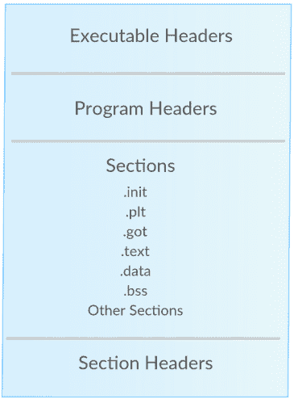

# 面向初学者的 Linux 逆向工程 CTFs

> 原文：<https://infosecwriteups.com/linux-reverse-engineering-ctfs-for-beginners-4cf03ff2cfb4?source=collection_archive---------0----------------------->

过了一会儿，我决定写一篇关于 Linux 二进制反转 CTFs 的简短博文。初学者如何处理二进制数和求解？总的来说，我个人并不喜欢 Linux 逆向工程挑战，因为我更多的时间是在 Windows 逆向工程上。我更喜欢 windows 逆向工程挑战。我喜欢 Windows 的一个原因是，作为一个测试者，我每天都会遇到 Windows 机器，很少会遇到整个网络都运行 Linux 的情况。即使是在漏洞开发方面，你也很少会在测试时手动为 Linux 软件开发漏洞。但是当涉及到物联网时，这些知识真的很有用，因为几乎许多设备都基于 Linux embedded。如果你想开始逆向工程和开发，从 Linux 开始将是一个好主意。很多年前我也是从 Linux 开始的。他说，因为有些人在看到逆向工程的挑战时会试图逃避。因此，如果你是一个新手，我希望这些内容可能对你有用。

# ELF 格式

我们先来看看精灵头。详细了解这一点的最好方法是查看 ELF 的手册页。



以下是更详细的内容。“e_shoff”成员保存节标题表的偏移量。“sh_offset”成员保存段的第一个字节的地址。

```
 +-------------------+
            | ELF header        |---+
+---------> +-------------------+   | e_shoff
|           |                   |<--+
| Section   | Section header 0  |
|           |                   |---+ sh_offset
| Header    +-------------------+   |
|           | Section header 1  |---|--+ sh_offset
| Table     +-------------------+   |  |
|           | Section header 2  |---|--|--+
+---------> +-------------------+   |  |  |
            | Section 0         |<--+  |  |
            +-------------------+      |  | sh_offset
            | Section 1         |<-----+  |
            +-------------------+         |
            | Section 2         |<--------+
            +-------------------+
```

# 可执行文件头

任何 ELF 文件都以可执行文件头开始。这包含了关于 ELF 文件类型的信息，不同文件头的偏移量。你看看评论就明白了。对于这个例子，我使用 32 位结构。对于 x86_64，大小可能会改变，命名约定将以“Elf64_”开头。

```
#define EI_NIDENT (16)

typedef struct {
  unsigned char e_ident[EI_NIDENT];     /* Magic number and other info */
  Elf32_Half    e_type;                 /* Object file type */
  Elf32_Half    e_machine;              /* Architecture */
  Elf32_Word    e_version;              /* Object file version */
  Elf32_Addr    e_entry;                /* Entry point virtual address */
  Elf32_Off     e_phoff;                /* Program header table file offset */
  Elf32_Off     e_shoff;                /* Section header table file offset */
  Elf32_Word    e_flags;                /* Processor-specific flags */
  Elf32_Half    e_ehsize;               /* ELF header size in bytes */
  Elf32_Half    e_phentsize;            /* Program header table entry size */
  Elf32_Half    e_phnum;                /* Program header table entry count */
  Elf32_Half    e_shentsize;            /* Section header table entry size */
  Elf32_Half    e_shnum;                /* Section header table entry count */
  Elf32_Half    e_shstrndx;             /* Section header string table index */
} Elf32_Ehdr;
```

这是一个使用 readelf 的例子。

```
# readelf -h /bin/ls
ELF Header:
  Magic:   7f 45 4c 46 02 01 01 00 00 00 00 00 00 00 00 00 
  Class:                             ELF64
  Data:                              2's complement, little endian
  Version:                           1 (current)
  OS/ABI:                            UNIX - System V
  ABI Version:                       0
  Type:                              DYN (Shared object file)
  Machine:                           Advanced Micro Devices X86-64
  Version:                           0x1
  Entry point address:               0x6130
  Start of program headers:          64 (bytes into file)
  Start of section headers:          137000 (bytes into file)
  Flags:                             0x0
  Size of this header:               64 (bytes)
  Size of program headers:           56 (bytes)
  Number of program headers:         11
  Size of section headers:           64 (bytes)
  Number of section headers:         29
  Section header string table index: 28
```

要计算整个二进制文件的大小，我们可以使用下面的计算方法

`size = e_shoff + (e_shnum * e_shentsize)
size = Start of section headers + (Number of section headers * Size of section headers)
size = 137000 + (29*64) = 138856`

如你所见，我们的计算是正确的。

```
# ls -l /bin/ls
-rwxr-xr-x 1 root root 138856 Aug 29 21:20 /bin/ls
```

# 程序标题

这些头文件描述了二进制文件中对于加载二进制文件很重要的部分。这些信息对于内核将段从磁盘映射到内存非常有用。结构的成员是不言自明的。我不会在这篇文章中深入解释这一点，因为我试图保持事情的基本性。然而，在 ELF 中用逆向工程做很酷的事情时，理解每一部分都很重要:)

```
typedef struct {
  Elf32_Word    sh_name;                /* Section name (string tbl index) */
  Elf32_Word    sh_type;                /* Section type */
  Elf32_Word    sh_flags;               /* Section flags */
  Elf32_Addr    sh_addr;                /* Section virtual addr at execution */
  Elf32_Off     sh_offset;              /* Section file offset */
  Elf32_Word    sh_size;                /* Section size in bytes */
  Elf32_Word    sh_link;                /* Link to another section */
  Elf32_Word    sh_info;                /* Additional section information */
  Elf32_Word    sh_addralign;           /* Section alignment */
  Elf32_Word    sh_entsize;             /* Entry size if section holds table */
} Elf32_Shdr;
```

# 部分

与任何二进制文件一样，这些是部分。有些部分熟悉 PE 的头。然而，我不会讨论所有的部分，因为我尽量保持它的基本性。

# 。bss 部分

这个部分包含程序未初始化的全局数据。

# 。数据部分

这个部分包含程序初始化的全局变量。

# 。rodata 部分

此部分包含只读数据，如所用程序的字符串。

# 。文本部分

这一部分包含程序的实际代码，即逻辑流程。

```
# readelf -S --wide /bin/ls
There are 29 section headers, starting at offset 0x21728:Section Headers:
  [Nr] Name              Type            Address          Off    Size   ES Flg Lk Inf Al
  [ 0]                   NULL            0000000000000000 000000 000000 00      0   0  0
  [ 1] .interp           PROGBITS        00000000000002a8 0002a8 00001c 00   A  0   0  1
  [ 2] .note.ABI-tag     NOTE            00000000000002c4 0002c4 000020 00   A  0   0  4
  [ 3] .note.gnu.build-id NOTE            00000000000002e4 0002e4 000024 00   A  0   0  4
  [ 4] .gnu.hash         GNU_HASH        0000000000000308 000308 0000c0 00   A  5   0  8
  [ 5] .dynsym           DYNSYM          00000000000003c8 0003c8 000c90 18   A  6   1  8
  [ 6] .dynstr           STRTAB          0000000000001058 001058 0005d8 00   A  0   0  1
  [ 7] .gnu.version      VERSYM          0000000000001630 001630 00010c 02   A  5   0  2
  [ 8] .gnu.version_r    VERNEED         0000000000001740 001740 000070 00   A  6   1  8
  [ 9] .rela.dyn         RELA            00000000000017b0 0017b0 001350 18   A  5   0  8
  [10] .rela.plt         RELA            0000000000002b00 002b00 0009f0 18  AI  5  24  8
  [11] .init             PROGBITS        0000000000004000 004000 000017 00  AX  0   0  4
  [12] .plt              PROGBITS        0000000000004020 004020 0006b0 10  AX  0   0 16
  [13] .plt.got          PROGBITS        00000000000046d0 0046d0 000018 08  AX  0   0  8
  [14] .text             PROGBITS        00000000000046f0 0046f0 01253e 00  AX  0   0 16
  [15] .fini             PROGBITS        0000000000016c30 016c30 000009 00  AX  0   0  4
  [16] .rodata           PROGBITS        0000000000017000 017000 005129 00   A  0   0 32
  [17] .eh_frame_hdr     PROGBITS        000000000001c12c 01c12c 0008fc 00   A  0   0  4
  [18] .eh_frame         PROGBITS        000000000001ca28 01ca28 002ed0 00   A  0   0  8
  [19] .init_array       INIT_ARRAY      0000000000021390 020390 000008 08  WA  0   0  8
  [20] .fini_array       FINI_ARRAY      0000000000021398 020398 000008 08  WA  0   0  8
  [21] .data.rel.ro      PROGBITS        00000000000213a0 0203a0 000a38 00  WA  0   0 32
  [22] .dynamic          DYNAMIC         0000000000021dd8 020dd8 0001f0 10  WA  6   0  8
  [23] .got              PROGBITS        0000000000021fc8 020fc8 000038 08  WA  0   0  8
  [24] .got.plt          PROGBITS        0000000000022000 021000 000368 08  WA  0   0  8
  [25] .data             PROGBITS        0000000000022380 021380 000268 00  WA  0   0 32
  [26] .bss              NOBITS          0000000000022600 0215e8 0012d8 00  WA  0   0 32
  [27] .gnu_debuglink    PROGBITS        0000000000000000 0215e8 000034 00      0   0  4
  [28] .shstrtab         STRTAB          0000000000000000 02161c 00010a 00      0   0  1
Key to Flags:
  W (write), A (alloc), X (execute), M (merge), S (strings), I (info),
  L (link order), O (extra OS processing required), G (group), T (TLS),
  C (compressed), x (unknown), o (OS specific), E (exclude),
  l (large), p (processor specific)
```

# 解决一个基本的 CTF 挑战

现在你对标题有了一个基本的了解，让我们选择一个随机的挑战 CTF 和爆炸。从[这里](https://ufile.io/blvpm)下载二进制文件。

当我们传入一些随机的字符串时，就会显示出`[+] No flag for you. [+]`文本。

```
# ./nix_5744af788e6cbdb29bb41e8b0e5f3cd5 aaaa[+] No flag for you. [+]
```

# 用线串

让我们从字符串开始，看看有什么有趣的字符串。

```
# strings nix_5744af788e6cbdb29bb41e8b0e5f3cd5 
/lib/ld-linux.so.2
Mw1i#'0
libc.so.6
_IO_stdin_used
exit
sprintf
puts
strlen
__cxa_finalize
__libc_start_main
GLIBC_2.1.3
Y[^]
[^_]
UWVS
[^_]
Usage: script.exe <key>
Length of argv[1] too long.
[+] The flag is: SAYCURE{%s} [+]
[+] No flag for you. [+]
%c%c%c%c%c%c%c%c%c%c%c%c%c%c%c
;*2$"
GCC: (Debian 8.2.0-8) 8.2.0
crtstuff.c
```

我们找到了从二进制文件中打印出来的所有字符串。“%c”是打印我们的标志的格式字符串，我们可以确定标志必须是 15 个字符。

`Usage: script.exe
Length of argv[1] too long.
[+] The flag is: SAYCURE{%s} [+]
[+] No flag for you. [+]
%c%c%c%c%c%c%c%c%c%c%c%c%c%c%c`

我们可以更好地了解这些字符串，如果我们看看。带有偏移量的“rodata”部分。

```
# readelf -x .rodata nix_5744af788e6cbdb29bb41e8b0e5f3cd5 Hex dump of section '.rodata':
  0x00002000 03000000 01000200 55736167 653a2073 ........Usage: s
  0x00002010 63726970 742e6578 65203c6b 65793e00 cript.exe <key>.
  0x00002020 4c656e67 7468206f 66206172 67765b31 Length of argv[1
  0x00002030 5d20746f 6f206c6f 6e672e00 5b2b5d20 ] too long..[+] 
  0x00002040 54686520 666c6167 2069733a 20534159 The flag is: SAY
  0x00002050 43555245 7b25737d 205b2b5d 0a000a5b CURE{%s} [+]...[
  0x00002060 2b5d204e 6f20666c 61672066 6f722079 +] No flag for y
  0x00002070 6f752e20 5b2b5d00 25632563 25632563 ou. [+].%c%c%c%c
  0x00002080 25632563 25632563 25632563 25632563 %c%c%c%c%c%c%c%c
  0x00002090 25632563 256300                     %c%c%c.
```

# 检查符号

通过检查二进制的符号，我们可以意识到它使用了`printf, puts, sprintf, strlen`函数。

```
# nm -D nix_5744af788e6cbdb29bb41e8b0e5f3cd5 
         w __cxa_finalize
         U exit
         w __gmon_start__
00002004 R _IO_stdin_used
         w _ITM_deregisterTMCloneTable
         w _ITM_registerTMCloneTable
         U __libc_start_main
         U printf
         U puts
         U sprintf
         U strlen
```

# 跟踪系统调用

我们可以使用 strace 之类的工具来跟踪程序使用的系统调用。

```
# strace ./nix_5744af788e6cbdb29bb41e8b0e5f3cd5 aaaa
execve("./nix_5744af788e6cbdb29bb41e8b0e5f3cd5", ["./nix_5744af788e6cbdb29bb41e8b0e"..., "aaaa"], 0x7ffd5ff92d18 /* 46 vars */) = 0
strace: [ Process PID=59965 runs in 32 bit mode. ]
brk(NULL)                               = 0x56f14000
access("/etc/ld.so.nohwcap", F_OK)      = -1 ENOENT (No such file or directory)
mmap2(NULL, 8192, PROT_READ|PROT_WRITE, MAP_PRIVATE|MAP_ANONYMOUS, -1, 0) = 0xf7ef0000
access("/etc/ld.so.preload", R_OK)      = -1 ENOENT (No such file or directory)
openat(AT_FDCWD, "/etc/ld.so.cache", O_RDONLY|O_CLOEXEC) = 3
fstat64(3, {st_mode=S_IFREG|0644, st_size=220471, ...}) = 0
mmap2(NULL, 220471, PROT_READ, MAP_PRIVATE, 3, 0) = 0xf7eba000
close(3)                                = 0
access("/etc/ld.so.nohwcap", F_OK)      = -1 ENOENT (No such file or directory)
openat(AT_FDCWD, "/lib/i386-linux-gnu/libc.so.6", O_RDONLY|O_CLOEXEC) = 3
read(3, "\177ELF\1\1\1\3\0\0\0\0\0\0\0\0\3\0\3\0\1\0\0\0 \233\1\0004\0\0\0"..., 512) = 512
fstat64(3, {st_mode=S_IFREG|0755, st_size=1930924, ...}) = 0
mmap2(NULL, 1940000, PROT_READ, MAP_PRIVATE|MAP_DENYWRITE, 3, 0) = 0xf7ce0000
mprotect(0xf7cf9000, 1814528, PROT_NONE) = 0
mmap2(0xf7cf9000, 1359872, PROT_READ|PROT_EXEC, MAP_PRIVATE|MAP_FIXED|MAP_DENYWRITE, 3, 0x19000) = 0xf7cf9000
mmap2(0xf7e45000, 450560, PROT_READ, MAP_PRIVATE|MAP_FIXED|MAP_DENYWRITE, 3, 0x165000) = 0xf7e45000
mmap2(0xf7eb4000, 12288, PROT_READ|PROT_WRITE, MAP_PRIVATE|MAP_FIXED|MAP_DENYWRITE, 3, 0x1d3000) = 0xf7eb4000
mmap2(0xf7eb7000, 10784, PROT_READ|PROT_WRITE, MAP_PRIVATE|MAP_FIXED|MAP_ANONYMOUS, -1, 0) = 0xf7eb7000
close(3)                                = 0
set_thread_area({entry_number=-1, base_addr=0xf7ef10c0, limit=0x0fffff, seg_32bit=1, contents=0, read_exec_only=0, limit_in_pages=1, seg_not_present=0, useable=1}) = 0 (entry_number=12)
mprotect(0xf7eb4000, 8192, PROT_READ)   = 0
mprotect(0x5664d000, 4096, PROT_READ)   = 0
mprotect(0xf7f1e000, 4096, PROT_READ)   = 0
munmap(0xf7eba000, 220471)              = 0
fstat64(1, {st_mode=S_IFCHR|0620, st_rdev=makedev(0x88, 0x2), ...}) = 0
brk(NULL)                               = 0x56f14000
brk(0x56f35000)                         = 0x56f35000
brk(0x56f36000)                         = 0x56f36000
write(1, "\n", 1
)                       = 1
write(1, "[+] No flag for you. [+]\n", 25[+] No flag for you. [+]
) = 25
exit_group(26)                          = ?
+++ exited with 26 +++
```

为了更好地理解，我们可以使用 ltrace 来跟踪通过解混 C++函数名进行的库调用。我们可以看到正在进行字符串长度检查。

```
# ltrace -i -C ./nix_5744af788e6cbdb29bb41e8b0e5f3cd5 aaaaaaaa
[0x565570e1] __libc_start_main(0x565571e9, 2, 0xffe3a584, 0x56557400 <unfinished ...>
[0x56557249] strlen("aaaaaaaa")                                                                                      = 8
[0x565572ca] puts("\n[+] No flag for you. [+]"
[+] No flag for you. [+]
)                                                                      = 26
[0xffffffffffffffff] +++ exited (status 26) +++
```

# 分解文本部分

让我们来看看。正文部分的反汇编和试理解。在这个二进制代码中，符号没有被去掉，所以我们可以看到函数名，这样更容易理解。如果你现在能读懂汇编，你就会明白发生了什么。如果没有，让我们做一些现场调试，并试图更好地理解。

```
root@Omega:/mnt/hgfs/shared/Linux RE# objdump -D -M intel -j .text nix_5744af788e6cbdb29bb41e8b0e5f3cd5 nix_5744af788e6cbdb29bb41e8b0e5f3cd5:     file format elf32-i386 Disassembly of section .text:000010b0 <_start>:
    10b0:	31 ed                	xor    ebp,ebp
    10b2:	5e                   	pop    esi
    10b3:	89 e1                	mov    ecx,esp
    10b5:	83 e4 f0             	and    esp,0xfffffff0
    10b8:	50                   	push   eax
    10b9:	54                   	push   esp
    10ba:	52                   	push   edx
    10bb:	e8 22 00 00 00       	call   10e2 <_start+0x32>
    10c0:	81 c3 40 2f 00 00    	add    ebx,0x2f40
    10c6:	8d 83 60 d4 ff ff    	lea    eax,[ebx-0x2ba0]
    10cc:	50                   	push   eax
    10cd:	8d 83 00 d4 ff ff    	lea    eax,[ebx-0x2c00]
    10d3:	50                   	push   eax
    10d4:	51                   	push   ecx
    10d5:	56                   	push   esi
    10d6:	ff b3 f8 ff ff ff    	push   DWORD PTR [ebx-0x8]
    10dc:	e8 9f ff ff ff       	call   1080 <__libc_start_main@plt>
    10e1:	f4                   	hlt    
    10e2:	8b 1c 24             	mov    ebx,DWORD PTR [esp]
    10e5:	c3                   	ret    
    10e6:	66 90                	xchg   ax,ax
    10e8:	66 90                	xchg   ax,ax
    10ea:	66 90                	xchg   ax,ax
    10ec:	66 90                	xchg   ax,ax
    10ee:	66 90                	xchg   ax,ax... Output Omitted ...000011e9 <main>:
    11e9:	8d 4c 24 04          	lea    ecx,[esp+0x4]
    11ed:	83 e4 f0             	and    esp,0xfffffff0
    11f0:	ff 71 fc             	push   DWORD PTR [ecx-0x4]
    11f3:	55                   	push   ebp
    11f4:	89 e5                	mov    ebp,esp
    11f6:	56                   	push   esi
    11f7:	53                   	push   ebx
    11f8:	51                   	push   ecx
    11f9:	83 ec 1c             	sub    esp,0x1c
    11fc:	e8 ef fe ff ff       	call   10f0 <__x86.get_pc_thunk.bx>
    1201:	81 c3 ff 2d 00 00    	add    ebx,0x2dff
    1207:	89 ce                	mov    esi,ecx
    1209:	c7 45 e4 00 00 00 00 	mov    DWORD PTR [ebp-0x1c],0x0
    1210:	c7 45 dc 07 00 00 00 	mov    DWORD PTR [ebp-0x24],0x7
    1217:	83 3e 02             	cmp    DWORD PTR [esi],0x2
    121a:	74 1c                	je     1238 <main+0x4f>
    121c:	83 ec 0c             	sub    esp,0xc
    121f:	8d 83 08 e0 ff ff    	lea    eax,[ebx-0x1ff8]
    1225:	50                   	push   eax
    1226:	e8 15 fe ff ff       	call   1040 <printf@plt>
    122b:	83 c4 10             	add    esp,0x10
    122e:	83 ec 0c             	sub    esp,0xc
    1231:	6a 01                	push   0x1
    1233:	e8 28 fe ff ff       	call   1060 <exit@plt>
    1238:	8b 46 04             	mov    eax,DWORD PTR [esi+0x4]
    123b:	83 c0 04             	add    eax,0x4
    123e:	8b 00                	mov    eax,DWORD PTR [eax]
    1240:	83 ec 0c             	sub    esp,0xc
    1243:	50                   	push   eax
    1244:	e8 27 fe ff ff       	call   1070 <strlen@plt>
    1249:	83 c4 10             	add    esp,0x10
    124c:	83 f8 0f             	cmp    eax,0xf
    124f:	76 1c                	jbe    126d <main+0x84>
    1251:	83 ec 0c             	sub    esp,0xc
    1254:	8d 83 20 e0 ff ff    	lea    eax,[ebx-0x1fe0]
    125a:	50                   	push   eax
    125b:	e8 f0 fd ff ff       	call   1050 <puts@plt>
    1260:	83 c4 10             	add    esp,0x10
    1263:	83 ec 0c             	sub    esp,0xc
    1266:	6a 01                	push   0x1
    1268:	e8 f3 fd ff ff       	call   1060 <exit@plt>
    126d:	c7 45 e0 00 00 00 00 	mov    DWORD PTR [ebp-0x20],0x0
    1274:	eb 1a                	jmp    1290 <main+0xa7>
    1276:	8b 46 04             	mov    eax,DWORD PTR [esi+0x4]
    1279:	83 c0 04             	add    eax,0x4
    127c:	8b 10                	mov    edx,DWORD PTR [eax]
    127e:	8b 45 e0             	mov    eax,DWORD PTR [ebp-0x20]
    1281:	01 d0                	add    eax,edx
    1283:	0f b6 00             	movzx  eax,BYTE PTR [eax]
    1286:	0f be c0             	movsx  eax,al
    1289:	01 45 e4             	add    DWORD PTR [ebp-0x1c],eax
    128c:	83 45 e0 01          	add    DWORD PTR [ebp-0x20],0x1
    1290:	8b 45 e0             	mov    eax,DWORD PTR [ebp-0x20]
    1293:	3b 45 dc             	cmp    eax,DWORD PTR [ebp-0x24]
    1296:	7c de                	jl     1276 <main+0x8d>
    1298:	81 7d e4 21 03 00 00 	cmp    DWORD PTR [ebp-0x1c],0x321
    129f:	75 1a                	jne    12bb <main+0xd2>
    12a1:	e8 33 00 00 00       	call   12d9 <comp_key>
    12a6:	83 ec 08             	sub    esp,0x8
    12a9:	50                   	push   eax
    12aa:	8d 83 3c e0 ff ff    	lea    eax,[ebx-0x1fc4]
    12b0:	50                   	push   eax
    12b1:	e8 8a fd ff ff       	call   1040 <printf@plt>
    12b6:	83 c4 10             	add    esp,0x10
    12b9:	eb 12                	jmp    12cd <main+0xe4>
    12bb:	83 ec 0c             	sub    esp,0xc
    12be:	8d 83 5e e0 ff ff    	lea    eax,[ebx-0x1fa2]
    12c4:	50                   	push   eax
    12c5:	e8 86 fd ff ff       	call   1050 <puts@plt>
    12ca:	83 c4 10             	add    esp,0x10
    12cd:	90                   	nop
    12ce:	8d 65 f4             	lea    esp,[ebp-0xc]
    12d1:	59                   	pop    ecx
    12d2:	5b                   	pop    ebx
    12d3:	5e                   	pop    esi
    12d4:	5d                   	pop    ebp
    12d5:	8d 61 fc             	lea    esp,[ecx-0x4]
    12d8:	c3                   	ret 000012d9 <comp_key>:
    12d9:	55                   	push   ebp
    12da:	89 e5                	mov    ebp,esp
    12dc:	57                   	push   edi
    12dd:	56                   	push   esi
    12de:	53                   	push   ebx
    12df:	83 ec 7c             	sub    esp,0x7c
    12e2:	e8 09 fe ff ff       	call   10f0 <__x86.get_pc_thunk.bx>
    12e7:	81 c3 19 2d 00 00    	add    ebx,0x2d19
    12ed:	c7 45 e4 00 00 00 00 	mov    DWORD PTR [ebp-0x1c],0x0
    12f4:	c7 45 a8 4c 00 00 00 	mov    DWORD PTR [ebp-0x58],0x4c
    12fb:	c7 45 ac 33 00 00 00 	mov    DWORD PTR [ebp-0x54],0x33
    1302:	c7 45 b0 74 00 00 00 	mov    DWORD PTR [ebp-0x50],0x74
    1309:	c7 45 b4 73 00 00 00 	mov    DWORD PTR [ebp-0x4c],0x73
    1310:	c7 45 b8 5f 00 00 00 	mov    DWORD PTR [ebp-0x48],0x5f
    1317:	c7 45 bc 67 00 00 00 	mov    DWORD PTR [ebp-0x44],0x67
    131e:	c7 45 c0 33 00 00 00 	mov    DWORD PTR [ebp-0x40],0x33
    1325:	c7 45 c4 74 00 00 00 	mov    DWORD PTR [ebp-0x3c],0x74
    132c:	c7 45 c8 5f 00 00 00 	mov    DWORD PTR [ebp-0x38],0x5f
    1333:	c7 45 cc 69 00 00 00 	mov    DWORD PTR [ebp-0x34],0x69
    133a:	c7 45 d0 6e 00 00 00 	mov    DWORD PTR [ebp-0x30],0x6e
    1341:	c7 45 d4 32 00 00 00 	mov    DWORD PTR [ebp-0x2c],0x32
    1348:	c7 45 d8 5f 00 00 00 	mov    DWORD PTR [ebp-0x28],0x5f
    134f:	c7 45 dc 52 00 00 00 	mov    DWORD PTR [ebp-0x24],0x52
    1356:	c7 45 e0 33 00 00 00 	mov    DWORD PTR [ebp-0x20],0x33
    135d:	8b 55 e0             	mov    edx,DWORD PTR [ebp-0x20]
    1360:	8b 75 dc             	mov    esi,DWORD PTR [ebp-0x24]
    1363:	8b 45 d8             	mov    eax,DWORD PTR [ebp-0x28]
    1366:	89 45 a4             	mov    DWORD PTR [ebp-0x5c],eax
    1369:	8b 4d d4             	mov    ecx,DWORD PTR [ebp-0x2c]
    136c:	89 4d a0             	mov    DWORD PTR [ebp-0x60],ecx
    136f:	8b 7d d0             	mov    edi,DWORD PTR [ebp-0x30]
    1372:	89 7d 9c             	mov    DWORD PTR [ebp-0x64],edi
    1375:	8b 45 cc             	mov    eax,DWORD PTR [ebp-0x34]
    1378:	89 45 98             	mov    DWORD PTR [ebp-0x68],eax
    137b:	8b 4d c8             	mov    ecx,DWORD PTR [ebp-0x38]
    137e:	89 4d 94             	mov    DWORD PTR [ebp-0x6c],ecx
    1381:	8b 7d c4             	mov    edi,DWORD PTR [ebp-0x3c]
    1384:	89 7d 90             	mov    DWORD PTR [ebp-0x70],edi
    1387:	8b 45 c0             	mov    eax,DWORD PTR [ebp-0x40]
    138a:	89 45 8c             	mov    DWORD PTR [ebp-0x74],eax
    138d:	8b 4d bc             	mov    ecx,DWORD PTR [ebp-0x44]
    1390:	89 4d 88             	mov    DWORD PTR [ebp-0x78],ecx
    1393:	8b 7d b8             	mov    edi,DWORD PTR [ebp-0x48]
    1396:	89 7d 84             	mov    DWORD PTR [ebp-0x7c],edi
    1399:	8b 45 b4             	mov    eax,DWORD PTR [ebp-0x4c]
    139c:	89 45 80             	mov    DWORD PTR [ebp-0x80],eax
    139f:	8b 7d b0             	mov    edi,DWORD PTR [ebp-0x50]
    13a2:	8b 4d ac             	mov    ecx,DWORD PTR [ebp-0x54]
    13a5:	8b 45 a8             	mov    eax,DWORD PTR [ebp-0x58]
    13a8:	83 ec 0c             	sub    esp,0xc
    13ab:	52                   	push   edx
    13ac:	56                   	push   esi
    13ad:	ff 75 a4             	push   DWORD PTR [ebp-0x5c]
    13b0:	ff 75 a0             	push   DWORD PTR [ebp-0x60]
    13b3:	ff 75 9c             	push   DWORD PTR [ebp-0x64]
    13b6:	ff 75 98             	push   DWORD PTR [ebp-0x68]
    13b9:	ff 75 94             	push   DWORD PTR [ebp-0x6c]
    13bc:	ff 75 90             	push   DWORD PTR [ebp-0x70]
    13bf:	ff 75 8c             	push   DWORD PTR [ebp-0x74]
    13c2:	ff 75 88             	push   DWORD PTR [ebp-0x78]
    13c5:	ff 75 84             	push   DWORD PTR [ebp-0x7c]
    13c8:	ff 75 80             	push   DWORD PTR [ebp-0x80]
    13cb:	57                   	push   edi
    13cc:	51                   	push   ecx
    13cd:	50                   	push   eax
    13ce:	8d 83 78 e0 ff ff    	lea    eax,[ebx-0x1f88]
    13d4:	50                   	push   eax
    13d5:	8d 83 30 00 00 00    	lea    eax,[ebx+0x30]
    13db:	50                   	push   eax
    13dc:	e8 af fc ff ff       	call   1090 <sprintf@plt>
    13e1:	83 c4 50             	add    esp,0x50
    13e4:	8d 83 30 00 00 00    	lea    eax,[ebx+0x30]
    13ea:	8d 65 f4             	lea    esp,[ebp-0xc]
    13ed:	5b                   	pop    ebx
    13ee:	5e                   	pop    esi
    13ef:	5f                   	pop    edi
    13f0:	5d                   	pop    ebp
    13f1:	c3                   	ret    
    13f2:	66 90                	xchg   ax,ax
    13f4:	66 90                	xchg   ax,ax
    13f6:	66 90                	xchg   ax,ax
    13f8:	66 90                	xchg   ax,ax
    13fa:	66 90                	xchg   ax,ax
    13fc:	66 90                	xchg   ax,ax
    13fe:	66 90                	xchg   ax,ax... Output Omitted ...
```

# 实时调试

为此，我将使用 GDB-佩达，这样更容易理解。让我们首先检查二进制文件中的函数。我们可以看到`main, comp_key`等功能

```
gdb-peda$ info functions 
All defined functions:Non-debugging symbols:
0x00001000  _init
0x00001040  printf@plt
0x00001050  puts@plt
0x00001060  exit@plt
0x00001070  strlen@plt
0x00001080  __libc_start_main@plt
0x00001090  sprintf@plt
0x000010a0  __cxa_finalize@plt
0x000010a8  __gmon_start__@plt
0x000010b0  _start
0x000010f0  __x86.get_pc_thunk.bx
0x00001100  deregister_tm_clones
0x00001140  register_tm_clones
0x00001190  __do_global_dtors_aux
0x000011e0  frame_dummy
0x000011e5  __x86.get_pc_thunk.dx
0x000011e9  main
0x000012d9  comp_key
0x00001400  __libc_csu_init
0x00001460  __libc_csu_fini
0x00001464  _fini
```

这就是你调试程序的方法。我们将在主函数中找到一个断点。使用`n`步进，使用`ni`步进每个指令。如果你不懂汇编，在像这样的基本挑战中，寻找跳转，比较指令。试着理解检查程序做什么，并在头脑中建立逻辑。有许多很好的汇编速成课程，我建议少读一些。

```
gdb-peda$ break main
Breakpoint 1 at 0x11f9
gdb-peda$ run aaaaaaaa
Starting program: /mnt/hgfs/shared/Linux RE/nix_5744af788e6cbdb29bb41e8b0e5f3cd5 aaaaaaaa[----------------------------------registers-----------------------------------]
EAX: 0xf7f95dd8 --> 0xffffd2f0 --> 0xffffd4d1 ("NVM_DIR=/root/.nvm")
EBX: 0x0 
ECX: 0xffffd250 --> 0x2 
EDX: 0xffffd274 --> 0x0 
ESI: 0xf7f94000 --> 0x1d5d8c 
EDI: 0x0 
EBP: 0xffffd238 --> 0x0 
ESP: 0xffffd22c --> 0xffffd250 --> 0x2 
EIP: 0x565561f9 (<main+16>:	sub    esp,0x1c)
EFLAGS: 0x282 (carry parity adjust zero SIGN trap INTERRUPT direction overflow)
[-------------------------------------code-------------------------------------]
   0x565561f6 <main+13>:	push   esi
   0x565561f7 <main+14>:	push   ebx
   0x565561f8 <main+15>:	push   ecx
=> 0x565561f9 <main+16>:	sub    esp,0x1c
   0x565561fc <main+19>:	call   0x565560f0 <__x86.get_pc_thunk.bx>
   0x56556201 <main+24>:	add    ebx,0x2dff
   0x56556207 <main+30>:	mov    esi,ecx
   0x56556209 <main+32>:	mov    DWORD PTR [ebp-0x1c],0x0
[------------------------------------stack-------------------------------------]
0000| 0xffffd22c --> 0xffffd250 --> 0x2 
0004| 0xffffd230 --> 0x0 
0008| 0xffffd234 --> 0xf7f94000 --> 0x1d5d8c 
0012| 0xffffd238 --> 0x0 
0016| 0xffffd23c --> 0xf7dd79a1 (<__libc_start_main+241>:	add    esp,0x10)
0020| 0xffffd240 --> 0xf7f94000 --> 0x1d5d8c 
0024| 0xffffd244 --> 0xf7f94000 --> 0x1d5d8c 
0028| 0xffffd248 --> 0x0 
[------------------------------------------------------------------------------]
Legend: code, data, rodata, valueBreakpoint 1, 0x565561f9 in main ()
1: main = {<text variable, no debug info>} 0x565561e9 <main>
2: puts = {<text variable, no debug info>} 0xf7e25e40 <puts>
gdb-peda$
```

如果你玩一下 gdb，你就会明白它是如何工作的。让我们试着一部分一部分去理解其中的逻辑。

程序首先尝试比较参数的数量。它存储在 ecx 寄存器中，并移至 esi，用于将该值与 0x2 进行比较。你可以用 gdb 来过一遍汇编指令，更好的理解。

```
0x56556207 <+30>:	mov    esi,ecx
   0x56556209 <+32>:	mov    DWORD PTR [ebp-0x1c],0x0
   0x56556210 <+39>:	mov    DWORD PTR [ebp-0x24],0x7
   0x56556217 <+46>:	cmp    DWORD PTR [esi],0x2
   0x5655621a <+49>:	je     0x56556238 <main+79>
   0x5655621c <+51>:	sub    esp,0xc
   0x5655621f <+54>:	lea    eax,[ebx-0x1ff8]
   0x56556225 <+60>:	push   eax
   0x56556226 <+61>:	call   0x56556040 <printf@plt>
   0x5655622b <+66>:	add    esp,0x10
   0x5655622e <+69>:	sub    esp,0xc
   0x56556231 <+72>:	push   0x1
   0x56556233 <+74>:	call   0x56556060 <exit@plt>
```

我们可以这样写伪代码。

```
if(argc != 2) {
  printf("Usage: script.exe <key>");
  exit(1);
}0x56556238 <+79>:	mov    eax,DWORD PTR [esi+0x4]
   0x5655623b <+82>:	add    eax,0x4
   0x5655623e <+85>:	mov    eax,DWORD PTR [eax]
   0x56556240 <+87>:	sub    esp,0xc
   0x56556243 <+90>:	push   eax
   0x56556244 <+91>:	call   0x56556070 <strlen@plt>
   0x56556249 <+96>:	add    esp,0x10
   0x5655624c <+99>:	cmp    eax,0xf
   0x5655624f <+102>:	jbe    0x5655626d <main+132>
   0x56556251 <+104>:	sub    esp,0xc
   0x56556254 <+107>:	lea    eax,[ebx-0x1fe0]
   0x5655625a <+113>:	push   eax
   0x5655625b <+114>:	call   0x56556050 <puts@plt>
   0x56556260 <+119>:	add    esp,0x10
   0x56556263 <+122>:	sub    esp,0xc
   0x56556266 <+125>:	push   0x1
   0x56556268 <+127>:	call   0x56556060 <exit@plt>
```

翻译后:

```
if(strlen(argv[1]) > 15) {
  puts("Length of argv[1] too long.");
  exit(1);
}
```

如果你检查这段代码，我们可以看到有一个循环遍历我们提供的字符串的每个字符。

```
0x5655626d <+132>:	mov    DWORD PTR [ebp-0x20],0x0
   0x56556274 <+139>:	jmp    0x56556290 <main+167>
   0x56556276 <+141>:	mov    eax,DWORD PTR [esi+0x4]
   0x56556279 <+144>:	add    eax,0x4
   0x5655627c <+147>:	mov    edx,DWORD PTR [eax]
   0x5655627e <+149>:	mov    eax,DWORD PTR [ebp-0x20]
   0x56556281 <+152>:	add    eax,edx
   0x56556283 <+154>:	movzx  eax,BYTE PTR [eax]
   0x56556286 <+157>:	movsx  eax,al
   0x56556289 <+160>:	add    DWORD PTR [ebp-0x1c],eax
   0x5655628c <+163>:	add    DWORD PTR [ebp-0x20],0x1
   0x56556290 <+167>:	mov    eax,DWORD PTR [ebp-0x20]
   0x56556293 <+170>:	cmp    eax,DWORD PTR [ebp-0x24]
   0x56556296 <+173>:	jl     0x56556276 <main+141>
   0x56556298 <+175>:	cmp    DWORD PTR [ebp-0x1c],0x321
   0x5655629f <+182>:	jne    0x565562bb <main+210>
   0x565562a1 <+184>:	call   0x565562d9 <comp_key>
   0x565562a6 <+189>:	sub    esp,0x8
   0x565562a9 <+192>:	push   eax
   0x565562aa <+193>:	lea    eax,[ebx-0x1fc4]
   0x565562b0 <+199>:	push   eax
   0x565562b1 <+200>:	call   0x56556040 <printf@plt>
   0x565562b6 <+205>:	add    esp,0x10
   0x565562b9 <+208>:	jmp    0x565562cd <main+228>
   0x565562bb <+210>:	sub    esp,0xc
   0x565562be <+213>:	lea    eax,[ebx-0x1fa2]
   0x565562c4 <+219>:	push   eax
   0x565562c5 <+220>:	call   0x56556050 <puts@plt>
   0x565562ca <+225>:	add    esp,0x10
   0x565562cd <+228>:	nop
   0x565562ce <+229>:	lea    esp,[ebp-0xc]
   0x565562d1 <+232>:	pop    ecx
   0x565562d2 <+233>:	pop    ebx
   0x565562d3 <+234>:	pop    esi
   0x565562d4 <+235>:	pop    ebp
   0x565562d5 <+236>:	lea    esp,[ecx-0x4]
   0x565562d8 <+239>:	ret
```

它最多循环多少个字符？我是这样找到的。基本上，我们的密码长度必须是 7 个字符。

```
[----------------------------------registers-----------------------------------]
EAX: 0x6 
EBX: 0x56559000 --> 0x3efc 
ECX: 0x6 
EDX: 0xffffd4c6 ("1234567890")
ESI: 0xffffd250 --> 0x2 
EDI: 0x0 
EBP: 0xffffd238 --> 0x0 
ESP: 0xffffd210 --> 0xf7f943fc --> 0xf7f95200 --> 0x0 
EIP: 0x56556293 (<main+170>:	cmp    eax,DWORD PTR [ebp-0x24])
EFLAGS: 0x206 (carry PARITY adjust zero sign trap INTERRUPT direction overflow)
[-------------------------------------code-------------------------------------]
   0x56556289 <main+160>:	add    DWORD PTR [ebp-0x1c],eax
   0x5655628c <main+163>:	add    DWORD PTR [ebp-0x20],0x1
   0x56556290 <main+167>:	mov    eax,DWORD PTR [ebp-0x20]
=> 0x56556293 <main+170>:	cmp    eax,DWORD PTR [ebp-0x24]
   0x56556296 <main+173>:	jl     0x56556276 <main+141>
   0x56556298 <main+175>:	cmp    DWORD PTR [ebp-0x1c],0x321
   0x5655629f <main+182>:	jne    0x565562bb <main+210>
   0x565562a1 <main+184>:	call   0x565562d9 <comp_key>
[------------------------------------stack-------------------------------------]
0000| 0xffffd210 --> 0xf7f943fc --> 0xf7f95200 --> 0x0 
0004| 0xffffd214 --> 0x7 
0008| 0xffffd218 --> 0x6 
0012| 0xffffd21c --> 0x135 
0016| 0xffffd220 --> 0x2 
0020| 0xffffd224 --> 0xffffd2e4 --> 0xffffd487 ("/mnt/hgfs/shared/Linux RE/nix_5744af788e6cbdb29bb41e8b0e5f3cd5")
0024| 0xffffd228 --> 0xffffd2f0 --> 0xffffd4d1 ("NVM_DIR=/root/.nvm")
0028| 0xffffd22c --> 0xffffd250 --> 0x2 
[------------------------------------------------------------------------------]
Legend: code, data, rodata, value
0x56556293 in main ()
gdb-peda$ print $ebp-0x24
$24 = (void *) 0xffffd214
gdb-peda$ x/x 0xffffd214
0xffffd214:	0x00000007
```

在翻译成高级代码后，它看起来会像这样。

```
for (i = 0; i < 7; i++) value += argv[1][i];
if (value != 801) return puts("\n[+] No flag for you. [+]");
return printf("[+] The flag is: SAYCURE{%s} [+]\n", comp_key());
```

基本上，我们的密码的每个字节的总和必须等于 801。给我们 7 个字，我们可以这样概括。你可以使用任何加起来等于 801 的计算方法。检查完成后，它调用 comp_key 函数并打印出标志。我们并不真的需要挖掘 com_key 函数，因为它直接给了我们标志。

`114 * 6 + 117 = 801`

让我们检查一下 ASCII 表中的那些字符。114 是‘r’，117 是‘u’。

```
Dec Hex    Dec Hex    Dec Hex  Dec Hex  Dec Hex  Dec Hex   Dec Hex   Dec Hex  
  0 00 NUL  16 10 DLE  32 20    48 30 0  64 40 @  80 50 P   96 60 `  112 70 p
  1 01 SOH  17 11 DC1  33 21 !  49 31 1  65 41 A  81 51 Q   97 61 a  113 71 q
  2 02 STX  18 12 DC2  34 22 "  50 32 2  66 42 B  82 52 R   98 62 b  114 72 r
  3 03 ETX  19 13 DC3  35 23 #  51 33 3  67 43 C  83 53 S   99 63 c  115 73 s
  4 04 EOT  20 14 DC4  36 24 $  52 34 4  68 44 D  84 54 T  100 64 d  116 74 t
  5 05 ENQ  21 15 NAK  37 25 %  53 35 5  69 45 E  85 55 U  101 65 e  117 75 u
  6 06 ACK  22 16 SYN  38 26 &  54 36 6  70 46 F  86 56 V  102 66 f  118 76 v
  7 07 BEL  23 17 ETB  39 27 '  55 37 7  71 47 G  87 57 W  103 67 g  119 77 w
  8 08 BS   24 18 CAN  40 28 (  56 38 8  72 48 H  88 58 X  104 68 h  120 78 x
  9 09 HT   25 19 EM   41 29 )  57 39 9  73 49 I  89 59 Y  105 69 i  121 79 y
 10 0A LF   26 1A SUB  42 2A *  58 3A :  74 4A J  90 5A Z  106 6A j  122 7A z
 11 0B VT   27 1B ESC  43 2B +  59 3B ;  75 4B K  91 5B [  107 6B k  123 7B {
 12 0C FF   28 1C FS   44 2C ,  60 3C <  76 4C L  92 5C \  108 6C l  124 7C |
 13 0D CR   29 1D GS   45 2D -  61 3D =  77 4D M  93 5D ]  109 6D m  125 7D }
 14 0E SO   30 1E RS   46 2E .  62 3E >  78 4E N  94 5E ^  110 6E n  126 7E ~
 15 0F SI   31 1F US   47 2F /  63 3F ?  79 4F O  95 5F _  111 6F o  127 7F DEL
```

就是这样！我们刚刚解决了一个非常简单的二元问题

```
# ./nix_5744af788e6cbdb29bb41e8b0e5f3cd5 rrrrrru
[+] The flag is: SAYCURE{L3ts_g3t_in2_R3} [+]
```

# 参考

[http://www.cirosantilli.com/elf-hello-world/](http://www.cirosantilli.com/elf-hello-world/)

*关注* [*Infosec 报道*](https://medium.com/bugbountywriteup) *获取更多此类精彩报道。*

[](https://medium.com/bugbountywriteup) [## 信息安全报道

### 收集了世界上最好的黑客的文章，主题从 bug 奖金和 CTF 到 vulnhub…

medium.com](https://medium.com/bugbountywriteup)