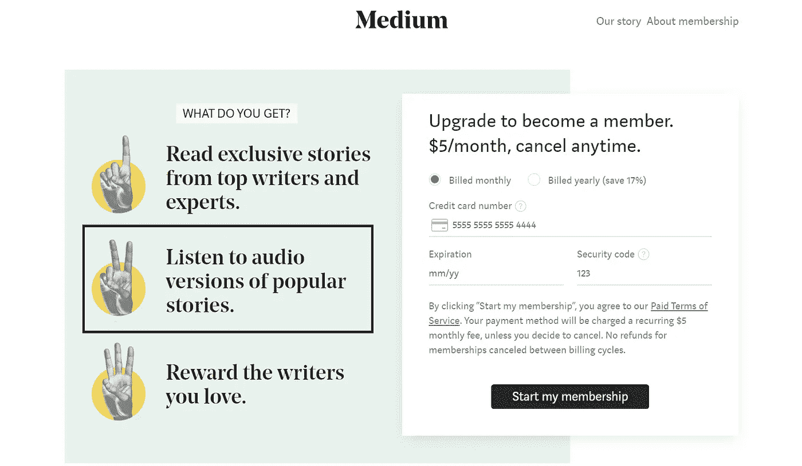
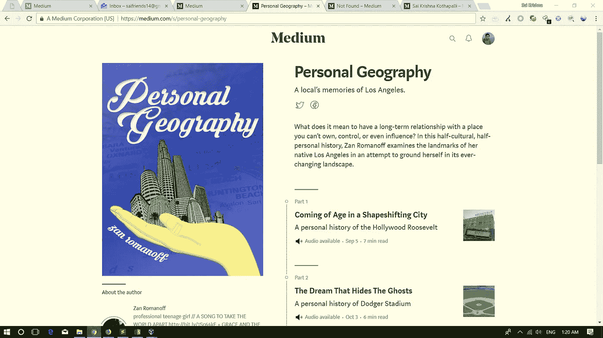
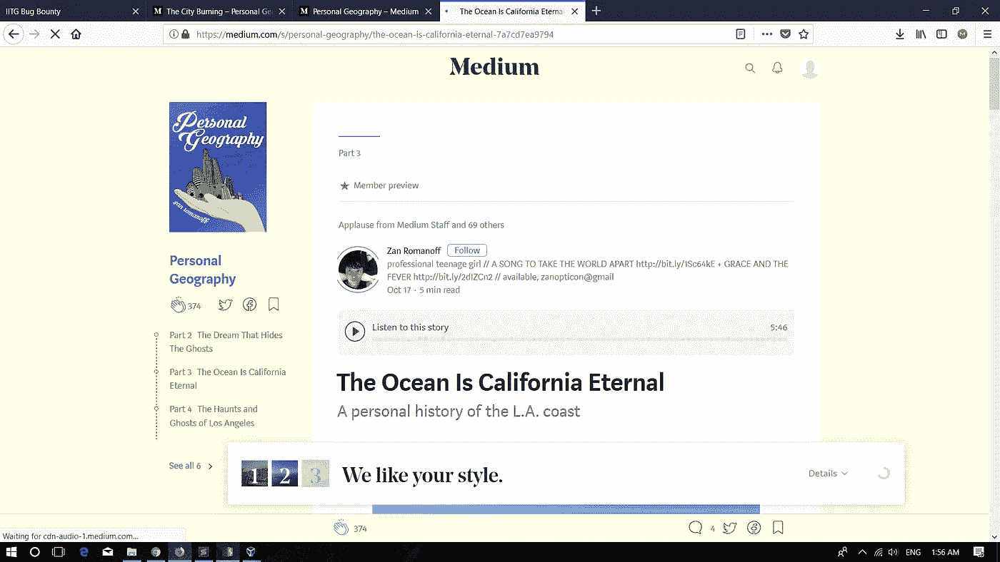
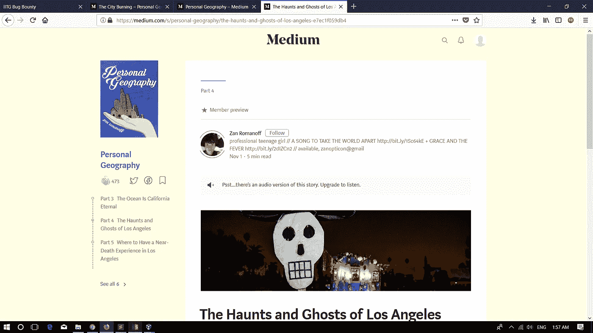
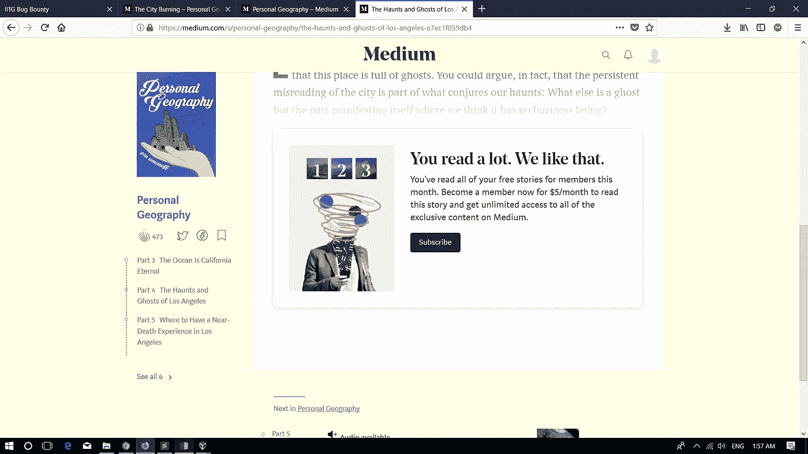

# 在媒体上收听任何故事的任何成员专用音频版本

> 原文：<https://infosecwriteups.com/listening-to-any-members-only-audio-version-of-the-story-in-medium-bf2dc2abc8d7?source=collection_archive---------4----------------------->



这个故事是关于我如何能够听到流行故事的音频版本，否则，只对高级会员开放——不成为会员就不能免费获得。

来自媒体常见问题:

> 作为会员我能得到什么？
> 
> 当您升级时，您将解锁所有由顶级作家和领先专家在 Medium 上为会员发布的故事。(当你作为会员阅读这些故事并为之鼓掌时，你每月 5 美元的一部分将直接交给作者。)你还可以听到由我们的编辑精心挑选的数百个流行故事的音频版本。你可以将故事保存到你的离线阅读列表并存档。

基本上，作者可以选择是公开发表他们的故事，还是只对订阅成员发表。任何非订阅者每月可以免费阅读 3 篇订阅者故事。

Medium 也有这些故事的音频版本，只对订阅的成员开放。非订户每月只能听 3 次。

让我们看看这个例子。这个系列大约有 6 个部分，他们都是订阅的成员，只有音频版本的故事。



系列页面

读完两个故事后，你会看到。如你所见，你可以播放故事的音频版本。



看完 2 个故事。

如果你打开 4 楼。因为，我们用完了 3 个故事的限制，音频版本不可用。



故事的音频版本不可用

只有第一段是可见的，你不能阅读整个故事。



超过 3 层限制后，只能看到第一段。

由于这是一个新功能，我很好奇，开始四处挖掘，发现如果你知道帖子的网址。你很可能会，因为 Medium 鼓励作者在社交媒体上分享作品。

链接如下所示

> [https://medium . com/s/personal-geography/the-city-burning-9 CEC 234 df 901](https://medium.com/s/personal-geography/the-city-burning-9cec234df901)

最后一个 *9cec234df901* 是这个故事的 ID。你可以向 https://medium.com/p/ID/notes 的([https://medium.com/p/9cec234df901/notes 的](https://medium.com/p/9cec234df901/notes))做一个 GET 请求

响应应该是这样的。

```
{"success":true,"payload":{"value":[],"post":{"id":"9cec234df901","versionId":"","creatorId":"c5dcb9bd1cde","creator":{"userId":"c5dcb9bd1cde","name":"Zan Romanoff","username":"zanopticon","createdAt":1478303172099,"lastPostCreatedAt":1513707919782,"imageId":"0*nXRdjZB5aGiQHn9Z.jpg","backgroundImageId":"","bio":"professional teenage girl // A SONG TO TAKE THE WORLD APART http://bit.ly/1Sc64kE + GRACE AND THE FEVER http://bit.ly/2dIZCn2 // available, zanopticon@gmail","twitterScreenName":"zanopticon","facebookAccountId":"","allowNotes":1,"mediumMemberAt":1511976619000,"isNsfw":false,"type":"User"},"homeCollectionId":"","title":"","detectedLanguage":"en","latestVersion":"71249c85f37a","latestPublishedVersion":"71249c85f37a","hasUnpublishedEdits":false,"latestRev":39,"createdAt":1513707919782,"updatedAt":1514634416331,"acceptedAt":0,"firstPublishedAt":1513875662844,"latestPublishedAt":1513875662844,"experimentalCss":"","displayAuthor":"","coverless":true,"slug":"the-city-burning","translationSourcePostId":"","translationSourceCreatorId":"","isApprovedTranslation":false,"inResponseToPostId":"","inResponseToRemovedAt":0,"isTitleSynthesized":false,"allowResponses":true,"importedUrl":"","importedPublishedAt":0,"visibility":2,"uniqueSlug":"the-city-burning-9cec234df901","license":0,"inResponseToMediaResourceId":"","canonicalUrl":"","approvedHomeCollectionId":"","newsletterId":"","webCanonicalUrl":"","mediumUrl":"","migrationId":"","notifyFollowers":true,"notifyTwitter":false,"isSponsored":false,"isRequestToPubDisabled":false,"notifyFacebook":false,"responseHiddenOnParentPostAt":0,"isSeries":false,"isSubscriptionLocked":true,"seriesLastAppendedAt":0,"audioVersionUrl**":"https://cdn-audio-1.medium.com/b/2/5/b2544a366cc8/m4a/96.m4a","audioVersionD**urationSec":304,"sequenceId":"a323f0cfa12d","isNsfw":false,"isEligibleForRevenue":false,"isBlockedFromHightower":false,"deletedAt":0,"lockedPostSource":2,"hightowerMinimumGuaranteeStartsAt":0,"hightowerMinimumGuaranteeEndsAt":0,"type":"Post"},"highlights":[],"references":{"User":{"c5dcb9bd1cde":{"userId":"c5dcb9bd1cde","name":"Zan Romanoff","username":"zanopticon","createdAt":1478303172099,"lastPostCreatedAt":1513707919782,"imageId":"0*nXRdjZB5aGiQHn9Z.jpg","backgroundImageId":"","bio":"professional teenage girl // A SONG TO TAKE THE WORLD APART http://bit.ly/1Sc64kE + GRACE AND THE FEVER http://bit.ly/2dIZCn2 // available, zanopticon@gmail","twitterScreenName":"zanopticon","facebookAccountId":"","allowNotes":1,"mediumMemberAt":1511976619000,"isNsfw":false,"type":"User"}}}},"v":3,"b":"32111-acac638"}
```

我在响应中突出显示了 **audioVersionUrl** 参数。

现在你可以在任何浏览器中打开它并播放它。

TLDR:

如果你有 premium member only 帖子的 ID，你可以带着那个 ID 去[https://medium.com/p/ID/notes](https://medium.com/p/9cec234df901/notes)获取 **audioVersionUrl** 参数值，然后在浏览器的新标签中打开它，欣赏 Premium members only 故事的音频版本。

我向媒体报告了这件事，他们回答说:

> 我们的工程师得出结论，您的报告不符合 Bug Bounty 计划中列出的标准([https://medium . com/policy/medium-Bug-Bounty-disclosure-program-34 B1 c 80764 C2](https://medium.com/policy/mediums-bug-bounty-disclosure-program-34b1c80764c2))，因此没有资格获得奖励。

因为他们不认为这是一个安全漏洞，所以我可以在博客上谈论它。如果你有兴趣，你可以去听一些音频好故事。

和平❤