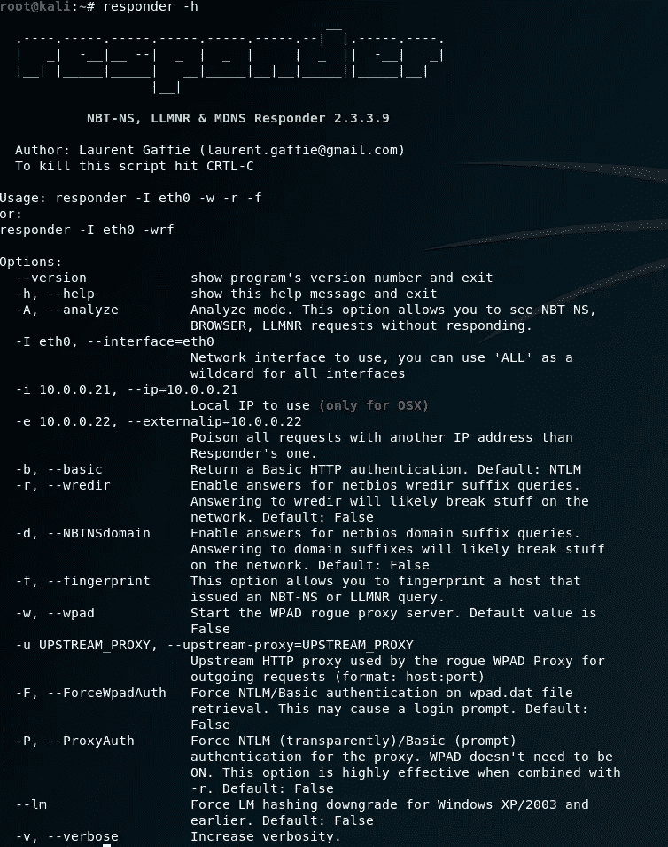
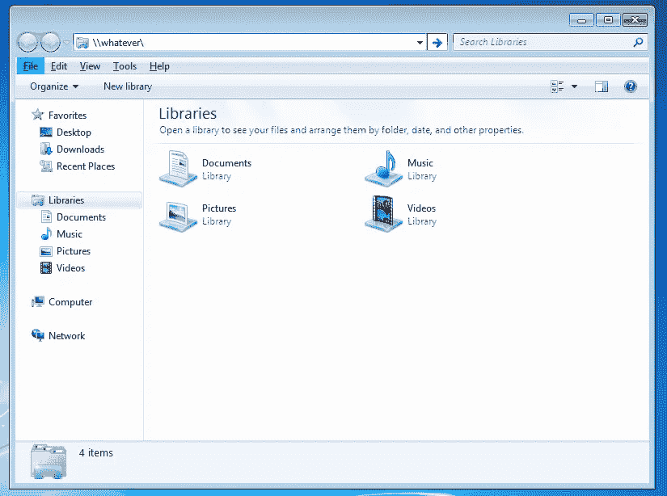
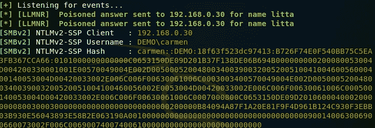
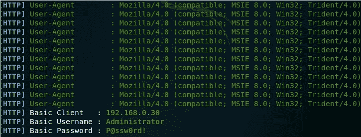
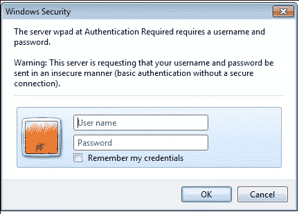

# LLMNR 中毒和 WPAD 恶搞

> 原文：<https://infosecwriteups.com/llmnr-poisoning-and-wpad-spoofing-69bfd8d8c504?source=collection_archive---------0----------------------->

我最近开始在【编辑】实习，作为一名 Pentesting 实习生。在开始之前，我知道 Active Directory 将会是一个巨大的目标，但是我还不知道可以可靠地在一个域中进行转换。我在的第三周被分配到一个内部的 pentest，在那里我们给一个客户送去一个 kali 盒子，他们把它接入网络，它就给家里打电话。我被告知要做的第一件事是运行一个叫做 responder 的工具。我听说过它，但没有太多的经验使用它对一个领域。几乎同时，我们开始接收域外的凭证。哇！我听说过使用 MiTM 技术从一个活跃的域中获取凭证是多么容易，但这仍然让我大吃一惊。我们进行了 pentest，得到了你想从一个域中得到的一切(我不是在开玩笑)。尽管浏览整个网络很有趣，但在我的内心深处，我仍然在想，“我们是如何如此容易地获得信用的？为什么会成功？”。

所以我决定研究这个工具，并学习它用来获得这些用户的技术。我首先调查的是一个叫 LLMNR 的东西。链路本地多播名称解析用于资源解析。例如，当用户寻找一个文件共享时，它会发出一个对资源来源的请求。默认情况下，Windows 7、8 和 10 会启用此行为。很容易禁用这种行为，但这是一个简单的谷歌搜索了。如果您可以访问网络，理论上，您可以响应文件共享请求，并说“我有位置，但我需要您的凭证来验证您是用户。”这就是工具响应器的用武之地。Responder 允许您监听这些事件，并向发出请求的人做出回应，获取用户的用户名和哈希。

使用标记“-h”启动响应器，我们可以看到此攻击的选项:

对于基本的 LLMNR 中毒，我们只需要一面旗帜:'-I '。用-I 运行 responder 并指定连接到域的接口，我们监听网络上的事件。如果网络上没有服务器知道用户想要的共享在哪里，我们可以说“我知道它在哪里”并抓取认证。

如你所见，我们从响应者那里得到了用户名和散列值。这是因为用户登录的 Windows 计算机发出了一个文件共享位置的请求。没有其他服务器知道共享的位置，所以我们说我们知道它在哪里。然后，Windows 机器向我们发送认证，我们捕获了该响应。这是一种非常简单的方法来获取用户在一个域中的散列值。我们可以破解哈希并获得用户名/密码，但是您可以看到哈希是 NTLMv2。这些很难破解。下一个选择是什么？我们接下来可以利用一个叫做 WPAD 的东西。

WPAD 是一种用于发现网络上的 web 代理的协议。默认情况下，Windows 配置为向域询问配置文件的位置，该文件包含 Web 代理在网络上使用的信息。Responder 为我们提供了欺骗的选项，并要求再次验证。让我们在 responder 上强制 WPAD，看看我们得到什么:

如我们所见，我们从服务器获得了明文凭证。让我们看看对用户来说是什么样的:

因为 responder 正在运行一个假的 HTTP 服务器，并且表现得像是在为网络提供代理，所以我们在机器上弹出了一个基本的身份验证框。大多数刚上班的人会不假思索地输入用户名/密码。这将导致在攻击过程中无法访问互联网。一旦我们取消，他们就可以像往常一样访问网络。这两种攻击都很容易补救。对于 LLMNR，禁用 TCP/IP 上的 NETBIOS。这将阻止 Windows 使用 LLMNR 协议查找共享。对于 WPAD，禁止在 IE 上通过网络查找 wpad 配置文件。

*关注* [*Infosec 报道*](https://medium.com/bugbountywriteup) *获取更多此类精彩报道。*

 [## 信息安全报道

### 收集了世界上最好的黑客的文章，主题从 bug 奖金和 CTF 到 vulnhub…

medium.com](https://medium.com/bugbountywriteup)