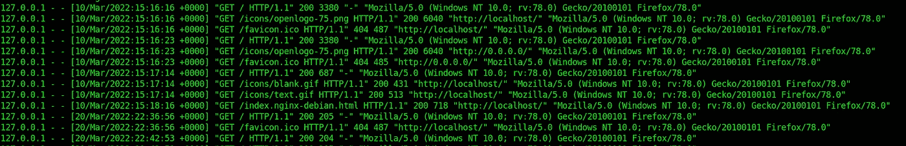
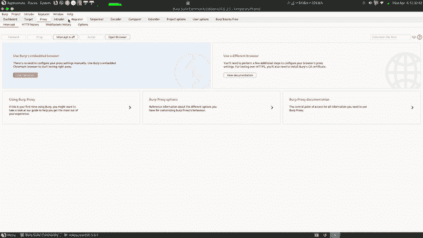

# 日志中毒—在日志中注入有效负载

> 原文：<https://infosecwriteups.com/log-poisoning-inject-payloads-in-logs-e7f1fa338f2f?source=collection_archive---------1----------------------->

日志…这些是文件，其中存储了服务器上的所有活动。这些用于监控、故障排除、修复错误(漏洞)以及许多其他事情。

由[托马斯·凯利](https://unsplash.com/@thkelley?utm_source=medium&utm_medium=referral)在 [Unsplash](https://unsplash.com?utm_source=medium&utm_medium=referral) 上拍摄

为不同的事物记录活动，例如代理、web 服务器等。但是在这里，我们正在学习网络日志中毒。

那么，web 服务器可能会记录什么呢？所以，最常见的是 IP 地址，日期和时间，以及用户代理。查看最常见的 web 服务器 Apache 2:

上面，你可以看到我在电脑上运行的 Apache 2 web 服务器的日志。第一件事是 IP 地址(这是本地 IP-127.0.0.1)，其次是日期和时间，然后是请求方法、web 路径、用户代理和其他一些东西。所以让我们先来看看我们能轻松控制什么

*   IP 地址:不，它是由 ISP 控制的，我们不能在其中注入有效载荷
*   时间和日期:这是网络服务器上的日期和时间，我们无法控制
*   请求方法和路径:可以，URL 和方法可以控制。
*   用户代理:同样，是的。我们可以控制。

# 执行攻击

现在，让我们来看看我们可以用它来执行哪些攻击。

经理和管理员可以手动查看日志。所以最有可能的是他们会在网络浏览器中打开它。那么，对此最有可能的攻击是什么呢？最有可能的是 XSS。因此，由于 URL、用户代理和请求方法是我们可以控制的，我们可以在其中注入有效负载。这将是一个盲 XSS，因为有效载荷不会在我们的浏览器上执行(这很可能是在系统管理员的浏览器上)。所以要做到这一点，我们可以使用 XSS 亨特，这是一个免费的 XSS 检测平台。

现在，假设服务器没有太多的空间，所以有可能它不会记录所有的请求，但它可能会记录错误以进行故障排除，并使用户体验更好。所以搜索/创建错误:

*   检查所有子域，如果它返回 4xx 或 5xx 错误(您可以使用我的工具 [httpselfie](https://github.com/shriyanss/HTTPSelfie) 轻松查看所有子域的截图)
*   发送格式错误的请求(下面的命令会导致错误)

`curl -X "<payload_here>" -H "User-Agent: <payload>" [http://target.co](http://target.co)m/<payload>`

`cat <wrong_host_header_request>.txt | nc target.com 80`

还有更多…

*   将用户代理设置为 burp 中的 XSS 有效负载

在打嗝中设置有效负载的步骤

我们可以针对不同的情况进行不同的攻击。假设它记录在 SQL 数据库中，那么攻击可能是 SQL 注入等等。

## 日志中毒的终点

*   登录页面(失败的登录尝试)
*   4xx 和 5xx 状态代码页/子域。
*   API 端点
*   敏感页面(管理页面等)
*   一次性操作(订阅等)
*   尝试使用用户名中的有效负载(也包括 RCE)登录 SSH，并尝试通过 LFI 或其他方法获取该文件
*   更多…

# 原木中毒的例子

## 在 SSH 日志中注入有效负载

因为我们要在 SSH 日志中注入有效负载，所以我们需要在目标中打开一个 SSH 端口。因此，我们可以使用用户“<payload>”和一些随机密码登录。确保我们注入所有类型的有效载荷，因为我们不知道它将如何被处理</payload>

例如，运行以下命令连接到目标(输入某个随机密码):-

`ssh ""@target.com`

我有一个树莓派，所以运行它，看看日志

> redacted @ raspberrypi:~ $ sudo cat/var/log/auth . log
> redacted
> Apr 5 08:59:23 raspberrypi sshd[1121]:无效用户的密码失败****来自 192.168.43.150 端口 47084 ss H2
> Apr 5 08:59:26 raspberrypi sshd[110 用户未知
> 4 月 5 日 08:59:28 raspberrypi sshd[1121]:无效用户密码失败****来自 192.168.43.150 端口 47084 ssh 2
> 4 月 5 日 08:59:29 raspberrypi sshd[1121]:PAM _ UNIX(sshd:auth):检查通过；用户未知
> 4 月 5 日 08:59:32 raspberrypi sshd[1121]:无效用户的密码失败****来自 192.168.43.150 端口 47084 ss H2
> 4 月 5 日 08:59:32 raspberrypi sshd[1121]:连接被无效用户关闭 **< img src=myserver**

在这里，您可以看到`img`标签，如果将它呈现给具有安全措施的浏览器，它会尝试从`myserver.com`获取图像。在`myserver.com`的根路径，我们可以放置一个记录所有请求和所有参数(例如，用户代理、主机、客户端 IP 等)的记录器。)

## 在失败的登录日志中注入有效负载

比如说`/admin`，服务器有特定的端点用于监控和管理，但是它们需要登录。它们是非常敏感的端点，所以每一个可疑的动作都要被记录下来。如果我们试图在所有参数中强制使用有效负载，那么它可能会被记录(就像上面的 SSH 示例中一样)，如果在没有适当清理的情况下呈现，那么它将导致有效负载被执行。

**类似地，您可以在不同的端点注入负载，这些端点有更多的机会被记录。并且确保让你的用户代理充满有效载荷**

# 自动化

对于日志中毒，我创建了一个叫做[日志毒液](http://github.com/shriyanss/Log-Venom)的工具。它被设计成用有效载荷毒害所有页面。

这是一个 shell 脚本，它自动发送不同字段中带有有效负载的请求。

**需要注意:确保你在这次攻击中没有使用** `****` **这样的有效载荷。这是一个盲目攻击，所以请确保您有自己的服务器启动并运行，以记录这些事情**