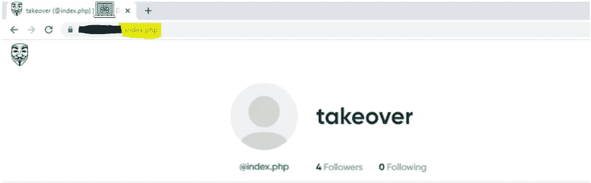

# 逻辑缺陷导致路径劫持

> 原文：<https://infosecwriteups.com/logical-flaw-resulting-path-hijacking-dd4d1e1e832f?source=collection_archive---------3----------------------->

你好，了不起的人们！我希望你一切都好。我带着新的报道回来了。在这篇文章中，我将解释我在一个目标上发现的导致路径劫持的逻辑缺陷。所以我简单解释一下。

在 redracted.com 上测试时，我发现它没有正确地检查和验证用户名的资格。有人可以使用任何现有的路径名注册并接管路径结果，导致访问时路径被覆盖。

我是怎么找到它的？

我注册了用户名“index.php”，然后访问了我的个人资料，发现在访问 retracted.com/index.php,时，我的个人资料出现了。然后我很快通知他们我的 index.php 用户名为 POC。第二天，他们批准并认可了我。

**有什么影响？**

这种错误的影响可能相当大，会导致不良行为者使用用户名(如 signup.php、signin.php 和许多类似的用户名)进行注册，并可能通过使这些注册、签名页面不可用来接管可能会给组织带来大问题的路径。

**外卖:**

尝试注册使用一般路径名，如 index.php，signup.php，signin.php，并检查是否访问这些路径显示您的个人资料。如果是的话，它可能是脆弱的。

如果你想和我联系，你可以在这里找到我。

再见，下次再写，祝你好运。继续黑。注意安全！！