# 卢克——黑客盒子报道

> 原文：<https://infosecwriteups.com/luke-hackthebox-writeup-65024c28229c?source=collection_archive---------3----------------------->

## 卢克是本周要退休的人。卢克有点像 CTF，但也很有趣。我将从配置文件中找到数据库凭证，因此使用 JSON Web Tokens ( JWT ),我将通过 API 获取所有用户的凭证。然后登录到一个登录面板，并抓取一个配置文件，我得到了根用户的密码。然后，我可以访问 high port 登录面板，并从那里获得 root shell。

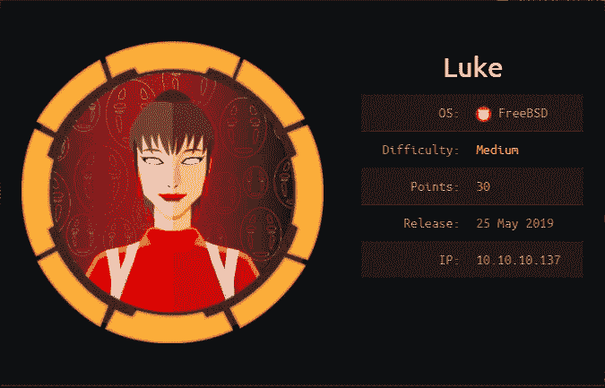

信息卡

# 计数和侦察

让我们从 Nmap 扫描开始

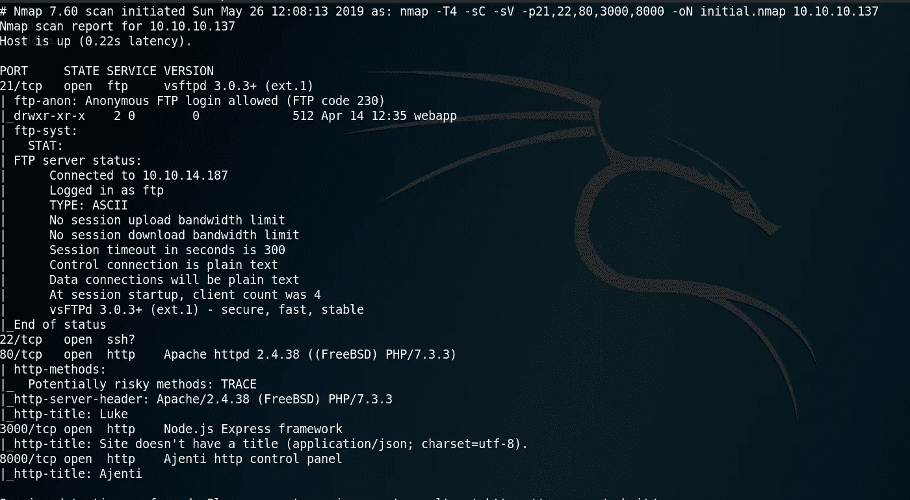

Nmap 扫描报告

我们有相当多的港口开放。21(带匿名访问的 FTP)，22 ( SSH )
，80，3000 和 8000 打开。

# FTP — TCP 21

在允许匿名访问的情况下，让我们看看有什么内容。
以`anonymous`为用户名，以`whatever`为密码登录

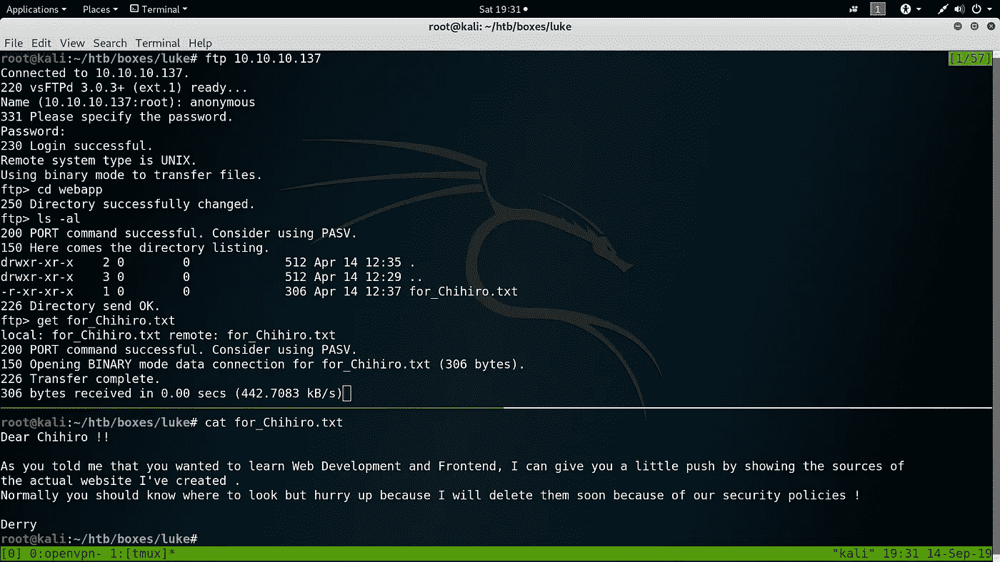

我们这里有一份有趣的文件`**for_Chihiro.txt**`。也许我们有一些潜在的用户名`**Chihiro**`和`**Derry**`。

# HTTP — 80

看着网站。

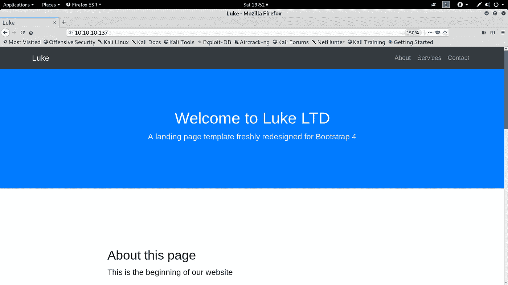

端口 80

Runnig `dirb`给了我们一些打开的目录。我在这里使用了`dirb`，因为我没有找到一些目录。

`config.php`给出了数据库的配置细节。我们得到一些凭证，让我们把它们放在我们的后口袋里，然后进一步枚举。

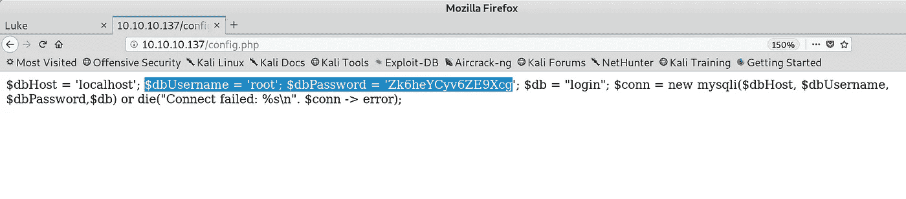

配置文件

让我们在找到的目录上使用这些凭证

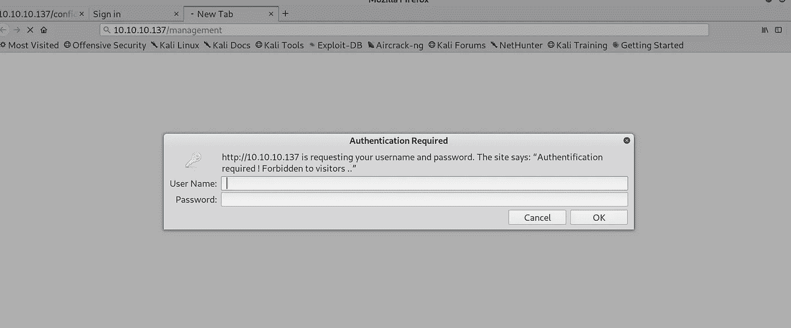

信用没有用

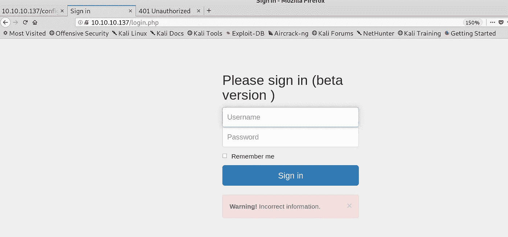

这里也没有。

当我找到其他凭证时，我将回到上述目录

# Node.js — 3000

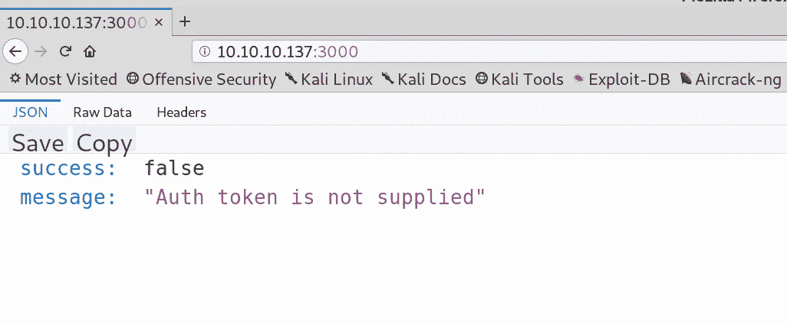

查看站点，我们得到一条有趣的消息，说没有提供 Auth 令牌。

## `*******************************************************
* Wfuzz 2.3.4 - The Web Fuzzer *
********************************************************`

## `Target: http://10.10.10.137:3000/FUZZ
Total requests: 2588`

## `==================================================================
ID Response Lines Word Chars Payload
==================================================================`

## `000034: C=200 0 L 2 W 13 Ch "login"
000123: C=200 0 L 5 W 56 Ch "users"
001642: C=200 0 L 2 W 13 Ch "Login"
002099: C=200 0 L 5 W 56 Ch "Users"`

在对什么是 JWT 以及如何使用它们进行身份验证进行了一些研究之后，我发现了这个网站，它解释了如何使用 JWT 不记名令牌进行身份验证。看一看吧。

 [## 使用 cURL 认证 JWT 无记名令牌

### 我今天学到了什么—2018 年 8 月 29 日

medium.com](https://medium.com/@nieldw/using-curl-to-authenticate-with-jwt-bearer-tokens-55b7fac506bd) 

这里棘手的部分是获得正确的 POST 参数，因为我们有几个用户名和一个密码，我猜参数是`username`和`password`。

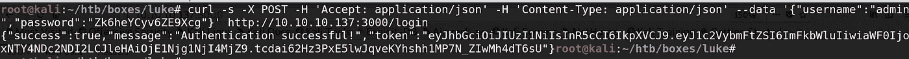

获得了一个授权令牌

我目前拥有的用户名和密码，

> ***千寻
> 德里
> 多利
> 尤里
> 管理员
> 和一个密码——zk6 heycyv 6 ze 9 xcg***

让我们使用这个令牌来验证其他用户名。我为它写了一个小剧本。

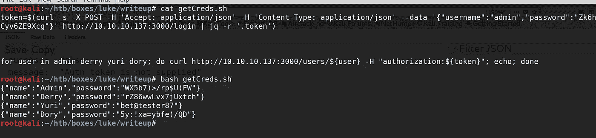

我们有 4 套凭证和两个登录地点(/ `management`、`login.php`)。

# 登录/管理

下面的证件让我们进去。让我们看看里面有什么。

> 用户名:德里
> 
> 密码:rZ86wwLvx7jUxtch

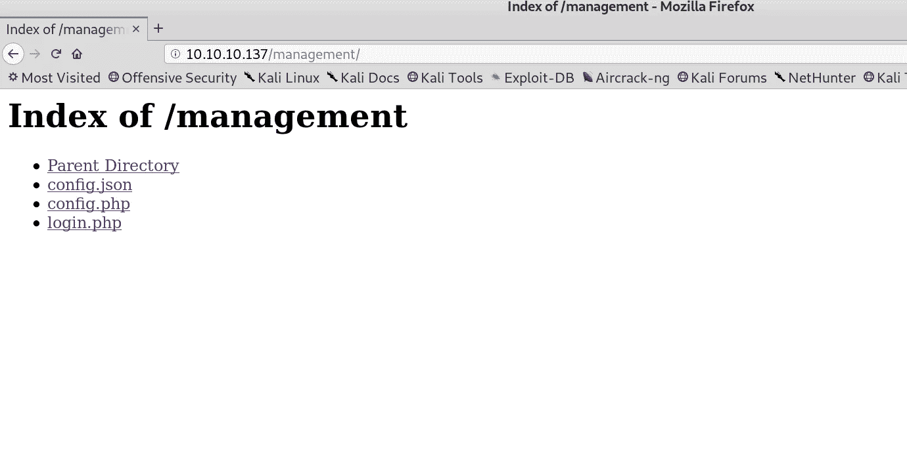

我们有 3 份文件

所有的文件看起来都很有趣。我会一个一个查出来。

## 配置. json

我们得到了根的证书。这份文件中还提到了`ajenti`。也许这些就是`Port 8000`的功劳

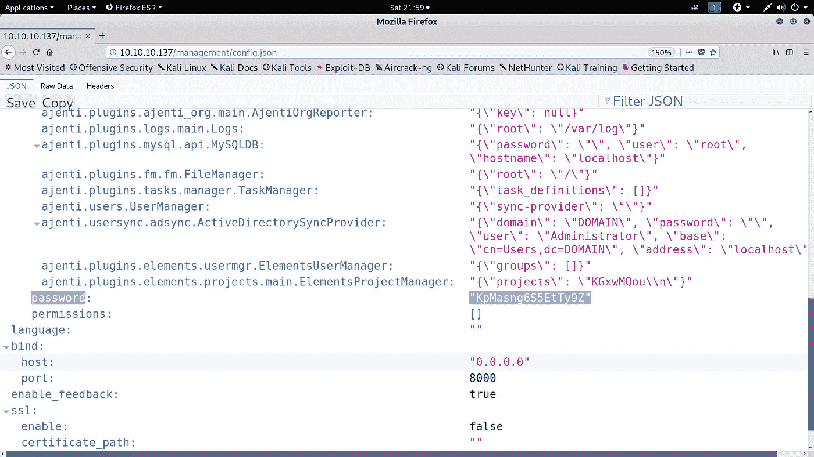

## login.php

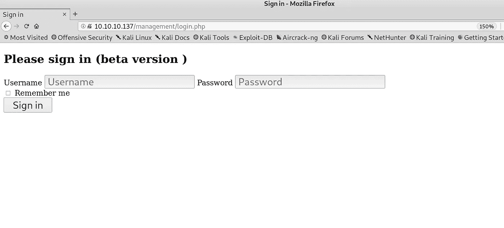

又一个登录页面。

没有任何凭据适用于此网站。我现在假设这是一个兔子洞。既然我们有**一个实体面板的凭证，**让我们在那里登录**。**和**config.php**是我们最初侦察得到的同一份文件

# 8000 —阿让蒂面板

> Root creds
> 用户名:root
> 密码:KpMasng6S5EtTy9Z

我立刻注意到了一个添加新终端的选项，而且这个服务是作为 root 运行的。

根深蒂固的

扎根！
这次我就这样了。

落款，
Preetham ( [@cyber01](https://www.hackthebox.eu/profile/9160) )

*关注* [*Infosec 报道*](https://medium.com/bugbountywriteup) *获取更多此类精彩报道。*

 [## 信息安全报道

### 收集了世界上最好的黑客的文章，主题从 bug 奖金和 CTF 到 vulnhub…

medium.com](https://medium.com/bugbountywriteup)