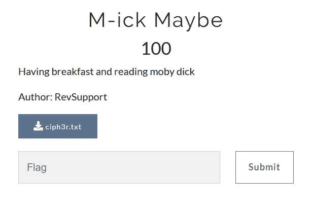
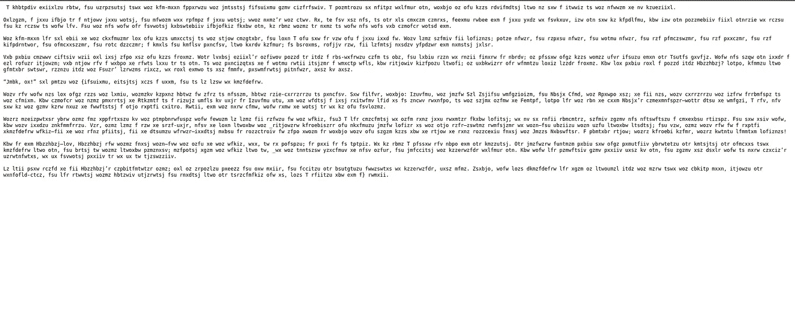
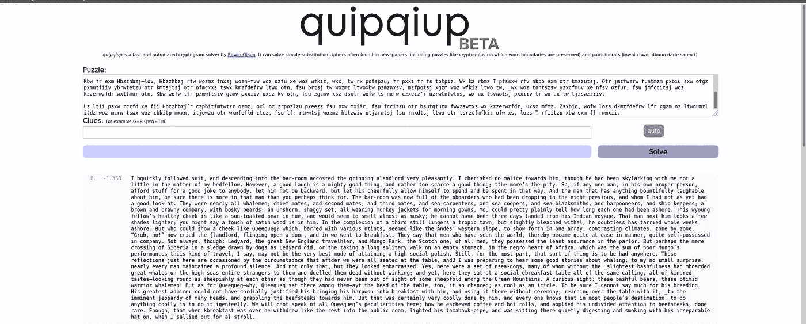
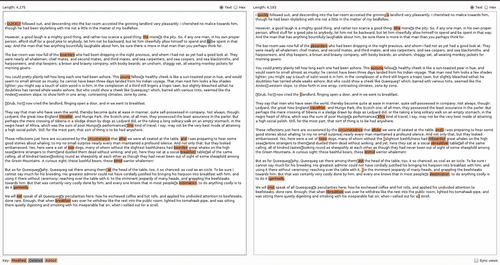

# 也许吧

> 原文：<https://infosecwriteups.com/m-ick-maybe-44e3409ff922?source=collection_archive---------4----------------------->

我们将在由 BSides Ahmedabad 组织的 BatPwn CTF 2020 中讨论加密挑战赛。

挑战本身指向了一本名为《莫比·迪克》的书

下载完 ciph3r.txt 文件后，我们得到了如下所示的文本。

[https://github . com/viston 03/Moby-dick-/blob/master/ciph 3r . txt](https://github.com/viston03/Moby-dick-/blob/master/ciph3r.txt)

在观察了密码文本后，从文本大小和标点符号来看，这似乎是单字母替换，所以我没有再尝试，很快就用 https://quipqiup.com/[破解了密码。](https://quipqiup.com/)

在观察了转换后的文本后，我在“莫比·迪克”这本书里搜索了文本。所以这篇文章类似于第五章的内容。

用 Burp 套件中的基本工具比较，我检查了更改的字母，结果是这样的。

经过一点点与改变的字母和做一些手工工作，你可以得到国旗。寻找旗子的模式是这样的，例如“The”被编辑成“t”| |“boards”被编辑成“pboarders”等等。

> Flag = batpwn{hidd3n_moby_dick}

https://twitter.com/underdawgs 的精彩挑战。

[远景](https://www.buymeacoffee.com/Viston)