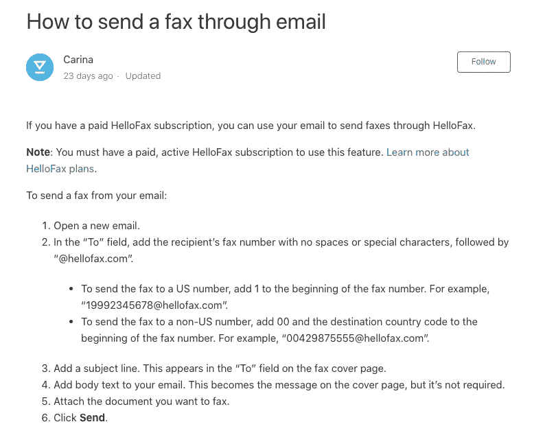
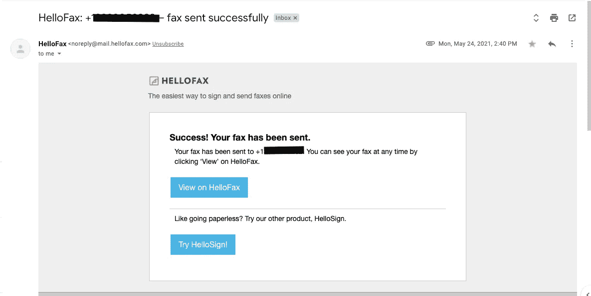
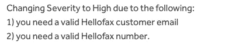
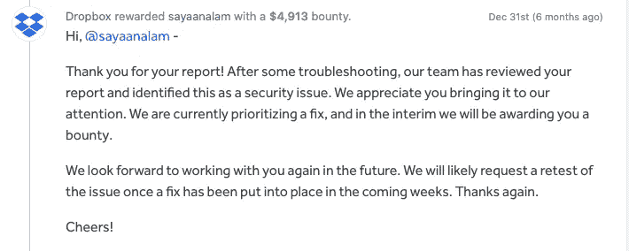

# 邮件服务器配置错误导致从 hello fax(BBP Dropbox)上任何人的账户发送传真，奖金为 4913 美元

> 原文：<https://infosecwriteups.com/mail-server-misconfiguration-leads-to-sending-a-fax-from-anyones-account-on-hellofax-dropbox-bbp-aab3d97ab4e7?source=collection_archive---------0----------------------->

大家好！,

希望你们都过得好:)

这篇文章是关于我最近在多个目标中发现的邮件服务器错误配置，它允许我在易受攻击的 web 应用程序上执行未经授权的操作，这个漏洞在多个目标和不同类型的 web 应用程序中很常见。Dropbox 修复了这个问题，并奖励了我 4913 美元的 bug 赏金。

## **描述**

我在 [Dropbox BBP](https://hackerone.com/dropbox?type=team) 开发 HelloFax 应用程序，寻找授权问题，但该应用程序很好地解决了授权问题，如 IDOR 和访问控制，所以我想寻找更有趣的功能，我发现了一个功能，允许用户[使用他们的电子邮件](https://faq.hellosign.com/hc/en-us/articles/215338277-How-to-send-a-fax-through-email)发送传真，而无需登录他们的 HelloFax 帐户

因此，当一个付费用户向*FAXNUMBER@hellofax.com*发送电子邮件时，应用程序会将电子邮件的内容作为传真从用户的 HelloFax 账户发送到 FAXNUMBER，例如，如果我向*13456789000@hellofax.com*发送电子邮件，那么应用程序会从我的 HelloFax 账户向 **+13456789000** 发送传真

## 剥削

这里我想到的第一件事是给 FAXNUMBER@hellofax.com 发一封假邮件，通过把受害者的邮件从字段放入**字段，我很快去了 http://anonymailer.net/[并给+12345678900@hellofax.com 发了一封假邮件，令人惊讶的是效果很好，我收到了来自 HelloFax 的邮件](http://anonymailer.net/)**

这封邮件说，我们的传真已经成功发送，Hellofax 的邮件服务器没有验证我发送的假邮件的真实性，它从受害者的帐户发送邮件

以下是漏洞的工作原理:-

*   Target 允许我们通过向 email@target.com 发送电子邮件来执行操作
*   攻击者通过将受害者的电子邮件放在来自字段的**中，向 email@target.com 发送一封假电子邮件**
*   目标服务器收到电子邮件，但不验证其真实性，而是将其视为用户发送的合法电子邮件
*   应用程序处理电子邮件并从受害者的帐户执行操作，从而绕过授权

我立即在 Hackerone 上向 Dropbox BBP 报告了这个错误，第二天它就被分类了，但是团队将严重性降级为**高**级，原因如下

团队对 Hackerone 的评论

尽管他们按照政策付给我 4913 美元的高级别奖金

**其他剥削场景**

*   我在一个漏洞报告门户网站上发现了同样的漏洞，它允许我通过向 bugs@redacted.com*的*发送电子邮件，从受害者的账户中创建漏洞报告
*   在使用自己的支持面板的应用程序上可能会发现这个错误，我们可以代表内部团队或任何其他用户在那里创建票证
*   任何其他类型的应用程序，通过向他们发送电子邮件来执行操作或创建票证/错误

此漏洞的根本原因是目标服务器不验证 SPF 记录，配置为使用 SPF 和 DMARC 的电子邮件客户端将自动拒绝未通过验证的电子邮件，这应该应用于应用程序以防止此漏洞

**时间线**

2021 年 12 月 16 日—向 Hackerone 上的 [Dropbox BBP](https://hackerone.com/dropbox) 报告了一个错误

2021 年 12 月 17 日 Hackerone 分类小组对错误进行了分类

2021 年 12 月 31 日 Dropbox 团队奖励 4913 美元奖金

2022 年 3 月 17 日— Dropbox 团队修复了该问题

2022 年 5 月 2 日—报告因已解决而关闭

感谢您阅读本文，如果您有任何疑问，请随时通过 Twitter 联系我，电话: [@ehsayaan](https://twitter.com/ehsayaan) 或*ehsayaan@gmail.com*

特别感谢山姆·库里校对这篇文章

下次见！

[赛亚安阿拉姆](https://sayn.in)

*来自 Infosec 的报道:Infosec 上每天都会出现很多难以跟上的内容。加入我们的每周简讯，以 5 篇文章、4 个线程、3 个视频、2 个 Github Repos 和工具以及 1 个工作提醒的形式免费获取所有最新的 Infosec 趋势！*[*https://weekly.infosecwriteups.com/*](https://weekly.infosecwriteups.com/)