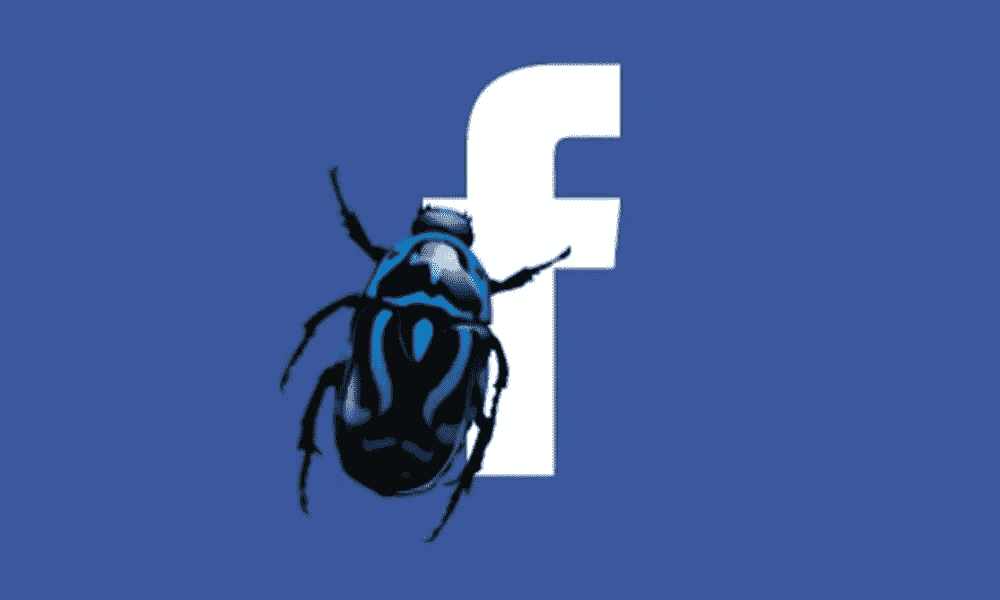
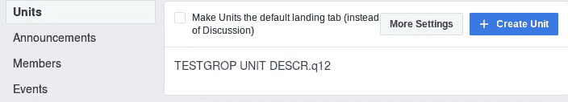
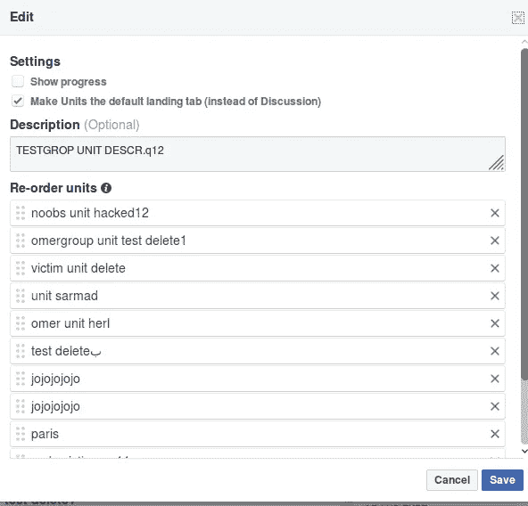
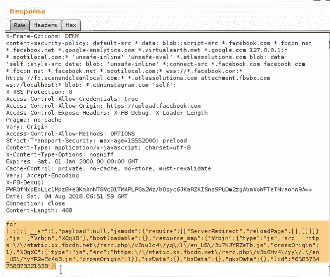
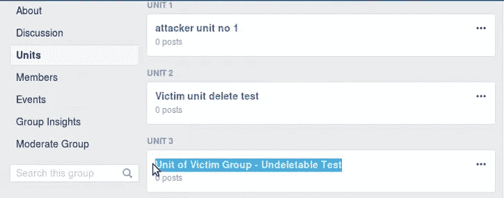
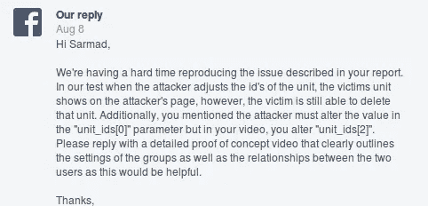
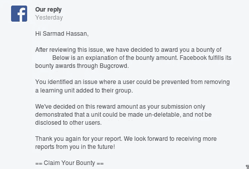

# 使脸书组中的任何单位不可删除

> 原文：<https://infosecwriteups.com/make-any-unit-in-facebook-groups-undeletable-efb68e26adb9?source=collection_archive---------1----------------------->

Sup 伙计们，今天我想和你们分享我是如何使 facebook 群组**中的**任何单元**不可删除的**，所以让我们开始吧:)

在 **Faebook 安全团队**要求我确认我的 [**最后一个 bug**](https://medium.com/bugbountywriteup/distorted-and-undeletable-posts-in-facebook-group-9424e15f5551) 后，我在我的测试组中凸轮穿过**单元设置选项**，见下图

更多设置选项，用于编辑您组中的单位

当我点击**更多设置**时，我看到以下选项

你可以描述和重新排列你的单位

嗯，有趣的是，我打开了我的博客，点击保存来看看幕后发生了什么，然后我看到了下面的请求:

> POST/groups/learning/edit _ units _ dialog/submit/？dpr=1 HTTP/1.1
> 主机:[www.facebook.com](http://www.facebook.com)
> 
> **组标识=** 【我的组标识】&描述=【我的单元描述】& **单元标识[0]=** 【单元标识号 1】&单元标识号[1]=【单元标识号 2】…等等

作为一个 bug 猎人，当你看到这种请求时，你当然会检查以下两点:

1- group_id === >我可以将我的群 id 更改为另一个群 ID，并将我的单位添加到其中吗！！

2- Unit_ids === >我可以用其他组的单元 ID 来更改我的单元 ID，并将它们添加到我的测试组中吗！！

所以我把 group_id 改成了另一个 group_id，但是没有用:(

但是，当我将我的 Unit _ ids 更改为另一组 unit IDs 时，响应如下:

200 无错误响应:)

我检查了**我的测试组单位**，我注意到另一个组的单位(我不是它的管理员)已经被添加到**我的测试组**

其他组的单位添加到我的单位

我知道 facebook 只检查 group_id 而不是 unit_id，这就是为什么我可以添加任何单位到我的组，因为服务器不会检查这个单位是否属于同一个组 id。

好，接下来呢！！，我注意到两件事:

1-当我向我的群组添加其他单位时，我可以从**群组洞察选项中看到它，**这意味着我也可以**下载**它。

2-我可以让其他组**的单位不可删除**，一旦我添加到我的组，并且**我应该邀请其他组的管理员加入我的测试组**。

邀请其他组的管理员是使他们的单位不可删除的诡计。

我在 2018 年 8 月 4 日向脸书安全团队**报告了这个错误，并向他们展示了我能够使任何单位不可删除，并向他们提到其他组的单位被添加到我的组中，我从他们那里得到了如下答复:**

他们无法复制无法删除的部分，因为他们不知道邀请的技巧

当我从他们的回复**中看到这部分内容时，“你的报告。在我们的测试中，当攻击者调整单元的 id 时，受害者单元显示在攻击者的页面上，然而，受害者仍然能够删除该单元"**。他觉得在**我的单元选项卡**中看到单元(添加到我的测试组的其他组单元)是一个正常问题，我想他们会知道它可以通过**组洞察**下载，这就是为什么我只关注不可删除的单元部分。

# 一致

2018 年 9 月 **1 日**我看到我的老乡[**Richard Telleng**](https://www.facebook.com/richard.telleng)在 [**脸书 bug 赏金社区**](https://www.facebook.com/groups/bugbountygroup/?ref=group_header) 群里贴出 bug，当我看到他的 PoC 视频的时候，是我提交的同一个根的同一个 bug，他在 18-8 月提交了他的 bug **，而我的 Bug 在 17-8 月**被**审判，他在 1 月得到了赏金**

我通知了脸书安全团队，并告诉他们这是我的错误，我是第一个向您报告的人，他们告诉我，我没有提到从 **Group Insights 下载其他组单位。所以他们只奖励了我第一次冲击**(不可删除单位)。****

# 我的想法

*   有些人彼此之间有很多联系，比如思想，分享想法..等等，看起来是我和我的同道 [**理查德特楞**](https://www.facebook.com/richard.telleng) 用 bug 互相连接:) [**看为什么**](https://medium.com/bugbountywriteup/distorted-and-undeletable-posts-in-facebook-group-9424e15f5551) 。
*   也许你们中的一些人会说这是一个愚蠢的错误，为什么脸书要为此付钱，嗯，我认为如果有人可以控制你的单位，它就不再是你的单位了:)。
*   最后，修复这种错误总是正确的事情。

**时间线:**
八月。2018 年 04 月—初次报告
8 月。2018 年 7 月 17 日—9 月份的报告审判
。2018 年 01 月— Bug 修复
9 月。2018 年 01 月—修复确认
10 月。2018 年 05 月—奖金已发放

我要感谢脸书安全团队的慷慨解囊。

我也要祝贺我的同事理查德·特伦因同样的错误获得奖励。

**概念验证视频:**

**外卖:**

*   不要犯和我一样的错误，确保你向安全团队解释了一切。

谢谢你

萨尔马德·哈桑 ( [朱巴巴格达](https://twitter.com/JubaBaghdad)