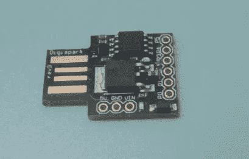
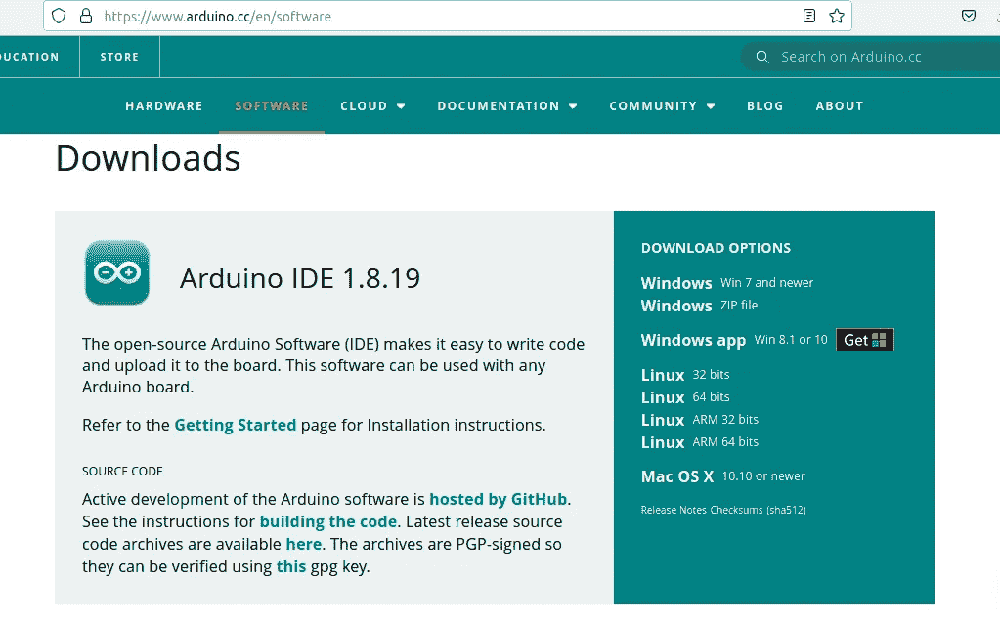
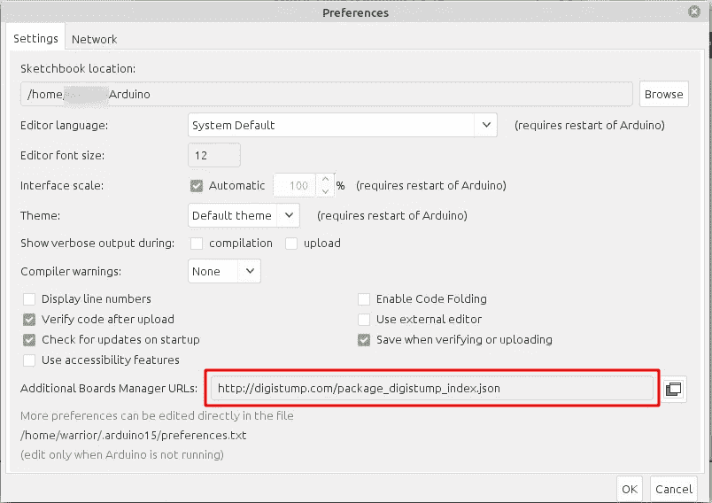
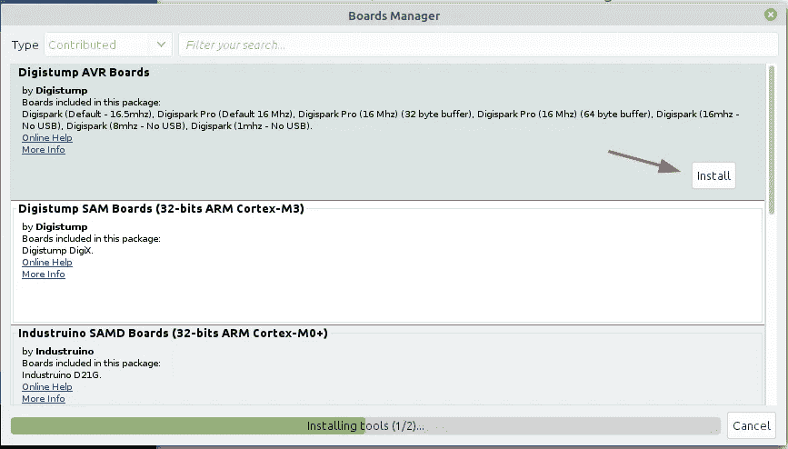
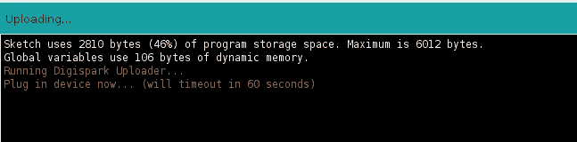
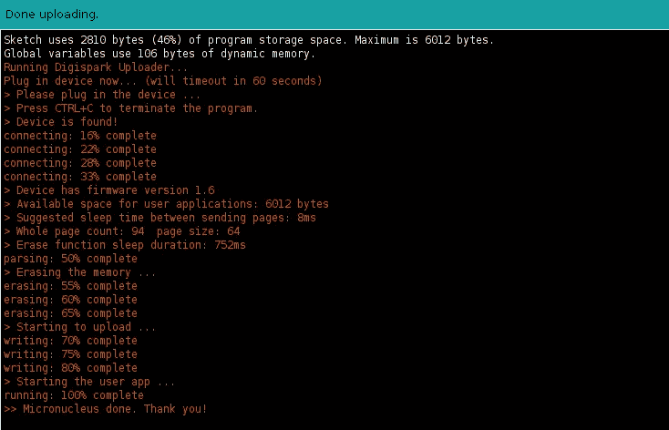
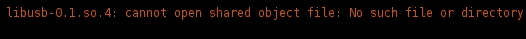
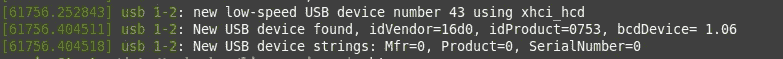

# 用不到 3 美元做一个 USB 橡皮鸭

> 原文：<https://infosecwriteups.com/make-usb-rubber-ducky-with-less-than-3-fa72dac9e4de?source=collection_archive---------0----------------------->

USB 橡皮鸭和 u 盘很像，但又不一样。因为它会在击键时注入一些有效载荷来入侵你的电脑。最妙的是，USB 橡胶 Ducky 没有被检测为 u 盘，而是被检测为键盘。

Hack5 卖这种 USB 49.99 美元。


[https://shop.hak5.org/products/usb-rubber-ducky-deluxe](https://shop.hak5.org/products/usb-rubber-ducky-deluxe)

那么，如何用不到 3 美元制作 USB 橡胶 Ducky 呢？

**Digispark** 就是答案。



Digispark Attiny 85

我在市场上花了 2.94 美元买了这个 85 年的 Digispark。Digispark 是一个具有 6kb 存储器的可编程板。就像一个超级小的 Arduino。

要做 USB 橡皮鸭，你只需要这个东西:
1。Digispark Attiny 85 美元
2。Arduino IDE
3。一杯带音乐的咖啡。

**设置环境【Linux】**

*   **在[https://www.arduino.cc/en/software](https://www.arduino.cc/en/software)下载**并**安装**最新的 Arduino 软件。对于这个项目，我使用的是 Linux 64 位的 Arduino IDE 1.8.19。在本教程中，我将跳过 Aduino IDE 的安装。



Arduino IDE 下载页面

*   运行 Arduino IDE，进入**文件**菜单，选择**首选项。**然后在*附加版块管理器网址*里，放上这个链接

```
[http://digistump.com/package_digistump_index.json](http://digistump.com/package_digistump_index.json)
```

并点击**确定**。



偏好窗口

*   转到工具菜单，然后是电路板子菜单，选择电路板管理器。在类型字段中，选择已贡献并安装 **Digistump AVR 板。**



董事会管理器窗口

*   安装完成后，**关闭**板卡管理器窗口。
*   最后一步，选择 Digispark(默认为 16.5mhz)作为您的主板。
    进入**工具**菜单，然后进入**板卡**子菜单，点击 **Digistump AVR 板卡**，选择 **Digispark(默认— 16.5mhz)。**

您已经完成了 Digispark 环境的设置。

**使用示例代码**进行测试

*   用来自**文件** > **的测试代码试一试** > **数码键盘** > **键盘**。

```
#include "DigiKeyboard.h"void setup() {
  // don't need to set anything up to use DigiKeyboard
}void loop() {
  DigiKeyboard.sendKeyStroke(0);
  DigiKeyboard.println("Hello Digispark!");
  DigiKeyboard.delay(5000);
}
```

**验证**代码，如果没问题，点击验证按钮右侧的**上传按钮**。



然后插上你的 **Digispark。**


笔记本电脑上的 Digispark 插头



Arduino 上传成功日志

上传完成后，拔掉你的 Digispark，恭喜你用不到 3 美元就做成了一个 USB 橡皮鸭。

**测试**

在 Android 中测试

在 PC 上测试(Linux Mint)

**故障排除**

*   如果您得到这样的错误:



在我的 Linux Mint 中，只需安装 **libusb-dev 即可。**

```
sudo apt install libusb-dev
```

*   如果您上传代码后没有检测到您的 Digispark，并且您的 **dmesg** 信息是这样的:


只需运行以下代码:

```
sudo udevadm control --reload-rules
```

并再次运行 **dmesg** ，如果您的终端显示为这样，您可以使用 Arduino IDE 重新加载。



对于其他疑难解答>[https://digi stump . com/wiki/digispark/tutorials/Linux 疑难解答](https://digistump.com/wiki/digispark/tutorials/linuxtroubleshooting)

**结论**

USB 橡皮鸭将是一个强大的自动键盘输入工具，以帮助您的工作。如果你是坏人，这个 USB 可以成为黑别人 PC 的工具。

今天学到了什么？
欢迎你:D