# MalDoc 101 恶意软件分析演练

> 原文：<https://infosecwriteups.com/maldoc-101-malware-analysis-walkhthrough-703be12c0c0d?source=collection_archive---------1----------------------->

**网站:cyberdefenders.org/**

**挑战:马尔多克 101**

**分类:恶意软件分析，VBA 宏**

**工具:oletools，oledump.py，olevba，strings，deob fuscate-repeations . py，base64dump.py，tr，grep，re-search.py**

## #1)多个流包含本文档中的宏。提供最高的数字。

> 这里我们需要找到包含宏的流。所以我们使用 oledump.py 来查找包含宏的流。

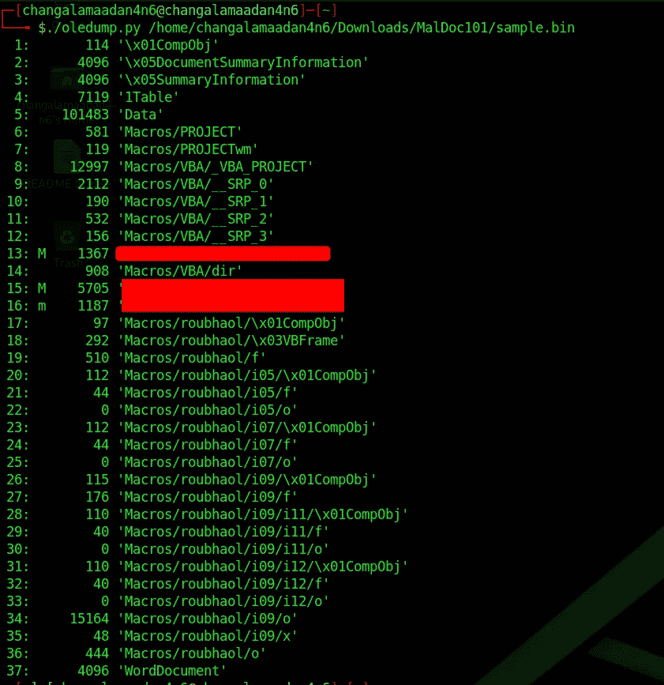

> 找出最高的那个。

**答案:1..**

## #2 什么事件用于开始宏的执行？

> 这里我们需要 olevba 工具的帮助。

**什么是 olevba？**

> olevba 是一个脚本，用于解析 OLE 和 OpenXML 文件，如 MS Office 文档(如 Word、Excel)，以**检测 vba 宏**，以明文形式提取其**源代码**，并检测与安全相关的模式，如**自动可执行宏**、恶意软件、反沙箱和反虚拟化技术使用的**可疑 VBA 关键字**，以及潜在的 **IOCs** (IP 地址、URL、可执行文件名等)。它还检测和解码几种常见的**混淆方法，包括十六进制编码、StrReverse、Base64、Dridex、VBA 表达式**，并从解码的字符串中提取 IOC。Excel 和 SLK 文件也支持 XLM/Excel 4 宏。
> 
> $ olevba < sample file name >
> 
> 并查看表格以查找恶意功能和活动

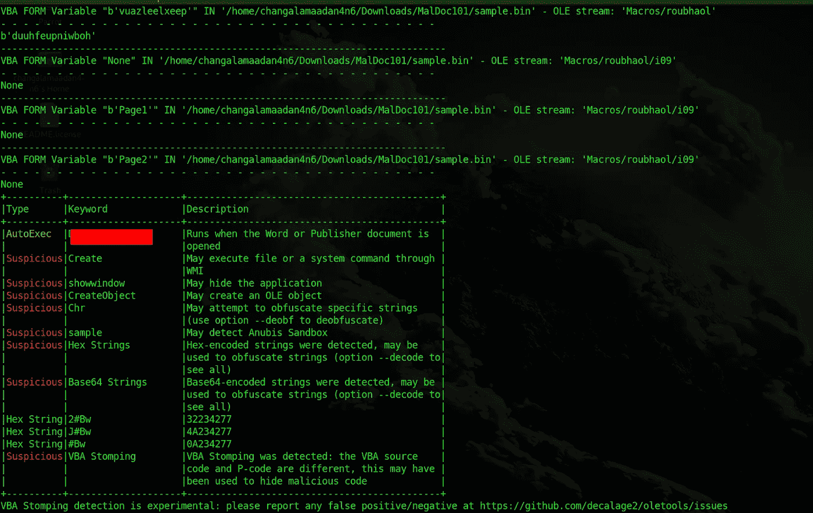

答案:医生…..

## #3 这个 maldoc 试图放弃哪个恶意软件家族？

> 这非常非常简单。去 virustotal.com 上传这个文件，以找到更多关于这个文件的细节。这里你可以看到恶意软件家族

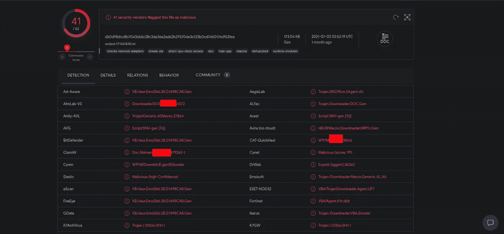

> 答:emo……..

## #4 哪个流负责存储 base64 编码的字符串？

> $ olevba < sample file name>
> 并向下滚动。我们可以看到一个很大的 base64 编码字符串。查看包含这个 base64 编码字符串的流的名称。

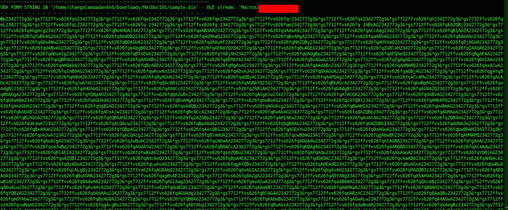

> 下一步是找到流的编号。使用＄ole dump . py< sample file name>并找到 base64 流的编号

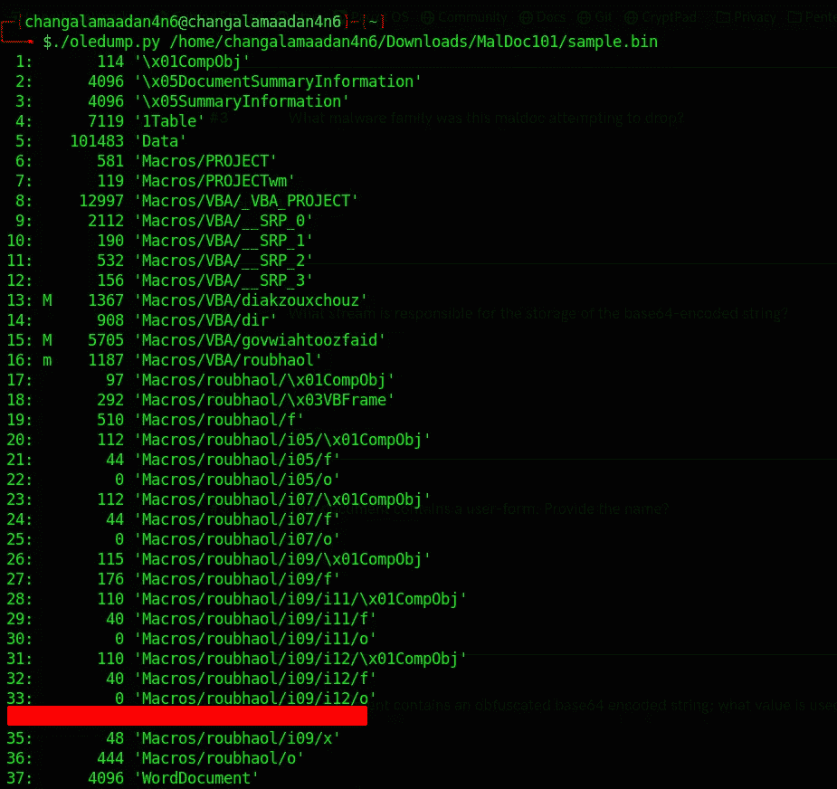

**答:3……..**

## #5 本文档包含一个用户表单。提供姓名？

> 在这个问题上，我需要图书馆的帮助。我在 Draw 中打开 doc 文件，进入工具->宏->组织宏->基本->sample.bin ->项目->表单->用户表单名称

ANS : roubh…

## #6 此文档包含一个模糊的 base64 编码字符串；用什么值填充(或混淆)这个字符串？

> 实际上，我们的分析过程从这里开始。因为在这个问题上我们需要付出更多的努力。但是这真的很有趣，很有意思。这里我们介绍一些基本的 Linux 命令和一些新的 python 工具。
> 
> 步骤 1:首先，我们使用 strings 命令，试图从这个文档中找到所有的字符串。它给了我们大量的字符串。但是我们不需要全部。然后我们试图找到所有包含最小 1500 字节的大字符串。
> 
> $ strings-n 1500-样本. bin
> 
> 是的，我们得到了一个巨大的 base64 编码字符串。但在我们的情况下，这不是一个有用的形式。但是我们可以把它转换成有用的形式。
> 
> 第二步:deobfuscate-repeations . py 是一个用于从混淆的字符串中找到重复字符串的工具。

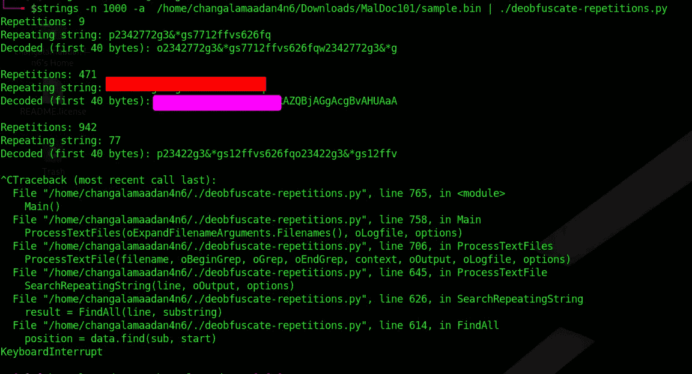

**ANS : 2342772g3 & *g……**

## # 7 base64 编码字符串执行的程序是什么？

> 查看 deobfuscate-repeations . py 和

**答:战俘…..**

## #8 哪个 WMI 类用于创建启动木马的进程？

> 我们知道这不是一种可以理解的形式。所以我们的第一项工作是解码整个字符串。首先，我们需要找到前一阶段解码的 PowerShell 字符串。使用-f 标志查找特定的解码字符串。
> 
> $ strings-n 1500-a/home/changalamaadan 4n 6/Downloads/maldoc 101/sample . bin |。/deobfuscate-repeations . py-f powersheLL

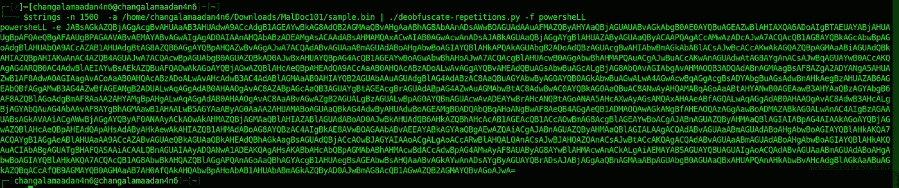

> 是的，我们拿到了。但是我们没有完成它。所以下一步是在 base64dump.py 工具的帮助下解码 base64 字符串
> 
> $ strings-n 1500-a/home/changalamaadan 4n 6/Downloads/maldoc 101/sample . bin |。/deobfuscate-replications . py-f powersheLL |。/base64dump.py

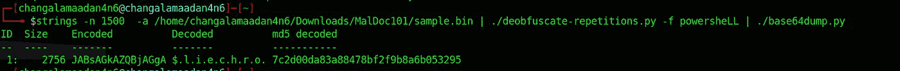

> 我们得到了一个解码字符串。是时候分析一下了。
> 
> $ strings-n 1500-a/home/changalamaadan 4n 6/Downloads/maldoc 101/sample . bin |。/deobfuscate-replications . py-f powersheLL |。/base64dump.py -s 1 -t utf16

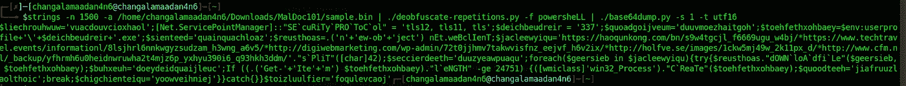

> 在 tr 命令的帮助下，我们删除了这个字符串中不需要的+、'、()字符

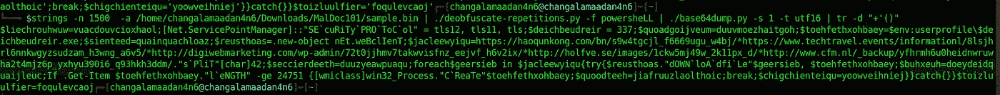

> 让我们深入这一串寻找答案。

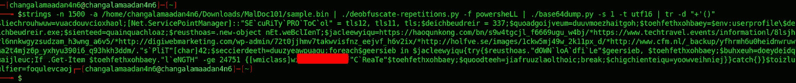

**ANS : win32………**

## #9 联系了多个域来下载特洛伊木马。根据提供的提示提供第一个 FQDN。

> 我们已经分析了 90%的文件。所以这是我们的最后一个阶段，也是简单的一个阶段。
> 在这里，我们为之前的命令添加了一个新工具。re-search.py 是一个用于从字符串中查找 URL 的工具

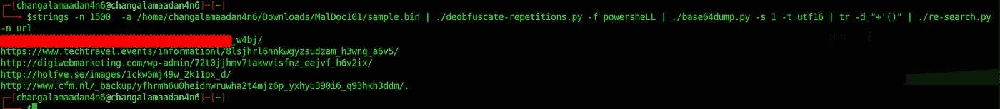

答复:屈浩……

了解更多信息

 [## 首页目录 2/oletools Wiki

### 这是 python-oletools 文档的主页。最新版本可以在网上找到，否则…

github.com](https://github.com/decalage2/oletools/wiki)  [## olevba 十进制 2/oletools Wiki

### olevba 是一个脚本，用于解析 OLE 和 OpenXML 文件，如 MS Office 文档(如 Word、Excel)，检测 vba 宏…

github.com](https://github.com/decalage2/oletools/wiki/olevba)  [## 日记

### SANS 互联网风暴中心-一个全球合作的网络威胁/互联网安全监测和警报系统。特色…

isc.sans.edu](https://isc.sans.edu/forums/diary/Maldoc+Strings+Analysis/26966/)  [## 日记

### SANS 互联网风暴中心-一个全球合作的网络威胁/互联网安全监测和警报系统。特色…

isc.sans.edu](https://isc.sans.edu/forums/diary/Obfuscation+and+Repetition/26648/)  [## GitHub-Didier Stevens/临时:临时解决方案

### 临时解决方案。通过在 GitHub 上创建一个帐户，为 DidierStevens/AdHoc 开发做出贡献。

github.com](https://github.com/DidierStevens/AdHoc)  [## oledump.py

### oledump.py 是一个分析 OLE 文件(复合文件二进制格式)的程序。这些文件包含数据流…

blog.didierstevens.com](https://blog.didierstevens.com/programs/oledump-py/)  [## DidierStevens -概述

### 从 Microsoft/ETL 2 capng 实用程序派生的块或报告。包含 Windows 网络数据包的 etl 文件…

github.com](https://github.com/DidierStevens)