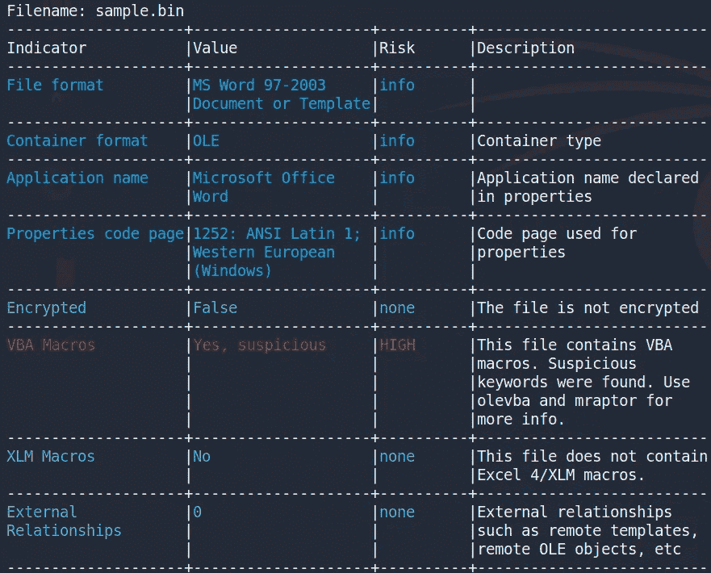
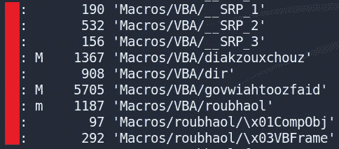
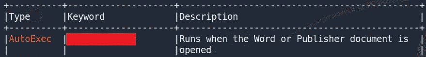
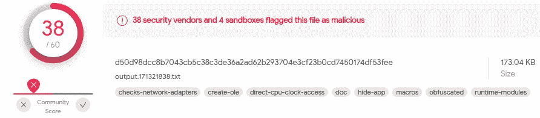
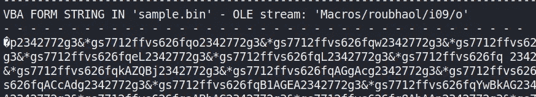
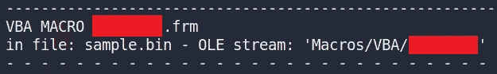
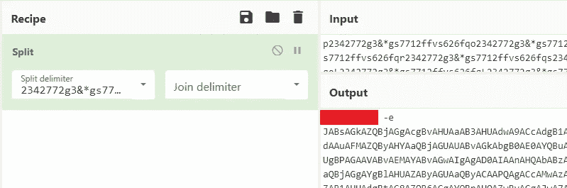
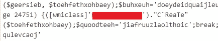
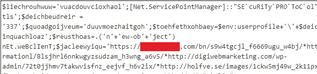

# MalDoc101 —使用 OLETOOLS 进行恶意宏分析

> 原文：<https://infosecwriteups.com/maldoc101-malicious-macros-analysis-with-oletools-8be3cda84544?source=collection_archive---------0----------------------->


这篇文章提供了我解决由 *Josh Stroschein* 在 CyberDefenders 网站上创建的 **MalDoc101** CTF 的方法，这是一个蓝色团队专注的挑战，要求你静态分析一个恶意的 Microsoft word 文档。我在最后提供了一个网络卫士网站的链接，供有兴趣尝试这项挑战的人使用。

# 放弃

我喜欢在一篇文章之前添加一个简短的免责声明，以鼓励人们在阅读这篇文章之前尝试一下这个房间，因为在这篇文章中显然会有**剧透****。我相信，如果你先自己尝试，然后在遇到困难或需要提示时再来写这篇文章，你会更喜欢 CTF。因此，没有任何进一步的拖延，让我们开始吧！**

# **OLETOOLS**

**为了解决一些挑战性问题，我将使用 oletools python 包。OLETOOLS 是一套 python 工具，用来分析[微软 OLE2 文件](http://en.wikipedia.org/wiki/Compound_File_Binary_Format)(也叫结构化存储，复合文件二进制格式或复合文档文件格式)，比如微软 Office 文档或 Outlook 消息，主要用于恶意软件分析、取证和调试。我在下面提供了一些对感兴趣的人有用的资源:**

**[](https://github.com/decalage2/oletools) [## GitHub-decal age 2/ole tools:ole tools-用于分析 MS OLE2 文件的 python 工具(结构化存储…

### 用于分析 MS OLE2 文件(结构化存储，复合文件二进制格式)和 MS Office…

github.com](https://github.com/decalage2/oletools) [](https://juliodellaflora.wordpress.com/2017/04/07/oletools-tools-to-analyze-ms-ole2-files-and-ms-office-documents-for-malware-analysis-forensics-and-debugging/) [## 分析 MS OLE2 文件和 MS Office 文档的工具，用于恶意软件分析，取证…

### oletools 是一个 python 工具包，用于分析 Microsoft OLE2 文件(也称为结构化存储、复合文件…

juliodellaflora.wordpress.com](https://juliodellaflora.wordpress.com/2017/04/07/oletools-tools-to-analyze-ms-ole2-files-and-ms-office-documents-for-malware-analysis-forensics-and-debugging/) [](https://blog.didierstevens.com/programs/oledump-py/) [## oledump.py

### oledump.py 是一个分析 OLE 文件(复合文件二进制格式)的程序。这些文件包含数据流…

blog.didierstevens.com](https://blog.didierstevens.com/programs/oledump-py/) [](https://0xevilc0de.com/analyzing-malicious-office-documents-with-oledump/) [## 使用 ole dump | 0xEvilC0de.com 分析恶意 Office 文档

### Microsoft office 文档是恶意软件作者用来传播恶意软件的常用工具。这些文件，用于…

0xevilc0de.com](https://0xevilc0de.com/analyzing-malicious-office-documents-with-oledump/) 

# 挑战问题

> 1.多个流包含本文档中的宏。提供最高的数字。

解压缩挑战文件后，我开始使用 OLEID 来分析文件，并收集恶意文件中常见的任何指标:

```
oleid sample.bin
```



OLEID 输出。

根据输出，我们可以看到文件格式、容器格式、应用程序名称等。但更重要的是，我们可以看到该文件包含 VBA 宏(用红色突出显示)。要回答问题 1，我们可以使用 OLEDUMP 来分析流并识别包含宏的最高流:

```
oledump.py sample.bin
```



OLEDUMP 流。

在 OLEDUMP 的输出中，在一些流的旁边，我们可以看到字母 **M** ，表示该流包含 VBA 宏。

> 2.什么事件被用来开始宏的执行？

要收集有关恶意宏的更多信息，我们可以使用 OLEVBA:

```
olevba sample.bin
```



OLEVBA AutoExec 事件

在上面的输出中，我们看到了 **AutoExec，**，这意味着当您启动 Word 或加载一个全局模板时，宏就会运行。接下来，我们可以看到用于开始执行宏的事件。您可以使用下面的链接了解有关恶意宏和用于启动它们的事件的更多信息:

[](https://www.trustedsec.com/blog/malicious-macros-for-script-kiddies/) [## 脚本小子的恶意宏-可信安全

### 宏似乎是黑客们的新宠，但我认为宏只是一些会计人员编写的简单脚本…

www.trustedsec.com](https://www.trustedsec.com/blog/malicious-macros-for-script-kiddies/) 

> 3.这个 maldoc 试图放弃什么恶意软件家族？

要回答这个问题，我们可以将恶意文档上传到 VirusTotal:



病毒总分。

将 maldoc 加载到 VirusTotal 后，我们可以看到 38 家安全供应商将其标记为恶意软件。查看详细信息选项卡，我们可以看到恶意软件家族的名称。

> 4.哪个流负责存储 base64 编码的字符串？

如果我们返回到 OLEVBA 输出并向上滚动，我们可以看到 OLE 流' *Macros/roubhaol/i09/o* '中存储的一大串编码文本:



负责存储 base64 编码字符串的 OLE 流名称。

为了确定 OLE 流的编号，我们可以查看 OLEDUMP 的输出，并找到上面看到的流名称:


负责存储 base64 编码字符串的 OLE 流的编号。

> 5.该文档包含一个用户表单。提供姓名？

用户表单[对象](https://docs.microsoft.com/en-us/office/vba/language/glossary/vbe-glossary#object)是一个窗口或对话框，它构成了应用程序用户界面的一部分。为了识别用户表单的名称，我们可以利用 OLEVBA 及其 code 参数只显示 VBA 源代码:

```
olevba sample.bin -c 
```



VBA 宏用户表单。

浏览 VBA 的源代码，我们可以看到用户表单的代码被保存为一个 ***。frm** 文件，文件名就是答案。您可以在下面了解有关用户表单文件扩展名的更多信息:

[](https://answers.microsoft.com/en-us/msoffice/forum/all/introduction-to-the-office-macro-editor-part-2/ab747f7e-3c40-48cc-b28d-db5221701535) [## Office 宏编辑器介绍，第 2 部分

### 作为对新浪 Fekrazadeh 2017 年 11 月 10 日帖子的回复，虽然有时获得一些语法是有用的…

answers.microsoft.com](https://answers.microsoft.com/en-us/msoffice/forum/all/introduction-to-the-office-macro-editor-part-2/ab747f7e-3c40-48cc-b28d-db5221701535) 

> 6.此文档包含一个模糊的 base64 编码字符串；用什么值填充(或混淆)这个字符串？

要回答这个问题，我们可以继续分析问题 5 中看到的 OLEVBA 提供的 VBA 代码。往下看 VBA 代码，我们看到一个变量保存了一个大的连接字符串的值:

```
haothkoebtheil = "2342772g3&*gs7712ffvs626fq2342772g3&*gs7712ffvs626fqw2342772g3&*gs7712ffvs626fq2342772g3&*gs7712ffvs626fqin2342772g3&*gs7712ffvs626fq2342772g3&*gs7712ffvs626fqm2342772g3&*gs7712ffvs626fqgm2342772g3&*gs7712ffvs626fq2342772g3&*gs7712ffvs626fqt2342772g3&*gs7712ffvs626fq" + gooykadheoj + "2342772g3&*gs7712ffvs626fq2342772g3&*gs7712ffvs626fq:w2342772g3&*gs7712ffvs626fq2342772g3&*gs7712ffvs626fqin2342772g3&*gs7712ffvs626fq322342772g3&*gs7712ffvs626fq_2342772g3&*gs7712ffvs626fq" + roubhaol.joefwoefcheaw + "2342772g3&*gs7712ffvs626fqr2342772g3&*gs7712ffvs626fqo2342772g3&*gs7712ffvs626fq2342772g3&*gs7712ffvs626fqc2342772g3&*gs7712ffvs626fqes2342772g3&*gs7712ffvs626fqs2342772g3&*gs7712ffvs626fq"
```

再往下，我们可以看到 Split 函数:

```
feaxgeip = Split(geutyoeytiestheug, "2342772g3&*gs7712ffvs626fq")
```

仔细观察，我们可以看到 **Split** 函数使用的分隔符用于填充上面看到的变量的连接值。如果我们删除这个分隔符字符串，我们会得到以下结果:

```
haothkoebtheil = "winmgmt" + gooykadheoj + ":win32_" + roubhaol.joefwoefcheaw + "rocess"
```

> 7.base64 编码字符串执行的程序是什么？

继续使用 VBA 代码，我们可以看到有一大块混淆的 base64 编码的文本，正如前面回答问题 4 时看到的。查看文本块，我们可以看到它已经使用了与问题 6 中相同的分隔符进行了模糊处理。我们可以将文本块复制到 CyberChef 中，然后使用具有相同分隔符的 **Split** 函数来检索混淆的文本:



赛博咖啡馆的反混淆字符串。

查看去模糊字符串，我们可以看到用于执行 base64 编码字符串的程序。

> 8.哪个 WMI 类用于创建启动木马的进程？

要回答这个问题，我们可以从上面问题 7 中看到的 CyberChef 输出中取出 base64 编码的字符串，并对其进行解码:


CyberChef Base64 字符串解码。

浏览解码后的文本，我可以看到用于创建启动特洛伊木马程序的 WMI 类:



WMI 级。

> 9.联系了多个域来下载特洛伊木马。根据提供的提示提供第一个 FQDN。

查看问题 8 中相同的 base64 解码文本，我们可以看到 FQDN 联系的第一个下载木马的人:



首先 FQDN 联系了。

# 结束语

我真的很喜欢通过这个 CTF 工作，并有机会学习更多关于使用 OLETOOLS python 包分析恶意宏的知识。谢谢你一直读到最后，继续黑下去😄！

[](https://cyberdefenders.org/) [## 网络卫士:蓝队 CTF 挑战

### 网络卫士的想法是在两位联合创始人致力于一个联合项目以培训一支…

cyberdefenders.org](https://cyberdefenders.org/)**