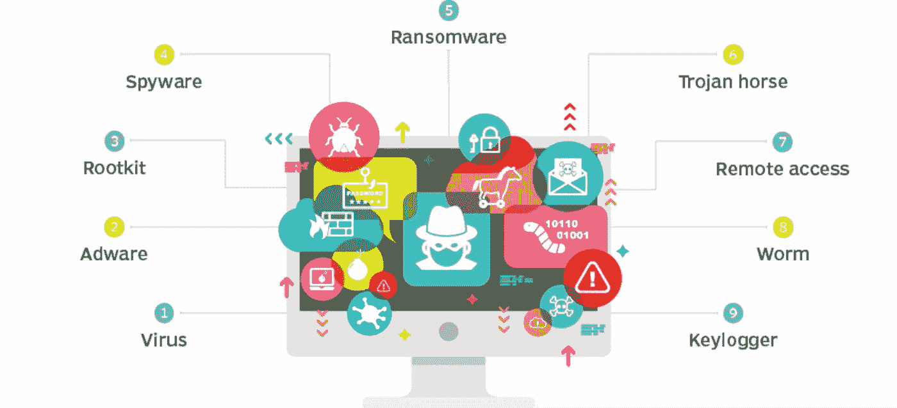
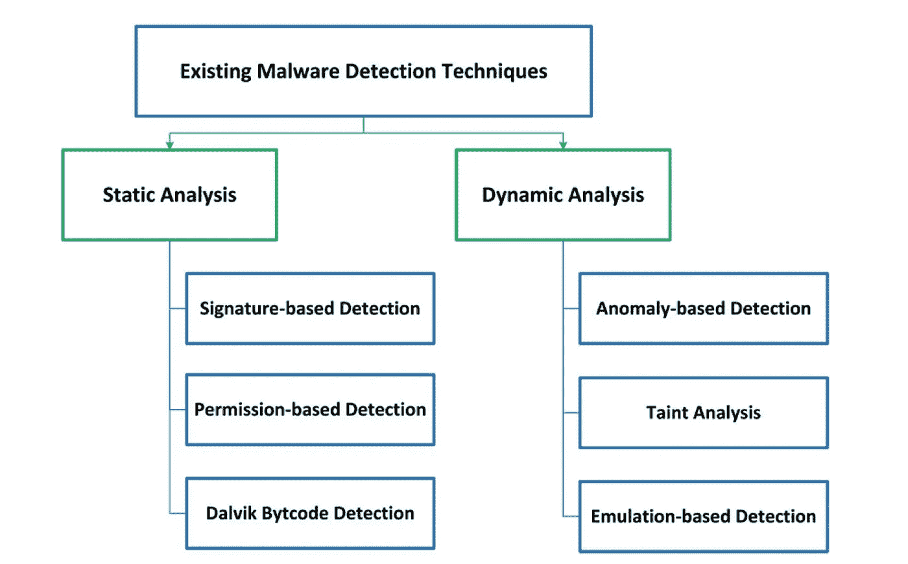
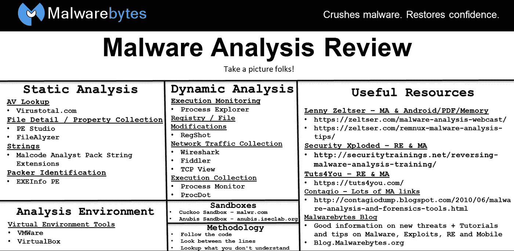

# 恶意软件分析 101

> 原文：<https://infosecwriteups.com/malware-analysis-101-ac6d55092c8d?source=collection_archive---------0----------------------->

## 什么是恶意软件分析，如何应对？

在过去的几周里，我没有能够写任何文章，因为我在度假几天，我最近开始学习关于恶意软件分析。正是网络安全领域一直吸引着我，但我总是不断拖延，说服自己对像我这样的人来说太难太复杂了。上个月，我很幸运，在与一位了不起的法国信息安全工程师 Jo ( telegram - @jiab77)交谈时，他向我解释了恶意软件分析的基础知识，并打破了我在脑海中建立的那堵墙。

# 我们开始吧！

在我们深入恶意软件分析之前，让我们了解什么是恶意软件。恶意软件(恶意软件)是一些程序或文件，旨在对计算机和用户造成伤害。在我们广阔的互联网世界中存在各种类型的恶意软件，如病毒、蠕虫、特洛伊木马、勒索软件和间谍软件。该恶意软件可以执行各种功能，如窃取数据、加密文件、删除数据、修改文件，甚至将这些系统添加到一个巨大的僵尸网络中，并在用户不知道他们的计算机已被感染的情况下监控这些系统。黑客主要编写这些恶意软件，并根据攻击面以两种不同的方法实施攻击，一种是大规模攻击，他们编写恶意软件来感染大量人群，例如“WannaCry”和“NotPetya”勒索软件，第二种是有针对性的攻击，攻击者编写恶意软件来完成一项非常专注的任务，臭名昭著的“Stuxnet”就是这种攻击之一。

现在，我们已经对恶意软件有了基本的了解，让我们深入了解我们实际上是如何进行恶意软件分析的，以及使用了哪些技术。

# 恶意软件分析技术

有两种不同类型的恶意软件分析技术，一种是静态分析，另一种是动态分析。他们的名字不言自明，但请让我进一步解释。通俗地说，静态分析需要对恶意软件进行所有这些检查，在这些检查中，您并不实际执行恶意软件，而是试图找出恶意软件试图做什么。动态分析是指当您实际执行恶意软件(在沙盒环境中执行)时进行的所有检查，然后尝试找出恶意软件的功能。

来源:Android 应用安全扫描流程- *Iman Almomani 和 Mamdouh Alenezi*

这些可以进一步分为四类。

i) *基本静态分析*

*   基本的静态分析包括检查可执行文件，而不查看实际的指令。
*   基本静态分析可以确认文件是否是恶意的，提供关于其功能的信息
*   有时会提供一些信息，让您能够生成简单的网络签名。
*   它简单快捷，但对复杂的恶意软件基本无效&可能会错过重要的行为。

*ii)基本动态分析*

*   基本的动态分析技术包括运行恶意软件并观察其在系统上的行为，以便消除感染、生成有效的签名或两者兼而有之。
*   在执行恶意软件之前，您必须设置一个环境，允许您研究正在运行的恶意软件，而不会对您的系统或网络造成损害。
*   没有深厚编程知识的大多数人都可以使用基本的动态分析技术，但它们不会对所有恶意软件都有效，并且可能会错过重要的功能。

*iii)高级静态分析*

*   通过将可执行文件加载到反汇编程序中并查看程序指令来发现程序的功能，从而对恶意软件的内部进行逆向工程。
*   指令是由 CPU 执行的，所以高级静态分析告诉你程序到底在做什么。
*   然而，与基本静态分析相比，它的学习曲线更加陡峭，并且需要反汇编、代码构造和 Windows 操作系统概念的专业知识。

*iv)高级动态分析*

*   它使用调试器来检查正在运行的恶意可执行文件的内部状态。
*   高级动态分析技术提供了另一种从可执行文件中提取详细信息的方法。
*   当您试图获取难以用其他技术收集的信息时，这些技术最有用。

我计划写更多的文章来深入解释这些技术，以及如何以可能的最佳方式执行它们。

# 三条黄金法则

恶意软件分析有自己的三条黄金法则，在对这些程序进行检查时，您应该牢记在心，以提高您的工作效率，不落入攻击者的陷阱。

i) *第一个*

*   不要太纠结于细节。大多数恶意软件程序庞大而复杂，你不可能了解每一个细节。
*   相反，关注关键特征。当你遇到困难和复杂的部分时，试着在陷入混乱之前有一个大概的了解。

ii) *第二个*

*   记住不同的工作有不同的工具和方法。没有一种方法。
*   每种情况都是不同的，您将学习的各种工具和技术将具有相似的、有时是重叠的功能。
*   如果你在一个工具上运气不好，试试另一个。如果你卡住了，不要在任何一个问题上花太长时间；换个话题。
*   尝试从不同的角度分析恶意软件，或者尝试不同的方法。

iii) *第三*

*   请记住，恶意软件分析就像一场猫捉老鼠的游戏。
*   随着新的恶意软件分析技术的发展，恶意软件作者用新的技术来阻止分析。
*   要成为一名成功的恶意软件分析师，你必须能够识别、理解和击败这些技术，并对恶意软件分析艺术的变化做出反应。

既然我们知道了恶意软件分析的黄金法则以及什么是恶意软件，现在让我们从鸟瞰的角度来看当我们在您的系统或我们的网络上遇到恶意软件时我们需要做的事情。

# 遭遇恶意软件攻击时该怎么办？

恶意软件分析的目的通常是提供应对网络入侵所需的信息。我们的目标通常是确定到底发生了什么&确保我们已经找到所有受感染的机器和文件。

*   在分析可疑的恶意软件时，您的目标通常是准确确定:-

I)特定可疑二进制文件可以做什么

ii)如何在您的网络中检测它

iii)如何衡量和控制其损害。

在确定哪些文件需要全面分析后，我们需要开发签名来检测网络上的恶意软件感染。

*   *基于主机的签名*或指示器，用于检测受害者计算机上的恶意代码。

恶意软件指示器关注恶意软件对系统的影响，而不是恶意软件本身的特征

*   *网络签名*通过监控网络流量来检测恶意代码。

没有恶意软件分析也可以创建网络签名，但是在恶意软件分析的帮助下创建的签名通常更加有效。

最终目标始终是弄清楚恶意软件是如何工作的，以及当它出现在系统上时，它试图执行什么功能。

> 附:这里有一张图片，可以让你对恶意软件分析有一个基本的了解。我将在接下来的文章中尝试涵盖这些主题。

来源:BSides Austin 2015 和恶意软件分析培训，由 [Adam Kujawa](https://blog.malwarebytes.com/author/akujawa/)

如果你喜欢，请鼓掌让我们合作。获取、设置、破解！

网址:[aditya12anand.com](https://www.aditya12anand.com/)|捐赠:[paypal.me/aditya12anand](https://paypal.me/aditya12anand)

电报:[https://t.me/aditya12anand](https://t.me/aditya12anand)

推特:[twitter.com/aditya12anand](https://twitter.com/aditya12anand?source=post_page---------------------------)

领英:[linkedin.com/in/aditya12anand/](https://www.linkedin.com/in/aditya12anand/?source=post_page---------------------------)

电子邮件:aditya12anand@protonmail.com

*关注* [*Infosec 报道*](https://medium.com/bugbountywriteup) *获取更多此类精彩报道。*

 [## 信息安全报道

### 收集了世界上最好的黑客的文章，主题从 bug 奖金和 CTF 到 vulnhub…

medium.com](https://medium.com/bugbountywriteup)