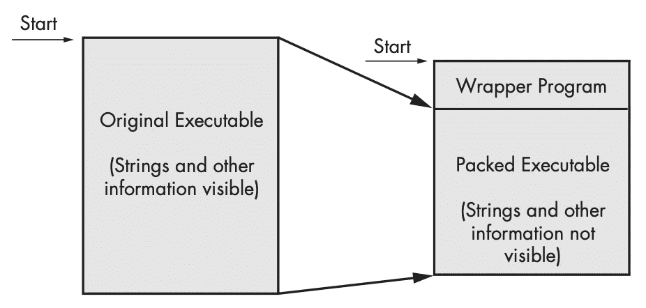
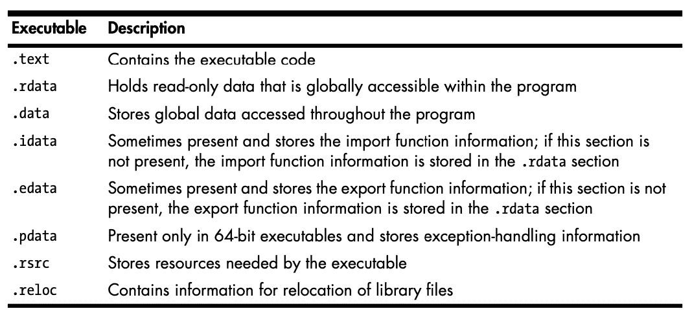
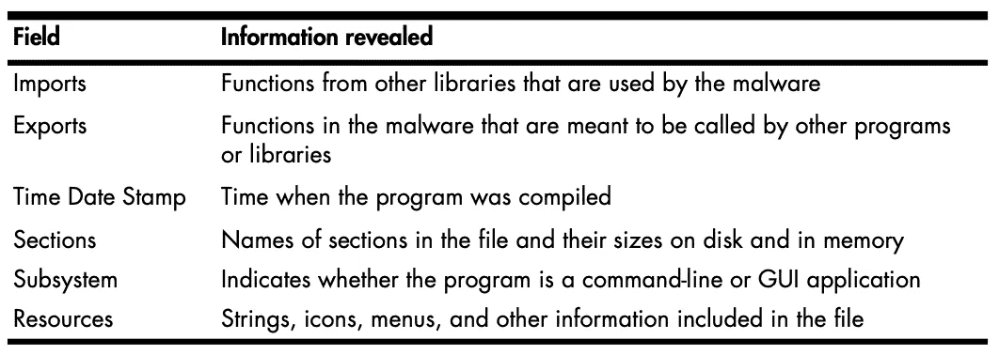
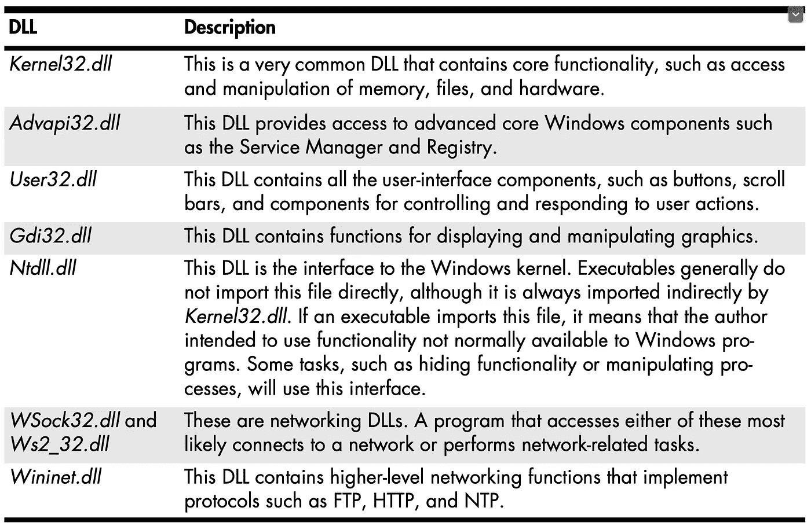
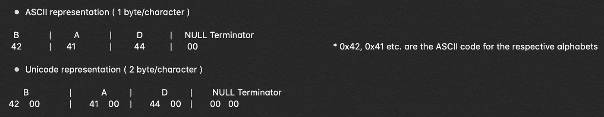
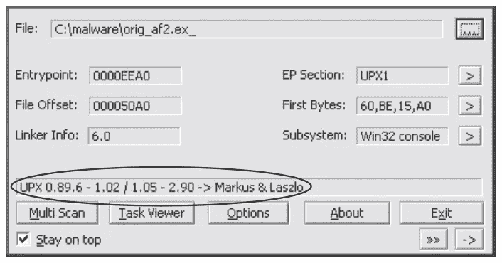
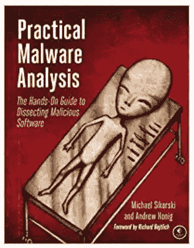

# 恶意软件分析 101 -基本静态分析

> 原文：<https://infosecwriteups.com/malware-analysis-101-basic-static-analysis-db59119bc00a?source=collection_archive---------0----------------------->


> 这篇文章是我上一篇文章“[恶意软件分析 101](https://medium.com/bugbountywriteup/malware-analysis-101-ac6d55092c8d) ”的续篇，请在继续这篇文章之前阅读一下，以便更好地理解我将在这里解释的东西。

恶意软件分析大致分为两组静态分析和动态分析。我们可以将静态分析描述为对恶意软件的所有检查，其中我们并不实际执行恶意软件，而是试图找出恶意软件试图做什么以及它试图执行的命令。另一方面，动态分析是当您实际执行恶意软件(最好是在沙盒环境中)时进行的所有这些检查，然后尝试找出恶意软件的功能。

尽管我们有两种定义明确的方法，但我们仍然有这些组的进一步细分。这些是我们在试图找出这些恶意软件背后的真正动机时使用的基本和高级方法。在这篇文章中，我试图解释恶意软件分析的基本静态分析方法。

# 我们开始吧！

我实际上计划在这篇文章中关注基本的静态和基本的动态分析，但是适当地解释我坚持的基本静态分析。现在，在深入讨论基本静态分析中使用的每一种技术之前，让我们讨论一下它的实际含义。

静态分析包括在不查看实际指令的情况下检查可执行文件。它用于确认，至少了解正在检查的文件是否是恶意的。我们通过找出可执行文件调用的函数和库来做到这一点。尽管这不是很有效，但基本的静态分析确实可以作为恶意软件分析的垫脚石，并让您了解应该关注的事情。

在深入静态分析方法之前，首先让我们探索更多关于恶意软件的知识，以便我们了解在对我们认为是恶意的软件进行分析时所采取的所有步骤。

# 打包和混淆的恶意软件

恶意软件通常有两种类型，一种是模糊的，另一种不是。那些没有混淆的可以被静态工具很好地分析，但是现在的恶意软件大多被打包和混淆。

*混淆的*程序是恶意软件作者试图隐藏其执行的程序。*打包*程序是混淆程序的子集，恶意程序在其中被压缩，无法被分析。为了识别恶意软件是否被打包，我们可以用字符串对其进行静态检查，如果我们发现极少数量的字符串，那么代码几乎 100%有可能是恶意的。

*   打包和混淆的代码将至少包括像 LoadLibrary 和 GetProcAddress 这样的函数，这些函数用于加载和获得对附加函数的访问，并且是表明该程序是恶意软件*的泄漏。*
*   打包文件

I)当打包程序运行时，一个小的包装程序也运行以解压缩打包的文件，然后运行解包的文件

ii)分析打包程序我们只能清楚地理解包装程序，然后可以对其进行剖析，查看下图。



左边的文件是原始的可执行文件，所有的字符串、导入和其他信息都是可见的。右边是打包的可执行文件。打包文件的所有字符串、导入和其他信息都是压缩的，对大多数静态分析工具都是不可见的。

现在让我们试着去理解可移植的可执行文件和它们的格式，这样我们就知道要找什么了。

# 可移植可执行文件格式

Windows 可执行文件、目标代码和 dll 使用可移植的可执行文件格式。PE 文件格式是一种数据结构，包含 Windows OS 加载程序描述如何管理包装的可执行代码所需的信息。

*   几乎每一个由 Windows 加载的带有可执行代码的文件都是 PE 文件格式，除了少数在恶意软件中很少出现的传统文件格式。
*   PE 文件以包含以下内容的文件头开始

I)关于代码的信息

ii)申请类型

iii)所需的库功能

四)空间要求

*   从 PE 报头接收的信息对于恶意软件分析师来说可能具有很大的价值

## 可移植的可执行文件头和节

PE 文件头可以提供比导入更多的信息。PE 文件格式包含一个标题，后跟一系列的节。许多信息可以从文件头中获得，因为它包含关于文件本身的元数据。在头文件之后，我们还可以访问文件的实际部分，每个部分都包含有用的信息。

以下是 PE 文件中最常见和最有趣的部分:



**- PE 表头汇总**

PE 头包含对恶意软件分析师有用的信息，我们将在后续章节中继续研究它。从 PE 报头中可以获得的关键信息很少。



我们知道恶意软件需要使用链接库&函数才能正常工作，所以让我们来发现这一点。

# 链接库

我们可以收集的关于可执行文件的最有用的信息之一是它所使用的链接库的列表。

*   代码库可以在运行时静态链接，也可以动态链接

了解库代码是如何链接的，这对于我们理解恶意软件至关重要，因为我们在 PE 头中找到的信息可以根据这些库如何相互交互和链接来理解。

## **静态链接**

*   这是最不常用的链接库的方法(在 UNIX 和 Linux 中很常见)
*   静态链接时，所有代码都被复制到可执行文件中，这反过来增加了文件本身的大小。
*   尽管分析代码变得很困难，因为区分静态链接的代码和可执行程序自己的代码变得非常困难。
*   如果使用静态链接，那么 PE 头文件并不表明该文件包含链接的代码。

## **运行时链接**

*   它主要用于恶意软件程序，尤其是当它被打包或混淆时。
*   使用这种技术的可执行文件仅在需要时连接到库。
*   Windows 函数允许程序调用程序头文件中没有列出的函数。
*   两个最常用的函数是 *LoadLibrary* 和 *GetProcAddress*
*   *ldrgetprogaddress*和 *LdrLoadDll* 也被使用
*   *LoadLibrary* 和 *GetProcAddress* 允许程序访问系统上任何库中的任何函数。
*   因此，无论何时使用这些函数，我们都不能准确地说出哪些函数与可疑程序相关联。

## **动态链接**

*   这是恶意软件最常用的方法
*   当库被动态链接时，每当程序被加载时，主机操作系统搜索必要的库
*   当程序调用链接的库函数时，该函数在库中执行。
*   PE 文件头存储了关于将要加载的每个库和程序将要使用的每个函数的信息
*   识别正在使用的库是非常重要的，因为它允许我们猜测程序试图做什么。
*   最需要的常用 dll，可用于进行某些扣除。



常见 dll

# 功能

可移植的可执行文件所调用的函数让我们深入了解了它的工作原理。有三种不同类型的链接库，同样，我们在功能上也有两个主要的子部门，即导入和导出。

## **导入功能**

*   *导入*是一个程序用来链接代码库的函数，代码库包含所需的功能并存储在不同的程序中。
*   PE 文件头还包括关于可执行文件使用的特定函数的信息。
*   这些窗口函数的名称可以让您对可执行文件的功能有一个正确的概念。

## **导出功能**

*   dll 和 exe 导出函数来与其他程序和代码交互。
*   DLL 实现一个或多个函数，并导出它们供可执行文件使用，然后可执行文件可以导入和使用它们。
*   PE 文件包含关于文件导出哪些函数的信息。
*   dll 是专门实现来提供 exe 使用的功能的
*   如果您在可执行文件中发现导出，它们通常会提供有用的信息
*   在许多情况下，软件作者以提供有用信息的方式命名他们导出的函数。
*   因此，导出函数的名称实际上对复杂的恶意软件用处有限。
*   如果恶意软件使用导出，它通常要么完全省略名称，要么使用不清楚或误导的名称。

既然我们已经介绍了基础知识，让我们从用来进行有效的基本静态分析的技术开始。

## 1.防病毒扫描

这是您可以执行的第一步，以确定您怀疑是恶意软件的特定程序实际上是否是恶意的。大多数情况下，出于安全原因，您想要检查的软件可能已经被主要的防病毒公司识别出来了，这将为您节省大量的时间。

*   无论如何，这些都不是完美的，它们使用已知的可疑代码(文件签名)以及行为和模式匹配分析(启发式)来执行扫描。
*   代码中的重大更改可以用来绕过文件签名检查。因此，新的和独特的恶意软件可以绕过这种启发式检查。
*   不同的杀毒工具使用不同的特征码来识别恶意软件，因此建议使用各种杀毒软件([virustotal.com](http://virustotal.com))来测试恶意软件文件。

## **2。散列法**

哈希是一种用于唯一识别恶意软件的常用技术。关于哈希的事情是，一旦我们有了我们认为是恶意的软件的唯一哈希，我们就可以将它用于多种目的

I)将其用作标签，以便在恶意软件分析社区中识别它

ii)与其他分析师分享，帮助他们识别恶意软件

iii)在线搜索恶意软件并检查它是否已经被识别

## **3。寻找琴弦**

我们知道什么是字符串，我们所说的字符串是程序中的一系列字符。因此，在这种特殊的技术中，我们试图找出程序中存在的字符串，如消息、连接到 URL 的内容或可能存在于特定位置的文件副本等。

*   搜索这些字符串可能是获得程序功能提示的一种方式。
*   微软的字符串([bit.ly/ic4plL](http://bit.ly/ic4plL))工具可以用来在可执行文件中搜索字符串，字符串通常以 ASCII 或 Unicode 格式存储
*   Strings 搜索三个字母或更长的 ASCII 和 Unicode 字符序列，后跟终止字符

> **注意:**两种 ASCII & Unicode 格式都存储以 NULLL 结束符结尾的序列中的字符，以表示字符串结束



*   Strings 在搜索可执行文件中的 ASCII 和 Unicode 字符串时会忽略上下文和格式，因此它可以分析任何文件类型并检测整个文件中的字符串
*   不是所有的字符串都是有效的字符串，它们可以是字符串、内存地址、CPU 指令或程序使用的数据，由用户过滤掉。

## 4.使用 PEiD 检测封隔器

使用 PEiD，我们可以检测用于构建应用程序的打包程序或编译器的类型，这使得分析打包的文件变得更加容易，例如 iD 证明、照片、付款。

*   对 PEiD 的支持和开发已于 2011 年停止，但它是最好的工具之一，在少数情况下，它还可以识别用于打包文件的打包程序。



PEid 软件输出

> **注意:** PEiD 已确定该文件打包有 UPX 版本 0.89.6 - 1.02 / 1.05 - 2.90

*   我们现在知道了打包的方法，所以我们现在可以解包了。他们非常复杂，但幸运的是，UPX 打包的恶意软件很容易解包，只要从(【upx.sourceforge.net/】)下载就可以了

```
$ upx -d PackedProgram.exe
```

*   许多 PEiD 插件在没有警告的情况下运行恶意软件可执行文件！像其他程序一样，尤其是那些用于恶意软件分析的程序，PEiD 也可能存在漏洞。

> **注意:**PEiD 0.92 版包含一个缓冲区溢出，使得攻击者能够执行任意代码。这将允许一个聪明的恶意软件作者编写一个程序来利用恶意软件分析师的机器。所以最好只使用最新版本的 PEiD。

## **其他 PE 文件工具**

许多其他工具可用于浏览 PE 头。两个最有用的工具是 PEBrowse Professional 和 PE Explorer。

[**PEBrowse Professiona**l](http://www.smidgeonsoft.prohosting.com/pebrowse- pro-file-viewer.html)类似于 PEview。它允许您查看每个部分的字节，并显示解析的数据。PEBrowse Professional 在展示资源信息方面做得更好。rsrc)部分。

[**PE Explorer**](http://www.heaventools.com/) 有一个丰富的 GUI，允许你浏览 PE 文件的各个部分。您可以编辑 PE 文件的某些部分，它包含的资源编辑器对于浏览和编辑文件的资源非常有用。这个工具的主要缺点是它不是免费的。



**编辑**:文中提到的东西和截图大多摘自《实用恶意软件分析》一书。你绝对应该考虑买这本书，[链接这里](https://www.amazon.in/Practical-Malware-Analysis-Hands-Dissecting/dp/1593272901)。我在这里总结了我的笔记，有几点是直接从书上摘下来的，因为我认为它们解释得很好，重新措辞或编辑它们没有意义。

**如果你喜欢，请鼓掌让我们合作吧。获取、设置、破解！**

网址:[aditya12anand.com](https://www.aditya12anand.com/)|捐赠:[paypal.me/aditya12anand](https://paypal.me/aditya12anand)

电报:[https://t.me/aditya12anand](https://t.me/aditya12anand)

推特:[twitter.com/aditya12anand](https://twitter.com/aditya12anand?source=post_page---------------------------)

领英:[linkedin.com/in/aditya12anand/](https://www.linkedin.com/in/aditya12anand/?source=post_page---------------------------)

电子邮件:aditya12anand@protonmail.com

*关注* [*Infosec 报道*](https://medium.com/bugbountywriteup) *获取更多此类精彩报道。*

[](https://medium.com/bugbountywriteup) [## 信息安全报道

### 收集了世界上最好的黑客的文章，主题从 bug 奖金和 CTF 到 vulnhub…

medium.com](https://medium.com/bugbountywriteup)