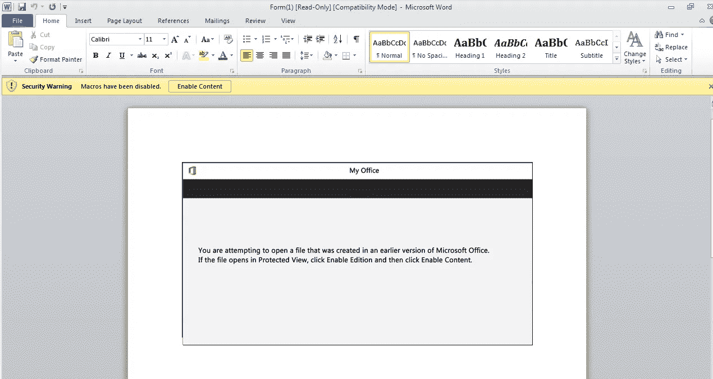
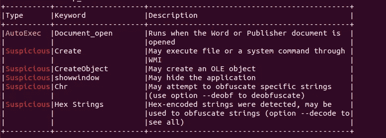
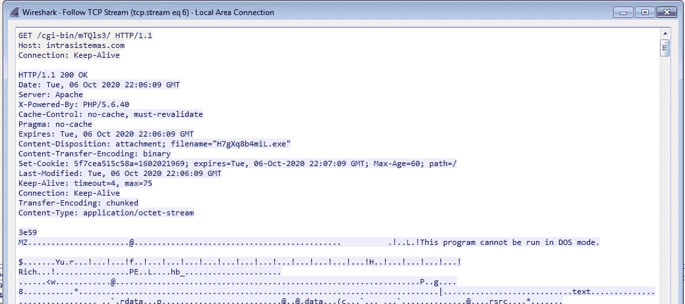
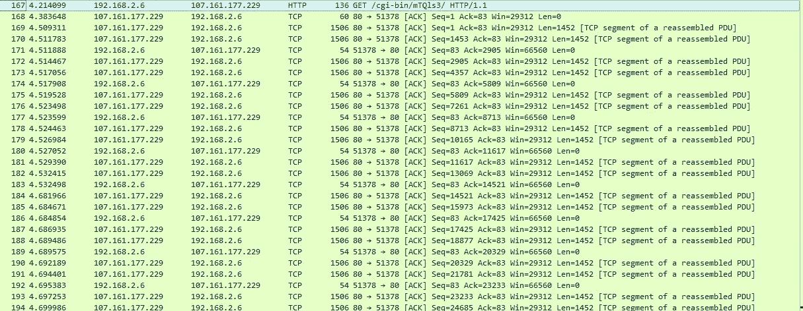
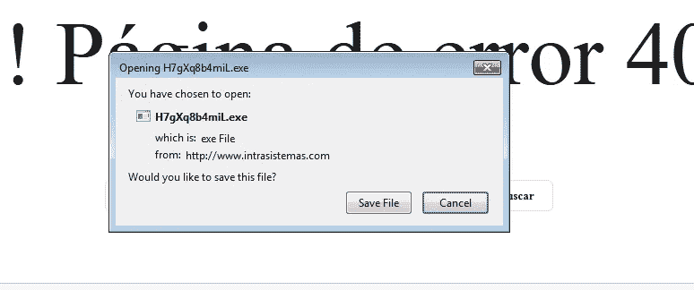
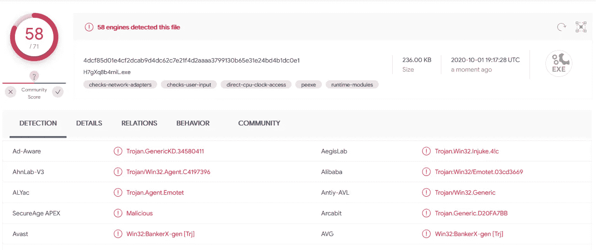

# 恶意软件分析 101 — Emotet MalDoc 行为方法

> 原文：<https://infosecwriteups.com/malware-analysis-101-emotet-maldoc-a-behavioral-approach-af69e40f708d?source=collection_archive---------0----------------------->

距离我上次写关于安全的文章已经有一段时间了，但是这次我带着我的新爱好回到了我热爱的低级安全领域，恶意软件分析。这篇文章是两篇文章的迷你系列的一部分，我将演示我是如何从恶意下载者到未打包版本的 Emotet 僵尸网络样本的，完全是靠运气。

**简介**

我真的不认为我应该进一步解释 Emotet 是什么，我可以用一个短语将其命名为“一个即使撒旦也会失去他-她的银行账户的银行特洛伊木马/机器人”。要进一步了解 Emotet 是什么，你可以观看下面这个令人惊叹的动画视频:

Emotet 解释得很快

让我们开始写吧:

```
Sample Characteristics 
MD5 => 7ab1d4fac08b7210c03058626a4ad49d
SHA-1 => e918b7e867769884cded21f22acbf03a996e51d2
SHA-256 => af5d152ec16da716f758d26ad30f58ec6bf0082e5ccc5db9b93d93a75c666718
Vhash => 567c96ecc686ef1e7be0fc55d286c129
SSDEEP => 1536:CJ0ZsWTJ0ZsWirdi1Ir77zOH98Wj2gpngR+a9+Q54LW056:5rfrzOH98ipga+qD56
File type
MS Word Document
```

病毒总数:

 [## 病毒总数

### 病毒总数

VirusTotalwww.virustotal.com](https://www.virustotal.com/gui/file/af5d152ec16da716f758d26ad30f58ec6bf0082e5ccc5db9b93d93a75c666718/detection) 

**README.txt —免责声明**

以下文章中执行的每个任务都是在 Windows 虚拟机上执行的，请不要将您的主要操作系统用作恶意软件分析实验室。此外，如果您选择按照写的内容操作，并最终导致机器、网络等受到感染，那么作者不承担任何责任。如果你选择实际遵循这篇文章，我认为如果事情出错，你可以采取必要的行动来保护自己和你的网络。

**传播与规避**

Emotet 通常使用 maldocs(恶意文档)进行传播，如上所述，这些通常是 Microsoft Office 文件(例如 MS-Word、MS-Excel 等)，它们具有武器化的 Visual Basic 脚本，可将恶意可执行文件下载、安装并运行到目标计算机。我想，你会想到的第一个问题是,. doc 文件为什么/如何运行 VB-Script。原因是因为微软办公套件的所有程序中都嵌入了解释器来执行任务，例如提供有用的功能(例如在 Excel 中计算统计模型等)。)，但是他们说的好事不出门，也是真的。由于有了 VB-Script 解释器，恶意的开发人员可以利用它的功能编写一个脚本，将恶意代码传递给操作系统(使用 PowerShell 命令)。从 VB-Script 下载并运行病毒的角度来看，我们能做的阻止感染的事情有限。

**获取代码**

通过打开。我可以有把握地假设它是恶意的，但要证明我的假设是正确的，我需要更多的证据，所以我必须深入挖掘。为此，我必须获得宏的代码，我可以尝试使用 MS-Word 环境中“视图”选项卡上的“宏”选项来获得它，或者使用 oletools(更具体地说是 olevba ),这是一个对 OLE2(基本上是 Microsoft Office)文件执行各种操作的工具集。



恶意文件正试图对我们进行社会工程，以启用武器化宏。

按照下面的链接安装 oletools

[](https://github.com/decalage2/oletools/wiki/Install) [## 十堰 2/工具

### 运行 oletools 的推荐 Python 版本是最新的 Python 3.x(目前为 3.7)。Python 2.7 仍然受支持…

github.com](https://github.com/decalage2/oletools/wiki/Install) 

因为我很懒，我只想尽快完成工作，所以我选择了第二个选项，使用 olevba 从 OLE 文件中提取 Visual Basic 脚本。



运行 olevba 的最终报告

正如你从上面的输出中看到的，运行 olevba 给了我高度混乱的代码，它也给了我一些额外的信息，脚本可能会自动执行一些东西。在这一点上，我有两个选择来深入挖掘，一个是对脚本进行逆向工程，这是缓慢但安全的，成功率很高，另一个是对它进行行为分析，这在某些情况下可能有风险，如果它很安静，我们可能不会发现任何东西，但过程很快。因为我知道这个脚本会尝试运行一个 PowerShell 命令，猜测这是一个病毒下载安装程序，所以我选择了第二个选项。

**对 MalDoc 进行行为分析**

要在 Windows 机器上执行行为分析，您需要我们称之为“监控信标”的东西，这些基本上是在受感染机器上运行的监控工具，用于监控不同的攻击面，可以是网络和/或正在运行的进程(内存)。为了监控它们，我们需要我们的老朋友 WireShark 和 ProcMon。这是两个功能强大的工具，基本上是监控将被感染的机器所需的最低要求。

```
TIP: A small tip that OALabs taught me, about these two is to rename their icons to something random (e.g. somethingrandom.exe) on the Desktop (and not only there) since a lot of the malwares in the wild check if their default names are present in the target system and if that's true the viruses remain dormant. In this case we don't have to face a malware (yet) but it's a good practice in general.
```

因为我设置了这两个，所以我必须在 MalDoc 中运行宏来看看它是如何工作的。按下“启用宏”按钮后的一秒钟，我终于看到了想要的输出。就是一个 GET 请求从这下载一个 PE 文件(被黑了？)网站。我的假设是正确的，它是恶意的。

```
http://intasistemas.com/cgi-bin/mTQls3
```



执行了恶意 VB 脚本的 GET 请求和一些回复行。

我们可以确认这下载了一个可移植的可执行文件，因为我们可以看到特征字符串:

```
"MZ" which are the magic bytes of a PE file (4D 5A) and "This program cannot be run in DOS mode."
```

这是 PE 文件的神奇字节和包含在大多数 PE 文件中的字符串。同样从*保活连接报头中，*我们知道其他请求将会关注同一个流。



从 IP 地址 107.161.177.229 下载 PE 文件的数据流

在 ProcMon 端，除了一个名为 CharMapX.exe 的新运行进程之外，我们看不到任何奇怪的东西，我猜这是 VB 脚本的命令注入下载并执行的运行病毒。但那时我认为这无关紧要，我只想找到可执行文件本身。我关闭了我的虚拟机，将它恢复到我之前拍摄的干净快照。剩下的工作就是访问该站点并下载可执行文件以供进一步研究(第 2 部分)。



使用浏览器下载恶意可执行文件。

正在上传。我敢肯定这是臭名昭著的 Emotet 病毒。



它被 58 种抗病毒病毒认为是恶意的和/或情绪化的。