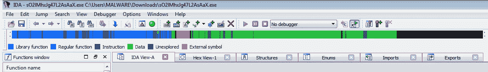
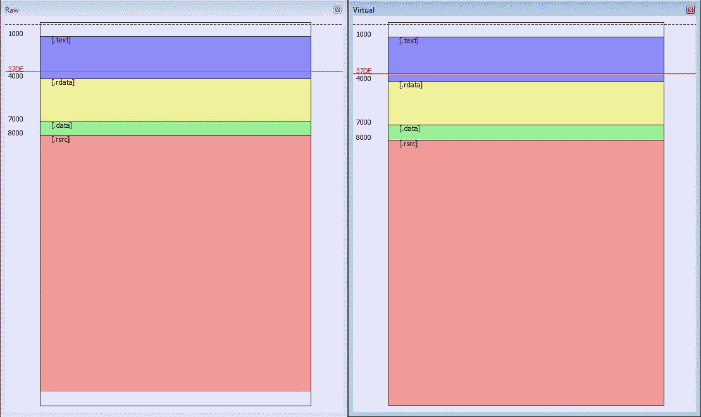
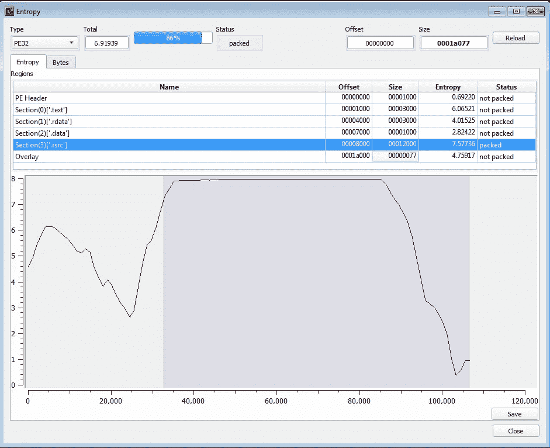
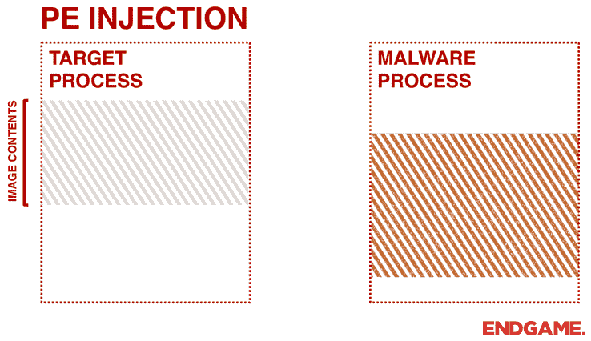
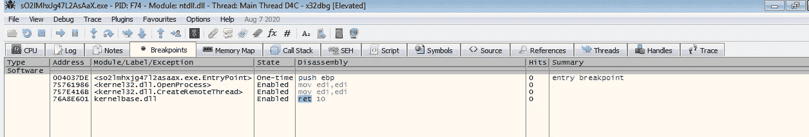
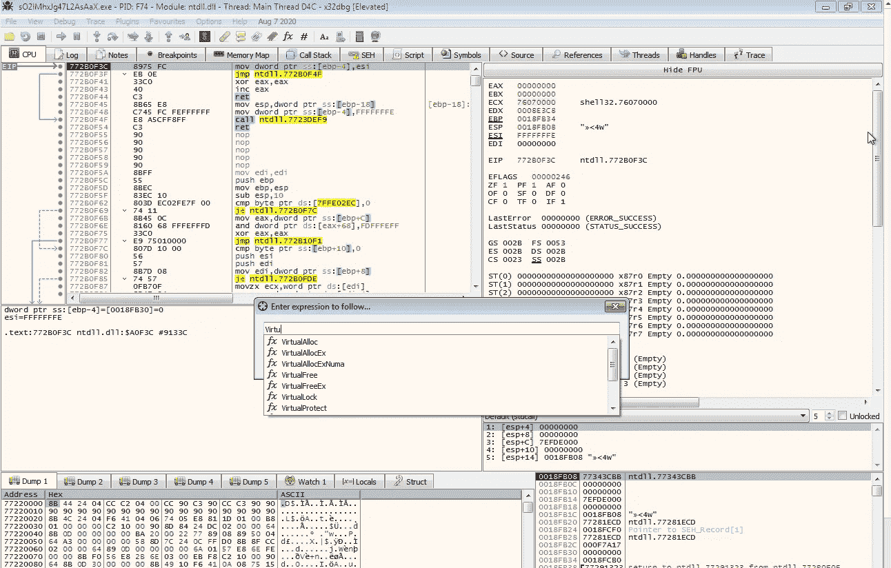
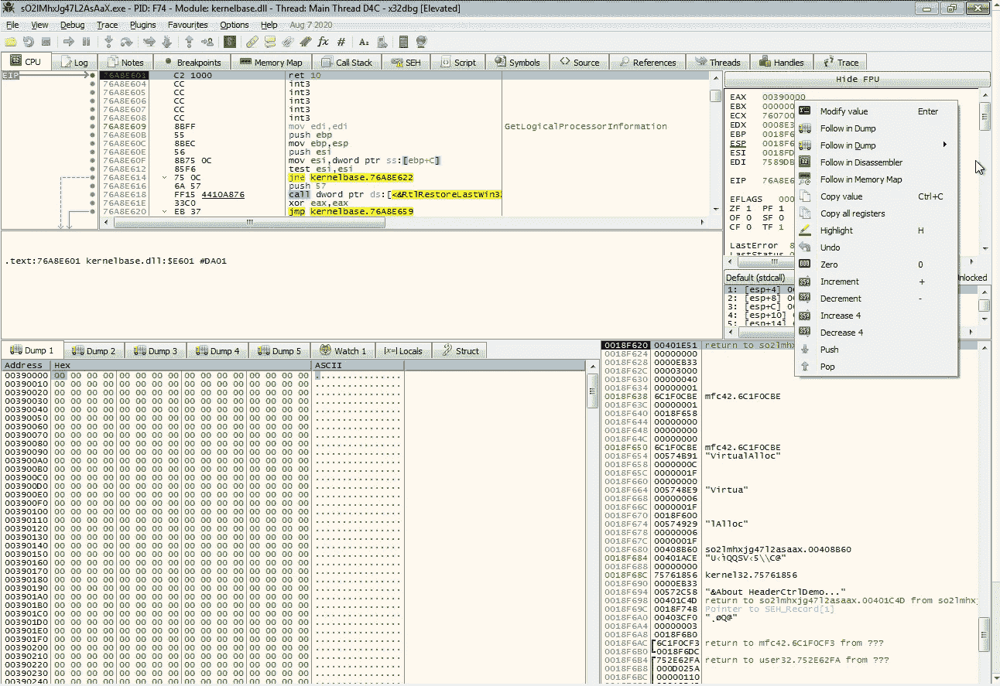
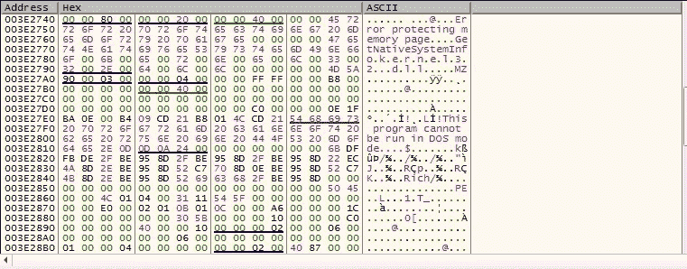

# 恶意软件分析 101 —拆包恶意软件。案例研究:一个新的情绪样本

> 原文：<https://infosecwriteups.com/malware-analysis-101-unpacking-malwares-case-study-a-fresh-emotet-sample-f2ea07d90d18?source=collection_archive---------4----------------------->

欢迎来到迷你#Emotet 系列的第二部分。如果你还没有阅读第一部分，请点击下面的链接。在第一部分中，我从恶意代码开始追踪 Emotet 的可执行文件。在这篇文章中，我将主要解释打包是如何工作的，以及这些知识是如何方便地引导我找到病毒的未打包版本的。

[](https://medium.com/@shad3box/malware-analysis-101-emotet-maldoc-a-behavioral-approach-af69e40f708d) [## 恶意软件分析 101 — Emotet MalDoc 行为方法

### 自从我上次写关于安全的文章已经有一段时间了，但是这次我带着我的新爱好回来了

medium.co](https://medium.com/@shad3box/malware-analysis-101-emotet-maldoc-a-behavioral-approach-af69e40f708d) 

**首先要做的事情**

在下载了恶意软件后，从那个被黑的域(见第一部分)，我必须做一些初始枚举来看看它做了什么，例如，如果它直接访问注册表，如果它试图安装一个键盘记录器或任何其他可疑的东西。所以我直接上传到了 VirusTotal.com

细心的读者可能会发现上图中的可执行文件与第一部分中的不同。这是因为访问域给了我不同的可执行文件名称。我的猜测是，这是相同的病毒，但有不同的包装(我稍后会解释这是什么)。

我从被黑的网站上收集的打包的恶意软件样本的名称。

**包装工及其工作方式**

打包程序(也称为可执行压缩程序)是试图隐藏“真正的”可执行程序的汇编代码的程序，方法是加密和/或混淆汇编代码，并将其存储在运行时解密并执行的内存区域中。这是针对静态分析技术的对策。几年前，它们被游戏工作室等公司用来保护他们的软件免受逆向工程。一些最著名的打包程序是 UPX(可执行文件的终极打包程序)，英格玛保护者，Themida。这如何适用于我们的情况？….想想看，假设你是一个恶意软件开发者，你最大的敌人是反病毒程序。你如何改革你的可执行文件，通过(至少)保护它不被静态分析而隐藏它的恶意行为，但仍然保持它的功能？你猜对了…通过包装。

**识别打包的可执行文件**

识别打包的可执行文件相对简单，因为大多数打包程序都使用。数据，。rdata 和/或。rsrc 段来存储加密的可执行文件。在 PE-bear(一种分析 PE 文件的工具)或反汇编程序(如确定每个段大小的 IDA)或任何其他 PE 分析器上打开可执行文件时，通常会出现如下图像。



打包的可执行文件在 IDA 中打开。



在 PE-bear 中打开打包的可执行文件。

正如我们在上面看到的，我们可以很容易地确定这是一个打包的可执行文件，因为数据段的大小，否则用于存储实际数据，如打印函数的字符串，比代码本身(存储在。文本段)。这是二进制文件被打包的主要标志，如果不是确认的话，因为我们可以理解数据段不是用作数据，而是用作其他东西，例如代码，这种工作方式将在以后的文章中解释。另一个主要的标志是二进制的熵，熵是混沌的量度，或者至少物理学家是这么说的。在我们的例子中，熵是对可执行文件中某个区域的模糊性或稀有性的度量。我还从密码学中了解到，加密或混淆的数据往往具有高熵。将这些知识结合在一起，很容易确定。熵约为 7.6(非常高的值)的 rsrc 被打包。我通过使用 DetectItEasy 工具来确定恶意软件的熵值，在某些情况下，我发现这种工具很少。



使用 DetectItEasy 工具对二进制片段进行熵测量。

**代码注入技术及其存在的原因**

帮助病毒绕过防病毒程序的另一种方式是注入它们的代码，并在另一个不受高度监控的进程上执行代码，例如在 Windows 中，这可以是 explorer.exe，它基本上是一个管理器进程，提供了用于与大多数 Windows 交互的图形界面。有多种技术可以实现这一点(我们将在未来的 Red Teamers 系列文章中探讨它们)。其中一种是 Emotet 使用的 PE 注入，恶意软件进程在远程目标进程中注入整个 PE 文件(在另一个进程的内存中注入正在运行的进程模块的完整映像)，然后在目标进程的线程中继续执行它。

**PE 注射**

PE 注入遵循一组标准 API 调用来执行注入，它们是(来源 MSDN):

```
*OpenProcess* **Functionality**
Opens an existing local process object. This call will open the remote process handler.**Return** 
If the function succeeds, the return value is an open handle to the specified process.*VirtualAlloc***Functionality** Reserves, commits, or changes the state  of a region of pages in the virtual address space of the calling process. Memory allocated by this function is automatically initialized to zero. This call will allocate the memory on the remote process that the malware's image will get written. **Return** If the function succeeds, the return value is the base address of the allocated region of pages.*CreateRemoteThread***Functionality** Creates a thread that runs in the virtual address space of another process. This call will create the malware process thread.**Return** If the function succeeds, the return value is a handle to the new thread. Keep also in mind also that for the CreateRemoteThread call it doesnt matter if the start address of the Thread (given as lpStartAddress parameter) points to data, or code segments.
```



PE 注射的图示。资料来源:elastic.com

**连接圆点**

我的目标从一开始就是解开恶意软件，因为它几乎不可能对打包程序本身进行逆向工程，理解它是如何工作的，然后编写一个脚本来解开二进制文件。我遵循动态分析方法来获得解压缩的目标可执行文件。为此，我不得不滥用它的注射技术。请记住，恶意软件必须被*解包才能在远程进程*中运行，并且在恶意软件注入内存和执行之间有一小段时间。我知道我有一个清晰的攻击面，可以在不感染我和我的网络的情况下获取我的解压后的可执行文件。

**转储恶意软件**

我用来对付恶意软件的唯一的“枪”是我最喜欢的调试器，你可以使用你喜欢的调试器。我的个人选择各不相同，对于这一个，我使用 x86dbg，因为我通常在处理恶意软件时会这样做，但当情况是 Windows 内部没有选择，而不是 WinDBG。我在调试器中打开了打包的恶意软件，并在前面提到的 API 调用上设置了一些断点，因为我希望能找到它们。



解包过程中使用的所有断点

```
Tip 1 : To set a breakpoint on a function of the API press CTRL+G inside the debugger and search for the function that you want.
```



按 CTRL + G 后会弹出一条消息。使用它来搜索所需的表达式(可能是一个 API 调用)。

```
Tip 2 : Regarding of setting a breakpoint on the VirtualAlloc call, as mentioned earlier, VirtualAlloc returns the base address of the newly allocated area that it's stored in the EAX register. Instead of setting a breakpoint on the start of the VirtualAlloc call follow the JMP instructions inside the kernel32.dll, find the ret 10 instruction which basically is the return of the VirtualAlloc call and set your breakpoint there. When your breakpoint gets a hit there the EAX register will contain the base address of the newly allocated area which you can follow in dump and monitor. -- Thanks OALabs for that tip **❤** ️--
```



通过右键单击 EAX 寄存器的值，然后按“Follow in Dump ”,我们将得到右下方的区域，解压缩后的可执行文件将写入该区域。

在设置了断点之后，我按下了 run 按钮，在 OpenProcess 调用上获得了几次点击，但在 VirtualAlloc 断点上没有一次点击，这在开始时对我来说似乎很奇怪，但退一步想，最终这一切都是有意义的。恶意软件基本上是映射打开的进程，以获取感兴趣的进程的 id，因为我没有检查正在搜索的 id(通过检查 OpenProcess 调用的参数值可以很容易地找到它)，但我猜测它正在搜索 explorer.exe 或类似的 windows 进程。然后，在几次点击 OpenProcess 调用后，我点击了我的虚拟虚拟分配断点，如上所述，我在转储中跟踪 EAX 寄存器包含的值，该值现在是一个空内存区域。我知道，在下一个断点命中时，新的解压缩恶意软件将被写入那里。我按下继续按钮，在下一个断点点击…发生了这种事



在内存中定位解包的可执行文件。

字符串“这个程序不能在 DOS 模式下运行”被写在新分配的区域中，表明那里存在未打包的二进制文件。剩下的就是将字节复制到一个二进制文件并关闭我的调试器。

**固定补偿(或不固定？)**

最后但并非最不重要的是，我通过在十六进制编辑器中打开文件观察到，在文件的开头和结尾都有一些多余的字节。为了修剪它，我有多种工具可供选择。从，如 binwalk(快速全自动和快速的方式，不太关心手动偏移)，PEBear(半自动的方式，我可以手动设置段的偏移，但自动产生输出)和 Python + HexEdit(我最喜欢的十六进制编辑器)全手动的，我所做的只是删除几个字节，我认为无用的前，并保存输出为 emotet_unpacked.exe， 如果可以选择的话，我总是更喜欢手动方式，因为我觉得我可以完全控制我正在做的事情，我不喜欢不了解工具对我的样本做了什么😆。 话虽如此，这是一个总结！！最后第三部分再见，我们将提取恶意软件的配置文件。