# 恶意软件分析[#3]—磁盘写入程序

> 原文：<https://infosecwriteups.com/malware-analysis-3-disk-writer-5ee764819597?source=collection_archive---------3----------------------->

在这篇文章中，我试图用 Linux 机器分析我从[恶意软件集市](https://bazaar.abuse.ch/browse.php?search=sha256%3Adf81fe69de455d1aeceb00e4cd4702d94edf9ab917dede008b65d0f045d75baf)中获取的这个恶意软件样本，但最终我需要使用 windows 机器进行调试和磁盘分析，所以让我们开始吧。

## 样本:

*   MD5:95 bfd 387 a 4105 a2 e 940 F3 c 50 C5 aa 1069
*   sha 256:df 81 Fe 69 de 455d 1 AEC EB 00 E4 CD 4702d 94 EDF 9 ab 917 dede 008 b 65d 0 f 045d 75 BAF

## 一般信息:

在 Linux 机器上静态分析一个 windows 恶意软件样本，我们可以使用许多工具来获取关于样本的信息，如 pefile、strings、file…等等，或者我们可以使用 Cutter 来分析样本，这就是我在这里使用的。

下图是样品的一般信息:

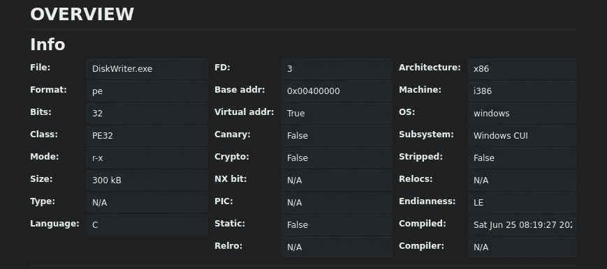

刀具:一般信息

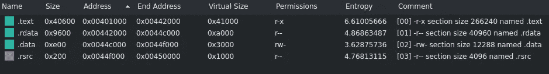

刀具:截面

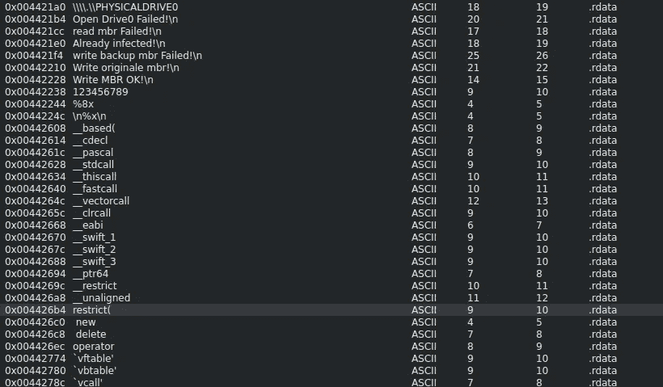

切割器:重要的琴弦

从示例的字符串中，我们可以看到一些有趣的东西，它们是“\\\”。\\PHYSICALDRIVE0 "和" MBR "。第一个用于通过“create file”API 函数获得硬盘的句柄，第二个是“主引导记录”的缩写，它位于硬盘的第一个扇区，负责指向操作系统的代码所在的位置，并具有关于硬盘中分区的信息，从这几行中，我们还可以预期该示例将获得硬盘的句柄，读取“MBR”并写入“MBR”记录，因此我们正在使用驱动器写入程序。

## 在反汇编程序中:

反汇编程序把我们放在了样本的入口点，但它不是恶意软件功能开始的地方，所以首先要寻找的是 main 函数。当分析 C/C++软件/恶意软件时，您从初始化开始的入口点开始，大多数时候我们并不关心那里发生了什么，而是立即寻找主函数，大多数时候您会发现一个函数在调用它之前有 3 次推送，它们代表“argc”、“argv”和“envp”，这意味着环境变量:

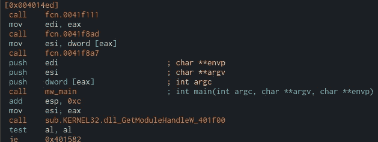

刀具:主要功能

在 main 函数中，我们发现只有一个函数调用:

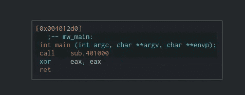

刀具:调用磁盘写函数

在调用该函数后，我们看到它首先调用的是带参数的“CreateFileA”函数:

*   lpFileName: PHYSICALDRIVE0。
*   dwDesiredAccess: (0xc)。
*   dwShareMode:(文件共享读取 **|** 文件共享写入**)。**
*   lpSecurityAttributes: (NULL)。
*   dwcreationdeposition:(OPEN _ EXISTING)。
*   dwFlagsAndAttributes: (NULL)。
*   hTemplateFile: (NULL)。

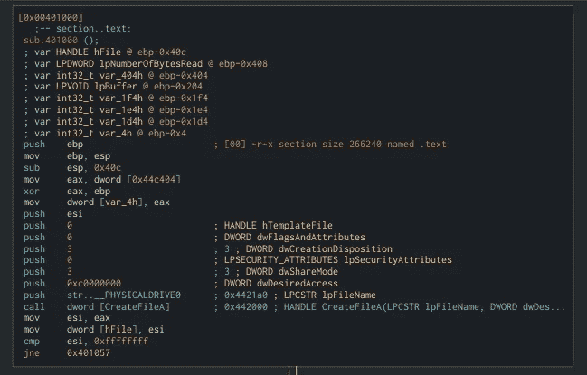

Cutter:获取磁盘的句柄

如果函数失败，它会将一个字符串推送到一个函数，并打印出来，得到最后一个错误并退出。但是如果该函数成功，它将继续执行下一个函数“SetFilePointer”:

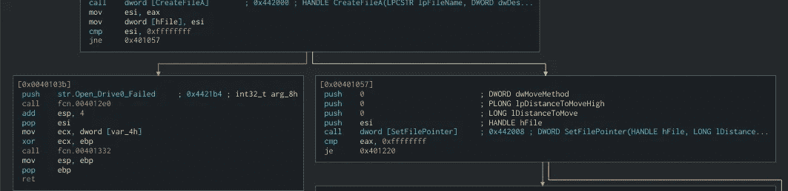

刀具:设置文件指针

SetFilePointer 函数所做的是移动指定文件的文件指针，这里它取一个硬盘的句柄，其余参数为(0)。如果函数成功，它调用 ReadFile 函数:

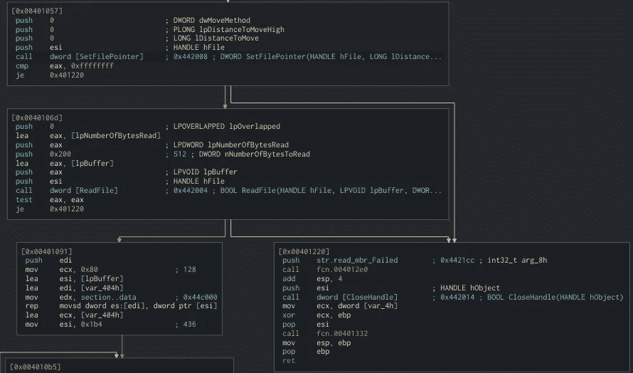

Cutter:读“MBR”

如上面截图所示,“ReadFile”函数采用十六进制的“nNumberOfBytesToRead”参数 0x200，这表示“MBR”的大小为 512 字节。如果其中一个函数失败，它将推送字符串“read_mbr_Failed”并关闭句柄并退出，否则它将把 128 个“dword”字节(这意味着 512 个字节)从接收从“mbr”读取的数据的缓冲区移动到新的缓冲区，以将其与来自“MBR”的字节进行比较。数据”部分，如果它们相等，它将把字符串“already_infected”推入打印，如果在任何点上比较不相等，它将继续并准备写入“MBR”:

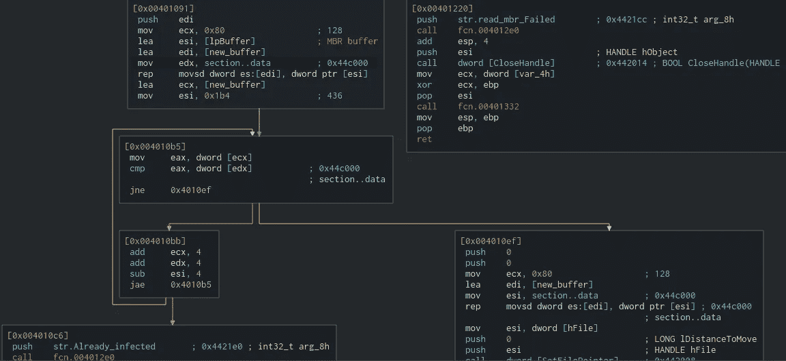

Cutter:比较原始“MBR”和恶意软件“MBR”

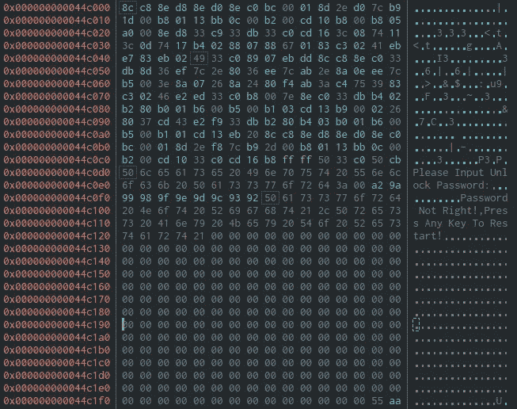

切割器:恶意软件“MBR”

从上面的屏幕截图中，我们可以看到 hexdump 与驱动器的“MBR”进行了比较，正如我提到的，如果它不相等，它将开始将其写入“MBR”，我还想在这里提到一个数字取证说明，这是上面屏幕截图中的最后两个字节(55，aa)，它们代表扇区的结束签名。

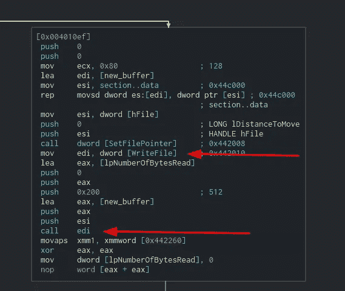

Cutter:编写“MBR”

之后，它开始在一个循环中将原始“MBR”与“0x442260”地址中的一个值进行简单的异或运算，直到它小于 200 个十六进制数(512 个字节):

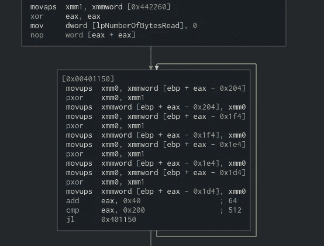

切割器:Xoring 循环

然后，它将文件指针移动到第三个扇区的开头，并写入原始“MBR”。如果失败，它将推送字符串“write_backup_mbr_failed”进行打印，然后调用“CloseHandle”并退出，否则，它将推送字符串“Write_original_mbr”进行打印，然后调用“CloseHanle ”,然后推送字符串“Write_mbr_OK”进行打印。

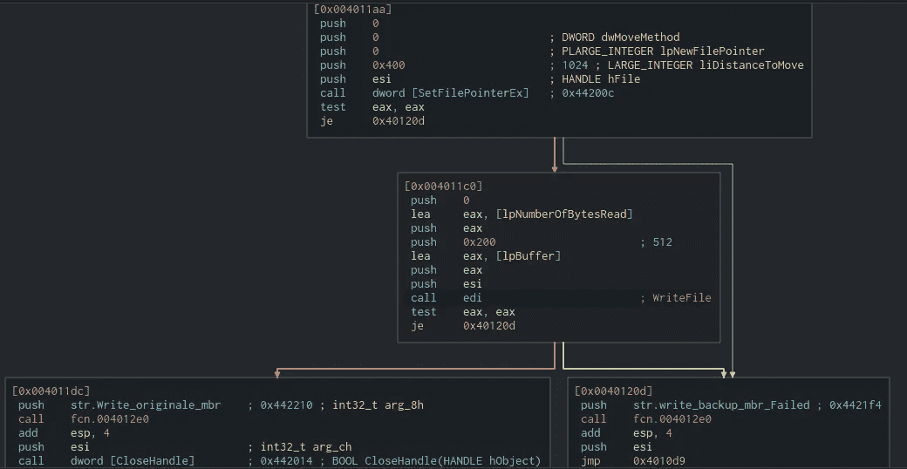

Cutter:写原“MBR”

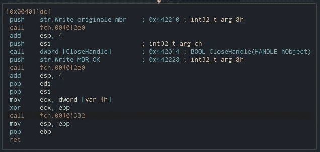

切割器:关闭手柄并退出

## 在调试器中:

我们可以在获得物理驱动器的句柄并设置指向驱动器开头的指针后看到恶意软件，它读取它的第一个扇区，如下面的屏幕截图所示，左边来自 WinHex，右边来自 x64dbg:

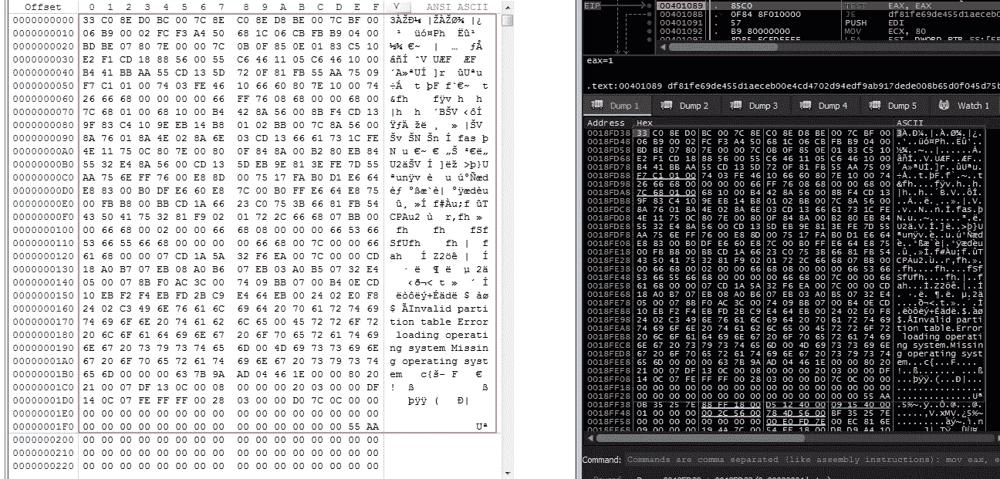

WinHex 和 x64dbg 比较

然后，它用来自“的新数据写入第一个扇区。数据”部分，因为它出现在 WinHex 的下一个屏幕截图中:

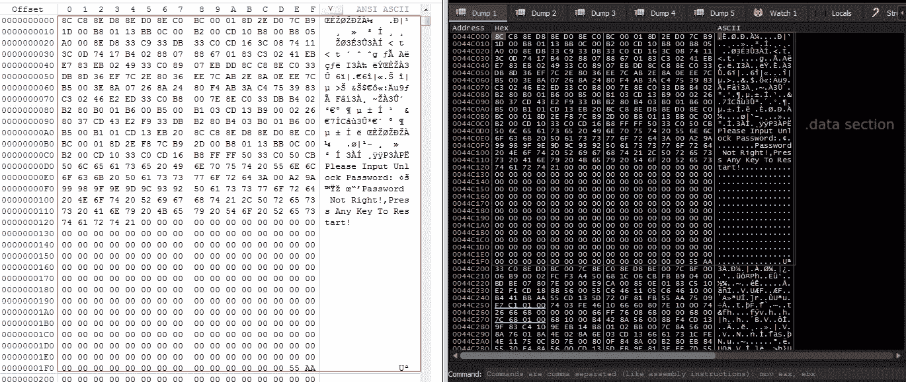

WinHex 和 x64dbg 比较

之后，它开始通过将原始“MBR”与“cdcdcdcdcdcdcdcdcdcdcdcdcdcdcdcdcdcdcdcdcdcdcdcd”进行异或运算来混淆原始“MBR ”,然后将其写入第三个扇区，并打印出成功的消息:

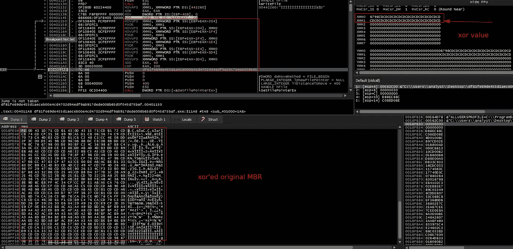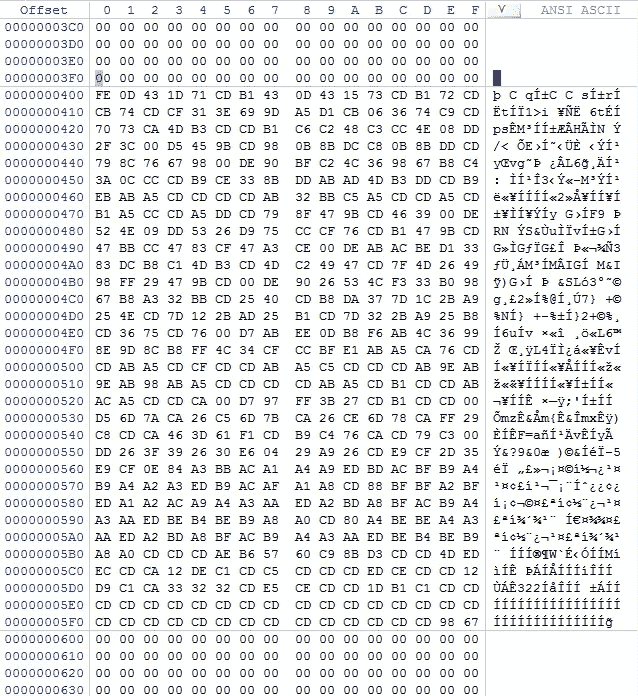

WinHex:异或原始“MBR”

重启机器时，我们会看到一个黑屏和红色文本，要求我们输入密码以解锁机器，输入任何密码时，我们都会收到一条消息，提示密码不正确:

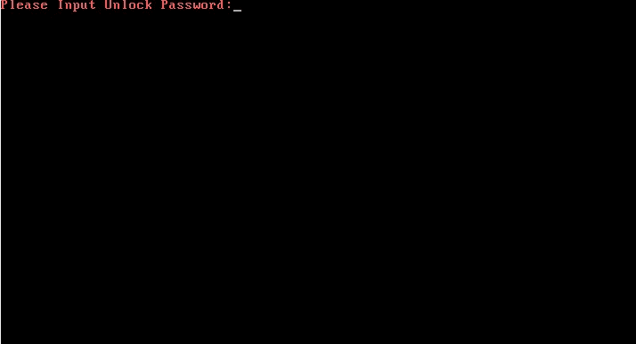

引导后

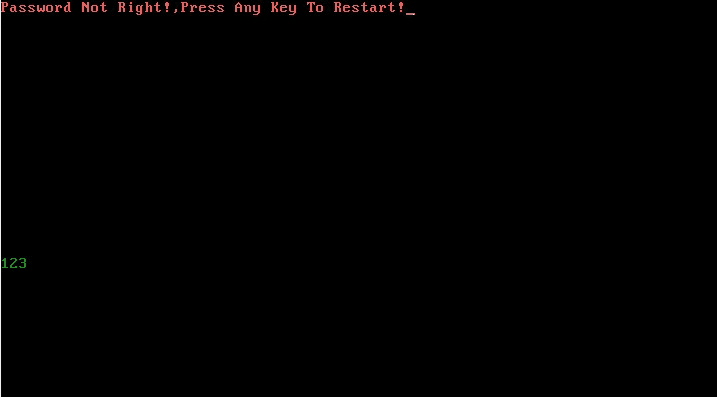

引导后

解决这个问题很简单，将模糊的“MBR”与值“cdcdcdcdcdcdcdcdcdcdcdcdcdcdcdcdcdcdcdcdcdcdcd”进行异或运算，删除恶意软件 MBR，写回模糊的“MBR ”,一切都应该正常工作。

**防逆转技术:**

没有人

## 链接:

 [## 39，536 个免费的代码图标

### 很抱歉您取消了 Premium 订阅，但您仍可以享受 Flaticon 收藏，但有以下限制…

www.flaticon.com](https://www.flaticon.com/free-icons/code) 

## 来自 Infosec 的报道:Infosec 每天都有很多内容，很难跟上。[加入我们的每周简讯](https://weekly.infosecwriteups.com/)以 5 篇文章、4 个线程、3 个视频、2 个 Github Repos 和工具以及 1 个工作提醒的形式免费获取所有最新的 Infosec 趋势！