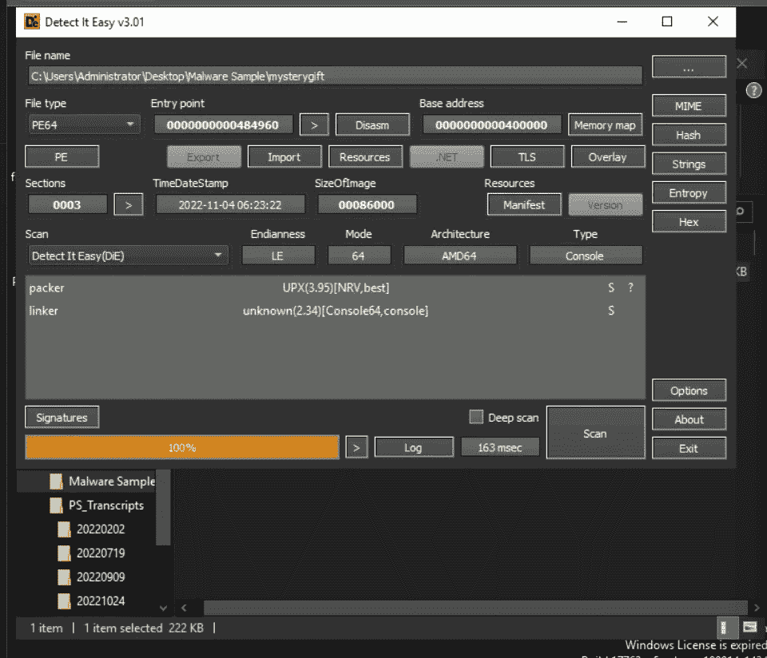
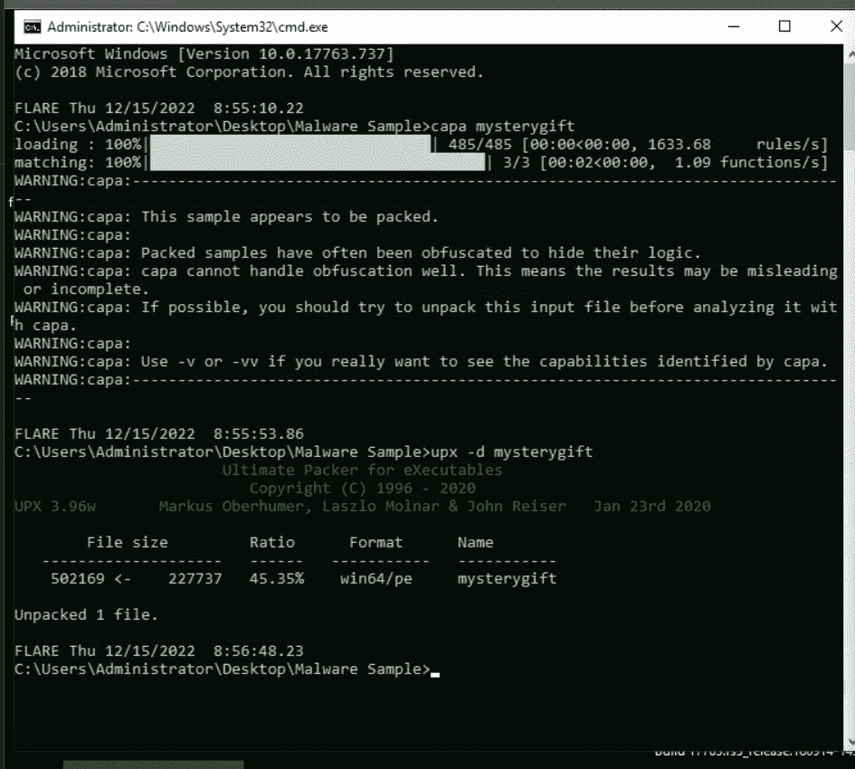
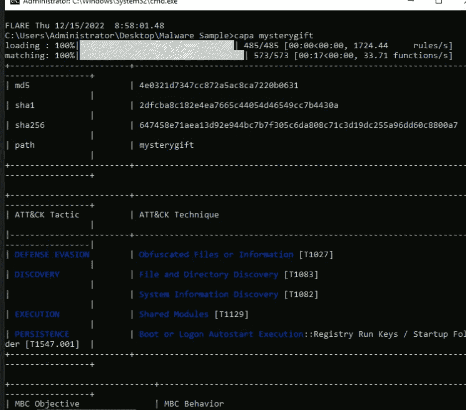
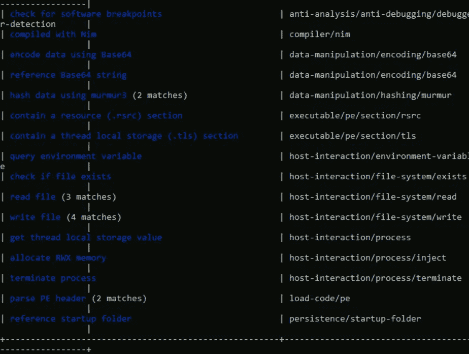
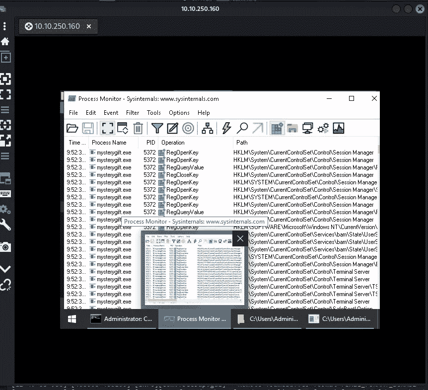
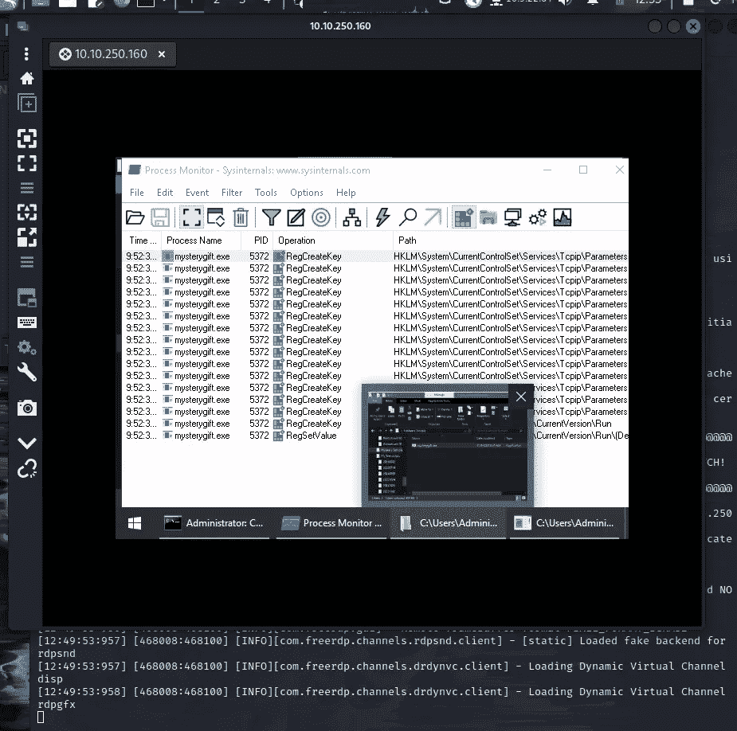
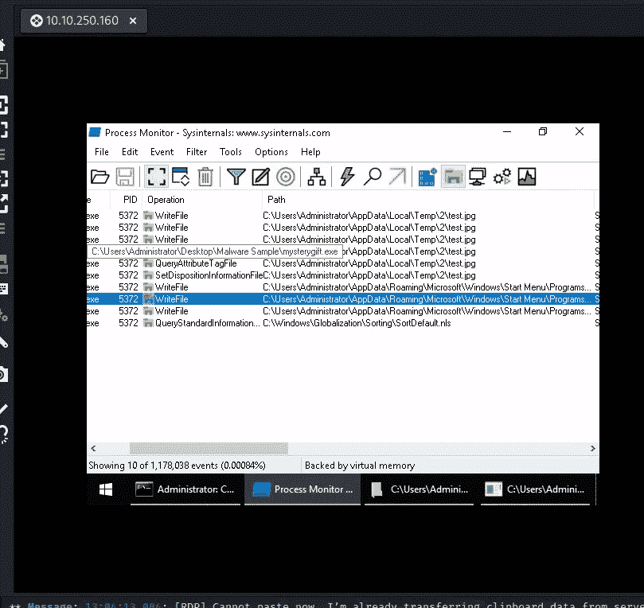
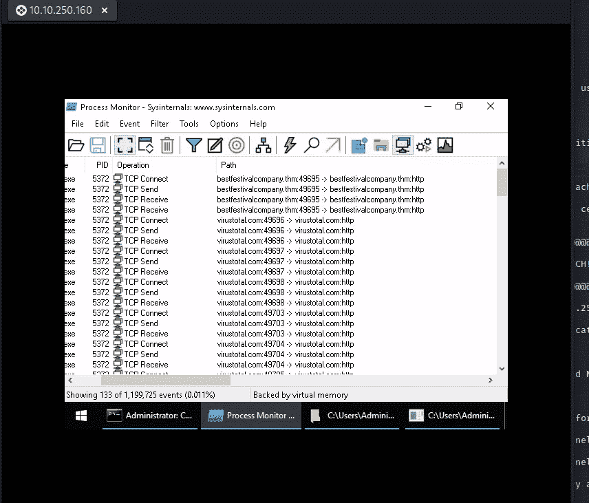
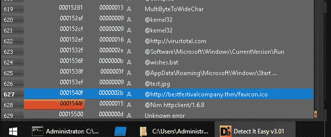

# 恶意软件分析

> 原文：<https://infosecwriteups.com/malware-analysis-fe47d6a5f3f?source=collection_archive---------2----------------------->

## 法医麦克布鲁请到 REVscue！THM — aoc 2022 第 12 天

恶意软件:用来危害计算机或整个网络的软件。

目标:渗透网络、破坏敏感数据、破坏运营服务等。

检查:网络连接(外部和内部横向移动，本质上是一种用于扩展对其他主机或应用程序的访问的技术)、注册表项修改(例如注册表运行项)、文件操作。

## 静态和动态分析

静态分析->不执行恶意代码。侧重于分析二进制文件及其可读信息、属性、程序流和字符串。

动态分析->在安全环境(如沙箱)中执行恶意软件。

我们将使用工具:**检测它容易和 CAPA。**

打开带有 detect it 的恶意软件样本，易于查看架构、打包程序(压缩、混淆、加密二进制文件)



打开 CAPA:检测可执行文件中的功能。打开包装使用:



```
upx -d mysterygift 
```

现在运行(删除缓存的 viv 文件后) :

```
capa mysterygift
```



恶意软件滥用的注册表项是什么？

这需要动态分析:

分析的行为。exe : **ProcMon(进程监视器)**工具:显示实时注册表、文件系统、进程/线程活动。'

启动 ProcMon，将 filter 设置为“进程名为 mysterygift.exe”。



你可以在这里看到很多



排除任务中的给定条目以获得更少的操作

您可能会注意到只有一个注册表项同时具有 **RegCreateKey** 和 **RegSetValue** 。该密钥与名为**注册表运行密钥修改**的持久性技术相关，通常被恶意软件开发者用来安装后门。

恶意软件滥用的注册表项是什么？以及
根据上一个问题写在注册表项上的值是什么？

Ans->右键单击操作并检查属性以查找路径。

文件修改:

再次排除和检查



两个文件:test.jpg 和 wishes.bat

网络连接:



恶意软件向这些域发起请求



这个任务到此为止，今天的图片够多了。一会儿见。在那之前继续黑！

## 来自 Infosec 的报道:Infosec 每天都有很多内容，很难跟上。[加入我们的每周简讯](https://weekly.infosecwriteups.com/)以 5 篇文章、4 个线程、3 个视频、2 个 GitHub Repos 和工具以及 1 个工作提醒的形式免费获取所有最新的 Infosec 趋势！