# 恶意软件分析[#2] — FFDroider

> 原文：<https://infosecwriteups.com/malware-analysis-ffdroider-21a3fc0fe40f?source=collection_archive---------2----------------------->

这是针对 FFDroider stealer 恶意软件的恶意软件分析报告，这是一种新的恶意软件，于 2022 年 4 月首次发现。

我们今天的例子:MD5(B1 d 856 a Fe 8 ffd 2649843d 64 affe 9d 4 c 3)

## 静态分析:

在 PEStudio 中查看我们的示例，我们可以看到它是一个 32 位示例，具有高熵和最近编译的日期，并且该文件是在调试模式下编译的，它的原始名称也是“FbRobot.exe ”,并且有许多 URL 模式和大量资源列表:

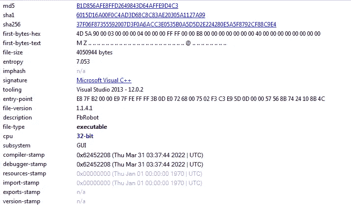

PEStudio:一般信息

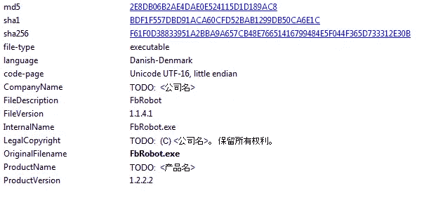

PEStudio:一般信息

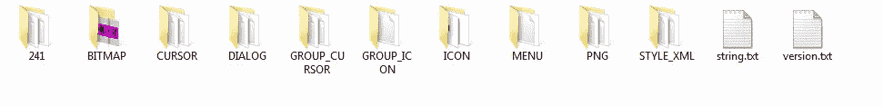

资源文件

它有很多资源，但除了用中文写的“string.txt”文件外，没有什么值得一提的，所以我翻译了它，下面的图是文件的一些部分及其翻译:

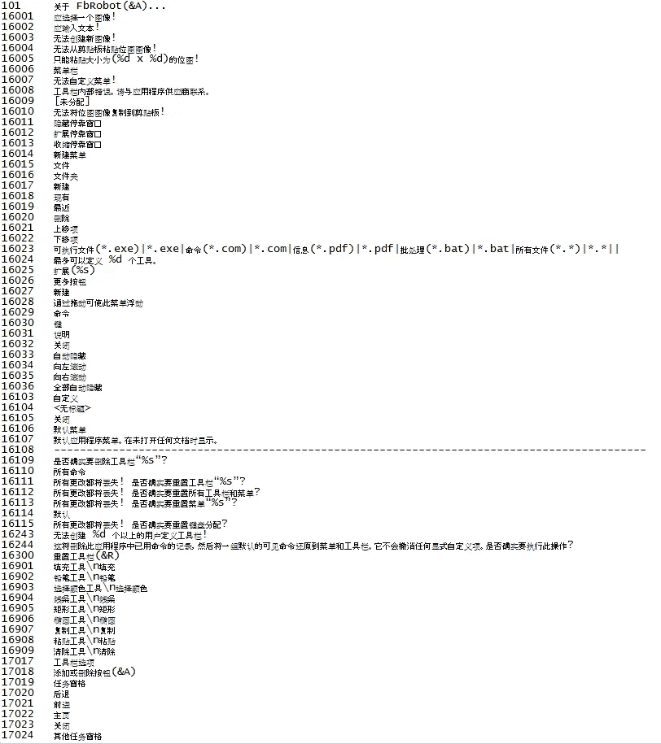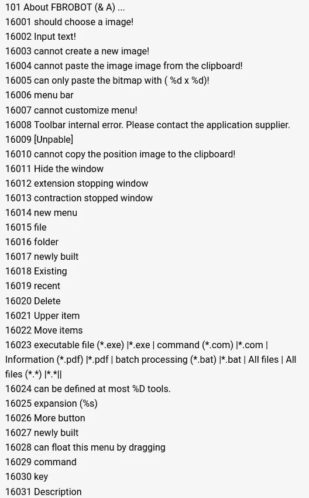

查看导入的功能，我们有许多网络连接功能:

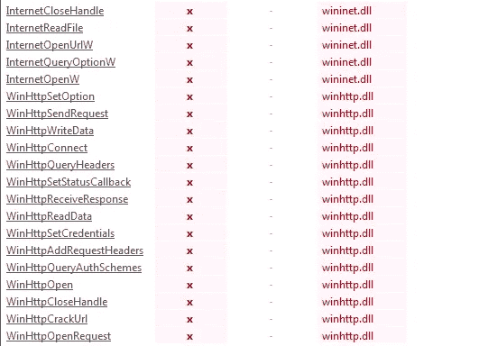

从“检测它容易”看起来像是。正文”部分已打包:

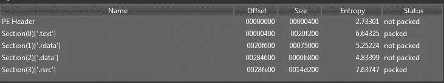

## 动态分析:

运行示例时，它创建一个名为“VcpVideoV1.0.1”的目录，并在其中创建自己的副本

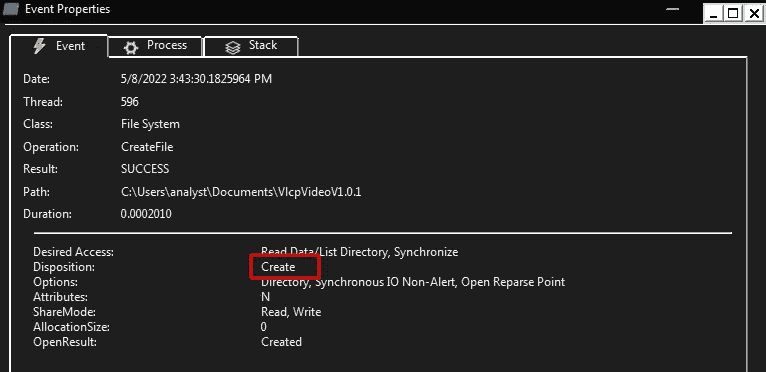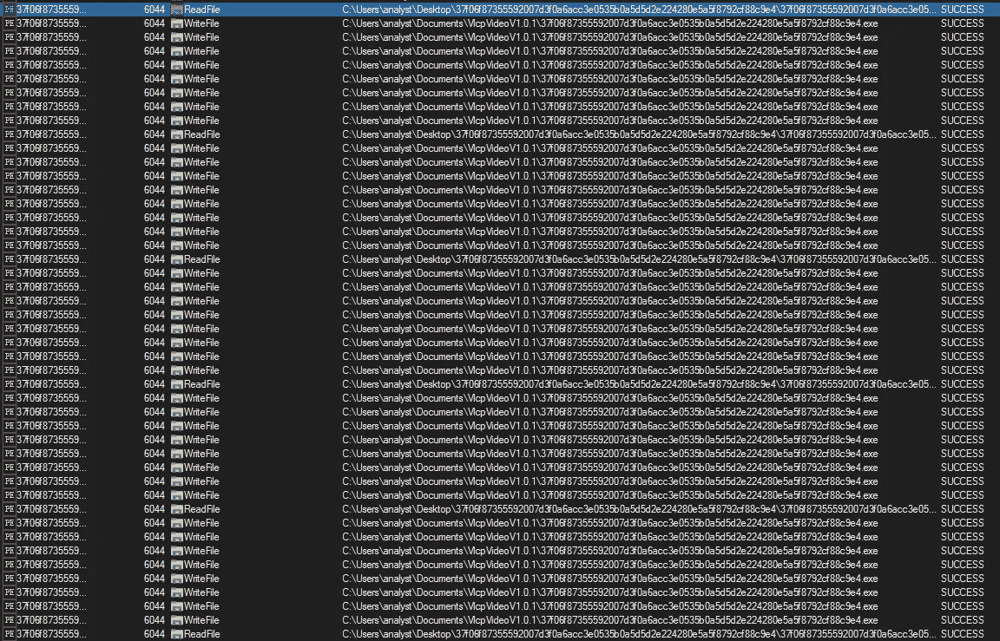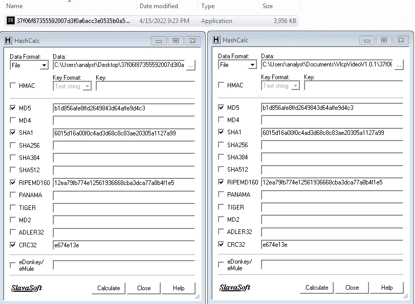

接下来，我们可以看到它在“HKCU \软件”下创建了一个名为“ffdroider\FFDROIDER”的注册表项:

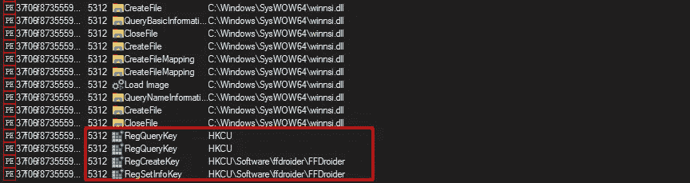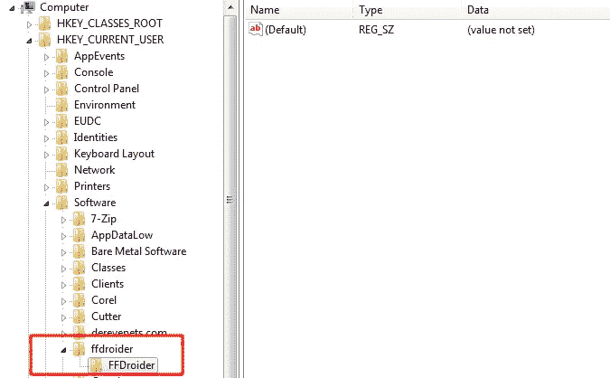

它还在执行示例的同一个目录中创建一个名为“d”的 SQLite 数据库文件，然后开始从 Chrome 目录中读取 cookies 并写入“d”文件，然后开始查询:

*   WebCache。
*   用户固定的应用程序。
*   开始菜单。
*   图书馆。
*   链接。
*   临时目录。
*   Internet 临时文件。

列表继续下去，我发现“d”文件是“Cookies”文件的副本:

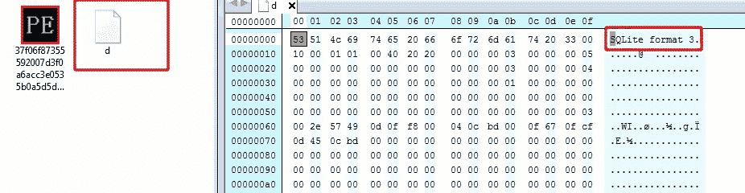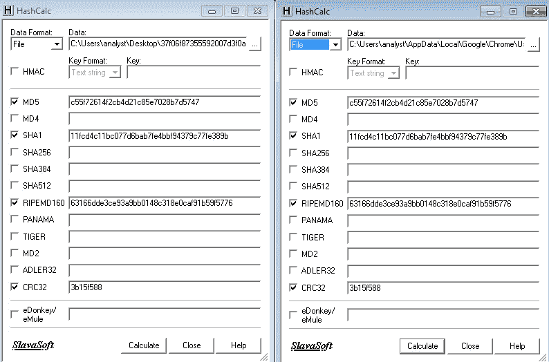

图:“d”文件和“Cookies”文件的比较

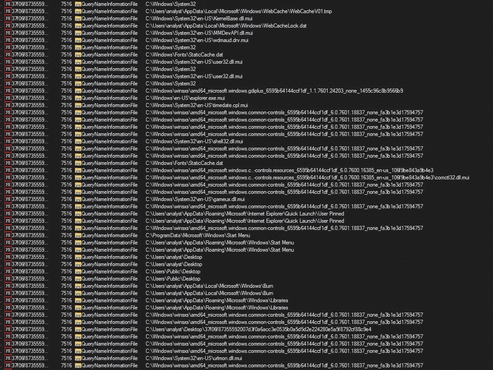

用“sqlite browser”检查“d”文件，我发现了两个表，一个用于“Cookies ”,另一个用于“meta ”:

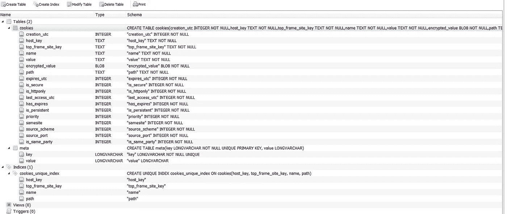

恶意软件开始一个循环:

*   从“Cookie”文件读取并写入“d”文件。
*   查询文件和目录。
*   使用参数“-PID:123”启动新的“iElowutil.exe”进程以完成其工作，然后退出。

“iElowutil.exe”是一个代理进程，它处理需要在低完整性级别进行处理的操作。发生这种情况是因为 Internet Explorer 和一套其他本机 Windows 应用程序需要检查提要和网页快讯以获取更新，这是由 ielowutil.exe 处理的，

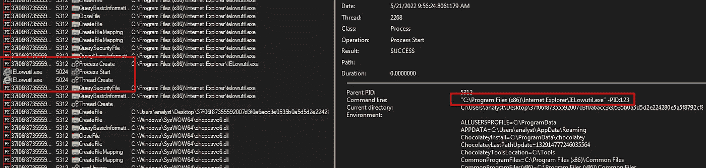

该示例使用文件名创建了到 C2 服务器的 2 个 internet 连接:

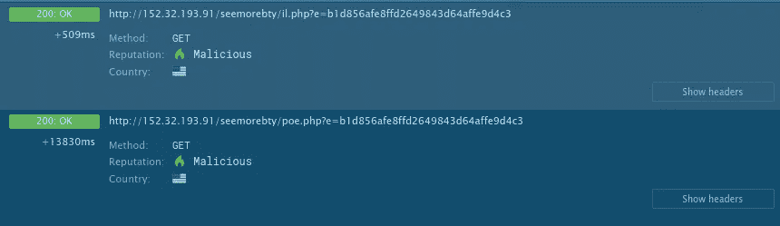

## **倒车:**

开始时，恶意软件通过对象名为“37238328–1324242–5456786–8 fdff 0–67547552436675”的“CreateMutex”函数启动，如果该函数没有失败，它将使用“GetLastError”并将结果与“183(0xb 7)= Error _ already _ Exists**进行比较，根据微软文档参见链接:**

** [## 系统错误代码(0-499) (WinError.h) - Win32 应用程序

### 描述 WinError.h 头文件中定义的错误代码 0-499，供开发人员使用。

docs.microsoft.com](https://docs.microsoft.com/en-us/windows/win32/debug/system-error-codes--0-499-) 

如果它不存在，它将继续执行，但如果函数失败或错误消息为“Error_already_Exists ”,它将继续执行带有“<<< Exit with same app>> >”字符串的“OutputDebugStringA”函数。

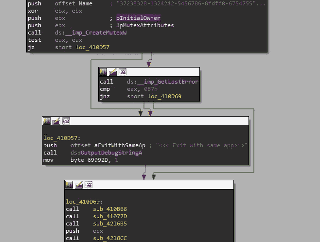

之后，它通过调用“SHGetSpecialFolderPathW”函数在 Documents 文件夹中创建一个名为“VlcpVideosV1.0.1”的目录，该函数将检索一个特殊文件夹的路径，该路径由其 [CSIDL](https://docs.microsoft.com/en-us/windows/win32/shell/csidl) 标识。使用的参数是“CSIDL _ 我的文档”来获取文档文件夹的路径，然后它将“//VlcpVideosV1.0.1”附加到路径中，并调用“PathFileExistW”来确定文件夹的路径是否有效，如果无效，它将使用“CreateDirectoryW”函数创建目录，然后使用“CopyFileW”将自身复制到新创建的目录中:

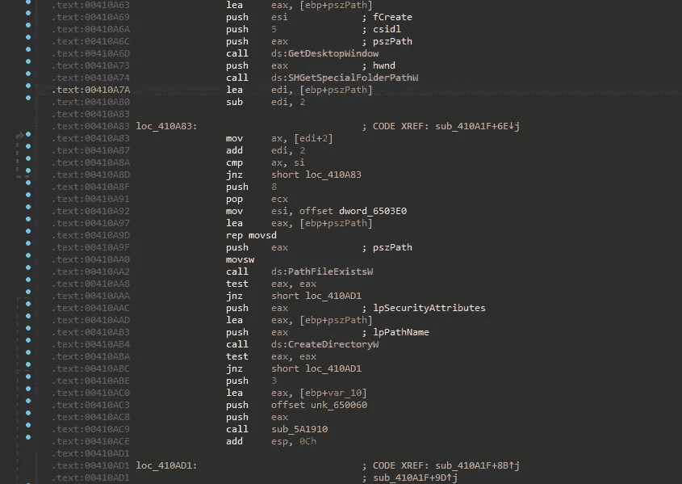

接下来，恶意软件开始动态加载一些库并导入一个加密函数，解密函数实际上很简单，它从第一个字母与数字“5”进行异或运算开始，这个数字在每次循环后增加“1”，这意味着字符串[0]与“5”进行异或运算，字符串[1]与“6”进行异或运算，并一直进行到字符串的末尾。解密的字符串是:

*   加载库 a。
*   Wininet.dll。
*   InternetGetCookieExW。
*   Ieframe.dll。
*   IEGetProtectedModeCookie。
*   netapi32.dll。
*   NetWkstaGetInfo。
*   NetApiBufferFree。
*   advapi32.dll。
*   RegCreateKeyW。
*   iphlpapi.dll
*   GetAdaptersInfo。

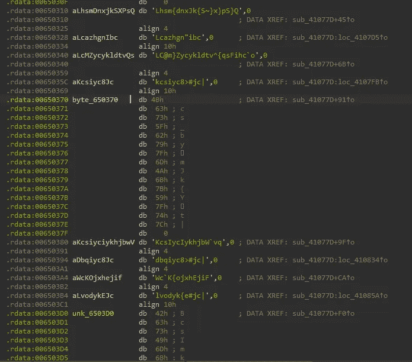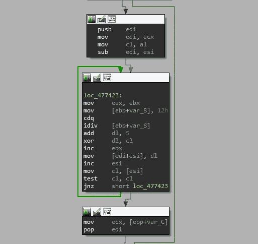

之后，恶意软件开始准备通过建立 HTTP 请求连接到"152.32.193.91/seemorebty/il.php C2 服务器？e= <filename>":</filename>

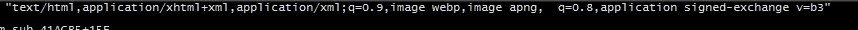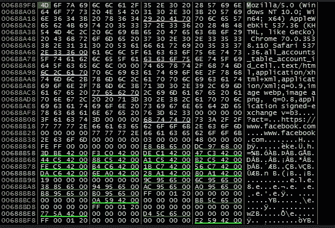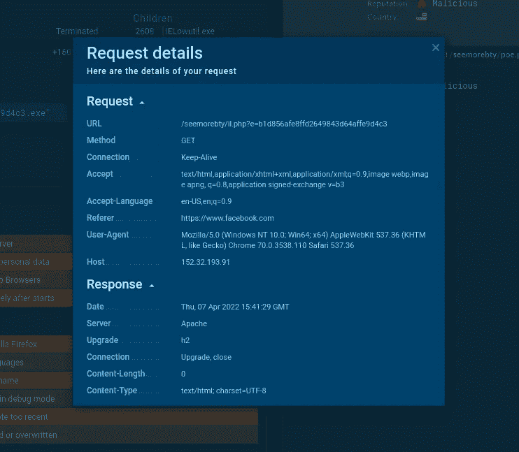

之后，恶意软件开始使用前面提到的相同解密函数解密 Chrome 目录的路径，并打开 Cookies 文件:

然后，恶意软件尝试检查名为“d”的 SQLite 文件是否存在，如果不存在，它将创建它，之后，它尝试打开另外两个名为“d-journal”“d-wal”的文件，但即使无法找到它们，也没有创建它们，然后读取、查询和写入的过程开始循环:

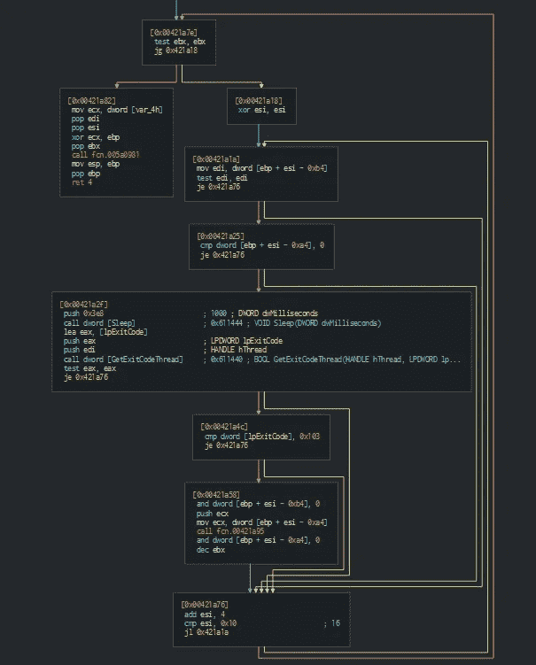

接下来，它开始设置顶级域名，将其添加为“amazon”域名，然后添加“https://www。”到域:

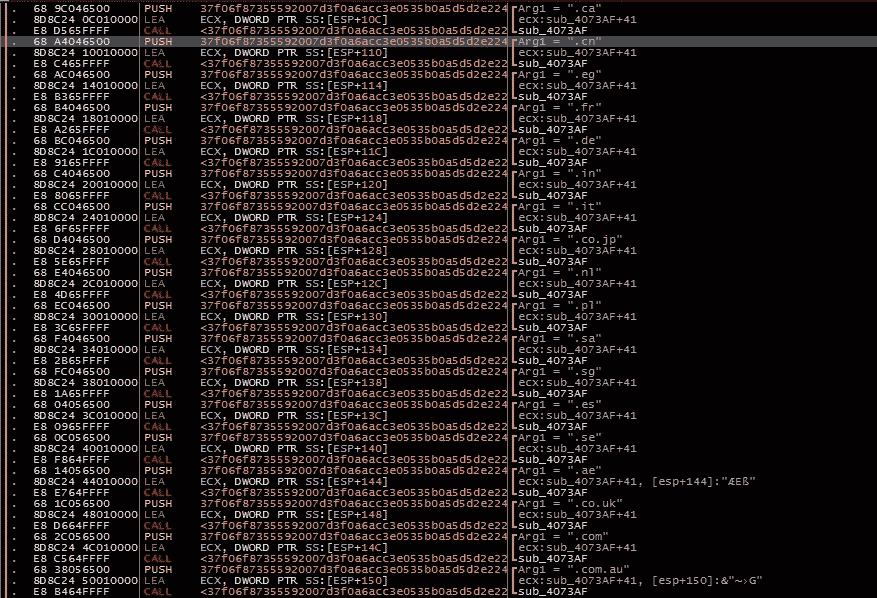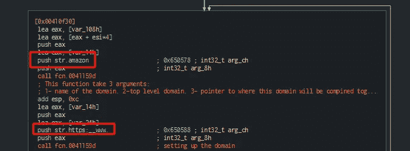

之后，它将开始建立一个新的 HTTP get 请求，然后尝试打开名为“install.exe”的文件，这可能是从 C2 安装的第二阶段。我试图模仿恶意软件的请求来安装第二阶段，但没有从 C2 服务器获得任何响应(最新的样本 IP 地址):

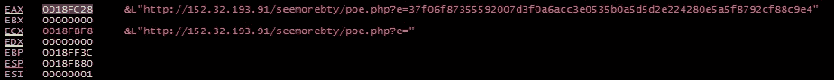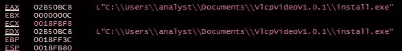

它还尝试使用“ShellExecuteExW”执行名为“tmp.exe”的文件，然后删除名为“install.exe”的文件:

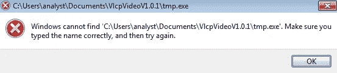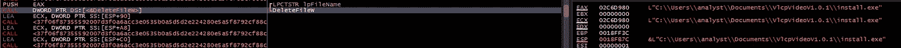

## C2 基础设施:

该示例的 C2 服务器 IP 已关闭，因此我查找了向“MalwareBazaar”报告的最新示例，并获得了 C2 服务器的 IP 地址，然后我去检查了基础架构，以下是我的发现:

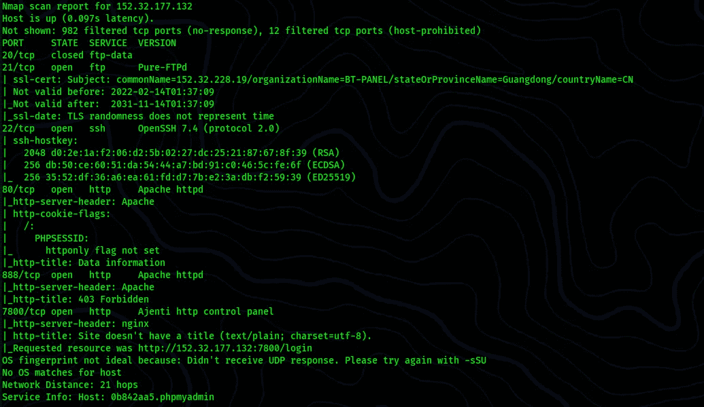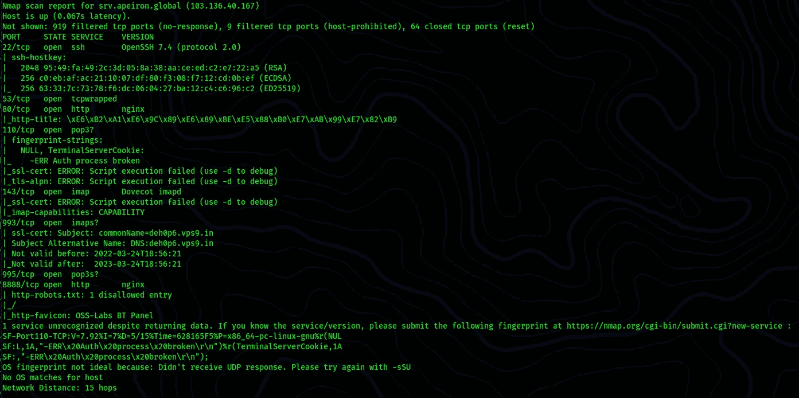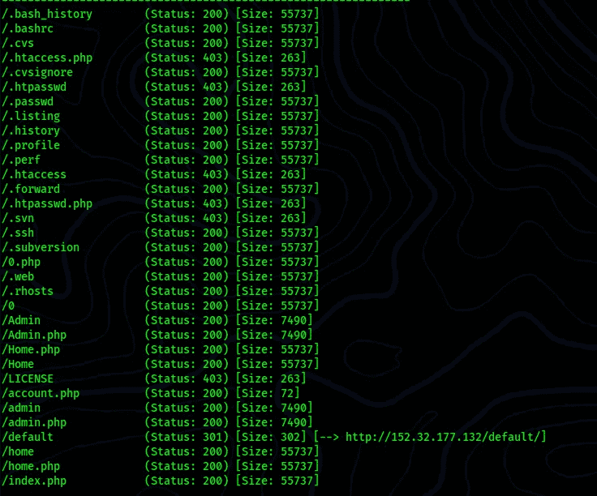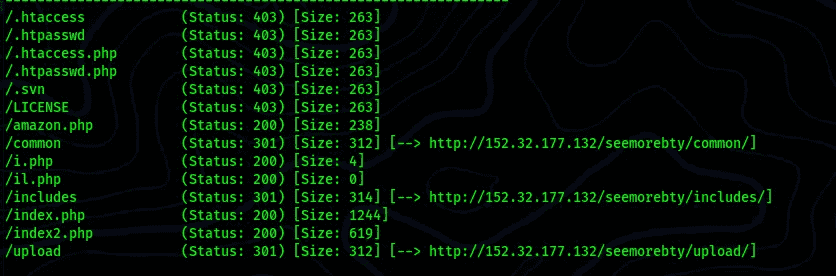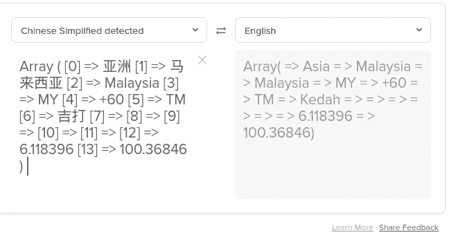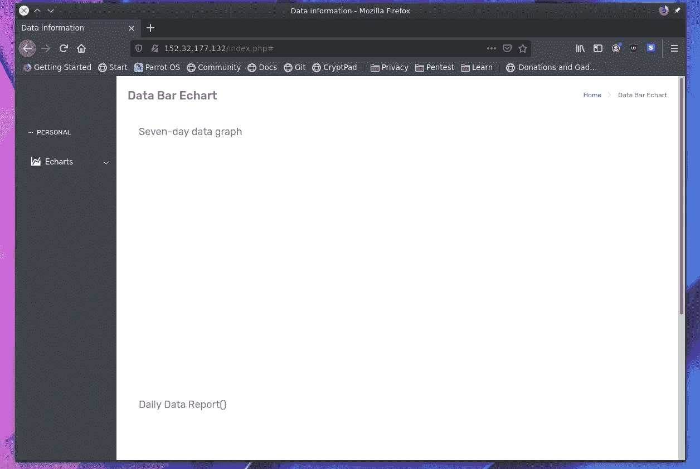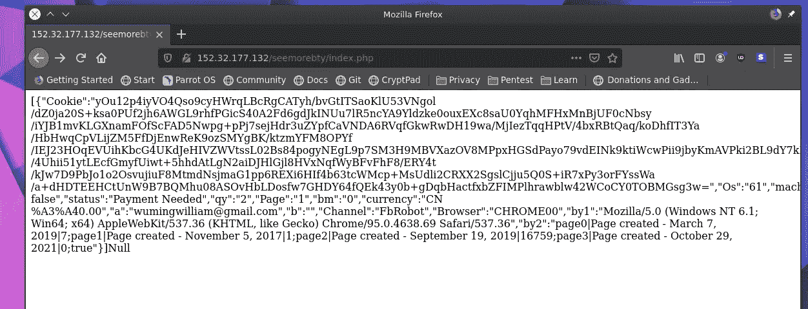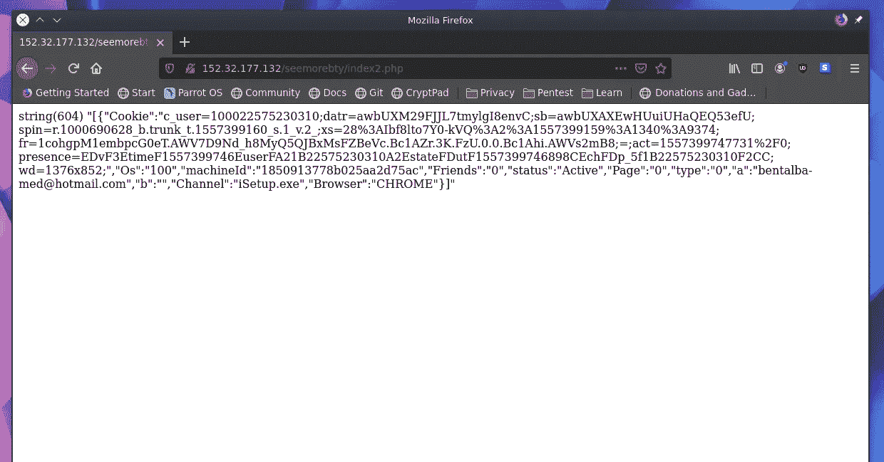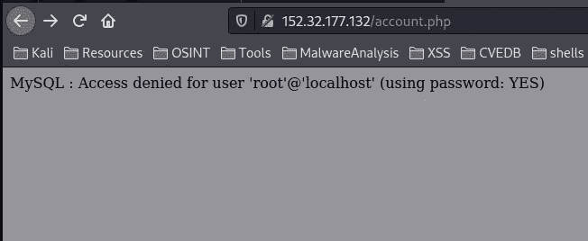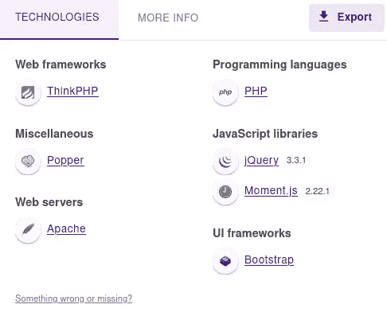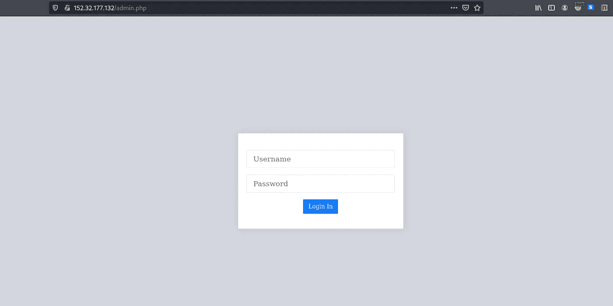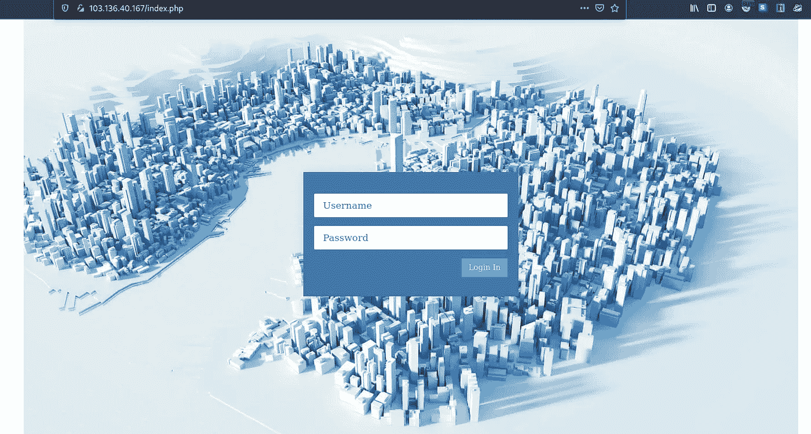

## 妥协的标志:

**网络指标:**

*   https://152.32.193.91/seemorebty/

**主机指示灯:**

*   FFdroider
*   vlcpvideo 1 . 0 . 1
*   FB 机器人

## 雅拉规则和签名:

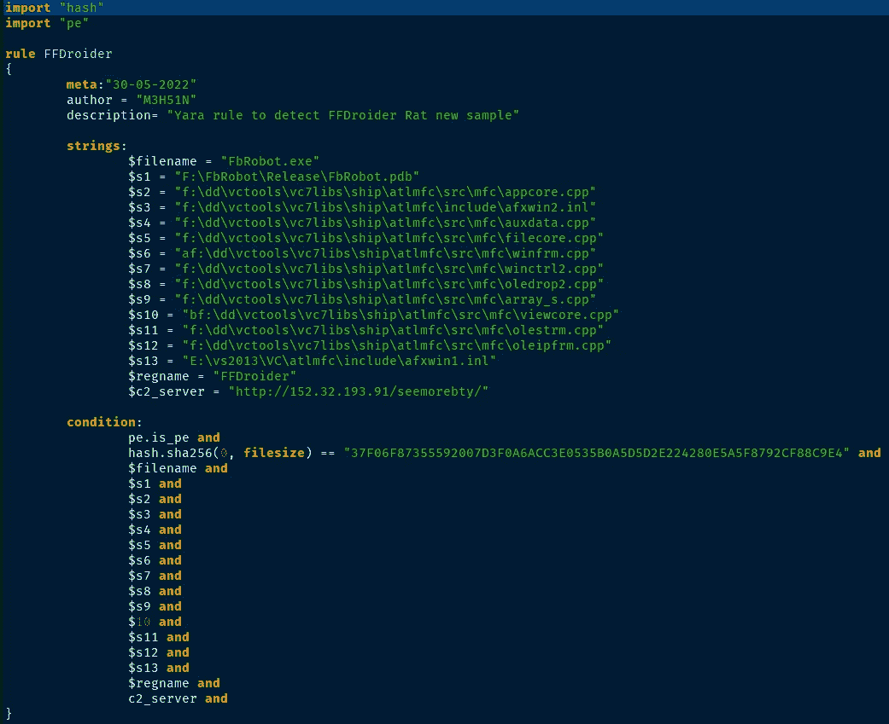

## 防逆转技术:

*   IsDebuggerPresent。
*   OutputDebugString。
*   加密一些输入和字符串。

## 链接:

 [## 2047 个免费的欺诈图标

### 很抱歉您取消了 Premium 订阅，但您仍可以享受 Flaticon 收藏，但有以下限制…

www.flaticon.com](https://www.flaticon.com/free-icons/fraud) 

## 来自 Infosec 的报道:Infosec 每天都有很多内容，很难跟上。[加入我们的每周简讯](https://weekly.infosecwriteups.com/)以 5 篇文章、4 条线索、3 个视频、2 个 Github Repos 和工具以及 1 个工作提醒的形式免费获取所有最新的 Infosec 趋势！**