# 恶意软件分析[#1]-纳米核心鼠

> 原文：<https://infosecwriteups.com/malware-analysis-nanocore-rat-6cae8c6df918?source=collection_archive---------0----------------------->

在恶意软件分析的这一系列文章中，我将从恶意软件市场[https://bazaar.abuse.ch/](https://bazaar.abuse.ch/)随机选取一个样本，我将在不知道它是什么的情况下分析它，(黑盒)方法。

让我们开始吧…

我们今天的例子:MD5(5846 c 3588 FBC F6 a 5078 b7a 2413 da 0345)。

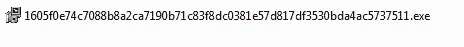

## 恶意软件构成:

该示例由以下组件组成:

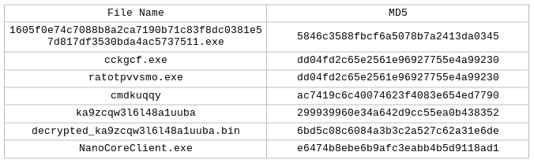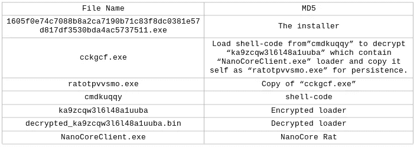

## 1605 f 0 e 74 c 7088 b 8 a2 ca 7190 b 71 c 83 F8 DC 0381 e 57d 817 df 3530 BDA 4 AC 5737511 . exe 的静态分析:

将样本上传到 PEStudio，我们看到它是 32 位高熵可执行文件，并使用 NSIS(Nullsoft Scriptable Install System)——这是一个创建 windows 安装程序的专业开源系统——来删除/重写新文件/可执行文件，它还有一个很旧的编译日期，可能是假的，我面对的是 ghost 恶意软件的样本，而不是以前使用相同的技术来安装恶意软件组件:

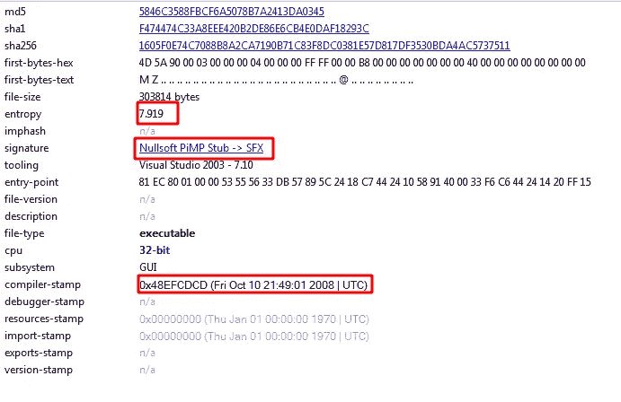

PEStudio

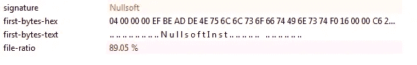

PEStudio:覆盖

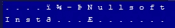

PEbear:覆盖 Nullsoft 标头

解压缩 NSIS 包时，我们得到 4 个文件，一个是可执行文件，两个可能是外壳代码或加密文件，最后是 NSIS 脚本:

## 1605 f 0 e 74 c 7088 b 8 a2 ca 7190 b 71 c 83 f 8 DC 0381 e 57d 817 df 3530 BDA 4 AC 5737511 . exe 的动态分析:

运行此示例时，我们发现它会在%TEMP%文件夹中创建三个文件，然后写入每个文件，还会在%TEMP%文件夹中创建一个文件夹，每次都使用随机名称，并保持其为空:

*   ccgkcf.exe。
*   ka9zcqw3l6l48a1uuba。
*   cmdkuqqy。
*   ns*****。tmp。(最后五个字母在每次执行时都会改变)

Procmon:创建 **ka9zcqw3l6l48a1uuba** 并写入其中。

Procmon:创建 **cmdkuqqy** 并写入其中。

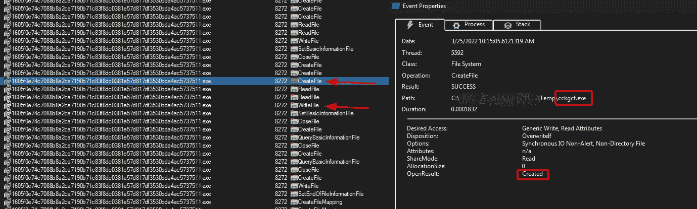

Procmon:创建**ccgkcf.exe**并写入其中。

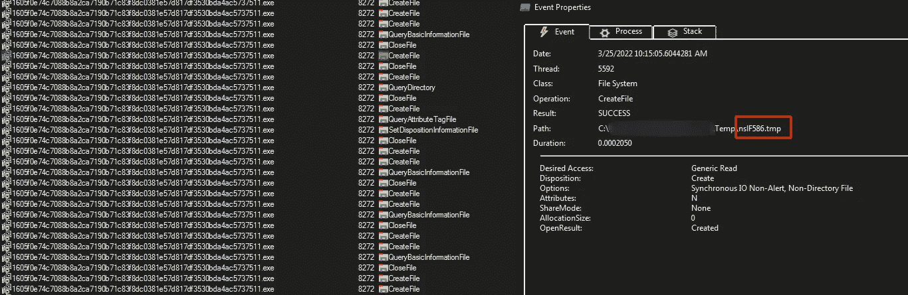

Procmon:正在创建 ns*****。tmp。

在调试器下，我们可以看到它正在创建一个新进程，使用命令行启动 **"ccgkcf.exe"** ，使用文件" **cmdkuqqy"** 作为参数，然后退出该进程:

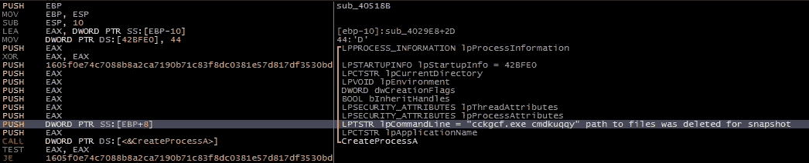

x64dbg:创建流程

## ccgkcf.exe 的静态分析:

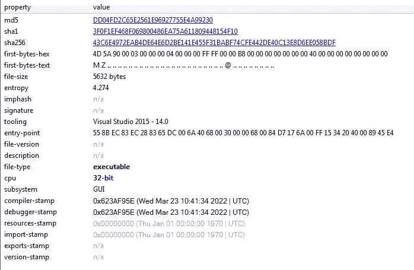

PEStudio:一般信息

它是一个 32 位可执行文件，具有新的编译和调试日期，将其上传到 **IDA** 我们看到它正在获取命令行参数，并尝试使用“CreateFileW”打开一个文件，如果该函数失败，它将退出，如果成功，它将获取文件大小，为该文件分配内存并读取它，然后继续解密从该文件读取的数据，然后跳转到该文件，这意味着它是一个外壳代码:

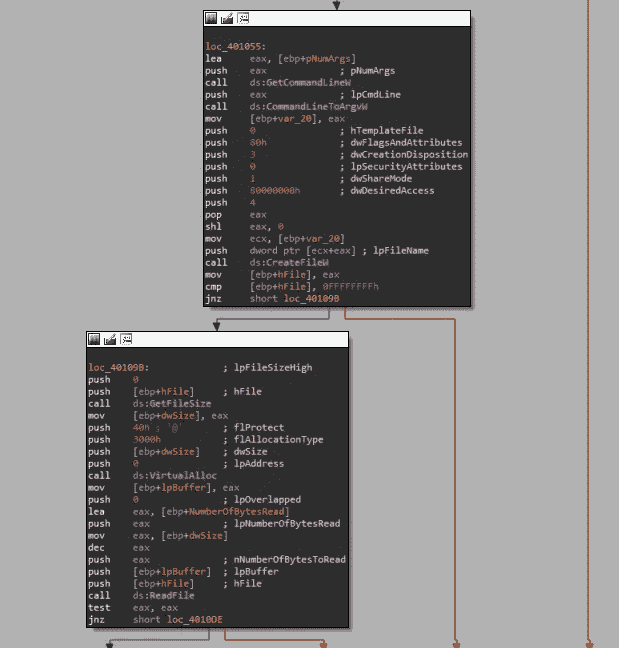

IDA:ccgkcf.exe

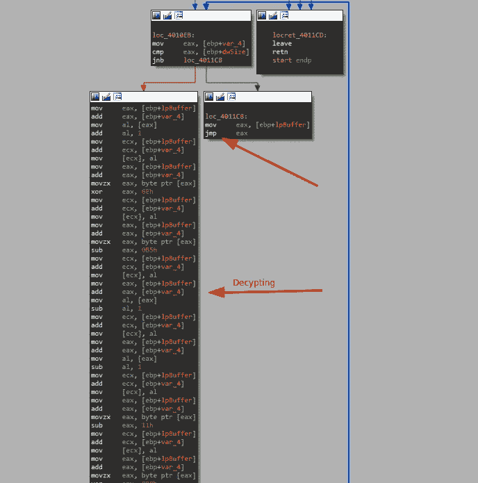

伊达:解密函数

## ccgkcf.exe 的动态分析:

如前所述，在没有任何参数的情况下运行该实例时，进程将退出，并且不会采取任何操作，但是当添加" **cmdkuqqy"** 作为参数时，正如我们看到的安装程序在创建新进程时所做的那样，该示例通过打开" **cmdkuqqy** "文件来继续其工作，获取其大小，读取并解密它，最后将执行处理为外壳代码:

x64dbg:找不到错误路径

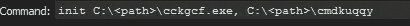

x64dbg:添加参数的命令

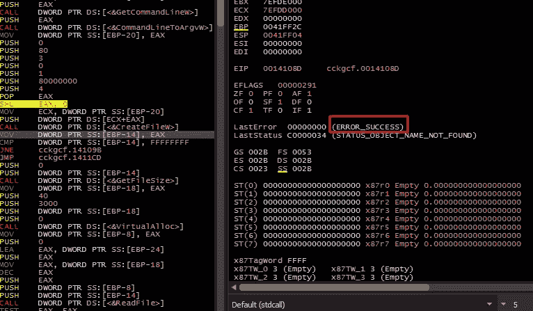

x64dbg:功能成功

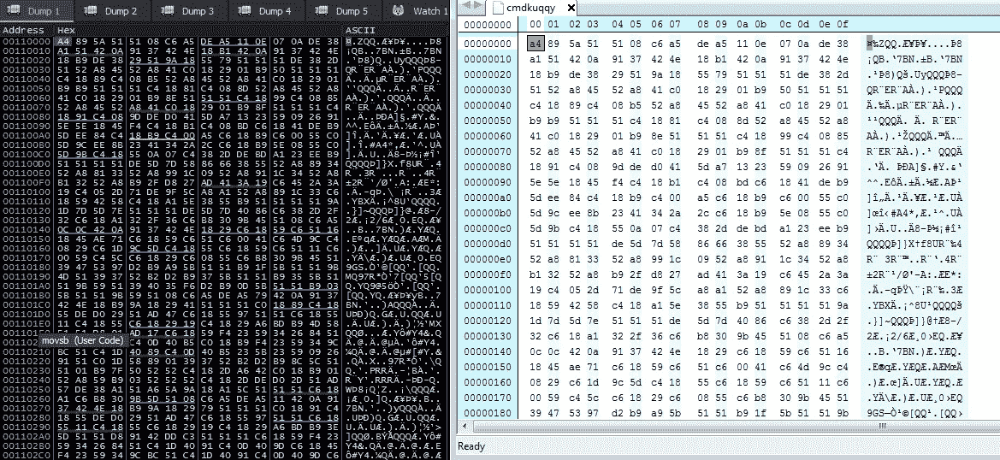

十六进制比较

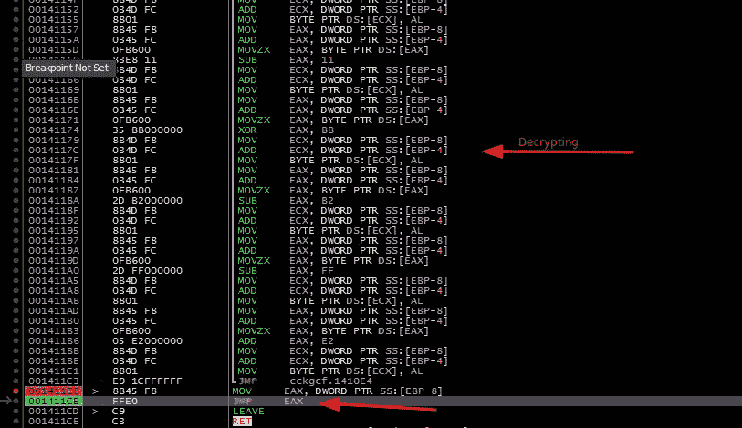

x64dbg:解密后跳转

shell 代码从加载库和导入模块开始，然后将下面的名字一个字母一个字母地推到内存中:

*   ka9zcqw3l6l48a1uuba。
*   ratotpvvsmo.exe。
*   gswccl。
*   hhtktvn。

之后，它从%TEMP%文件夹中打开" **ka9zcqw3l6l48a1uuba"** 文件以获得它的句柄，然后获得文件大小，分配内存，读取文件并解密从文件中读取的数据，因此我将它转储到一个文件中以供稍后分析:

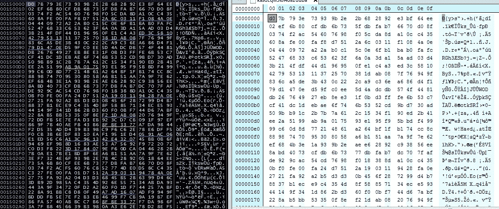

接收从文件" **ka9zcqw3l6l48a1uuba** 中读取的数据的缓冲区

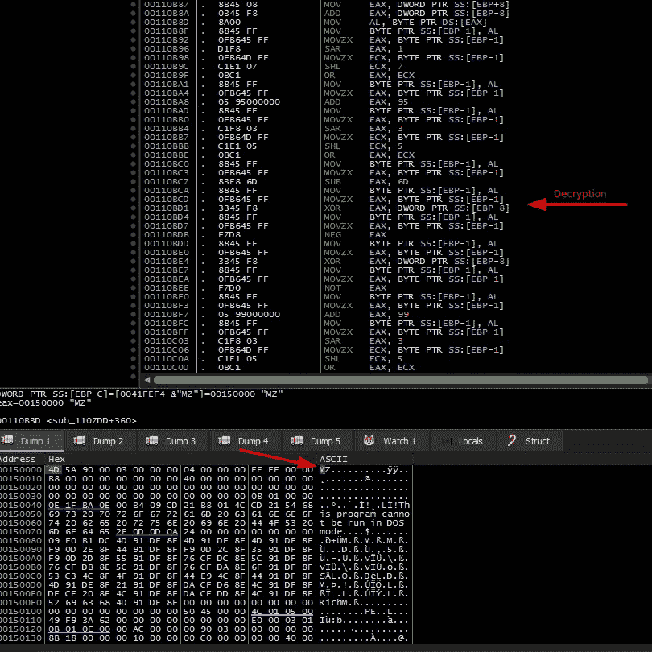

x64dbg:解密数据后

之后，它在“C:\<USER>\ AppData \ Roaming”中创建一个名为“ **gswccl** 的文件夹，并在其中创建一个名为“**ratotpvvsmo.exe**的文件，并通过更改注册表“HKCU \软件\微软\Windows\CurrentVersion\Run”中名为“ **hhtktvn** ”的自动运行值，将该文件用作持久性技术:

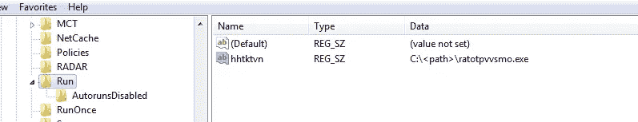

注册表新值；快照的可执行文件路径已更改

通过快速查看" **ratotpvvsmo.exe"** ，我们看到它是 **"ccgkcf.exe "可执行文件的副本:**

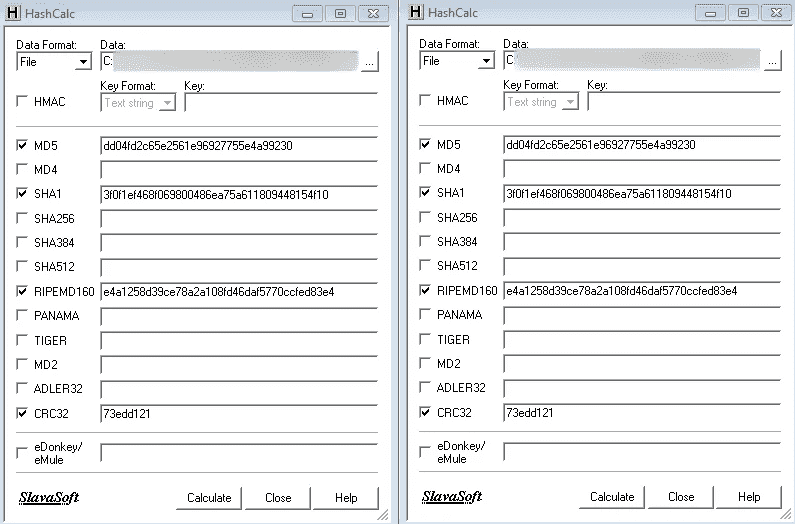

HashCalc:ccgkcf.exe 和 ratotpvvsmo.exe 的比较

**继续分析，我们看到它用自己的名字创建了一个新的进程，并将从" **ka9zcqw3l6l48a1uuba** "文件中解密的代码注入其中，然后退出该进程**

**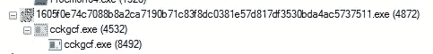**

**Procmon:进程注入**

**值得一提的是，它使用了“Havens gate”技术，这是指远返回，切换到 64 位模式，也可以作为一种反逆向工程技术，以保护恶意软件。**

## **ka9zcqw3l6l48a1uuba 的静态分析。解密:**

**上传这个实例到 PEStudio，我们看到它是 32 位高熵可执行文件，新的编译和调试日期也有一个可执行资源。从 IDA 中，我们发现这个实例将从资源中加载可执行文件并退出进程。**

**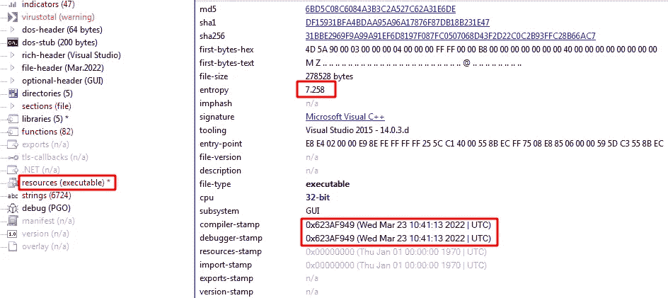**

**PESutdio:ka 9 zcqw3l 6l 48 a 1 uuba . decrypted 一般信息**

**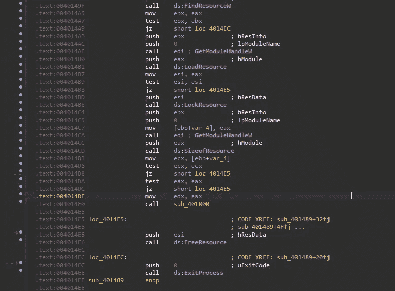**

**IDA:加载资源文件**

**我使用“**resource hacker”**在 x64dbg 中检查完资源文件后将其删除**

## **资源文件的静态分析(NanoCore Rat):**

**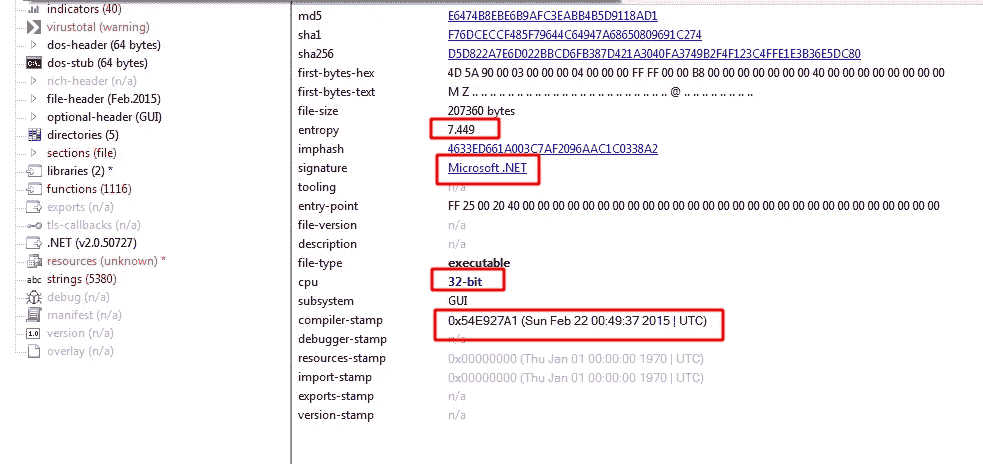**

**纳米核心鼠一般信息**

**上传资源文件，看起来是的。NET 可执行文件，当查看该可执行文件的导入或字符串时，有一个很大的哈希导入列表，重要的是，我发现了一个 NanoCore ascii 字符串，当将文件上传到 dnSpy 时，我们可以看到它被严重混淆:**

****

**纳米核心鼠串**

**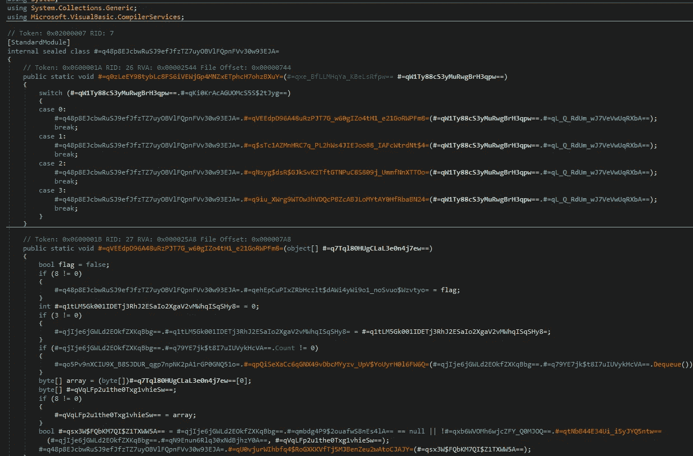**

**dnSpy: NanoCore 客户端混淆实例**

## **资源文件的动态分析(NanoCore Rat):**

**运行 NanoCore 时，它会在“< **用户> \AppData\Roaming** ”文件夹中创建一个文件“ **run.dat** ”。它还尝试连接到 C2 服务器，下面是 DNS 请求的快照和关于该域的信息:**

****

**WireShark:为域发送了 DNS 请求**

**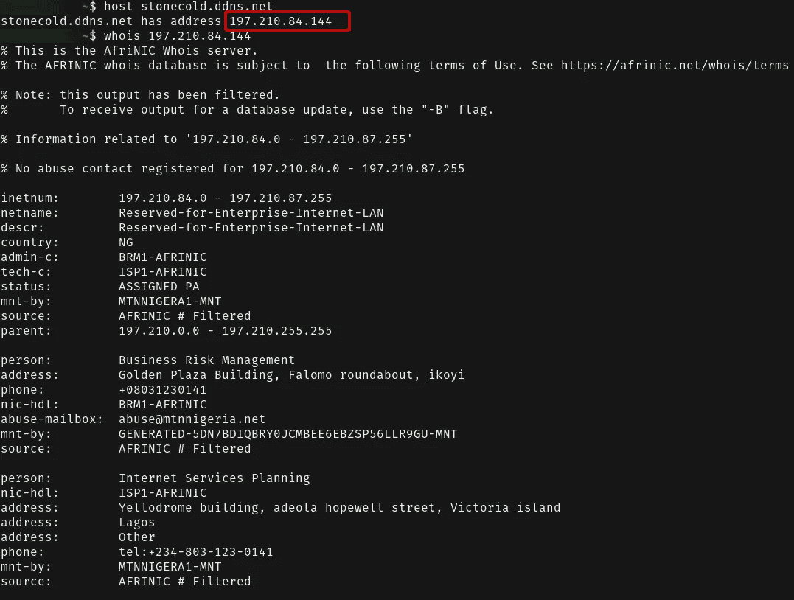**

**领域信息**

## **雅拉规则和签名:**

**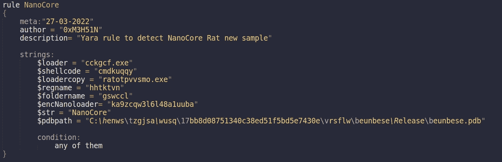**

****防逆转技术:****

*   **IsDebuggerPresent。**
*   **远归(天堂之门)。**
*   **混淆视听。**

****链接:****

*   **[https://bazaar . abuse . ch/sample/1605 f 0e 74 c 7088 b 8 a2 ca 7190 b 71 c 83 f 8 DC 0381 e 57d 817 df 3530 BDA 4 AC 5737511/](https://bazaar.abuse.ch/sample/1605f0e74c7088b8a2ca7190b71c83f8dc0381e57d817df3530bda4ac5737511/)**
*   **[https://www . virus total . com/GUI/file/1605 f 0e 74 c 7088 b 8 a2 ca 7190 b 71 c 83 f 8 DC 0381 e 57d 817 df 3530 BDA 4 AC 5737511/detection/f-1605 f 0e 74 c 7088 b 8 a2 ca 7190 b 71 c 83 f 8 DC 0381 e 57d 817 df 3530 BDA 4 AC 5737511](https://www.virustotal.com/gui/file/1605f0e74c7088b8a2ca7190b71c83f8dc0381e57d817df3530bda4ac5737511/detection/f-1605f0e74c7088b8a2ca7190b71c83f8dc0381e57d817df3530bda4ac5737511-1648116728)**
*   **[https://www.flaticon.com/free-icons/trojan](https://www.flaticon.com/free-icons/trojan)**

## **来自 Infosec 的报道:Infosec 每天都有很多内容，很难跟上。[加入我们的每周简讯](https://weekly.infosecwriteups.com/)以 5 篇文章、4 个线程、3 个视频、2 个 Github Repos 和工具以及 1 个工作提醒的形式免费获取所有最新的 Infosec 趋势！**