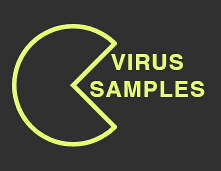
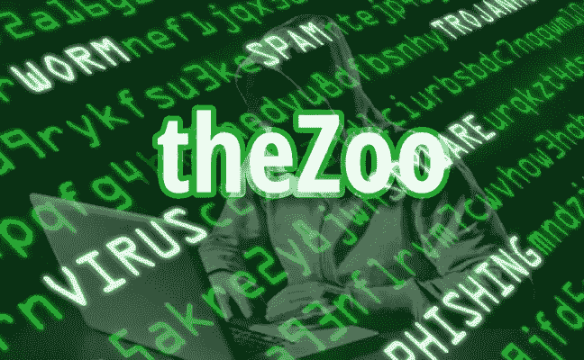

# 恶意软件样本来源—新的和维护的

> 原文：<https://infosecwriteups.com/malware-sample-sources-a3c7f306adea?source=collection_archive---------0----------------------->

**什么是恶意软件？**

恶意软件是恶意软件的缩写形式。这是一种专门设计用来访问或破坏计算机的软件，通常在所有者不知情的情况下。有各种类型的恶意软件，包括广告软件，后门，间谍软件，勒索软件，木马，蠕虫和任何类型的恶意代码渗透到计算机。

**为什么研究人员需要恶意软件样本？**

恶意软件研究人员不断查询最新的恶意软件样本进行分析，以便学习、培训或开发新的威胁技术和防御手段。虽然总是不容易找到新的和维护过的恶意软件样本，但是有许多来源涉及恶意软件，但是大多数都是旧的和过时的。

**哪里可以找到恶意软件样本？**

有一些免费的源代码允许你直接或注册后下载恶意软件样本，还有一些需要你联系所有者来建立一个帐户。

有些资源既有免费版本也有付费版本，你可以用付费账户访问更多数据，不像免费账户有每日下载限制。

请记住，这些来源包含实时恶意软件，可能会损坏您的系统。小心不要感染自己当访问和试验恶意软件时不要运行它们，除非你完全确定你在做什么！建议在虚拟机环境下工作，因为您的设备有可能被感染。

# **病毒样本**

VirusSamples 声称“我们给你互联网上最坏的文件中的最好的。”他们向 SOC、团队、企业和安全研究人员提供所需的数据，以便更好地检测和打击恶意软件、病毒和其他在网络上发现并潜伏在互联网各个角落的特洛伊木马。

VirusSamples 要求您联系所有者以设置帐户。他们提供对其 1pb 数据库的有限访问(1000 个样本/天)的免费馈送和企业馈送(15 万多个样本/天)。

恶意软件可通过分类类别访问，如 Windows、Mac 和 APT 恶意软件、恶意脚本、Linux 可执行文件、劫持的 web 代码和 PE 二进制文件。此外，Github 页面上有免费的示例，您无需注册就可以进行测试。

[https://github.com/MalwareSamples](https://github.com/MalwareSamples)/

[https://virussamples.com/](https://virusshare.com/)

# **病毒共享**

VirusShare 是由 Corvus Forensics 托管和维护的服务。它是一个恶意软件样本的存储库，为安全研究人员、事故响应者、法医分析师和病态好奇者提供对实时恶意代码样本的访问。只有收到邀请才能访问该网站。要请求添加到列表中，需要向病毒共享的主机发送电子邮件。

VirusShare 有一个 torrent tracker，它按照恶意软件在系统中的接收和索引顺序提供恶意软件包。为安全起见，所有样品均以密码保护的 zip 文件形式交付。所有 zip 压缩的恶意软件样本的密码都是“已感染”。

[https://virusshare.com/](https://virusshare.com/)

# 病毒信号

VirusSign 提供了大量高质量的恶意软件样本，这是网络安全、反恶意软件和威胁情报机构的宝贵资源。它们服务于两个集合和一个系统，例如:恶意软件列表、Android 列表和自动恶意软件分析系统(VSAMAS)。

**—恶意软件列表**包含除 Android 之外的计算机恶意软件样本(针对 PC)。

**— AndroidList** 是一个移动样本的集合，它包括 Android、Mac 和 Java 样本。

**—自动化恶意软件分析系统(VSAMAS)** 基于 AI，虚拟机和行为分析独立识别未知恶意软件，无需任何第三方扫描器或云支持。具备 20000 条/天/台左右的程序分析能力。

根据不同的权限，如可访问量、下载恢复、多线程下载和带宽，提供的帐户有免费(500 个样本/天)、高级(10，000 个样本/天)和专业(200，000 个样本/天)。

[https://virussign.com/](https://virussign.com/)

# MalwareBazaar

MalwareBazaar 是由 abuse.ch 运营的一个项目，该项目的目标是收集和交换恶意软件样本，以协助 IT 安全研究人员和威胁分析师保护他们的选民和消费者免受网络威胁。MalwareBazaar 的数据库中有超过 280，000 个样本。在 MalwareBazaar 上看到的与恶意软件样本相关的大多数恶意软件家族是 Heodo、Quakbot、AgentTesla 和 CobaltStrike。

[https://bazaar.abuse.ch/](https://bazaar.abuse.ch/)

# **分配不均**

MalShare 项目是一个协作项目，旨在创建一个社区驱动的公共恶意软件存储库，该存储库致力于构建更多的工具来使整个安全社区受益。他们的免费恶意软件库为研究人员提供了访问样本、恶意源和 Yara 结果的途径。他们提供免费的公共 API 密钥。标准键允许每天 2000 次 API 调用(包括下载样本、详细信息查找和搜索)。如果您需要更多，您应该联系管理员以获得进一步的帮助。

[https://malshare.com](https://malshare.com/)

# **动物园**

动物园是一个项目，旨在使恶意软件分析的可能性对公众开放。该动物园的目的是允许研究恶意软件，并使对恶意软件分析感兴趣的人能够接触到活的恶意软件，分析它们的操作方式，甚至可能使高级和精明的人能够在他们自己的环境中阻止特定的恶意软件。

【https://github.com/ytisf/theZoo 

# **恶意软件存档**

该存储库旨在提供对各种恶意文件和其他工件的访问。它包含二进制文件，maldocs，内存转储和恶意软件分析练习。

[https://github.com/jstrosch/malware-samples](https://github.com/jstrosch/malware-samples)

**参考文献**

*   [https://us.norton.com/internetsecurity-malware.html](https://us.norton.com/internetsecurity-malware.html)
*   [https://www . mega beets . net/fantastic-malware-and-where-to-find-them/](https://www.megabeets.net/fantastic-malware-and-where-to-find-them/)
*   [https://www . science direct . com/topics/computer-science/malware-sample](https://www.sciencedirect.com/topics/computer-science/malware-sample)

**Buket genaydn**