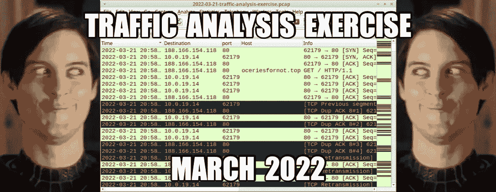
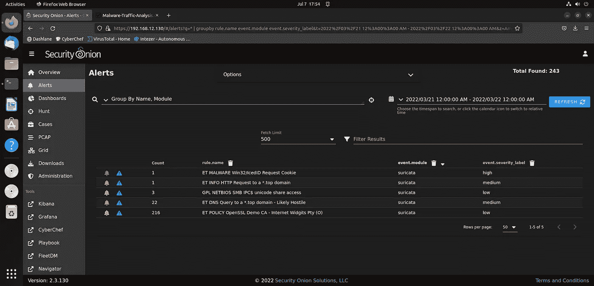
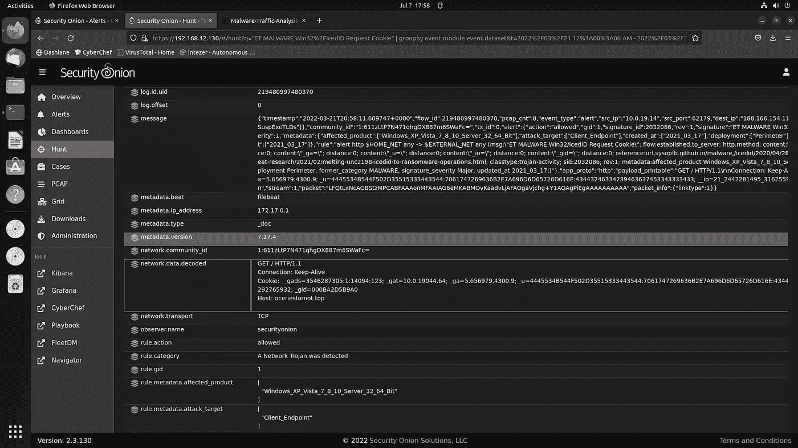
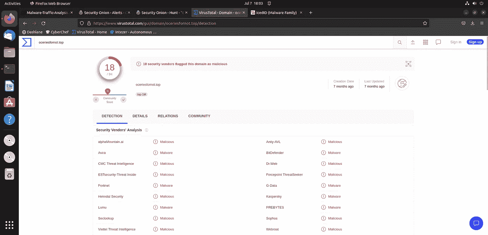
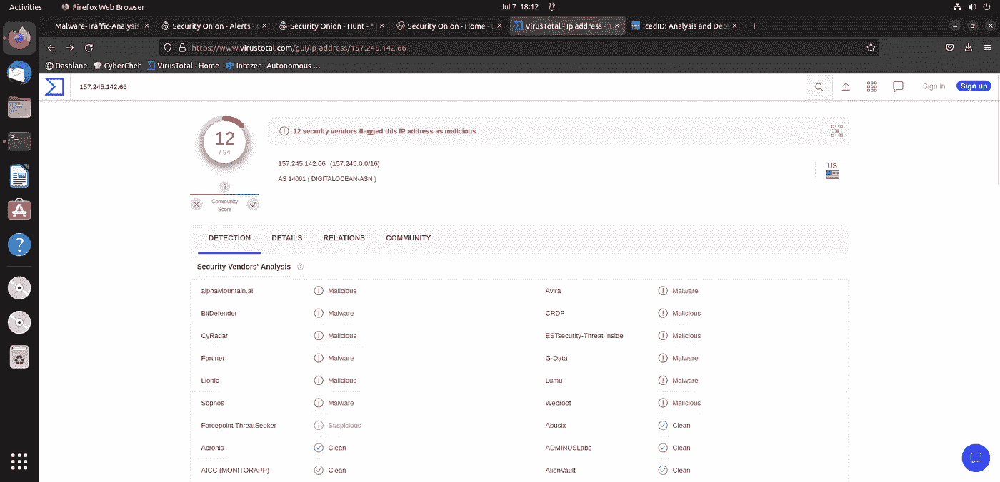
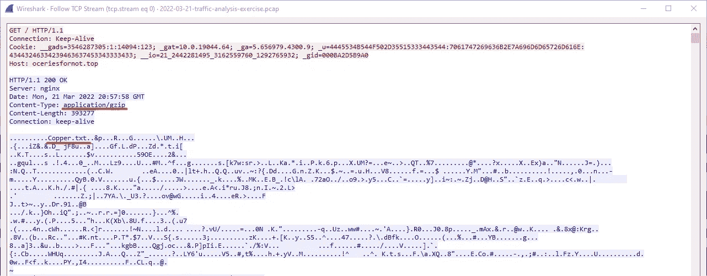
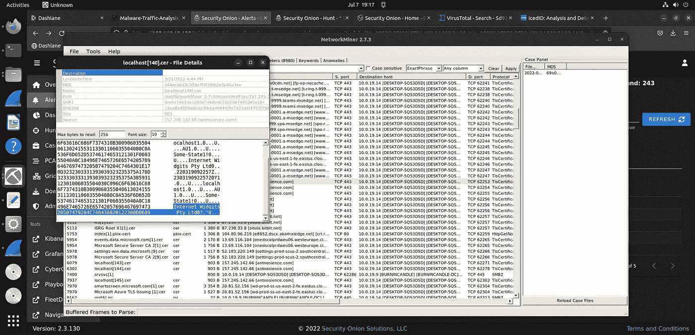
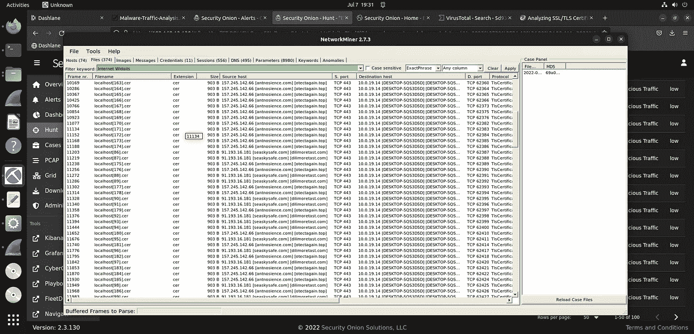
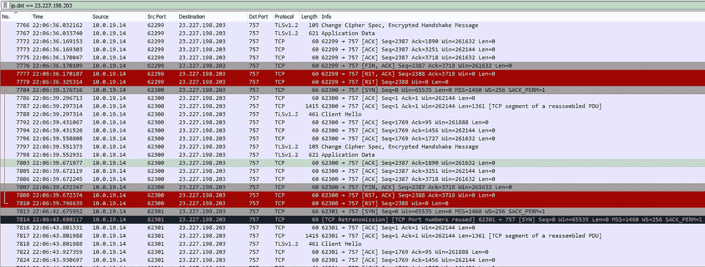

# 恶意软件流量分析练习| Burnincandle | IcedID 恶意软件

> 原文：<https://infosecwriteups.com/malware-traffic-analysis-exercise-burnincandle-icedid-malware-67e78ef1d46c?source=collection_archive---------0----------------------->

[https://www . malware-traffic-analysis . net/2022/03/21/index 3 . html](https://www.malware-traffic-analysis.net/2022/03/21/index3.html)

欢迎光临！今天我将回顾另一个来自 https://www.malware-traffic-analysis.net/[的恶意软件流量分析练习，这是我最近完成的。这个叫做 Burnincandle。这篇文章将包括一个执行摘要，被感染主机的详细信息，妥协的指标(国际奥委会的),以及一个技术摘要，其中我将解释我是如何进行分析的，以及我的结论是基于哪些指标。](https://www.malware-traffic-analysis.net/)

# **执行摘要**

在 2022 年 3 月 21 日大约 2058 UTC 时,“patrick.zimmerman”使用的一台 Windows 主机感染了 IcedID 恶意软件。在初次感染后，在受害者身上建立了钴打击指挥和控制(C2)信标。

# 受感染主机的详细信息

*   IP 地址:10.0.19.14
*   MAC 地址:00:60:52:b7:33:0f
*   主机名:DESKTOP-5QS3D5D
*   用户名:帕特里克·齐默曼

# 妥协的指标(国际奥委会的)

**与初始 IcedID 感染相关的网络流量:**

*   HTTP GET 请求—188.166.154.118:80—oceriesfornot . top
*   157.245.142.66:443——antnosience.com——HTTPS 交通
*   dilimoretast.com 91.193.16.181:443 seaskysafe.com 的 HTTPS 交通
*   160.153.32.99:443 suncoastpinball.com HTTPS 交通

**与文件共享相关的网络流量:**

*   185.47.40.36:443 filebin.net HTTPS 交通
*   87.238.33.8:443 87.238.33.7:443 到 situla.bitbit.net 的 HTTPS 交通

**与“钴打击”指挥和控制系统(C2)相关的网络流量:**

*   23.227.198.203:757 bupdater.com HTTPS 交通

# **技术分析**

完成这些练习后，我做的第一件事就是查看我的 security onion 控制台中的 suricata IDS/IPS 警报，以便了解我正在处理的问题，并决定如何指导我的分析。

security onion 中的 Suricata IDS/IPS 警报。

根据当前的警报，我假设前两个警报“ET 恶意软件 Win32/IcedID 请求 Cookie”和“ET INFO HTTP 请求 a *。顶级域”可能会对同一 HTTP 请求发出警报。这是基于两人都只报警过一次。由于我们讨论的是“IcedID 请求 cookie ”,受害者可能只会向 IcedID 恶意软件来源的恶意域发出一个 HTTP GET 请求，因此两个警报都是单个实例。但是我们不要在理论上花太多时间。

深入研究 IcedID 请求 cookie 警报，我看到一个 HTTP GET 请求在 cookie 参数中有一些奇怪的数据。

IcedID 请求 cookie 警报。注意 HTTP 请求的 cookie 参数中的奇数数据。

我做了一些研究以了解更多这方面的信息，并看到了一篇文章([https://sys opfb . github . io/malware，/ice did/2020/04/28/ice dids-updated-photo loader . html](https://sysopfb.github.io/malware,/icedid/2020/04/28/IcedIDs-updated-photoloader.html))，该文章描述了 cookie 参数中每个值的含义。简而言之，该 cookie 用于存储受害主机的编码数据，包括主机名、用户名、windows 版本等。因此，我现在有明确的证据表明威胁参与者能够列举一些关于受害主机的信息，但我还发现了第一个 IOC，因为 oceriesfornot.top 域和 IP 被确定为恶意的。

oceriesfornot.top 域的 Virustotal 结果。

我还证实了我对“IcedID 请求 cookie”警报和“HTTP 请求到*”的怀疑。顶级域”警报都是由相同的通信量触发的，GET 请求被发送到 oceriesfornot.top。

“IcedID request cookie”警报发出后，立即观察到受害者 IP 与 IP 地址为 157.245.142.66 的 antnosience.com 域建立了 HTTPS 连接，这在 virustotal 中也被确定为恶意连接。这给了我第二个国际奥委会。

157.245.142.66 IP 地址的病毒总数结果。

此时，我决定需要关闭并打开 networkminer，看看是否可以从 pcap 中提取任何有趣的文件信息。

Networkminer 能够向分析师显示 pcap 文件中哪些文件通过了网络。在本例中是 index.gzip

Networkminer 将我的注意力转向了一个名为“index.gzip”的文件。gzip 后缀表示该文件是使用 gzip 工具压缩的。压缩恶意文档是攻击者试图避免被 AV、IDS、IPS 等检测的常用策略。所以我觉得这很有趣。现在我有了这些信息，我进入 wireshark 并找到了通过网络发送 index.gzip 文件的 TCP 流。在 TCP stream 0 中，我发现原始的未压缩文件的名字是 Copper.txt。至少我是这么想的…

请注意，服务器响应中的内容类型参数表明它是一个 gzip 压缩文件。还要注意 TCP 数据中的“Copper.txt”字符串。

既然我已经找到了这个 gzip 文件，我做了一些与 IcedID 和 gzip 文件相关的研究。很快，我意识到这种感染远比我当时意识到的要多。本质上，“Copper.txt”字符串只是一个门面。事实上，这里根本没有真正的文件，所有这些数据基本上都是加密的 IcedID 配置。解密后，恶意软件会将名为 license.dat 的文件放入恶意软件配置指定的文件夹中，该文件夹位于当前用户的 Appdata\Roaming 目录中。它还将 IcedID 主加载程序放到 Appdata\Local\目录中。然后，这个主加载程序用于将 IcedID 有效负载(在 license.dat 中)加载到内存中并运行它。你可以在 binarydefense.com([https://www.binarydefense.com/icedid-gziploader-analysis/](https://www.binarydefense.com/icedid-gziploader-analysis/))的这篇文章中读到更多关于这一切是如何运作的信息。

既然我已经基本上确定了感染源，我需要把我的注意力转回到产生 IOC 的问题上。回顾 wireshark，我注意到受害者 IP 和外部 IP 之间发生了大量 TLS 握手，受害者 IP 的源端口号被快速轮换。在如此短的时间内建立如此多的新关系绝对是不寻常的。我还记得看到一个 IDS/IPS 警报“OpenSSL Demo CA—Internet wid gits Pty”，表明 OpenSSL 生成的 SSL/TLS 证书出现了某种奇怪的情况。触发此警报是因为这些 Internet Widgits TLS 证书是自签名的，不应被信任。

注意 TCP 数据中的“Internet Widgits 字符串”,该数据来自“antnosience.com”域发送给受害者 IP 的 TLS 证书。

在这里，我在 networkminer 中过滤这些 Internet Widgits TLS 证书，以找到与此 IcedID 恶意软件感染相关的其余恶意 IP 和域。

筛选“Internet widget”TLS 证书。

受害者 IP 也被观察到在 160.153.32.99:443 与 suncoastpinball.com 域名建立了多个奇怪的新 TLS 连接，给了我另一个 IOC。该域的 SSL 证书不是自签名的，但它是 godaddy 证书。

继续搜索 networkminer 和 wireshark，我没有看到任何与自签名 Internet Widgits TLS 证书相关的额外活动。我决定在 wireshark 中过滤 DNS 流量，因为 DNS 流量可以揭示威胁参与者正在使用哪些域和 IP 地址来进行恶意活动。应用这个过滤器后，我注意到受害者 IP 在相对较短的时间内对感兴趣的探测域发出了三个 DNS 请求。

受害者 IP 为 filebin.net 和 situla.bitbit.net 两个文件共享网站发出 DNS 请求。

filebin.net 和 situla.bitbit.net 域都是文件共享站点，之后到这两个域的连接都很短暂，每个都不到 10 秒。这可能是数据泄露，也可能是恶意软件试图获取额外的资源来攻击受害者，但目前还不清楚。如果我有受害者的 TLS 私钥，我可以在 wireshark 中解密该流量，并了解更多关于网络上实际发送的内容，但是在本练习中，我没有受害者的私钥。

在上图中，还有第三个被查询的域名，bupdater.com。在 wireshark 中过滤该域的 IP 地址揭示了一个非常有趣的模式。

请注意，短暂的 TLS 连接发生在连续的临时端口上。

在受害者 IP 和 bupdater.com IP 之间存在许多通常是短暂的 TLS 连接。上图中另一个有趣的地方是每个连接末尾的 TCP 确认号。在许多(但不是所有)连接的末尾，确认号是 3718，或者是一个非常接近的值。这很有趣，因为它表明在这些连接中，只有固定数量的 TCP 数据通过网络发送。换句话说，这看起来像 C2 心跳活动，其中受害者正在建立到 C2 服务器的连接，并发送具有指定数据长度的定期 pings，在我们的示例中为 3717 字节。受害者然后检查攻击者提供的任何指令。如果有指示，受害者会取回并执行。

在这种情况下，bupdater.com 域和 IP 地址也被确定为恶意的，甚至被社区明确确定为钴罢工 C2 服务器。然后我得出结论，威胁者使用了冰 dID 感染提供的初始访问权限，在受害者身上建立了钴击 C2。在这一点上，在真正的调查中，可能最有用的是进行一些端点取证，以生成额外的基于主机的 IOC，如文件哈希。

# **结论**

这是了解更多关于 IcedID 恶意软件的一个很好的练习。在这个练习之前，我对 IcedID 有一点熟悉，但是现在我对这个恶意软件是如何运行的以及它会产生什么样的工件有了更清楚的认识。我还学会了在 pcap 文件中寻找一种新的模式来识别 C2 流量。我将继续尝试观察 TCP 确认号中的模式，看看我是否可以更频繁地使用它来识别 C2 流量。

谢谢你访问我的博客！如果你喜欢这篇文章，请给我一个关注并分享这篇文章！

来自 Infosec 的报道:Infosec 上每天都会出现很多难以跟上的内容。 [***加入我们的每周简讯***](https://weekly.infosecwriteups.com/) *以 5 篇文章、4 个线程、3 个视频、2 个 Github Repos 和工具以及 1 个工作提醒的形式免费获取所有最新的 Infosec 趋势！*